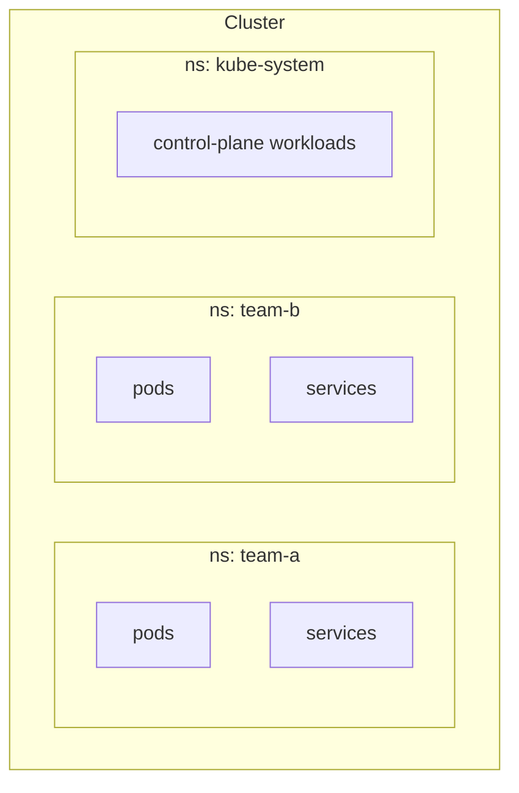

# 09 — Namespaces & Resource Quotas

> Namespaces partition a cluster into virtual sub-clusters. Quotas + LimitRanges keep tenants from eating everyone's lunch.

## Why namespaces

<!-- mermaid:rendered -->
<p align="center"></p>

<details><summary>Mermaid source</summary>



</details>
Use cases:
- Multi-tenant (per team / env / customer)
- Scoped RBAC
- Resource quotas
- Network policies

## What's namespaced vs cluster-scoped

| Namespaced | Cluster-scoped |
|------------|----------------|
| Pod, Deployment, Service, ConfigMap, Secret, PVC, Ingress, Role, RoleBinding | Node, PersistentVolume, StorageClass, ClusterRole, ClusterRoleBinding, Namespace itself |

```bash
kubectl api-resources --namespaced=true
kubectl api-resources --namespaced=false
```

## ResourceQuota vs LimitRange

| Object | Scope | What it limits |
|--------|-------|----------------|
| **ResourceQuota** | Per namespace (aggregate) | Total CPU/mem requests, total objects (pods, secrets, services) |
| **LimitRange** | Per pod / container | Default + min/max requests/limits per container |

LimitRange is what auto-fills `resources.requests` when developers forget.

## Apply & observe

```bash
kubectl apply -f namespace.yaml
kubectl apply -f resourcequota.yaml
kubectl apply -f limitrange.yaml

kubectl get ns demo --show-labels
kubectl describe quota -n demo
kubectl describe limitrange -n demo

# Try to deploy without resources — LimitRange auto-fills defaults
kubectl run test --image=nginx:1.27-alpine -n demo
kubectl get pod test -n demo -o jsonpath='{.spec.containers[0].resources}'

# Try to bust the quota
for i in 1 2 3 4 5 6 7 8 9 10 11 12; do
  kubectl run test-$i --image=nginx:1.27-alpine -n demo
done
# 11th pod onward: "exceeded quota: pod-quota, requested: pods=1, used: pods=10, limited: pods=10"
```

## Cleanup

```bash
kubectl delete namespace demo        # ← deletes EVERYTHING in the ns
```

## Gotchas

> ⚠️ **Deleting a namespace is recursive.** All pods, secrets, PVCs, etc. inside go with it. There's no undo.

> ⚠️ **Quotas don't apply to existing objects** — they kick in only for new admissions. Set quotas BEFORE the team onboards.

> ⚠️ **A ResourceQuota for `requests.cpu` REQUIRES every container to declare requests.** Combine with a LimitRange to inject defaults.

> ⚠️ **Namespace stuck in `Terminating`?** Usually a finalizer. Check `kubectl get namespace <ns> -o yaml`.

## Reference

- [Namespaces](https://kubernetes.io/docs/concepts/overview/working-with-objects/namespaces/)
- [Resource Quotas](https://kubernetes.io/docs/concepts/policy/resource-quotas/)
- [Limit Ranges](https://kubernetes.io/docs/concepts/policy/limit-range/)
