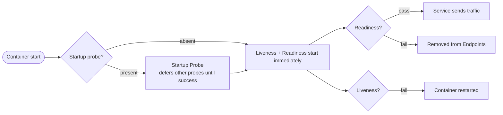

# 10 — Probes & Health

> The kubelet uses **probes** to know if your container is alive, ready for traffic, or still starting up. Without them, K8s does the wrong thing.

## The three probes

<!-- mermaid:rendered -->
<p align="center"></p>

<details><summary>Mermaid source</summary>



</details>
| Probe | Failure action | Use for |
|-------|----------------|---------|
| **startupProbe** | Counted as liveness fail (kills container) | Slow-starting apps (JVM, ML). Disables others until pass. |
| **readinessProbe** | Pod removed from Service Endpoints | Decide WHEN to send traffic |
| **livenessProbe** | Container restarted | Detect deadlock / hung process |

## Quick reference

=== ":material-lightbulb-outline: Concept"
    Probes let the kubelet decide if a container is starting, alive, or ready for traffic. Liveness restarts hung processes, readiness gates Service endpoints, and startup defers the other two for slow boots.

=== ":material-file-code-outline: Manifest"
    ```yaml
    apiVersion: v1
    kind: Pod
    metadata:
      name: probes-demo
    spec:
      containers:
        - name: app
          image: gcr.io/google-samples/hello-app:1.0
          ports:
            - { name: http, containerPort: 8080 }
          startupProbe:
            httpGet: { path: /, port: http }
            failureThreshold: 30
            periodSeconds: 2
          readinessProbe:
            httpGet: { path: /, port: http }
            periodSeconds: 5
            failureThreshold: 2
          livenessProbe:
            exec:
              command: ["sh", "-c", "test -f /tmp/healthy"]
            periodSeconds: 5
            failureThreshold: 3
    ```

=== ":material-console: kubectl"
    ```bash
    kubectl apply -f probes-demo.yaml
    kubectl get pod probes-demo -w
    kubectl describe pod probes-demo | grep -A2 -E 'Liveness|Readiness|Startup'
    kubectl exec probes-demo -- rm /tmp/healthy
    ```

=== ":material-text-box-outline: Expected output"
    ```text
    NAME          READY   STATUS    RESTARTS   AGE
    probes-demo   0/1     Running   0          3s
    probes-demo   1/1     Running   0          12s

    Liveness:   exec [sh -c test -f /tmp/healthy] delay=0s timeout=1s period=5s #success=1 #failure=3
    Readiness:  http-get http://:http/ delay=0s timeout=1s period=5s #success=1 #failure=2
    Startup:    http-get http://:http/ delay=0s timeout=1s period=2s #success=1 #failure=30

    probes-demo   1/1     Running   1 (2s ago)   45s
    ```

## Probe handlers

| Handler | Use |
|---------|-----|
| `httpGet` | Most apps (`/healthz`, `/ready`) |
| `tcpSocket` | Plain TCP services (DBs, caches) |
| `exec` | Run a command — use sparingly (forks) |
| `grpc` | Native gRPC health (K8s 1.24+) |

## Apply & observe

```bash
kubectl apply -f probes-demo.yaml
kubectl get pod probes-demo -w        # readiness false ~10s, then true
kubectl describe pod probes-demo | grep -A3 Liveness
```

Force a liveness fail to see restart:

```bash
kubectl exec probes-demo -- rm /tmp/healthy
kubectl get pod probes-demo -w        # Liveness fails → RESTARTS goes 0 → 1
```

## Tuning fields

| Field | Default | Notes |
|-------|---------|-------|
| `initialDelaySeconds` | 0 | Wait before first probe |
| `periodSeconds` | 10 | How often |
| `timeoutSeconds` | 1 | Probe call timeout |
| `successThreshold` | 1 | Consecutive successes to pass |
| `failureThreshold` | 3 | Consecutive failures to fail |

## Cleanup

```bash
kubectl delete -f probes-demo.yaml
```

## Gotchas

> ⚠️ **Liveness probe too aggressive = restart loop.** If your app takes 30s to start and `initialDelaySeconds=5`, you get crash-loop. Use a `startupProbe` instead.

> ⚠️ **Same endpoint for liveness AND readiness is a foot-gun.** A slow database call makes BOTH fail — pod gets restarted instead of just removed from rotation. Separate them: liveness = "process alive", readiness = "deps healthy".

> ⚠️ **`exec` probes fork a process every `periodSeconds`.** At scale this hurts. Prefer `httpGet`.

> ⚠️ **`failureThreshold * periodSeconds` is your detection time.** Default = 30s before action.

## Reference

- [Configure Liveness, Readiness and Startup Probes](https://kubernetes.io/docs/tasks/configure-pod-container/configure-liveness-readiness-startup-probes/)
- [Pod Lifecycle: container probes](https://kubernetes.io/docs/concepts/workloads/pods/pod-lifecycle/#container-probes)
