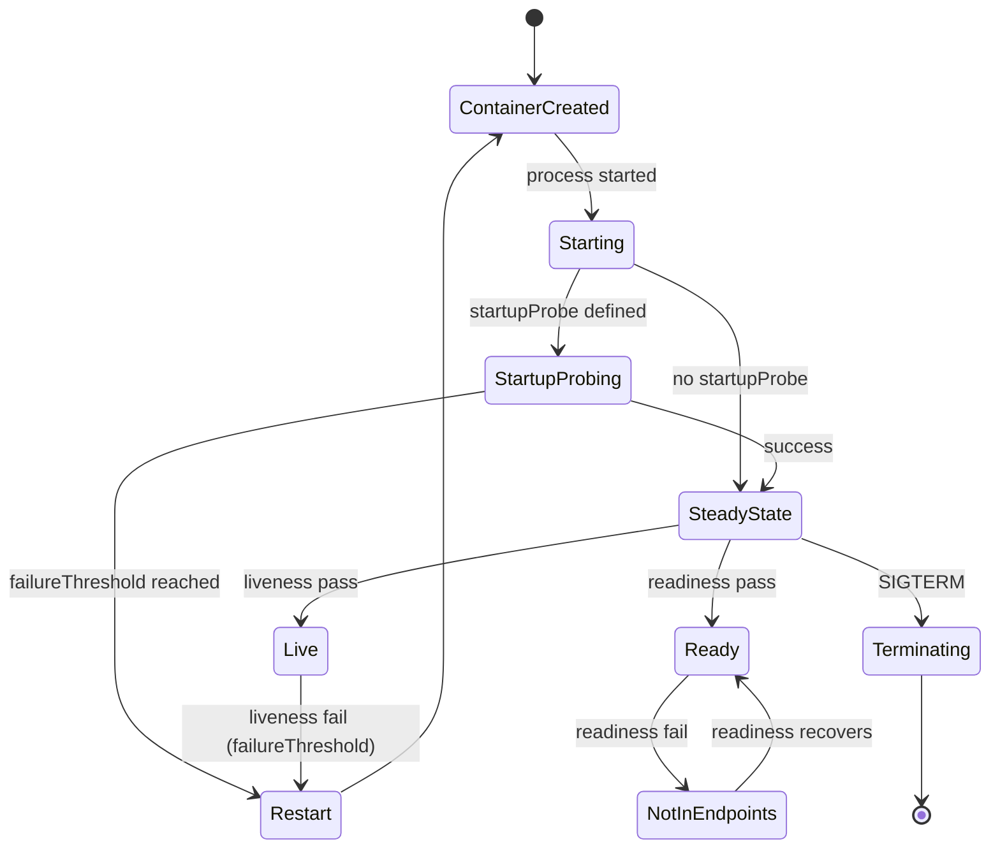
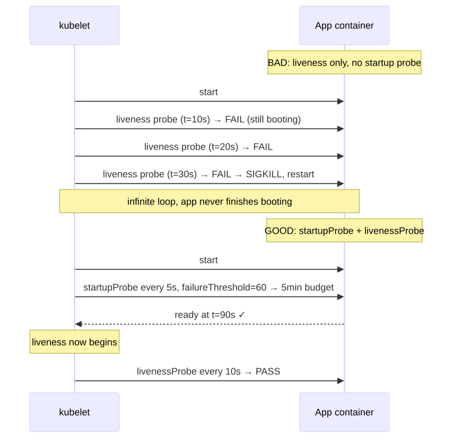
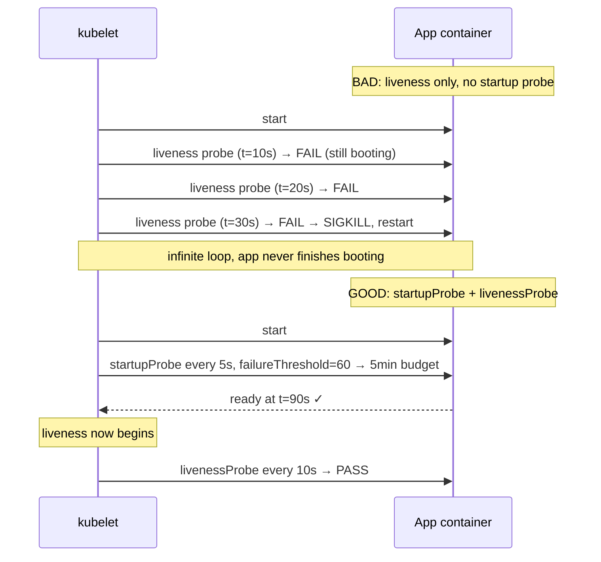

# Deep Dive: Probe Traps

## Why this matters

Misconfigured probes are the **#1 cause of self-inflicted production outages** in Kubernetes. A liveness probe firing during slow startup turns a healthy pod into an infinite restart loop. A readiness probe with no `initialDelaySeconds` removes pods from service mid-warmup. A `tcpSocket` probe says "healthy" while the app is hung. A 30-second `terminationGracePeriodSeconds` is silently overridden by a `preStop` that takes 35.

Probes look like a 4-line YAML snippet. They are actually a **state machine intersecting with the container lifecycle, the kubelet, EndpointSlices, and the OS signal pipeline**.

---

## Mental Model

> Three probes, three orthogonal jobs. Confuse them and you will page yourself at 3 AM.

| Probe | Question it answers | Failure action | Suspended by |
|---|---|---|---|
| **startupProbe** | "Has the app finished booting?" | Restart container | — |
| **livenessProbe** | "Is the app deadlocked?" | Restart container | startupProbe (until it passes) |
| **readinessProbe** | "Is the app accepting traffic right now?" | Remove from EndpointSlice (no restart) | startupProbe (until it passes) |

Critical rule: **livenessProbe and readinessProbe do not run until startupProbe succeeds**. If you have a slow startup, configure a startup probe — do NOT just bump `initialDelaySeconds` on liveness.

---

## Diagram 1 — Probe lifecycle within a container

<!-- mermaid:rendered -->
<p align="center"></p>

<details><summary>Mermaid source</summary>



</details>

---

## Diagram 2 — The slow-startup trap (and the fix)

<!-- mermaid:rendered -->
<p align="center"></p>

<details><summary>Mermaid source</summary>



</details>

---

## Handler types

| Handler | When to use | Pitfalls |
|---|---|---|
| `httpGet` | HTTP services | Treats 200–399 as healthy. **Path must NOT require auth.** Use a dedicated `/healthz`. |
| `tcpSocket` | Non-HTTP, just want "port open" | Says healthy if the kernel accepted the SYN. App can be deadlocked and probe still passes. |
| `exec` | Custom logic, sidecars | Forks a process every probe interval — **expensive**. `exec` probes leak zombie processes if the binary mishandles signals. |
| `grpc` | gRPC services (1.27+ GA) | Native, no need for `grpc_health_probe` binary. Service must implement `grpc.health.v1.Health`. |

---

## Walkthrough: the right way

```yaml
apiVersion: v1
kind: Pod
metadata: {name: api}
spec:
  terminationGracePeriodSeconds: 60
  containers:
    - name: api
      image: api:1.2
      ports: [{containerPort: 8080, name: http}]

      # 1) Startup gate: generous, fires until app is up.
      startupProbe:
        httpGet: {path: /healthz/started, port: http}
        periodSeconds: 5
        failureThreshold: 60        # 5 * 60 = 300s startup budget
        timeoutSeconds: 2

      # 2) Readiness: tight, controls EndpointSlice membership.
      readinessProbe:
        httpGet: {path: /healthz/ready, port: http}
        periodSeconds: 5
        failureThreshold: 3         # 15s of failure before traffic removed
        successThreshold: 1
        timeoutSeconds: 2

      # 3) Liveness: only restarts on TRUE deadlock. Loose thresholds.
      livenessProbe:
        httpGet: {path: /healthz/live, port: http}
        periodSeconds: 30
        failureThreshold: 3         # 90s before SIGTERM
        timeoutSeconds: 5

      lifecycle:
        preStop:
          exec:
            command: ["/bin/sh","-c","sleep 10 && kill -TERM 1"]
            # 10s = window for kube-proxy to drop us from EndpointSlice
            # before we stop accepting connections
```

Three different endpoints — `/started`, `/ready`, `/live` — so the app can answer each question independently:
- `/started`: "DB schema loaded, caches warmed?"
- `/ready`: "Can I serve a request right now?" (e.g., circuit breaker open → return 503)
- `/live`: "Is my event loop alive?" (a trivial OK if not deadlocked)

---

## Termination interaction (the silent killer)

`terminationGracePeriodSeconds` (TGPS) timeline:

```
t=0        DELETE pod
           ├── readiness probe stopped immediately
           ├── pod removed from EndpointSlice (eventual)
           └── preStop hook starts (BLOCKING)
t=preStop  preStop returns (or its own timeout = TGPS - elapsed)
           └── SIGTERM sent to PID 1
t=TGPS     SIGKILL sent
```

> **Trap 1**: `preStop` runs INSIDE the TGPS budget. If TGPS=30 and preStop sleeps 25, the app gets 5s before SIGKILL.
>
> **Trap 2**: PID 1 must handle SIGTERM. Shell-form `CMD ["sh","-c","app"]` makes `sh` PID 1 and SIGTERM is swallowed. Use exec form or `tini`.
>
> **Trap 3**: A failing liveness probe DURING termination still triggers a "restart" decision — but the pod is being deleted, so kubelet logs are confusing. Disable liveness during shutdown via preStop logic if needed.

---

## Common probe traps reference

| Trap | Symptom | Fix |
|---|---|---|
| Liveness without startup on slow app | CrashLoopBackOff | Add startupProbe |
| `tcpSocket` on a deadlocked HTTP server | Healthy in K8s, dead in reality | Use httpGet |
| `httpGet` to authenticated endpoint | Probe 401, restart loop | Use unauthenticated `/healthz` |
| `exec` with heavy CLI | High CPU on node | Switch to httpGet/grpc |
| `initialDelaySeconds: 0` on readiness | Pod thrashes Ready/NotReady | Use startupProbe + readiness initialDelay |
| TGPS too small for preStop + drain | Connections cut mid-flight | TGPS ≥ preStop + drain + buffer |
| Liveness fires on transient DB blip | Mass restarts cascade | Liveness should test ONLY local deadlock, not deps |
| Same endpoint for liveness + readiness | DB outage → pod restart loop | Separate endpoints |

---

## Interview Q&A

**Q1. What is the difference between liveness, readiness, and startup probes?**
Liveness restarts a deadlocked container. Readiness gates EndpointSlice membership (no restart). Startup is a one-shot bootstrap gate that suspends the other two until it passes.

**Q2. My pod restarts every 60s. What's the first thing you check?**
`kubectl describe pod` → `Last State: Terminated, Exit Code: 137` (SIGKILL) plus events showing `Liveness probe failed`. Then check the probe path against the actual app — most likely the app needs more time to start. Add a startupProbe.

**Q3. Should liveness check the database?**
No. Liveness should detect "this process is hung", not "downstream is broken". If the DB is down, liveness on every replica fails → entire deployment restart-loops → recovery becomes impossible. Use readiness for downstream checks (drop from LB) and let liveness stay simple.

**Q4. What does `successThreshold` do, and why is it almost always 1?**
Number of consecutive successes after a failure to be marked healthy again. For liveness/startup it MUST be 1 (the API rejects other values). For readiness, raising it adds hysteresis but slows recovery.

**Q5. How does the gRPC probe (1.27 GA) work, and why is it better than `exec grpc_health_probe`?**
The kubelet implements a native gRPC client that calls `grpc.health.v1.Health/Check`. No extra binary in the image, no fork-exec cost, no zombie-process risk. The service just needs to register the standard health service.

**Q6. What is the relationship between `preStop` and `terminationGracePeriodSeconds`?**
preStop runs synchronously BEFORE SIGTERM and consumes the grace budget. Total time from DELETE to SIGKILL is exactly `terminationGracePeriodSeconds`, regardless of what preStop does.

**Q7. Why would a pod still receive traffic for several seconds after it starts shutting down?**
EndpointSlice updates are eventually consistent: the controller updates the API, kube-proxy on every node watches and reprograms iptables/nftables — all of which takes time. A `preStop: sleep 5–10s` covers the gap.

**Q8. When would you use a `tcpSocket` probe instead of `httpGet`?**
For non-HTTP services (Redis, Kafka, custom TCP). Be aware it tests only the kernel accept(), not the application — pair it with a meaningful application-level check if possible (e.g., exec or gRPC).

---

## Sources

- [Configure Liveness, Readiness and Startup Probes](https://kubernetes.io/docs/tasks/configure-pod-container/configure-liveness-readiness-startup-probes/)
- [Container Lifecycle Hooks](https://kubernetes.io/docs/concepts/containers/container-lifecycle-hooks/)
- [Pod Lifecycle — Termination](https://kubernetes.io/docs/concepts/workloads/pods/pod-lifecycle/#pod-termination)
- [Pod readiness gates](https://kubernetes.io/docs/concepts/workloads/pods/pod-lifecycle/#pod-readiness-gate)
- [KEP-2727: gRPC probes](https://github.com/kubernetes/enhancements/tree/master/keps/sig-node/2727-grpc-probe)
- [SIG Node](https://github.com/kubernetes/community/tree/master/sig-node)
