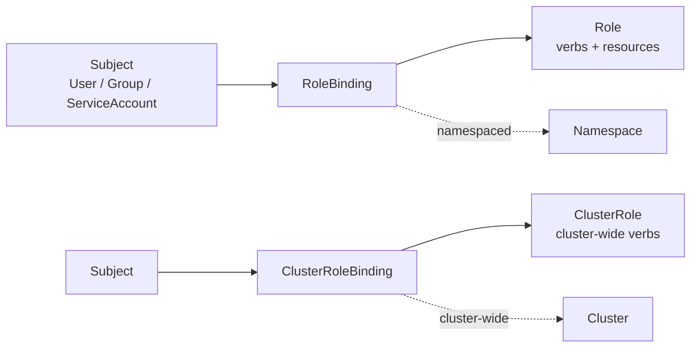
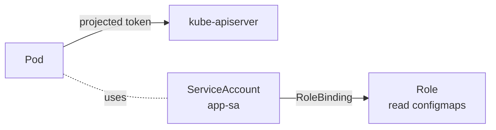

# 11 — RBAC

> RBAC = Role-Based Access Control. **Who** (subject) can do **what** (verb) on **which** resource, in **which** scope.

## The 4 building blocks

<!-- mermaid:rendered -->
<p align="center"></p>

<details><summary>Mermaid source</summary>



</details>
| Object | Scope | Pairs with |
|--------|-------|------------|
| **Role** | One namespace | RoleBinding |
| **ClusterRole** | Cluster-wide | ClusterRoleBinding (cluster) OR RoleBinding (single ns) |
| **RoleBinding** | One namespace | Role or ClusterRole |
| **ClusterRoleBinding** | Cluster-wide | ClusterRole only |

## Quick reference

=== ":material-lightbulb-outline: Concept"
    RBAC answers "who can do what, where". Subjects (User, Group, ServiceAccount) get verbs on resources via Role/ClusterRole, attached through RoleBinding/ClusterRoleBinding. Rules are additive and never deny.

=== ":material-file-code-outline: Manifest"
    ```yaml
    apiVersion: v1
    kind: ServiceAccount
    metadata:
      name: app-reader
      namespace: default
    ---
    apiVersion: rbac.authorization.k8s.io/v1
    kind: Role
    metadata:
      namespace: default
      name: configmap-reader
    rules:
      - apiGroups: [""]
        resources: ["configmaps"]
        verbs: ["get", "list", "watch"]
    ---
    apiVersion: rbac.authorization.k8s.io/v1
    kind: RoleBinding
    metadata:
      name: app-reader-binding
      namespace: default
    subjects:
      - kind: ServiceAccount
        name: app-reader
        namespace: default
    roleRef:
      kind: Role
      name: configmap-reader
      apiGroup: rbac.authorization.k8s.io
    ```

=== ":material-console: kubectl"
    ```bash
    kubectl apply -f rbac-example.yaml
    kubectl auth can-i list configmaps --as=system:serviceaccount:default:app-reader
    kubectl auth can-i delete pods --as=system:serviceaccount:default:app-reader
    kubectl auth can-i --list --as=system:serviceaccount:default:app-reader -n default
    ```

=== ":material-text-box-outline: Expected output"
    ```text
    serviceaccount/app-reader created
    role.rbac.authorization.k8s.io/configmap-reader created
    rolebinding.rbac.authorization.k8s.io/app-reader-binding created

    yes
    no

    Resources                  Non-Resource URLs   Resource Names   Verbs
    configmaps                  []                  []               [get list watch]
    selfsubjectreviews.authn..  []                  []               [create]
    ```

## ServiceAccount

Workloads (pods) authenticate to the API server using a **ServiceAccount**. Every namespace has a `default` SA — but you should make purpose-specific ones.

<!-- mermaid:rendered -->
<p align="center"></p>

<details><summary>Mermaid source</summary>



</details>
## Apply & observe

```bash
kubectl apply -f rbac-example.yaml

# Check what the SA can do
kubectl auth can-i list configmaps --as=system:serviceaccount:default:app-reader
# → yes
kubectl auth can-i delete pods --as=system:serviceaccount:default:app-reader
# → no

# Run a pod AS that SA and try
kubectl run test --rm -it --image=bitnami/kubectl --restart=Never \
  --overrides='{"spec":{"serviceAccountName":"app-reader"}}' -- \
  kubectl get configmaps
```

## Common ClusterRoles (built-in)

| ClusterRole | Use |
|-------------|-----|
| `cluster-admin` | God mode — never use except break-glass |
| `admin` | Full RW in a namespace (via RoleBinding) |
| `edit` | Modify objects in a namespace, no RBAC |
| `view` | Read-only in a namespace |

## Cleanup

```bash
kubectl delete -f rbac-example.yaml
```

## Gotchas

> ⚠️ **RBAC is additive.** No deny rules — if any binding grants access, you have it. Audit with `kubectl auth can-i --list --as=...`.

> ⚠️ **Don't bind `cluster-admin` to a SA.** That SA token in a pod = full cluster compromise from a single RCE.

> ⚠️ **`automountServiceAccountToken: false`** on Pods/SAs that don't call the API. Reduces blast radius.

> ⚠️ **Wildcards (`*`) in resources/verbs are dangerous.** Be explicit.

> ⚠️ **Cloud IAM ≠ K8s RBAC.** EKS/GKE/AKS map cloud identities to K8s users/groups via aws-auth ConfigMap, OIDC, or AAD — but RBAC still gates everything inside the cluster.

## Reference

- [RBAC Authorization](https://kubernetes.io/docs/reference/access-authn-authz/rbac/)
- [Service Accounts](https://kubernetes.io/docs/concepts/security/service-accounts/)
- [Authorization Overview](https://kubernetes.io/docs/reference/access-authn-authz/authorization/)
