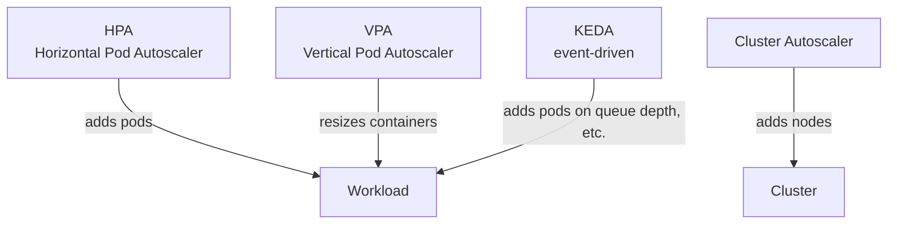
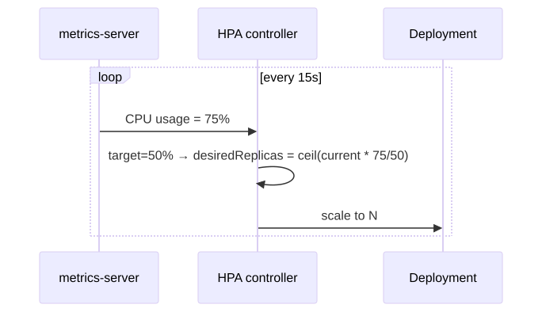
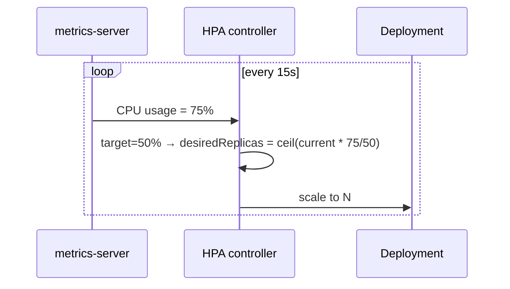

# 12 — Autoscaling

> Three axes of autoscaling. Pick the right one — or combine them.

## The three (four) autoscalers

<!-- mermaid:rendered -->
<p align="center"></p>

<details><summary>Mermaid source</summary>



</details>
| Tool | Direction | Trigger | When |
|------|-----------|---------|------|
| **HPA** | Pods (out/in) | CPU, memory, custom metrics | Web/API workloads |
| **VPA** | Container size (up/down) | Historical usage | Stateful, batch |
| **Cluster Autoscaler** | Nodes (out/in) | Pending pods | Cloud clusters |
| **KEDA** | Pods incl. scale-to-zero | Kafka lag, SQS depth, cron, 60+ scalers | Event-driven |

> ⚠️ **HPA + VPA on the same metric = oscillation.** Use VPA in "Off" / "Initial" mode if HPA scales on CPU.

## Quick reference

=== ":material-lightbulb-outline: Concept"
    Horizontal Pod Autoscaler (HPA) adjusts replica count based on CPU, memory, or custom metrics. It needs metrics-server installed and `resources.requests` set on the workload, otherwise it has no baseline to compute utilization.

=== ":material-file-code-outline: Manifest"
    ```yaml
    apiVersion: autoscaling/v2
    kind: HorizontalPodAutoscaler
    metadata:
      name: hello-app
    spec:
      scaleTargetRef:
        apiVersion: apps/v1
        kind: Deployment
        name: hello-app
      minReplicas: 2
      maxReplicas: 10
      metrics:
        - type: Resource
          resource:
            name: cpu
            target: { type: Utilization, averageUtilization: 50 }
      behavior:
        scaleDown:
          stabilizationWindowSeconds: 300
    ```

=== ":material-console: kubectl"
    ```bash
    kubectl apply -f hpa.yaml
    kubectl get hpa hello-app
    kubectl describe hpa hello-app | tail -15
    kubectl run -it --rm load --image=busybox --restart=Never -- \
      sh -c "while true; do wget -q -O- http://hello-app/; done"
    ```

=== ":material-text-box-outline: Expected output"
    ```text
    horizontalpodautoscaler.autoscaling/hello-app created

    NAME        REFERENCE              TARGETS         MINPODS   MAXPODS   REPLICAS
    hello-app   Deployment/hello-app   12%/50%, 8%/70% 2         10        2

    # under load:
    hello-app   Deployment/hello-app   180%/50%        2         10        4
    hello-app   Deployment/hello-app   95%/50%         2         10        7
    hello-app   Deployment/hello-app   48%/50%         2         10        7
    ```

## How HPA works

<!-- mermaid:rendered -->
<p align="center"></p>

<details><summary>Mermaid source</summary>



</details>
## Prerequisites

HPA needs **metrics-server** for CPU/memory. See [`metrics-server-install.md`](./metrics-server-install.md).

## Apply & observe

```bash
# Install metrics-server (see install file)
kubectl apply -f https://github.com/kubernetes-sigs/metrics-server/releases/latest/download/components.yaml
# kind only: patch to skip TLS verify
kubectl -n kube-system patch deploy metrics-server --type=json \
  -p='[{"op":"add","path":"/spec/template/spec/containers/0/args/-","value":"--kubelet-insecure-tls"}]'

# Backend
kubectl apply -f ../03-deployments/deployment.yaml
kubectl apply -f ../04-services/clusterip.yaml

# HPA
kubectl apply -f hpa.yaml
kubectl get hpa -w

# Generate load
kubectl run -it --rm load --image=busybox --restart=Never -- \
  sh -c "while true; do wget -q -O- http://hello-app/; done"

# Watch replicas climb
kubectl get hpa,deploy hello-app -w
```

## Cleanup

```bash
kubectl delete -f hpa.yaml
```

## Gotchas

> ⚠️ **No `resources.requests.cpu` = no HPA.** HPA computes utilization as `usage / requests`. Without requests, HPA can't compute.

> ⚠️ **HPA cooldown defaults: 5 min scale-down, 0s scale-up.** Tune via `behavior` block to avoid flapping.

> ⚠️ **Scale-to-zero needs KEDA** (or Knative). HPA's `minReplicas` floor is 1.

> ⚠️ **Cluster Autoscaler is cloud-specific.** Each cloud has its own (EKS managed node groups, GKE NAP, AKS autoscaler, Karpenter on AWS).

## Reference

- [HPA](https://kubernetes.io/docs/tasks/run-application/horizontal-pod-autoscale/)
- [VPA](https://github.com/kubernetes/autoscaler/tree/master/vertical-pod-autoscaler)
- [Cluster Autoscaler](https://github.com/kubernetes/autoscaler/tree/master/cluster-autoscaler)
- [KEDA](https://keda.sh/)
- [Karpenter](https://karpenter.sh/)
