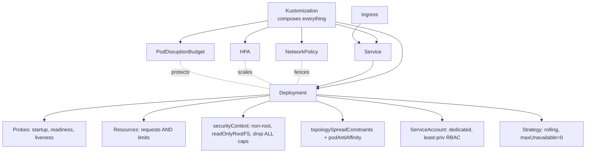

# 13 — Production-Grade Deployment

> The full checklist. This is what a "real" Deployment looks like — not the 5-line tutorial version.

## The production checklist

<!-- mermaid:rendered -->
<p align="center"></p>

<details><summary>Mermaid source</summary>



</details>
## Quick reference

=== ":material-lightbulb-outline: Concept"
    A production-grade workload bundles a Deployment with probes, resource limits, securityContext, anti-affinity, an HPA, a PodDisruptionBudget, and a NetworkPolicy. Kustomize composes them into one apply.

=== ":material-file-code-outline: Manifest"
    ```yaml
    apiVersion: policy/v1
    kind: PodDisruptionBudget
    metadata:
      name: hello-prod
    spec:
      minAvailable: 2
      selector:
        matchLabels:
          app: hello-prod
    ---
    apiVersion: networking.k8s.io/v1
    kind: NetworkPolicy
    metadata:
      name: hello-prod-default-deny
    spec:
      podSelector:
        matchLabels: { app: hello-prod }
      policyTypes: [Ingress, Egress]
    ```

=== ":material-console: kubectl"
    ```bash
    kubectl apply -k .
    kubectl get all,pdb,hpa,networkpolicy -l app=hello-prod
    kubectl get pods -l app=hello-prod -o wide
    kubectl drain kind-worker --ignore-daemonsets --delete-emptydir-data
    ```

=== ":material-text-box-outline: Expected output"
    ```text
    deployment.apps/hello-prod created
    service/hello-prod created
    poddisruptionbudget.policy/hello-prod created
    horizontalpodautoscaler.autoscaling/hello-prod created
    networkpolicy.networking.k8s.io/hello-prod-default-deny created

    NAME             READY   UP-TO-DATE   AVAILABLE   AGE
    hello-prod       3/3     3            3           20s

    NAME              MIN AVAILABLE   ALLOWED DISRUPTIONS   AGE
    pdb/hello-prod    2               1                     20s

    error: cannot delete Pods declare no controller (use --force):
    evicting pod default/hello-prod-... (PDB violation)
    ```

## What's in this folder

| File | Purpose |
|------|---------|
| `deployment.yaml` | App with probes, resources, securityContext, anti-affinity, topology spread |
| `service.yaml` | ClusterIP fronting the pods |
| `pdb.yaml` | PodDisruptionBudget — keeps min available during voluntary disruptions |
| `hpa.yaml` | Horizontal autoscaling |
| `networkpolicy.yaml` | Default-deny + selective allow |
| `kustomization.yaml` | Composes all of the above |

## Apply & observe

```bash
# Single command applies everything
kubectl apply -k .

# Verify
kubectl get all,pdb,hpa,networkpolicy -l app=hello-prod
kubectl describe pdb hello-prod
kubectl describe hpa hello-prod

# Check pods spread across nodes/zones
kubectl get pods -l app=hello-prod -o wide

# Try to drain a node — PDB protects you
kubectl drain kind-worker --ignore-daemonsets --delete-emptydir-data
# → blocked if it would violate PDB
```

## The big-ticket production fields explained

### `securityContext`
Run as non-root, read-only root filesystem, drop all Linux capabilities, no privilege escalation.

### `topologySpreadConstraints`
Spread replicas across zones / nodes. Prevents "all pods on one node, node dies, outage."

### `podAntiAffinity`
"Don't schedule another replica of me on the same node."

### `PodDisruptionBudget`
Caps how many pods can be voluntarily evicted at once (node drain, cluster upgrade). `kubectl drain` respects it.

### `NetworkPolicy`
Default deny all, then explicitly allow Ingress controller → app, app → DB. Requires a CNI that enforces them (Calico, Cilium, etc.). **Flannel does NOT.**

### Cloud-specific identity (IRSA / Workload Identity)

| Cloud | Mechanism |
|-------|-----------|
| AWS EKS | IRSA — annotate SA with IAM role ARN |
| GCP GKE | Workload Identity — bind KSA ↔ GSA |
| Azure AKS | Workload Identity (OIDC federation) |

Drop static keys from your pods. Always use the cloud's federated identity.

## Cleanup

```bash
kubectl delete -k .
```

## Production checklist (printable)

- [ ] Resource requests AND limits on every container
- [ ] startup + readiness + liveness probes (different endpoints when possible)
- [ ] securityContext: runAsNonRoot, readOnlyRootFilesystem, drop ALL caps
- [ ] Dedicated ServiceAccount with least-privilege RBAC
- [ ] topologySpreadConstraints across zones
- [ ] podAntiAffinity to avoid co-location
- [ ] PodDisruptionBudget set
- [ ] HPA configured with sensible min/max
- [ ] NetworkPolicy: default deny + explicit allows
- [ ] Image tag pinned (no `:latest`), ideally by digest
- [ ] imagePullPolicy: IfNotPresent (or Always if mutable tag)
- [ ] Cloud workload identity (IRSA / Workload Identity), no static credentials
- [ ] Termination grace period tuned to app's shutdown time
- [ ] PreStop hook for graceful shutdown / connection draining
- [ ] Logs to stdout/stderr (not files)
- [ ] Prometheus annotations or ServiceMonitor for scraping
- [ ] Stored in Git, applied via GitOps (Argo/Flux)

## Gotchas

> ⚠️ **NetworkPolicy without a supporting CNI is a no-op.** Verify your cluster uses Calico/Cilium/etc.

> ⚠️ **PDB with `minAvailable: 100%`** = node drain hangs forever.

> ⚠️ **`readOnlyRootFilesystem: true`** breaks apps that write to `/tmp` — mount an `emptyDir` for `/tmp`.

> ⚠️ **Don't forget `terminationGracePeriodSeconds`.** Default is 30s. If your app needs longer to drain, raise it.

## Reference

- [Configure Pod's Security Context](https://kubernetes.io/docs/tasks/configure-pod-container/security-context/)
- [Topology Spread Constraints](https://kubernetes.io/docs/concepts/scheduling-eviction/topology-spread-constraints/)
- [Pod Disruption Budget](https://kubernetes.io/docs/tasks/run-application/configure-pdb/)
- [Network Policies](https://kubernetes.io/docs/concepts/services-networking/network-policies/)
- [Kustomize](https://kubectl.docs.kubernetes.io/references/kustomize/)
