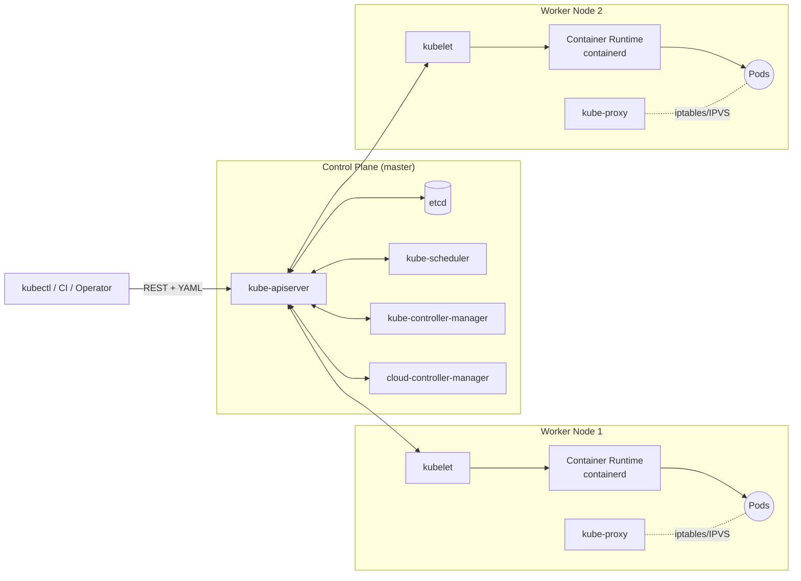

# 03 — Kubernetes Core Concepts

> From "what's a pod?" to confidently shipping production workloads. Every concept here ships with a real YAML manifest you can `kubectl apply -f` on a local cluster.

---

## Why this folder

Docker taught you containers. Kubernetes teaches you to run **fleets** of containers across machines, with self-healing, rolling updates, service discovery, and scaling — declaratively. This folder is the minimum surface area you need before reaching for Helm, Argo, Istio, or any "advanced" topic.

---

## Kubernetes architecture (at a glance)

<!-- mermaid:rendered -->
<p align="center"></p>

<details><summary>Mermaid source</summary>



</details>
---

## The 13-topic learning path

```mermaid
flowchart LR
  A[00 Cluster Setup] --> B[01 Architecture]
  B --> C[02 Pods]
  C --> D[03 Deployments]
  D --> E[04 Services]
  E --> F[05 ConfigMaps & Secrets]
  F --> G[06 Storage]
  G --> H[07 Workloads]
  H --> I[08 Ingress]
  I --> J[09 Namespaces & Quotas]
  J --> K[10 Probes & Health]
  K --> L[11 RBAC]
  L --> M[12 Autoscaling]
  M --> N[13 Production Grade]
```

<!-- mermaid:rendered -->
<p align="center"></p>

<details><summary>Mermaid source</summary>



</details>
---

## Index

| # | Topic | What you learn |
|---|-------|----------------|
| 00 | [Cluster Setup](./00-cluster-setup/) | kind, minikube, k3d, Docker Desktop, kubectl |
| 01 | [Architecture](./01-architecture/) | Control plane + node components |
| 02 | [Pods](./02-pods/) | Smallest deployable unit, init/sidecar |
| 03 | [Deployments](./03-deployments/) | ReplicaSets, rolling updates, scaling |
| 04 | [Services](./04-services/) | ClusterIP, NodePort, LoadBalancer, Headless |
| 05 | [ConfigMaps & Secrets](./05-configmaps-and-secrets/) | Decoupling config from code |
| 06 | [Storage](./06-storage/) | Volumes, PV, PVC, StorageClass |
| 07 | [Workloads](./07-workloads/) | Deployment vs StatefulSet vs DaemonSet vs Job vs CronJob |
| 08 | [Ingress](./08-ingress/) | HTTP routing, TLS, ingress-nginx |
| 09 | [Namespaces & Quotas](./09-namespaces-and-resource-quotas/) | Tenancy & limits |
| 10 | [Probes & Health](./10-probes-and-health/) | Liveness, readiness, startup |
| 11 | [RBAC](./11-rbac/) | Role, RoleBinding, ServiceAccount |
| 12 | [Autoscaling](./12-autoscaling/) | HPA, VPA, Cluster Autoscaler, KEDA |
| 13 | [Production Grade Deployment](./13-production-grade-deployment/) | Full prod checklist |
| — | [Cheatsheet](./cheatsheet.md) | kubectl one-liners |

---

## Setup your cluster first

Don't read past 01 without a working cluster. Start at **[00-cluster-setup](./00-cluster-setup/)**.

```bash
# fastest path on a Mac/Linux dev box
brew install kind kubectl
kind create cluster --config 00-cluster-setup/kind-cluster.yaml
kubectl cluster-info
```

---

## Where to go after this folder

- **[../04-kubernetes-strategies](../04-kubernetes-strategies/)** — Blue/green, canary, GitOps, progressive delivery
- **[../05-kubernetes-advanced](../05-kubernetes-advanced/)** — CRDs, Operators, admission controllers, multi-cluster

---

## Reference docs

- [Kubernetes Concepts](https://kubernetes.io/docs/concepts/)
- [kubectl Reference](https://kubernetes.io/docs/reference/kubectl/)
- [API Reference](https://kubernetes.io/docs/reference/kubernetes-api/)

> ⚠️ All manifests target Kubernetes **1.30+**. If you're on older clusters, check `apiVersion` for deprecations.
