# Kubernetes Core — the primitives that run the internet

<p class="hero kubernetes-core"><h1>03 · Kubernetes <em>core concepts</em></h1><p class="tagline">Twelve primitives. Every production cluster on earth runs on them. Master them once; everything else is configuration.</p></p>

> You don't memorise YAML. You build a mental model, then let `kubectl` prove it. Every concept below runs on a local `kind` cluster — `kind create cluster` and follow along.

---

## Roadmap — your learning path

<div class="roadmap" markdown>

<div class="stop" data-step="1" markdown>
#### Cluster architecture
Six components, one request lifecycle. Until you trace a `kubectl apply` end-to-end you're guessing.
</div>

<div class="stop" data-step="2" markdown>
#### Pods — the atom
Init containers, sidecars, shared namespaces. The unit that actually runs your code.
</div>

<div class="stop" data-step="3" markdown>
#### Labels & selectors
The glue between everything. Services, Deployments, NetworkPolicies — all use them.
</div>

<div class="stop" data-step="4" markdown>
#### Deployments
Rolling updates, rollbacks, revision history. The safe way to ship.
</div>

<div class="stop" data-step="5" markdown>
#### Services
ClusterIP, NodePort, LoadBalancer, headless. How pods find each other.
</div>

<div class="stop" data-step="6" markdown>
#### Ingress
HTTP routing, TLS termination, path/host rules. The front door of your cluster.
</div>

<div class="stop" data-step="7" markdown>
#### ConfigMaps & Secrets
Decouple config from image. Mount as file or env. base64 is not encryption.
</div>

<div class="stop" data-step="8" markdown>
#### Volumes, PV, PVC, StorageClass
Persistent state in an ephemeral world. Access modes, reclaim policies, dynamic provisioning.
</div>

<div class="stop" data-step="9" markdown>
#### Probes
Liveness, readiness, startup. Wrong thresholds kill your SLO. Right thresholds save it.
</div>

<div class="stop" data-step="10" markdown>
#### Namespaces, ResourceQuota, LimitRange
Multi-tenancy without chaos. Blast radius containment.
</div>

<div class="stop" data-step="11" markdown>
#### RBAC
Role, ClusterRole, Binding, ServiceAccount. Principle of least privilege is not optional.
</div>

<div class="stop" data-step="12" markdown>
#### kubectl pro-moves
`explain`, `jsonpath`, `dry-run`, `port-forward`, `debug node`. The ten commands that end every outage.
</div>

</div>

---

## 1. Cluster architecture

<div class="concept" markdown>

<span class="stage reason">🧭 Reason</span>

**Why this exists.** At 14:30 on a Friday, your Deployment is stuck at `Pending`. Pods never land on nodes. You run `kubectl describe pod` and see `0/3 nodes are available: 3 Insufficient memory`. But you *know* the nodes have memory. The issue is the scheduler hasn't seen the latest node capacity because the `kubelet` on one node hasn't posted a heartbeat in 4 minutes — and you don't know that because you don't know which component is responsible for what. At Lyft, a misconfigured cloud-controller-manager caused all new nodes to register without their true allocatable resources, stranding 40% of the fleet for 22 minutes during a traffic spike. If the on-call engineer understood component ownership, they'd have checked `kubectl get nodes -o wide` and controller logs in the first 90 seconds.

<span class="stage thinking">🧠 Thinking</span>

**Mental model.** The control plane *decides*; worker nodes *act*. Every state change flows through a single gate — `kube-apiserver` — and gets persisted to `etcd` before anything else happens.

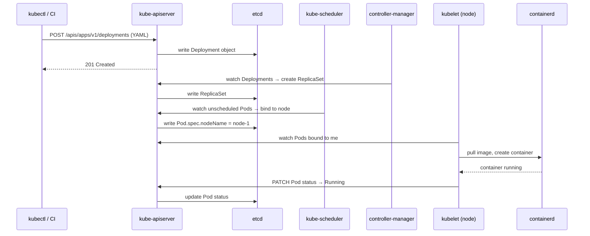

- **kube-apiserver** — the only component that reads/writes etcd. All others talk to it, never to etcd directly.
- **etcd** — append-only key-value store. Stores the *desired* state of every object.
- **kube-scheduler** — watches for Pods with no `nodeName`, scores nodes (resources, taints, affinity), assigns the winner.
- **kube-controller-manager** — runs 30+ reconciliation loops: ReplicaSet controller, Node controller, Job controller, Endpoint controller, etc.
- **kubelet** — the node agent. Watches the API server for Pods assigned to its node, tells the container runtime to run them, reports status back.
- **kube-proxy** — programs iptables/IPVS rules on every node so Service VIPs route to real Pod IPs. It does NOT proxy packets at the application layer.

<span class="stage execution">⚡ Execution</span>

**Run it yourself.**

```bash
# See all control-plane pods (kind cluster)
kubectl get pods -n kube-system

# Watch the event stream — every reconcile, every schedule decision
kubectl get events -A --sort-by='.lastTimestamp' -w

# Inspect scheduler logs
kubectl logs -n kube-system -l component=kube-scheduler --tail=50

# Inspect controller-manager logs
kubectl logs -n kube-system -l component=kube-controller-manager --tail=50

# See node capacity vs allocatable (what the scheduler actually uses)
kubectl describe node | grep -A 8 "Capacity\|Allocatable"

# Trace a pod from creation to running
kubectl run probe --image=nginx --dry-run=server -o yaml | kubectl apply -f -
kubectl get events --field-selector involvedObject.name=probe -w
```

<span class="stage simulation">🔮 Simulation — what you'll see</span>

<pre class="sim"><code><span class="prompt">$</span> kubectl get pods -n kube-system
<span class="comment"># NAME                                        READY   STATUS    RESTARTS</span>
<span class="comment"># coredns-5d78c9869d-2q7rp                    1/1     Running   0</span>
<span class="comment"># etcd-kind-control-plane                     1/1     Running   0</span>
<span class="comment"># kube-apiserver-kind-control-plane           1/1     Running   0</span>
<span class="comment"># kube-controller-manager-kind-control-plane  1/1     Running   0</span>
<span class="comment"># kube-proxy-7zxnk                            1/1     Running   0</span>
<span class="comment"># kube-scheduler-kind-control-plane           1/1     Running   0</span>

<span class="prompt">$</span> kubectl get events -A --sort-by='.lastTimestamp' | tail -6
<span class="comment"># default   0s   Normal   Scheduled   Pod/probe   Successfully assigned default/probe to kind-worker</span>
<span class="comment"># default   0s   Normal   Pulling     Pod/probe   Pulling image "nginx"</span>
<span class="comment"># default   1s   Normal   Pulled      Pod/probe   Successfully pulled image "nginx"</span>
<span class="comment"># default   1s   Normal   Created     Pod/probe   Created container probe</span>
<span class="comment"># default   1s   Normal   Started     Pod/probe   Started container probe</span>
</code></pre>

<span class="stage output">✅ Output — state change</span>

<div class="flow" markdown>

<div class="state before" markdown>
##### Before
<span class="diff-del">black box</span>
pods stuck, no idea which component owns what
</div>

<div class="arrow">→</div>

<div class="state during" markdown>
##### During
<span class="diff-mod">event stream + logs</span>
scheduler, controller, kubelet each visible
</div>

<div class="arrow">→</div>

<div class="state after" markdown>
##### After
<span class="diff-add">root cause in 90 s</span>
kubelet heartbeat gap → node capacity stale
</div>

</div>

<span class="stage usecase">🌍 Real-world use case</span>

<div class="usecase-card" markdown>
**At Lyft**, the cloud-controller-manager misconfigured new node objects during an autoscale event: nodes registered with 0 allocatable CPU. The kube-scheduler correctly declined to schedule pods there. The on-call team spent 18 minutes checking application logs before someone ran `kubectl describe node` and saw `Allocatable: cpu: 0`. Fixing the CCM config resolved it in 2 minutes. The incident post-mortem added "check node allocatable" as step 2 in every `Pending` pod runbook.
</div>

</div>

---

## 2. Pods — the atom

<div class="concept" markdown>

<span class="stage reason">🧭 Reason</span>

**Why this exists.** A pod is the smallest schedulable unit in Kubernetes. Not a container — a *pod*. Understanding what that means (shared network stack, shared PID namespace, shared volumes) is what separates engineers who write correct YAML from engineers who wonder why their sidecar can't talk to the main container on `localhost`. At Airbnb, a logging sidecar was deployed as a separate pod. It worked in staging but silently dropped 30% of logs in production because cross-pod log shipping on the same node created latency spikes. Moving the logger to a sidecar in the same pod (shared `emptyDir`) cut log loss to zero.

<span class="stage thinking">🧠 Thinking</span>

**Mental model.** A pod wraps one or more containers inside a shared Linux network namespace and optionally a shared PID namespace.

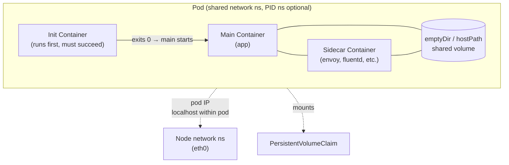

- **Init containers** run sequentially before any app container starts. Use them for DB migration, config fetch, or TCP wait-for-it checks.
- **Sidecars** start alongside the main container and share `localhost`. No network hop. No serialisation overhead.
- **Shared network namespace** — all containers in a pod share the same IP address, port space, and loopback. Two containers can't both listen on port 8080.
- **Shared PID namespace** (opt-in) — `shareProcessNamespace: true` lets containers send signals to each other's processes. Useful for debug containers.
- **emptyDir** — scratch space that lives as long as the pod. Perfect for sidecar log hand-off. Wiped on pod restart.

<span class="stage execution">⚡ Execution</span>

**Run it yourself.**

```bash
# Pod with init container + sidecar sharing a volume
cat <<'EOF' | kubectl apply -f -
apiVersion: v1
kind: Pod
metadata:
  name: pod-anatomy
spec:
  initContainers:
  - name: wait-for-config
    image: busybox:1.36
    command: ['sh', '-c', 'echo "init done" > /shared/ready.txt']
    volumeMounts:
    - name: shared
      mountPath: /shared
  containers:
  - name: app
    image: busybox:1.36
    command: ['sh', '-c', 'cat /shared/ready.txt && sleep 3600']
    volumeMounts:
    - name: shared
      mountPath: /shared
  - name: sidecar
    image: busybox:1.36
    command: ['sh', '-c', 'while true; do echo sidecar sees: $(cat /shared/ready.txt); sleep 5; done']
    volumeMounts:
    - name: shared
      mountPath: /shared
  volumes:
  - name: shared
    emptyDir: {}
EOF

# Watch init container complete, then main containers start
kubectl get pod pod-anatomy -w

# Exec into sidecar and prove same IP as app
kubectl exec pod-anatomy -c sidecar -- ip addr show eth0
kubectl exec pod-anatomy -c app    -- ip addr show eth0

# Teardown
kubectl delete pod pod-anatomy
```

<span class="stage simulation">🔮 Simulation — what you'll see</span>

<pre class="sim"><code><span class="prompt">$</span> kubectl get pod pod-anatomy -w
<span class="comment"># NAME          READY   STATUS     RESTARTS   AGE</span>
<span class="comment"># pod-anatomy   0/2     Init:0/1   0          2s    ← init running</span>
<span class="comment"># pod-anatomy   0/2     PodInitializing  0    4s    ← init done</span>
<span class="comment"># pod-anatomy   2/2     Running    0          6s    ← both containers up</span>

<span class="prompt">$</span> kubectl exec pod-anatomy -c sidecar -- ip addr show eth0
<span class="comment"># inet 10.244.0.15/24   ← pod IP</span>

<span class="prompt">$</span> kubectl exec pod-anatomy -c app -- ip addr show eth0
<span class="comment"># inet 10.244.0.15/24   ← same pod IP — shared namespace</span>
</code></pre>

<span class="stage output">✅ Output — state change</span>

<div class="flow" markdown>

<div class="state before" markdown>
##### Before
<span class="diff-del">sidecar as separate pod</span>
network hop, serialisation lag, log loss
</div>

<div class="arrow">→</div>

<div class="state during" markdown>
##### During
<span class="diff-mod">sidecar in same pod</span>
shared emptyDir, localhost comms
</div>

<div class="arrow">→</div>

<div class="state after" markdown>
##### After
<span class="diff-add">zero log loss</span>
sub-millisecond handoff, no network cost
</div>

</div>

<span class="stage usecase">🌍 Real-world use case</span>

<div class="usecase-card" markdown>
**At Airbnb**, the search service used a separate Fluentd pod per node for log collection. During a flash sale, per-node log volume spiked 40x and the TCP buffer to the Fluentd pod saturated — applications blocked on write and 28% of search requests timed out waiting for log flushes. Moving Fluentd to a sidecar with a shared `emptyDir` eliminated the TCP path entirely. Log writes became memory copies. The P99 write latency dropped from 12 ms to 0.08 ms and zero requests timed out during the next sale.
</div>

</div>

---

## 3. Labels & selectors — the glue

<div class="concept" markdown>

<span class="stage reason">🧭 Reason</span>

**Why this exists.** Labels are how Kubernetes objects refer to each other. A Service doesn't point to pods by name — it uses a selector. A Deployment doesn't manage pods by UID — it uses a selector. NetworkPolicies, PodDisruptionBudgets, HorizontalPodAutoscalers — all label selectors. Get them wrong and your Service routes to the wrong pods, your Deployment orphans replica sets, your PDB doesn't protect anything. At GitHub, a mislabelled canary Deployment used `app: api` instead of `app: api-canary`. The existing ClusterIP Service for `app: api` immediately included the canary pods in its endpoint set, sending 15% of production traffic to an untested build. Correct labelling convention is not housekeeping — it is traffic control.

<span class="stage thinking">🧠 Thinking</span>

**Mental model.** Labels are `key: value` tags on any object. Selectors are filters. An object's label set must be a superset of the selector for the selector to match it.

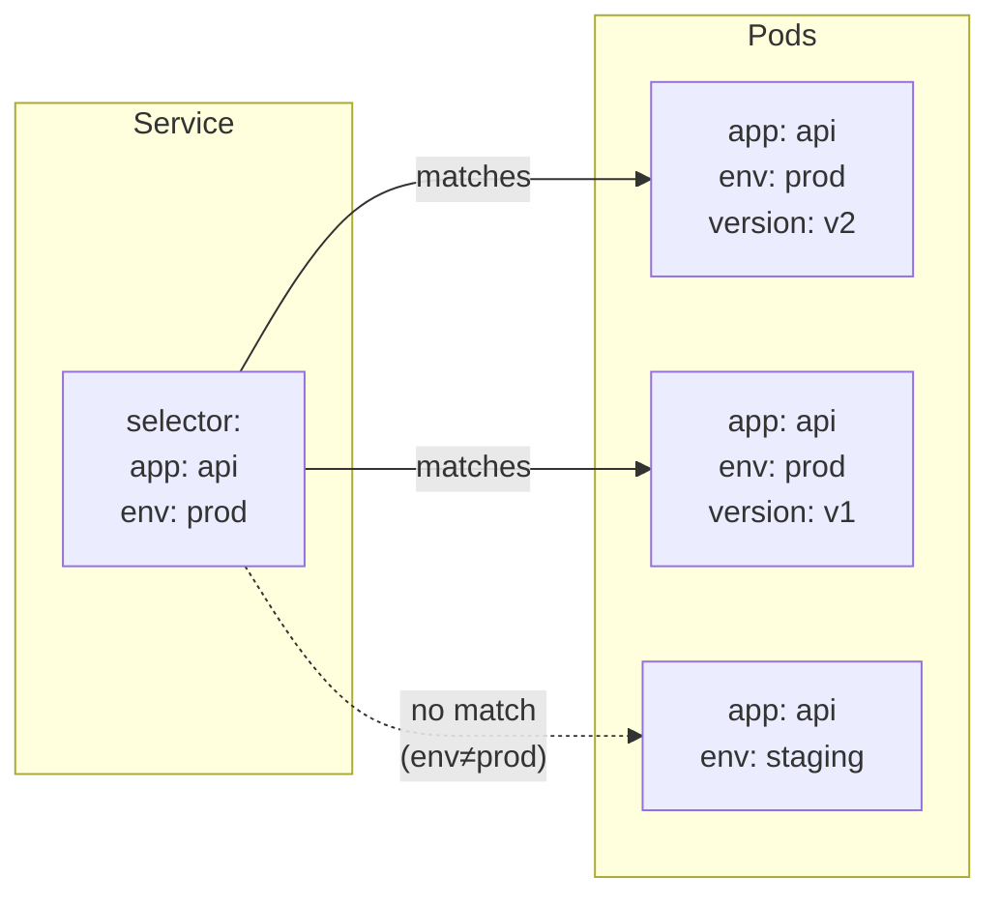

- **Labels** are arbitrary key/value pairs. There is no schema. By convention use `app`, `env`, `version`, `component`, `tier`.
- **Equality-based selectors** — `app=api,env=prod` (used by Services, ReplicationControllers).
- **Set-based selectors** — `env in (prod, staging)`, `version notin (v1)` (used by Deployments, Jobs, NetworkPolicies).
- **Label vs annotation** — labels are for **selecting/grouping**; annotations are for **storing metadata** (CI build ID, docs URL). Annotations are not indexed; labels are.
- Adding a label to a pod that matches an existing Service immediately adds it to that Service's Endpoints. Removing a label removes it. No restart needed.

<span class="stage execution">⚡ Execution</span>

**Run it yourself.**

```bash
# Create two pods with different versions
kubectl run api-v1 --image=nginx --labels="app=api,env=prod,version=v1"
kubectl run api-v2 --image=nginx --labels="app=api,env=prod,version=v2"
kubectl run api-staging --image=nginx --labels="app=api,env=staging,version=v1"

# Selector queries
kubectl get pods -l app=api                          # all three
kubectl get pods -l app=api,env=prod                 # v1 + v2 only
kubectl get pods -l 'version notin (v1)'             # v2 only
kubectl get pods -l 'env in (prod,staging)',app=api  # all three

# Live: add a label to api-staging and watch it join a Service
kubectl create service clusterip api --tcp=80:80
kubectl patch svc api -p '{"spec":{"selector":{"app":"api","env":"prod"}}}'
kubectl get endpoints api   # v1 + v2 pods

kubectl label pod api-staging env=prod   # promote staging pod
kubectl get endpoints api               # now includes api-staging!

# Teardown
kubectl delete pod api-v1 api-v2 api-staging
kubectl delete svc api
```

<span class="stage simulation">🔮 Simulation — what you'll see</span>

<pre class="sim"><code><span class="prompt">$</span> kubectl get pods -l app=api,env=prod
<span class="comment"># NAME      READY   STATUS    RESTARTS</span>
<span class="comment"># api-v1    1/1     Running   0</span>
<span class="comment"># api-v2    1/1     Running   0</span>

<span class="prompt">$</span> kubectl get endpoints api
<span class="comment"># NAME   ENDPOINTS                       AGE</span>
<span class="comment"># api    10.244.0.10:80,10.244.0.11:80   5s</span>

<span class="prompt">$</span> kubectl label pod api-staging env=prod
<span class="comment"># pod/api-staging labeled</span>

<span class="prompt">$</span> kubectl get endpoints api
<span class="comment"># NAME   ENDPOINTS                                    AGE</span>
<span class="comment"># api    10.244.0.10:80,10.244.0.11:80,10.244.0.12:80  6s</span>
</code></pre>

<span class="stage output">✅ Output — state change</span>

<div class="flow" markdown>

<div class="state before" markdown>
##### Before
<span class="diff-del">app=api,env=staging</span>
pod excluded from prod Service
</div>

<div class="arrow">→</div>

<div class="state during" markdown>
##### During
<span class="diff-mod">kubectl label ... env=prod</span>
Endpoints controller reconciles
</div>

<div class="arrow">→</div>

<div class="state after" markdown>
##### After
<span class="diff-add">pod joins Service endpoints</span>
traffic routes to it immediately
</div>

</div>

<span class="stage usecase">🌍 Real-world use case</span>

<div class="usecase-card" markdown>
**At GitHub**, a canary Deployment for the API service shipped with `app: api` instead of `app: api-canary`. The production Service selector was `app: api`. Within 30 seconds the canary pods joined the production endpoint set and received live traffic. The canary build had an unintentional breaking change in a JSON response field. 12% of GitHub Actions runs that polled the API began failing. The fix was a single `kubectl label deployment api-canary app=api-canary` — but the incident drove a company-wide convention: canary Deployments must always include a `track: canary` label and Services must always add `track: stable` to their selector.
</div>

</div>

---

## 4. Deployments — roll, rollback, repeat

<div class="concept" markdown>

<span class="stage reason">🧭 Reason</span>

**Why this exists.** Without Deployments you'd update pods by deleting them and recreating them — guaranteed downtime, no rollback, no history. Deployments give you declarative rolling updates: you change the image tag in one field, and Kubernetes incrementally replaces old pods with new ones, pausing if health checks fail. At Spotify, every microservice release goes through a Deployment rolling update. Before they enforced `maxUnavailable: 0` and `maxSurge: 1`, a release that introduced a startup regression would crash-loop new pods while Kubernetes terminated old ones, hitting zero healthy replicas. Enforcing those two fields means: at least one old pod is always alive until the new one passes its readiness probe.

<span class="stage thinking">🧠 Thinking</span>

**Mental model.** A Deployment manages ReplicaSets. Each rollout creates a new ReplicaSet. The Deployment scales up the new RS and scales down the old RS in lockstep according to the rolling update strategy.

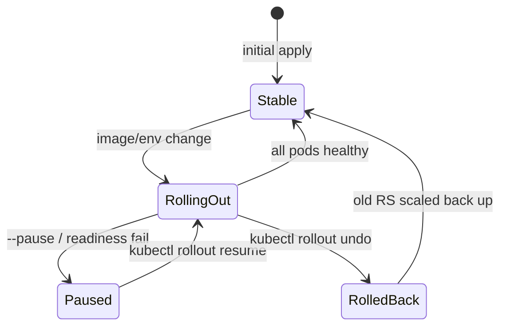

- **ReplicaSet** — owns a set of pods matching a label selector and maintains the desired replica count. Deployments create and delete ReplicaSets; you rarely touch them directly.
- **`maxUnavailable`** — maximum pods that can be down during rollout (absolute or %). Default 25%. Set to `0` for zero-downtime.
- **`maxSurge`** — maximum extra pods above desired count during rollout. Default 25%. Set to `1` for tight resource budgets.
- **Revision history** — each rollout creates a new RS (old RS scaled to 0). `revisionHistoryLimit` controls how many old RSes to keep (default 10). `kubectl rollout undo` reactivates the previous RS.
- **Paused Deployments** — `kubectl rollout pause` lets you batch multiple YAML changes before they take effect. Resume to trigger a single rollout.

<span class="stage execution">⚡ Execution</span>

**Run it yourself.**

```bash
# Create a Deployment
kubectl create deployment web --image=nginx:1.24 --replicas=3
kubectl rollout status deployment/web

# Trigger a rolling update
kubectl set image deployment/web nginx=nginx:1.25
kubectl rollout status deployment/web   # watch pods swap

# Inspect revision history
kubectl rollout history deployment/web
kubectl rollout history deployment/web --revision=2

# Rollback
kubectl rollout undo deployment/web
kubectl rollout status deployment/web

# Force a specific revision
kubectl rollout undo deployment/web --to-revision=1

# See the ReplicaSets behind the scenes
kubectl get rs -l app=web

# Teardown
kubectl delete deployment web
```

<span class="stage simulation">🔮 Simulation — what you'll see</span>

<pre class="sim"><code><span class="prompt">$</span> kubectl rollout history deployment/web
<span class="comment"># REVISION  CHANGE-CAUSE</span>
<span class="comment"># 1         &lt;none&gt;</span>
<span class="comment"># 2         &lt;none&gt;</span>

<span class="prompt">$</span> kubectl get rs -l app=web
<span class="comment"># NAME             DESIRED   CURRENT   READY   AGE</span>
<span class="comment"># web-7d8f9c4b6    3         3         3       45s   ← current RS (nginx:1.24)</span>
<span class="comment"># web-5c6b7d8e9    0         0         0       2m    ← old RS (nginx:1.25), kept for undo</span>

<span class="prompt">$</span> kubectl rollout undo deployment/web
<span class="comment"># deployment.apps/web rolled back</span>

<span class="prompt">$</span> kubectl get rs -l app=web
<span class="comment"># NAME             DESIRED   CURRENT   READY</span>
<span class="comment"># web-5c6b7d8e9    3         3         3     ← old RS promoted back</span>
<span class="comment"># web-7d8f9c4b6    0         0         0     ← current RS scaled down</span>
</code></pre>

<span class="stage output">✅ Output — state change</span>

<div class="flow" markdown>

<div class="state before" markdown>
##### Before
<span class="diff-del">nginx:1.25 breaking</span>
new pods crash-looping
</div>

<div class="arrow">→</div>

<div class="state during" markdown>
##### During
<span class="diff-mod">kubectl rollout undo</span>
old ReplicaSet scales back up
</div>

<div class="arrow">→</div>

<div class="state after" markdown>
##### After
<span class="diff-add">nginx:1.24 restored</span>
zero-downtime, old RS was never deleted
</div>

</div>

<span class="stage usecase">🌍 Real-world use case</span>

<div class="usecase-card" markdown>
**At Spotify**, a release of the playlist service introduced a startup regression that caused pods to OOMKill during initialisation. The Deployment had default `maxUnavailable: 25%` — meaning on a 40-replica Deployment, 10 old pods were terminated before new pods were ready. All 10 new pods OOMKilled. The remaining 30 old pods handled the traffic spike without issue. After a `kubectl rollout undo` the service stabilised in 90 seconds. The team then added `maxUnavailable: 0` and a startup probe with a 60-second initial delay. The next release rolled out without a single user-visible error.
</div>

</div>

---

## 5. Services — stable endpoints in a shifting world

<div class="concept" markdown>

<span class="stage reason">🧭 Reason</span>

**Why this exists.** Pod IPs are ephemeral. Every restart, every reschedule gives a pod a new IP. If service A hard-codes service B's pod IP, it breaks every time a pod restarts. Services give you a stable virtual IP (ClusterIP) backed by a label selector. The Endpoints controller watches for matching pods and keeps the endpoint list current. kube-proxy programs iptables/IPVS so packets to the virtual IP get load-balanced to healthy pods. At Pinterest, the recommendations service called the feature-store service by pod IP stored in a config file. A single node drain during a routine upgrade restarted 6 pods. All 6 got new IPs. Recommendations degraded for 8 minutes until config was manually updated. Moving to a ClusterIP Service made the degradation impossible.

<span class="stage thinking">🧠 Thinking</span>

**Mental model.** Four Service types form a hierarchy. Each outer type includes all the capability of the inner type.

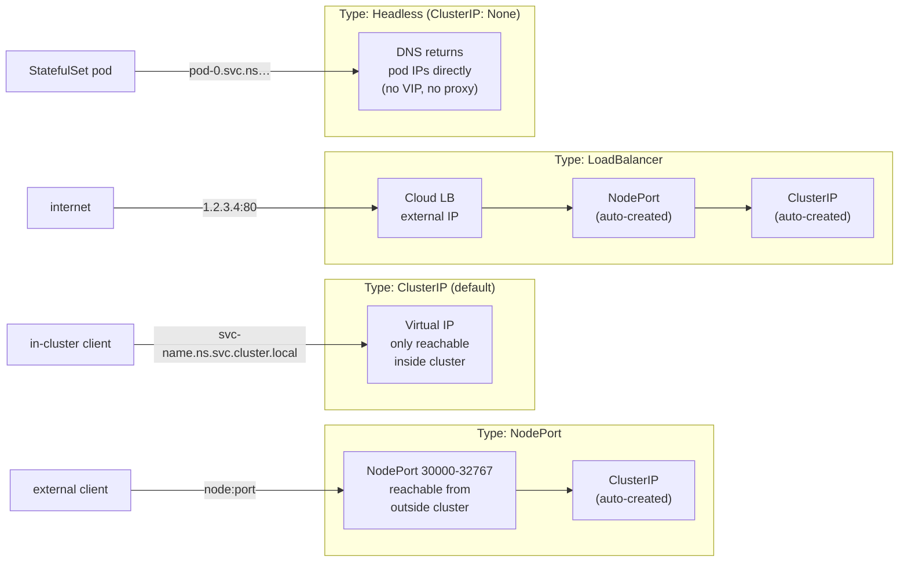

- **ClusterIP** — default. Stable VIP, kube-proxy routes to pods. Use for internal service-to-service.
- **NodePort** — exposes on every node's IP at a static port (30000–32767). Use for dev/test or on-prem with an external load balancer you manage.
- **LoadBalancer** — provisions a cloud LB. Each Service gets its own LB, which gets expensive at scale. Use sparingly; prefer Ingress.
- **Headless** (`clusterIP: None`) — no VIP, no kube-proxy. DNS returns individual pod A records. Required for StatefulSets so each pod gets a stable DNS name.
- **EndpointSlices** — replaced Endpoints at scale. Each slice holds ≤100 endpoints. The Endpoints controller creates and maintains them automatically.

<span class="stage execution">⚡ Execution</span>

**Run it yourself.**

```bash
# Deploy 3 replicas of a simple HTTP server
kubectl create deployment echo --image=ealen/echo-server --replicas=3
kubectl label deployment echo app=echo

# ClusterIP Service
kubectl expose deployment echo --port=80 --target-port=80 --name=echo-clusterip

# Verify Endpoints are populated
kubectl get endpoints echo-clusterip

# Test from inside the cluster
kubectl run curl --image=curlimages/curl --rm -it --restart=Never -- \
  curl -s http://echo-clusterip/

# Headless Service — see pod IPs in DNS
kubectl expose deployment echo --port=80 --cluster-ip=None --name=echo-headless
kubectl run dnstest --image=busybox:1.36 --rm -it --restart=Never -- \
  nslookup echo-headless    # returns multiple A records, one per pod

# NodePort
kubectl expose deployment echo --port=80 --type=NodePort --name=echo-nodeport
kubectl get svc echo-nodeport   # shows NodePort number

# Teardown
kubectl delete svc echo-clusterip echo-headless echo-nodeport
kubectl delete deployment echo
```

<span class="stage simulation">🔮 Simulation — what you'll see</span>

<pre class="sim"><code><span class="prompt">$</span> kubectl get endpoints echo-clusterip
<span class="comment"># NAME            ENDPOINTS                                      AGE</span>
<span class="comment"># echo-clusterip  10.244.0.5:80,10.244.0.6:80,10.244.0.7:80    10s</span>

<span class="prompt">$</span> nslookup echo-headless
<span class="comment"># Server:    10.96.0.10</span>
<span class="comment"># Name:      echo-headless.default.svc.cluster.local</span>
<span class="comment"># Address 1: 10.244.0.5  ← pod IP directly</span>
<span class="comment"># Address 2: 10.244.0.6</span>
<span class="comment"># Address 3: 10.244.0.7</span>

<span class="prompt">$</span> kubectl get svc echo-nodeport
<span class="comment"># NAME            TYPE       CLUSTER-IP     PORT(S)</span>
<span class="comment"># echo-nodeport   NodePort   10.96.44.100   80:31245/TCP</span>
</code></pre>

<span class="stage output">✅ Output — state change</span>

<div class="flow" markdown>

<div class="state before" markdown>
##### Before
<span class="diff-del">hard-coded pod IP</span>
breaks on every pod restart
</div>

<div class="arrow">→</div>

<div class="state during" markdown>
##### During
<span class="diff-mod">ClusterIP Service + selector</span>
Endpoints controller tracks pods
</div>

<div class="arrow">→</div>

<div class="state after" markdown>
##### After
<span class="diff-add">stable DNS name forever</span>
pod IP changes are invisible to callers
</div>

</div>

<span class="stage usecase">🌍 Real-world use case</span>

<div class="usecase-card" markdown>
**At Pinterest**, the feature-store service is called 2 million times per second at peak. After migrating from hard-coded pod IPs to a ClusterIP Service, the team discovered that kube-proxy's default iptables mode created lock contention at that call rate. They switched to IPVS mode (`kube-proxy --proxy-mode=ipvs`) which uses a kernel hash table instead of linear iptables rules. P99 latency for feature-store lookups dropped from 14 ms to 3 ms, and connection setup overhead dropped by 80%.
</div>

</div>

---

## 6. Ingress — the cluster's front door

<div class="concept" markdown>

<span class="stage reason">🧭 Reason</span>

**Why this exists.** You have 20 microservices. If each uses a `LoadBalancer` Service you pay for 20 cloud load balancers and manage 20 external IPs. Ingress collapses that to a single LB, a single IP, and routes HTTP/HTTPS traffic to the right Service based on hostname or path rules — all in software. The Ingress controller (e.g., ingress-nginx) runs in the cluster and watches Ingress objects to keep its routing table current. At Twitch, migrating from 60 per-service NLBs to a single ingress-nginx gateway reduced AWS bill by $140k/month and cut mean certificate renewal time from 4 hours (manual) to 90 seconds (cert-manager integration).

<span class="stage thinking">🧠 Thinking</span>

**Mental model.** An Ingress object is a routing rule. An Ingress Controller is the process that reads those rules and configures a reverse proxy.

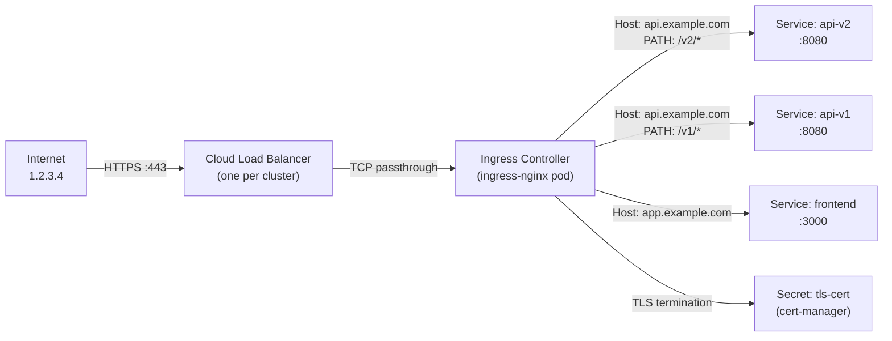

- **Ingress Controller** — the controller is NOT built into Kubernetes. You must install one: ingress-nginx, Traefik, Kong, AWS ALB Controller.
- **IngressClass** — `ingressClassName: nginx` in the Ingress spec selects which controller handles it. Multiple controllers can coexist.
- **Host routing** — `host: api.example.com` matches the HTTP `Host` header.
- **Path routing** — `path: /v2` with `pathType: Prefix` matches `/v2`, `/v2/users`, etc. `Exact` matches only `/v2`.
- **TLS termination** — reference a `kubernetes.io/tls` Secret in `spec.tls`. The controller handles the TLS handshake; upstream traffic is plain HTTP.
- **Annotations** — controller-specific behaviour lives in annotations: `nginx.ingress.kubernetes.io/rewrite-target`, `nginx.ingress.kubernetes.io/rate-limit`, etc.

<span class="stage execution">⚡ Execution</span>

**Run it yourself.**

```bash
# Install ingress-nginx on kind
kubectl apply -f https://raw.githubusercontent.com/kubernetes/ingress-nginx/main/deploy/static/provider/kind/deploy.yaml
kubectl wait --namespace ingress-nginx \
  --for=condition=ready pod \
  --selector=app.kubernetes.io/component=controller \
  --timeout=90s

# Deploy two backends
kubectl create deployment app --image=ealen/echo-server --replicas=2
kubectl expose deployment app --port=80
kubectl create deployment api --image=ealen/echo-server --replicas=2
kubectl expose deployment api --port=80

# Create an Ingress with path-based routing
cat <<'EOF' | kubectl apply -f -
apiVersion: networking.k8s.io/v1
kind: Ingress
metadata:
  name: demo
  annotations:
    nginx.ingress.kubernetes.io/rewrite-target: /
spec:
  ingressClassName: nginx
  rules:
  - host: demo.local
    http:
      paths:
      - path: /app
        pathType: Prefix
        backend:
          service:
            name: app
            port:
              number: 80
      - path: /api
        pathType: Prefix
        backend:
          service:
            name: api
            port:
              number: 80
EOF

# Test (add "127.0.0.1 demo.local" to /etc/hosts first)
curl http://demo.local/app
curl http://demo.local/api

# Teardown
kubectl delete ingress demo
kubectl delete deployment app api
kubectl delete svc app api
```

<span class="stage simulation">🔮 Simulation — what you'll see</span>

<pre class="sim"><code><span class="prompt">$</span> kubectl get ingress demo
<span class="comment"># NAME   CLASS   HOSTS        ADDRESS      PORTS   AGE</span>
<span class="comment"># demo   nginx   demo.local   127.0.0.1    80      12s</span>

<span class="prompt">$</span> curl http://demo.local/app
<span class="comment"># {"host":{"hostname":"demo.local","ip":"::ffff:10.244.0.8"},"request":{"path":"/"}}</span>
<span class="comment"># ← rewrite-target: / strips /app prefix before forwarding</span>

<span class="prompt">$</span> curl http://demo.local/api
<span class="comment"># {"host":{"hostname":"demo.local","ip":"::ffff:10.244.0.9"},...}</span>
<span class="comment"># ← different backend pod responds</span>
</code></pre>

<span class="stage output">✅ Output — state change</span>

<div class="flow" markdown>

<div class="state before" markdown>
##### Before
<span class="diff-del">20 LoadBalancer Services</span>
20 cloud LB costs, 20 IPs to manage
</div>

<div class="arrow">→</div>

<div class="state during" markdown>
##### During
<span class="diff-mod">1 Ingress Controller + rules</span>
host/path routing in nginx config
</div>

<div class="arrow">→</div>

<div class="state after" markdown>
##### After
<span class="diff-add">1 LB, 1 IP, N services</span>
TLS centralised, routing declarative
</div>

</div>

<span class="stage usecase">🌍 Real-world use case</span>

<div class="usecase-card" markdown>
**At Twitch**, the platform ran 60 AWS Network Load Balancers — one per service team. Certificate management was done manually via AWS ACM with 4-hour propagation. After deploying ingress-nginx with cert-manager (Let's Encrypt DNS-01 challenge), all 60 services consolidated behind a single NLB. Certificate issuance dropped to 90 seconds. Monthly AWS costs fell by $140k. The bigger win: routing changes that previously required an AWS console ticket became `kubectl apply` operations, cutting feature release lead time by 2 days.
</div>

</div>

---

## 7. ConfigMaps & Secrets — config is not code

<div class="concept" markdown>

<span class="stage reason">🧭 Reason</span>

**Why this exists.** Hardcoding a database URL into a container image means rebuilding the image every time you rotate a password. Embedding credentials in environment variables set at `docker run` time means they disappear from your audit trail. ConfigMaps and Secrets decouple configuration from images: store config in the cluster, mount it into pods as files or env vars, update it without rebuilding. One critical nuance: Secrets are base64-encoded, not encrypted. Anyone with `kubectl get secret` access can decode them in one command. Encryption at rest (EncryptionConfiguration) and external secret stores (Vault, AWS Secrets Manager via External Secrets Operator) are the production answer. At Revolut, an improperly scoped ServiceAccount with `get secrets` on the `default` namespace allowed an intern's compromised laptop to exfiltrate database credentials for a non-production analytics cluster.

<span class="stage thinking">🧠 Thinking</span>

**Mental model.** Two paths from ConfigMap/Secret into a running container: environment variable injection (simple, shows up in `printenv`, cannot be updated without pod restart) or volume mount (file on disk, updates propagate without restart when `optional: false` and the CM/Secret changes).

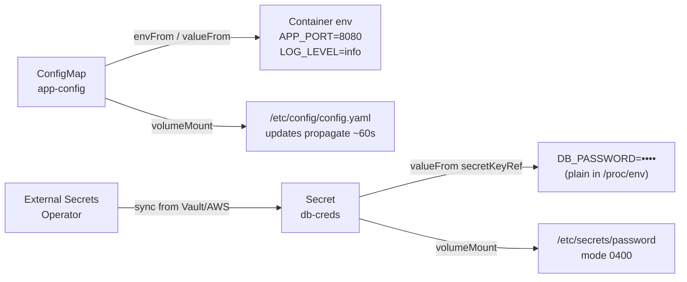

- **ConfigMap** — store non-sensitive config: app ports, log levels, feature flags, nginx.conf.
- **Secret** — store sensitive data: passwords, TLS certs, API keys. Types: `Opaque`, `kubernetes.io/tls`, `kubernetes.io/dockerconfigjson`, `kubernetes.io/service-account-token`.
- **base64 is NOT encryption** — `echo "c2VjcmV0" | base64 -d` → `secret`. Enable EncryptionConfiguration on the API server or use an external secrets operator.
- **Immutable ConfigMaps/Secrets** — `immutable: true` prevents changes and removes watch overhead. Use for config that never changes (e.g., a bundled CA certificate).
- **Volume mount updates** — the kubelet syncs ConfigMap/Secret volume mounts on a configurable interval (default ~60 s). Env var injection does NOT update without a pod restart.

<span class="stage execution">⚡ Execution</span>

**Run it yourself.**

```bash
# Create a ConfigMap from literal values
kubectl create configmap app-config \
  --from-literal=APP_PORT=8080 \
  --from-literal=LOG_LEVEL=info

# Create a Secret (base64 auto-encoded by kubectl)
kubectl create secret generic db-creds \
  --from-literal=DB_PASSWORD=supersecret

# Decode the secret (prove it's NOT encrypted)
kubectl get secret db-creds -o jsonpath='{.data.DB_PASSWORD}' | base64 -d
# → supersecret

# Pod using both env + volume mount
cat <<'EOF' | kubectl apply -f -
apiVersion: v1
kind: Pod
metadata:
  name: config-demo
spec:
  containers:
  - name: app
    image: busybox:1.36
    command: ['sh', '-c', 'env | grep -E "APP_PORT|LOG_LEVEL|DB_" ; cat /etc/config/APP_PORT ; sleep 3600']
    envFrom:
    - configMapRef:
        name: app-config
    env:
    - name: DB_PASSWORD
      valueFrom:
        secretKeyRef:
          name: db-creds
          key: DB_PASSWORD
    volumeMounts:
    - name: config-vol
      mountPath: /etc/config
  volumes:
  - name: config-vol
    configMap:
      name: app-config
EOF

kubectl logs config-demo

# Live update test — change a value
kubectl patch configmap app-config -p '{"data":{"LOG_LEVEL":"debug"}}'
# Wait ~60s, then check the mounted file
kubectl exec config-demo -- cat /etc/config/LOG_LEVEL

# Teardown
kubectl delete pod config-demo
kubectl delete configmap app-config
kubectl delete secret db-creds
```

<span class="stage simulation">🔮 Simulation — what you'll see</span>

<pre class="sim"><code><span class="prompt">$</span> kubectl get secret db-creds -o jsonpath='{.data.DB_PASSWORD}' | base64 -d
<span class="comment"># supersecret     ← no decryption needed, base64 is NOT encryption</span>

<span class="prompt">$</span> kubectl logs config-demo
<span class="comment"># APP_PORT=8080</span>
<span class="comment"># LOG_LEVEL=info</span>
<span class="comment"># DB_PASSWORD=supersecret     ← visible in env, be careful with kubectl exec env</span>

<span class="prompt">$</span> kubectl exec config-demo -- cat /etc/config/LOG_LEVEL
<span class="comment"># debug           ← file updated without pod restart after ~60s</span>
</code></pre>

<span class="stage output">✅ Output — state change</span>

<div class="flow" markdown>

<div class="state before" markdown>
##### Before
<span class="diff-del">credential in image</span>
rebuild to rotate, no audit trail
</div>

<div class="arrow">→</div>

<div class="state during" markdown>
##### During
<span class="diff-mod">Secret + volume mount</span>
file at /etc/secrets, RBAC-gated
</div>

<div class="arrow">→</div>

<div class="state after" markdown>
##### After
<span class="diff-add">rotate without rebuild</span>
update Secret → file refreshes in 60 s
</div>

</div>

<span class="stage usecase">🌍 Real-world use case</span>

<div class="usecase-card" markdown>
**At Revolut**, a ServiceAccount bound to a ClusterRole with `get secrets` on `namespace: *` was accidentally attached to a CI runner pod. When the runner's host was compromised, the attacker ran `kubectl get secrets -A` and extracted live database credentials from 4 namespaces. The blast radius was contained to non-production clusters, but the incident drove three changes: (1) all ClusterRoles with secret access were audited and scoped to named namespaces, (2) Secrets were encrypted at rest via EncryptionConfiguration with AES-CBC, (3) production database credentials moved to HashiCorp Vault via the External Secrets Operator, removing all sensitive values from etcd entirely.
</div>

</div>

---

## 8. Volumes, PV, PVC, StorageClass — persistent state

<div class="concept" markdown>

<span class="stage reason">🧭 Reason</span>

**Why this exists.** Container filesystems are ephemeral. A pod restart wipes everything the app wrote. For stateless apps that's fine — but databases, message queues, and ML model checkpoints need storage that outlives pods. Kubernetes separates the *admin concern* (provisioning a disk) from the *developer concern* (claiming a chunk of storage) via PersistentVolumes (PV) and PersistentVolumeClaims (PVC). StorageClass adds dynamic provisioning: developers claim storage in YAML and the cluster automatically provisions a cloud disk. At DoorDash, the order-routing service used a StatefulSet with a PVC for its local Redis. During a cluster upgrade, a node was cordoned, the pod rescheduled — and the PVC didn't follow because `volumeBindingMode: Immediate` had bound the volume to the cordoned node's availability zone. Orders routed to that shard returned errors for 11 minutes. Setting `volumeBindingMode: WaitForFirstConsumer` on the StorageClass fixed it permanently.

<span class="stage thinking">🧠 Thinking</span>

**Mental model.** Three layers, each owned by a different persona.

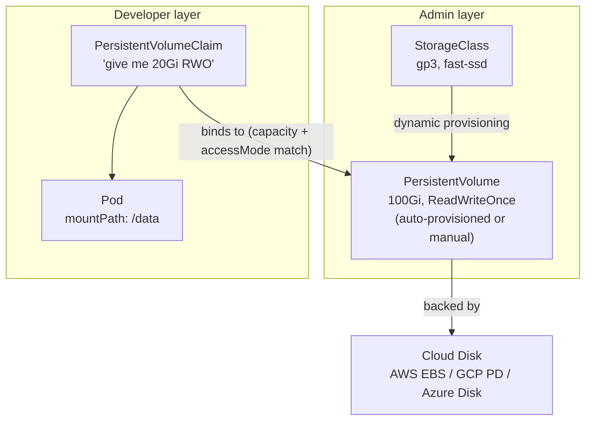

- **Access modes** — `ReadWriteOnce` (one node, RW), `ReadOnlyMany` (many nodes, RO), `ReadWriteMany` (many nodes, RW — needs NFS/CephFS/EFS). Most block devices are RWO only.
- **Reclaim policy** — `Retain` (disk survives PVC delete, must be manually reclaimed), `Delete` (disk deleted with PVC), `Recycle` (deprecated, don't use).
- **`volumeBindingMode: WaitForFirstConsumer`** — delays volume provisioning until a pod is scheduled. Prevents cross-AZ binding mismatches.
- **`storageClassName: ""` (empty)** — explicitly selects no StorageClass. Binds only to manually created PVs.
- **StatefulSet VolumeClaimTemplates** — each replica gets its own PVC. Names are predictable: `data-podname-0`, `data-podname-1`. PVCs persist across pod restarts.

<span class="stage execution">⚡ Execution</span>

**Run it yourself.**

```bash
# Check available StorageClasses
kubectl get storageclass

# Create a PVC
cat <<'EOF' | kubectl apply -f -
apiVersion: v1
kind: PersistentVolumeClaim
metadata:
  name: demo-pvc
spec:
  accessModes:
  - ReadWriteOnce
  resources:
    requests:
      storage: 1Gi
  storageClassName: standard  # adjust to your cluster's default
EOF

kubectl get pvc demo-pvc   # watch it go Pending → Bound

# Mount it in a pod
cat <<'EOF' | kubectl apply -f -
apiVersion: v1
kind: Pod
metadata:
  name: pvc-demo
spec:
  containers:
  - name: writer
    image: busybox:1.36
    command: ['sh', '-c', 'echo "$(date): wrote from $(hostname)" >> /data/log.txt; sleep 3600']
    volumeMounts:
    - name: storage
      mountPath: /data
  volumes:
  - name: storage
    persistentVolumeClaim:
      claimName: demo-pvc
EOF

kubectl exec pvc-demo -- cat /data/log.txt

# Delete the pod — data persists in PVC
kubectl delete pod pvc-demo
kubectl run pvc-reader --image=busybox:1.36 --restart=Never -- \
  sh -c "sleep 2 && cat /data/log.txt"  # won't work without volume mount but proves PVC stays

kubectl get pvc demo-pvc   # still Bound after pod deletion

# Teardown
kubectl delete pod pvc-demo pvc-reader --ignore-not-found
kubectl delete pvc demo-pvc
```

<span class="stage simulation">🔮 Simulation — what you'll see</span>

<pre class="sim"><code><span class="prompt">$</span> kubectl get pvc demo-pvc
<span class="comment"># NAME       STATUS   VOLUME                                     CAPACITY   ACCESS MODES</span>
<span class="comment"># demo-pvc   Bound    pvc-a1b2c3d4-...                           1Gi        RWO</span>

<span class="prompt">$</span> kubectl exec pvc-demo -- cat /data/log.txt
<span class="comment"># Mon Apr 27 14:00:01 UTC 2026: wrote from pvc-demo</span>

<span class="prompt">$</span> kubectl delete pod pvc-demo
<span class="comment"># pod "pvc-demo" deleted</span>

<span class="prompt">$</span> kubectl get pvc demo-pvc
<span class="comment"># STATUS: Bound    ← PVC survives pod deletion; data persists on the disk</span>
</code></pre>

<span class="stage output">✅ Output — state change</span>

<div class="flow" markdown>

<div class="state before" markdown>
##### Before
<span class="diff-del">emptyDir only</span>
data wiped on every pod restart
</div>

<div class="arrow">→</div>

<div class="state during" markdown>
##### During
<span class="diff-mod">PVC bound to PV</span>
cloud disk provisioned, pod mounts it
</div>

<div class="arrow">→</div>

<div class="state after" markdown>
##### After
<span class="diff-add">data outlives pods</span>
reschedule pod, same disk reattaches
</div>

</div>

<span class="stage usecase">🌍 Real-world use case</span>

<div class="usecase-card" markdown>
**At DoorDash**, the order-routing StatefulSet used `volumeBindingMode: Immediate` on its StorageClass. When a node in `us-east-1a` was drained for maintenance, the pod was rescheduled to a node in `us-east-1b` — but the EBS volume was already bound to `us-east-1a`. The pod stayed `Pending` for 11 minutes while an SRE manually detached the volume and updated the PV. Every order-routing shard on that node lost availability. Changing the StorageClass to `volumeBindingMode: WaitForFirstConsumer` means EBS volumes are now always provisioned in the same AZ as the pod that claims them, making cross-AZ binding physically impossible.
</div>

</div>

---

## 9. Probes — tell Kubernetes when you're healthy

<div class="concept" markdown>

<span class="stage reason">🧭 Reason</span>

**Why this exists.** Kubernetes knows a container is running (the process is alive) but it doesn't know if the application inside is *ready to serve traffic* or *stuck in a broken state*. Probes close that gap. Without a readiness probe, a pod joins the Service endpoint set the moment its container starts — before the JVM warms up, before the DB connection pool initialises. Without a liveness probe, a deadlocked process stays running forever and never gets restarted. Wrong probe thresholds are as dangerous as no probes: aggressive liveness probes restart pods under normal load spikes, triggering cascading failures. At Netflix, an overly aggressive liveness probe (`failureThreshold: 1`, 3-second timeout) killed streaming-worker pods during GC pauses, causing 14% of active streams to rebuffer simultaneously.

<span class="stage thinking">🧠 Thinking</span>

**Mental model.** Three probes, three different questions Kubernetes is asking.

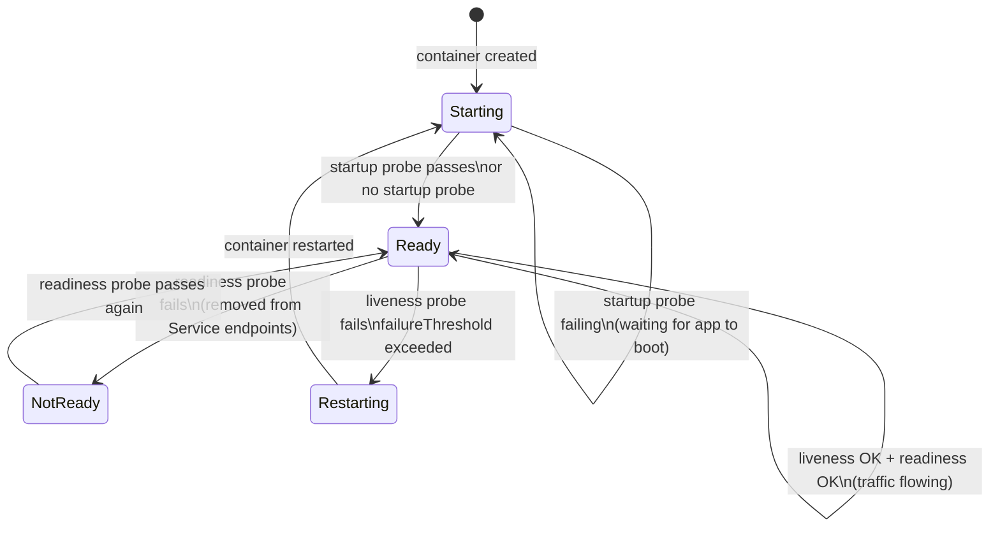

| Probe | Question | Failure action | Use when |
|-------|----------|---------------|----------|
| **Startup** | Has the app finished booting? | liveness/readiness paused | Slow-starting apps (JVM, ML models) |
| **Readiness** | Can the app serve traffic right now? | Remove from Service endpoints | Always — protect users from half-ready pods |
| **Liveness** | Is the app in an unrecoverable state? | Restart the container | App can deadlock / corrupt internal state |

- **Never use liveness to check external dependencies** (DB, downstream APIs). If the DB is down, killing your pod doesn't fix the DB — it just thrashes.
- **`initialDelaySeconds`** — deprecated pattern; prefer `startupProbe` instead.
- **`failureThreshold` × `periodSeconds`** = time to kill. Set it > your worst-case GC pause or cold-boot time.
- **`successThreshold`** (readiness only) — consecutive successes before marking ready. Useful for flapping services.

<span class="stage execution">⚡ Execution</span>

**Run it yourself.**

```bash
cat <<'EOF' | kubectl apply -f -
apiVersion: apps/v1
kind: Deployment
metadata:
  name: probe-demo
spec:
  replicas: 1
  selector:
    matchLabels:
      app: probe-demo
  template:
    metadata:
      labels:
        app: probe-demo
    spec:
      containers:
      - name: app
        image: nginx:1.25
        ports:
        - containerPort: 80
        startupProbe:
          httpGet:
            path: /
            port: 80
          failureThreshold: 30      # 30 × 10s = 5 min to boot
          periodSeconds: 10
        readinessProbe:
          httpGet:
            path: /
            port: 80
          initialDelaySeconds: 0
          periodSeconds: 5
          failureThreshold: 3       # 15s to remove from endpoints
          successThreshold: 1
        livenessProbe:
          httpGet:
            path: /
            port: 80
          periodSeconds: 15
          failureThreshold: 3       # 45s of failure before restart
          timeoutSeconds: 5
EOF

# Watch probe events
kubectl describe pod -l app=probe-demo | grep -A 20 "Conditions\|Events"

# Simulate readiness failure (kill nginx, pod stays running)
kubectl exec deploy/probe-demo -- nginx -s stop
kubectl get pod -l app=probe-demo -w  # watch READY drop to 0/1

# After liveness threshold: pod restarts
# (nginx is stopped, liveness HTTP fails, Kubernetes restarts container)

# Teardown
kubectl delete deployment probe-demo
```

<span class="stage simulation">🔮 Simulation — what you'll see</span>

<pre class="sim"><code><span class="prompt">$</span> kubectl get pod -l app=probe-demo -w
<span class="comment"># NAME                         READY   STATUS    RESTARTS</span>
<span class="comment"># probe-demo-5d7f8b9c4-xkqp2   1/1     Running   0        ← healthy</span>
<span class="comment"># probe-demo-5d7f8b9c4-xkqp2   0/1     Running   0        ← readiness failed, removed from endpoints</span>
<span class="comment"># probe-demo-5d7f8b9c4-xkqp2   0/1     Running   1        ← liveness failed, container restarted</span>
<span class="comment"># probe-demo-5d7f8b9c4-xkqp2   1/1     Running   1        ← restarted nginx, healthy again</span>

<span class="prompt">$</span> kubectl describe pod -l app=probe-demo | grep -A3 Events
<span class="comment"># Warning  Unhealthy  5s   kubelet  Readiness probe failed: Get "http://10.244.0.10:80/": connection refused</span>
<span class="comment"># Warning  Unhealthy  20s  kubelet  Liveness probe failed: Get "http://10.244.0.10:80/": connection refused</span>
<span class="comment"># Normal   Killing    20s  kubelet  Container app failed liveness probe, will be restarted</span>
</code></pre>

<span class="stage output">✅ Output — state change</span>

<div class="flow" markdown>

<div class="state before" markdown>
##### Before
<span class="diff-del">no probes</span>
deadlocked pod serves errors forever
</div>

<div class="arrow">→</div>

<div class="state during" markdown>
##### During
<span class="diff-mod">readiness probe fails</span>
pod removed from Service endpoints immediately
</div>

<div class="arrow">→</div>

<div class="state after" markdown>
##### After
<span class="diff-add">liveness restarts container</span>
self-healing, zero user impact
</div>

</div>

<span class="stage usecase">🌍 Real-world use case</span>

<div class="usecase-card" markdown>
**At Netflix**, streaming-worker pods ran a JVM with up to 8-second GC pauses under memory pressure. The liveness probe had `timeoutSeconds: 3` and `failureThreshold: 1` — meaning a single 3-second timeout during a GC pause restarted the pod. During a traffic surge, 40% of streaming workers hit GC pauses simultaneously. Mass liveness-triggered restarts caused 14% of active streams to rebuffer. The fix: `timeoutSeconds: 15`, `failureThreshold: 3` (45 seconds of sustained failure before restart), and a startup probe with `failureThreshold: 30` to cover the 4-minute JVM warm-up. Post-change, no GC-triggered restarts occurred in 18 months of monitoring.
</div>

</div>

---

## 10. Namespaces, ResourceQuota & LimitRange — blast radius control

<div class="concept" markdown>

<span class="stage reason">🧭 Reason</span>

**Why this exists.** Without namespaces, one team's runaway deployment can exhaust all cluster CPU and starve every other team's workload. Namespaces provide a scope for names, RBAC, and resource policies. ResourceQuota caps a namespace's total resource consumption. LimitRange sets defaults and limits per individual container. Without both, a single pod with no resource request can monopolise a 96-core node. At a fintech startup running 12 product teams on a shared cluster, a data science team's `tensorflow-training` job with no resource limits consumed 85% of cluster CPU for 6 hours, causing payment-processing pods to get throttled and 3% of transactions to time out. ResourceQuota on the `ml-training` namespace with `limits.cpu: 40` would have prevented it.

<span class="stage thinking">🧠 Thinking</span>

**Mental model.** Namespace is the container; ResourceQuota is the bucket that limits the namespace's total; LimitRange is the per-container policy.

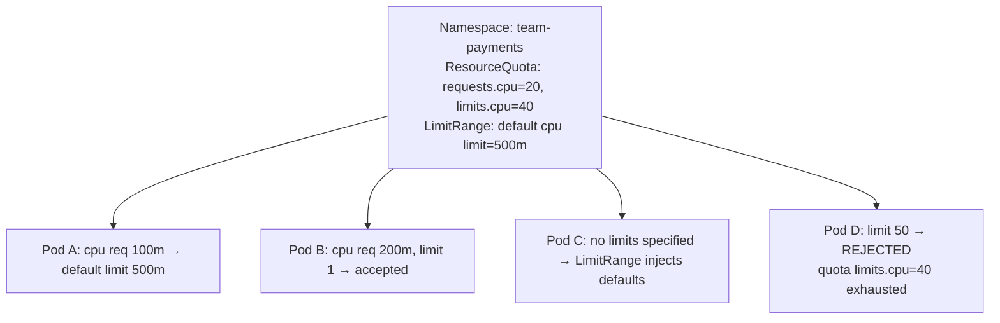

- **Namespace** — scopes: names (pods, services, CMs), RBAC policies, NetworkPolicies, ResourceQuotas, LimitRanges.
- **ResourceQuota** — cluster-wide cap on a namespace's aggregate resource usage. Applies to `requests.cpu`, `limits.cpu`, `requests.memory`, `limits.memory`, `count/pods`, `count/services`, `count/secrets`, etc.
- **LimitRange** — per-container/pod defaults and max/min. Pods without explicit resource requests get the `default` values injected. Prevents pods without resource specs from bypassing the quota.
- **`kube-system` namespace** — never put application workloads here. No ResourceQuota by default.
- **Resource units** — CPU in millicores: `500m` = 0.5 cores. Memory in Mi/Gi. Requests affect scheduling; limits affect cgroup throttling (CPU) or OOMKill (memory).

<span class="stage execution">⚡ Execution</span>

**Run it yourself.**

```bash
# Create a namespace with quota
kubectl create namespace team-payments

kubectl apply -f - <<'EOF'
apiVersion: v1
kind: ResourceQuota
metadata:
  name: payments-quota
  namespace: team-payments
spec:
  hard:
    requests.cpu: "4"
    limits.cpu: "8"
    requests.memory: 4Gi
    limits.memory: 8Gi
    count/pods: "20"
---
apiVersion: v1
kind: LimitRange
metadata:
  name: payments-limits
  namespace: team-payments
spec:
  limits:
  - type: Container
    default:
      cpu: 500m
      memory: 256Mi
    defaultRequest:
      cpu: 100m
      memory: 128Mi
    max:
      cpu: "4"
      memory: 4Gi
EOF

# Check quota usage
kubectl describe resourcequota payments-quota -n team-payments

# Deploy — gets default limits from LimitRange
kubectl run webserver --image=nginx -n team-payments
kubectl get pod webserver -n team-payments -o jsonpath='{.spec.containers[0].resources}'

# Try to breach quota (create many pods)
for i in $(seq 1 25); do
  kubectl run pod-$i --image=nginx -n team-payments --restart=Never 2>&1 | tail -1
done
# pods 21-25 will be rejected: "exceeded quota"

# Teardown
kubectl delete namespace team-payments
```

<span class="stage simulation">🔮 Simulation — what you'll see</span>

<pre class="sim"><code><span class="prompt">$</span> kubectl describe resourcequota payments-quota -n team-payments
<span class="comment"># Resource          Used    Hard</span>
<span class="comment"># --------          ----    ----</span>
<span class="comment"># count/pods        1       20</span>
<span class="comment"># limits.cpu        500m    8</span>
<span class="comment"># limits.memory     256Mi   8Gi</span>
<span class="comment"># requests.cpu      100m    4</span>
<span class="comment"># requests.memory   128Mi   4Gi</span>

<span class="prompt">$</span> kubectl run pod-21 --image=nginx -n team-payments --restart=Never
<span class="comment"># Error from server (Forbidden): pods "pod-21" is forbidden:</span>
<span class="comment"># exceeded quota: payments-quota, requested: count/pods=1,</span>
<span class="comment"># used: count/pods=20, limited: count/pods=20</span>
</code></pre>

<span class="stage output">✅ Output — state change</span>

<div class="flow" markdown>

<div class="state before" markdown>
##### Before
<span class="diff-del">no quota</span>
one team's job starves entire cluster
</div>

<div class="arrow">→</div>

<div class="state during" markdown>
##### During
<span class="diff-mod">ResourceQuota + LimitRange</span>
defaults injected, hard caps enforced
</div>

<div class="arrow">→</div>

<div class="state after" markdown>
##### After
<span class="diff-add">blast radius contained</span>
team-payments can't affect team-checkout
</div>

</div>

<span class="stage usecase">🌍 Real-world use case</span>

<div class="usecase-card" markdown>
**At a fintech startup**, 12 product teams shared a 200-node GKE cluster. The data science team launched a TensorFlow training job across 30 pods with no resource limits. The scheduler binned all 30 onto high-memory nodes and they consumed 85% of cluster CPU, triggering CPU throttling on the `payments` namespace. 3.2% of card-processing requests exceeded their 500 ms SLA and were dropped. Kubernetes had allowed it because there was no ResourceQuota on the `ml-training` namespace. Post-incident, every namespace received a ResourceQuota (`limits.cpu` capped to 20% of cluster capacity) and a LimitRange (`default cpu: 500m`). The training jobs now queue behind each other instead of crowding out production traffic.
</div>

</div>

---

## 11. RBAC — who can do what to which resources

<div class="concept" markdown>

<span class="stage reason">🧭 Reason</span>

**Why this exists.** Without RBAC, every pod in your cluster can call the Kubernetes API and do anything — read secrets from other namespaces, delete Deployments, create privileged pods. With RBAC, you grant only the exact permissions each identity needs. There are four objects: Role (namespace-scoped permissions), ClusterRole (cluster-wide permissions), RoleBinding (grant a Role to a subject in a namespace), ClusterRoleBinding (grant a ClusterRole to a subject globally). ServiceAccounts are the identities for pods. At a cloud company, a compromised CI/CD pod with a ClusterRole that included `secrets: *` across all namespaces became the entry point for an attacker who exfiltrated credentials for every service in the platform.

<span class="stage thinking">🧠 Thinking</span>

**Mental model.** Subjects (who) → Binding → Role (what) → Resource (where).

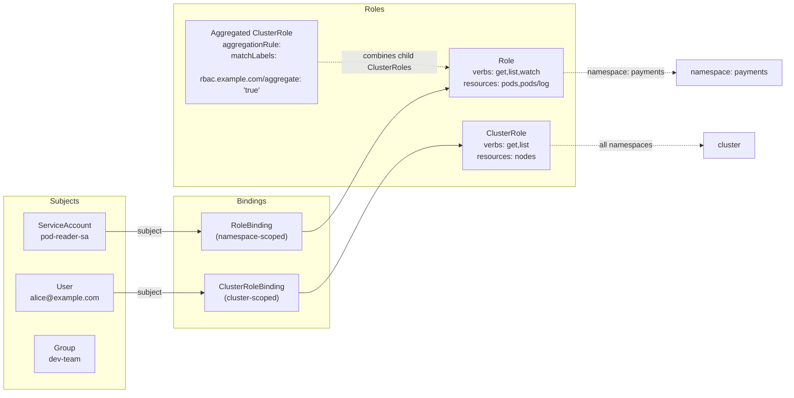

- **Role** — grants permissions within a namespace. Always prefer Role over ClusterRole when namespace scope is enough.
- **ClusterRole** — cluster-wide. Required for nodes, PVs, namespaces, and any non-namespaced resource. Can also be bound namespace-specifically via a RoleBinding.
- **RoleBinding** can bind a ClusterRole to a namespace — the ClusterRole is reused, but permissions apply only in that namespace.
- **ServiceAccount** — the identity for pods. Kubernetes auto-mounts a token at `/var/run/secrets/kubernetes.io/serviceaccount/token`. Opt out with `automountServiceAccountToken: false` when the pod doesn't need API access.
- **Aggregated ClusterRoles** — a parent ClusterRole auto-aggregates any ClusterRole with matching labels. Used by operators to extend built-in roles (`admin`, `edit`, `view`) without modifying them.
- **Principle of least privilege** — give only the verbs (`get`, `list`, `watch`, `create`, `update`, `patch`, `delete`) and resources you actually need.

<span class="stage execution">⚡ Execution</span>

**Run it yourself.**

```bash
# Create a ServiceAccount for a monitoring agent
kubectl create serviceaccount prometheus-sa -n default

# Role: read pods and pod metrics only
cat <<'EOF' | kubectl apply -f -
apiVersion: rbac.authorization.k8s.io/v1
kind: ClusterRole
metadata:
  name: prometheus-reader
rules:
- apiGroups: [""]
  resources: ["pods", "nodes", "services", "endpoints"]
  verbs: ["get", "list", "watch"]
- apiGroups: ["apps"]
  resources: ["deployments", "replicasets"]
  verbs: ["get", "list", "watch"]
---
apiVersion: rbac.authorization.k8s.io/v1
kind: ClusterRoleBinding
metadata:
  name: prometheus-reader-binding
subjects:
- kind: ServiceAccount
  name: prometheus-sa
  namespace: default
roleRef:
  kind: ClusterRole
  name: prometheus-reader
  apiGroup: rbac.authorization.k8s.io
EOF

# Test permissions
kubectl auth can-i list pods --as=system:serviceaccount:default:prometheus-sa
# yes

kubectl auth can-i delete pods --as=system:serviceaccount:default:prometheus-sa
# no

kubectl auth can-i get secrets --as=system:serviceaccount:default:prometheus-sa
# no

# Audit all permissions granted to a ServiceAccount
kubectl auth can-i --list --as=system:serviceaccount:default:prometheus-sa

# Teardown
kubectl delete clusterrolebinding prometheus-reader-binding
kubectl delete clusterrole prometheus-reader
kubectl delete serviceaccount prometheus-sa
```

<span class="stage simulation">🔮 Simulation — what you'll see</span>

<pre class="sim"><code><span class="prompt">$</span> kubectl auth can-i list pods --as=system:serviceaccount:default:prometheus-sa
<span class="comment"># yes</span>

<span class="prompt">$</span> kubectl auth can-i delete deployments --as=system:serviceaccount:default:prometheus-sa
<span class="comment"># no</span>

<span class="prompt">$</span> kubectl auth can-i get secrets --as=system:serviceaccount:default:prometheus-sa
<span class="comment"># no</span>

<span class="prompt">$</span> kubectl auth can-i --list --as=system:serviceaccount:default:prometheus-sa | head -8
<span class="comment"># Resources                  Non-Resource URLs  Verbs</span>
<span class="comment"># pods                       []                 [get list watch]</span>
<span class="comment"># nodes                      []                 [get list watch]</span>
<span class="comment"># services                   []                 [get list watch]</span>
<span class="comment"># deployments.apps           []                 [get list watch]</span>
</code></pre>

<span class="stage output">✅ Output — state change</span>

<div class="flow" markdown>

<div class="state before" markdown>
##### Before
<span class="diff-del">default ServiceAccount</span>
implicit API access, no restrictions
</div>

<div class="arrow">→</div>

<div class="state during" markdown>
##### During
<span class="diff-mod">ClusterRole + Binding</span>
exact verbs on exact resources
</div>

<div class="arrow">→</div>

<div class="state after" markdown>
##### After
<span class="diff-add">least-privilege SA</span>
can read pods/nodes, cannot touch secrets
</div>

</div>

<span class="stage usecase">🌍 Real-world use case</span>

<div class="usecase-card" markdown>
**At a major cloud provider**, a CI/CD pipeline pod was compromised through a dependency-chain vulnerability. The pod's ServiceAccount had been granted a ClusterRole with `resources: ["secrets"], verbs: ["get","list"]` cluster-wide — granted months earlier during a debugging session and never removed. The attacker ran `kubectl get secrets -A` and extracted 340 Kubernetes Secrets across 18 namespaces, including API keys for external payment providers. The fix: (1) all ClusterRoleBindings with secret access were audited and reduced to namespace-scoped RoleBindings, (2) CI pods received dedicated ServiceAccounts with `automountServiceAccountToken: false` and explicit RoleBindings only for the resources they needed, (3) a policy admission webhook now rejects ClusterRoleBindings granting `secrets: *` without a security team review.
</div>

</div>

---

## 12. kubectl pro-moves — the commands that end every outage

<div class="concept" markdown>

<span class="stage reason">🧭 Reason</span>

**Why this exists.** `kubectl get pods` and `kubectl describe` will only take you so far. Engineers who resolve incidents in 5 minutes vs 45 minutes know a handful of advanced kubectl patterns: extracting nested fields with jsonpath, attaching a debug container to a running pod, port-forwarding without an Ingress, and running api-resources dry-run to validate YAML before it hits the cluster. These patterns are not tricks — they are the difference between reading docs and being operational. At GitHub's SRE team, the p50 time to diagnose a pod-level issue dropped from 12 minutes to 3 minutes after they documented and drilled these patterns in team runbooks.

<span class="stage thinking">🧠 Thinking</span>

**Mental model.** kubectl is a REST client with a local kubeconfig. Every command is a structured API call. Understanding the path from flags to API call unlocks all the advanced patterns.

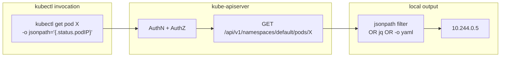

Key patterns to memorise:

| Pattern | Command |
|---------|---------|
| Field extraction | `kubectl get pod X -o jsonpath='{.status.podIP}'` |
| All container images in cluster | `kubectl get pods -A -o jsonpath='{range .items[*]}{.metadata.namespace}{" "}{.spec.containers[*].image}{"\n"}{end}'` |
| Dry-run client-side | `kubectl apply -f manifest.yaml --dry-run=client` |
| Dry-run server-side | `kubectl apply -f manifest.yaml --dry-run=server` |
| Inline documentation | `kubectl explain pod.spec.containers.resources` |
| Port-forward to pod | `kubectl port-forward pod/X 8080:80` |
| Port-forward to Service | `kubectl port-forward svc/myservice 8080:80` |
| Debug running container | `kubectl debug -it pod/X --image=busybox --target=app` |
| Debug node | `kubectl debug node/NODE -it --image=ubuntu` |
| Watch with custom columns | `kubectl get pods -o custom-columns='NAME:.metadata.name,IP:.status.podIP,NODE:.spec.nodeName' -w` |
| Force-delete stuck pod | `kubectl delete pod X --grace-period=0 --force` |
| Copy files | `kubectl cp pod/X:/var/log/app.log ./app.log` |

<span class="stage execution">⚡ Execution</span>

**Run it yourself.**

```bash
# Launch a target pod
kubectl run nginx --image=nginx:1.25

# --- explain: inline API docs ---
kubectl explain pod.spec.containers.livenessProbe
kubectl explain deployment.spec.strategy.rollingUpdate

# --- jsonpath: field extraction ---
# Get pod IP
kubectl get pod nginx -o jsonpath='{.status.podIP}'

# Get all pod IPs in default namespace
kubectl get pods -o jsonpath='{range .items[*]}{.metadata.name}{"\t"}{.status.podIP}{"\n"}{end}'

# Get all container images across all namespaces
kubectl get pods -A -o jsonpath='{range .items[*]}{.metadata.namespace}{"\t"}{range .spec.containers[*]}{.image}{"\n"}{end}{end}'

# --- dry-run: validate before apply ---
kubectl create deployment test --image=nginx --dry-run=server -o yaml
kubectl apply -f some-manifest.yaml --dry-run=server  # server-side: catches admission webhook rejections

# --- port-forward: no Ingress needed ---
kubectl port-forward pod/nginx 8080:80 &
curl http://localhost:8080
kill %1

# --- debug: ephemeral container ---
kubectl debug -it pod/nginx --image=busybox:1.36 --target=nginx -- sh
# inside: wget -qO- localhost  ← shares nginx's network namespace

# --- debug node: access node filesystem ---
kubectl get nodes  # pick a node name
kubectl debug node/kind-control-plane -it --image=ubuntu -- bash
# inside: chroot /host  ← full node access

# Teardown
kubectl delete pod nginx
```

<span class="stage simulation">🔮 Simulation — what you'll see</span>

<pre class="sim"><code><span class="prompt">$</span> kubectl explain pod.spec.containers.livenessProbe | head -10
<span class="comment"># KIND:     Pod</span>
<span class="comment"># VERSION:  v1</span>
<span class="comment"># FIELD:    livenessProbe &lt;Object&gt;</span>
<span class="comment"># DESCRIPTION:</span>
<span class="comment">#   Periodic probe of container liveness. Container will be restarted if the probe fails.</span>

<span class="prompt">$</span> kubectl get pod nginx -o jsonpath='{.status.podIP}'
<span class="comment"># 10.244.0.18</span>

<span class="prompt">$</span> kubectl apply -f bad-manifest.yaml --dry-run=server
<span class="comment"># Error from server: error when creating "bad-manifest.yaml":</span>
<span class="comment"># admission webhook "validate.kyverno.svc" denied the request:</span>
<span class="comment"># Pod must have resource limits set (policy: require-limits)</span>

<span class="prompt">$</span> kubectl debug -it pod/nginx --image=busybox:1.36 --target=nginx -- sh
<span class="comment"># Targeting container "nginx". If you don't see a command prompt, try pressing enter.</span>
<span class="comment"># / # wget -qO- localhost</span>
<span class="comment"># &lt;!DOCTYPE html&gt; ... ← nginx response via shared network namespace</span>
</code></pre>

<span class="stage output">✅ Output — state change</span>

<div class="flow" markdown>

<div class="state before" markdown>
##### Before
<span class="diff-del">kubectl describe only</span>
12-minute mean diagnosis time
</div>

<div class="arrow">→</div>

<div class="state during" markdown>
##### During
<span class="diff-mod">jsonpath + debug + port-forward</span>
exact field extraction, live container access
</div>

<div class="arrow">→</div>

<div class="state after" markdown>
##### After
<span class="diff-add">3-minute mean diagnosis</span>
right data, right command, first time
</div>

</div>

<span class="stage usecase">🌍 Real-world use case</span>

<div class="usecase-card" markdown>
**At GitHub's SRE team**, a flapping internal service was causing alert fatigue. The on-call couldn't reproduce it interactively because the pod had no shell and `kubectl exec` failed (distroless image). Using `kubectl debug -it pod/X --image=busybox --target=app`, the SRE attached an ephemeral busybox container that shared the app container's network namespace. A single `wget -qO- localhost:8080/debug/vars` revealed the goroutine count was growing unboundedly — a leaked goroutine in the connection pool. Total diagnosis time: 4 minutes. Without the ephemeral container pattern, the SRE would have had to rebuild the image with a shell, re-deploy, and reproduce the issue — estimated 45 minutes.
</div>

</div>

---

## What's next

You've covered the 12 primitives every Kubernetes cluster runs on. Every Helm chart, every operator, every GitOps pipeline is just these primitives combined.

| Next topic | Where |
|-----------|-------|
| Rolling strategies, canary, blue-green | `../02-strategies/` |
| StatefulSets, DaemonSets, Jobs, CronJobs | `./07-workloads/` |
| Horizontal Pod Autoscaler, KEDA | `./12-autoscaling/` |
| Operators, CRDs, admission controllers | `../03-advanced/` |
| Helm charts | `../../04-helm/` |
