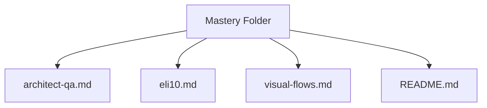
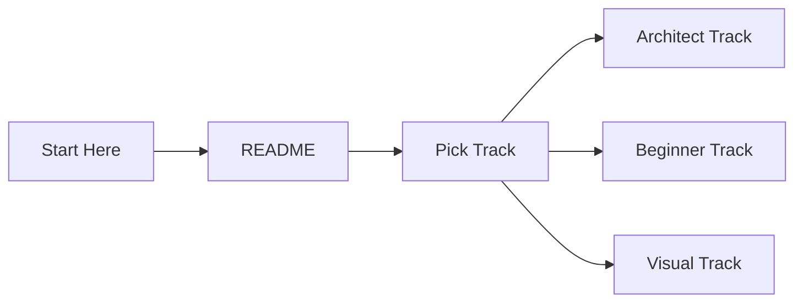
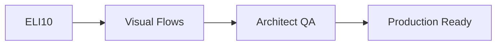

# Kubernetes Core Mastery

Index for the `01-core` mastery folder. Four files to take you from PhD-level architect questions to a 10-year-old's intuition, with visual flows in between.

## Org Chart

<!-- mermaid:rendered -->
<p align="center"></p>

<details><summary>Mermaid source</summary>



</details>

## File Map

| File | Audience | Purpose |
|------|----------|---------|
| `architect-qa.md` | Senior architects, SREs | 60+ Q&A on cluster design, scale, HA, scheduler |
| `eli10.md` | Beginners, interviewers explaining basics | PhD concepts as analogies for 10-year-olds |
| `visual-flows.md` | Visual learners, whiteboard reviewers | 12 mermaid flowcharts of core paths |
| `README.md` | You, right now | Index and navigation |

## How to use

<!-- mermaid:rendered -->
<p align="center"></p>

<details><summary>Mermaid source</summary>



</details>

### Architect track
Read `architect-qa.md`. Each question is grouped by topic: multi-tenancy, etcd, control-plane HA, scheduler tuning, pod density, networking, storage, namespaces, GitOps. Use as interview prep or design-review checklist.

### Beginner track
Read `eli10.md`. Each Kubernetes object is explained as a school analogy first, then real definition, then a tiny diagram, then the actual `kubectl` commands to see it live.

### Visual track
Read `visual-flows.md`. Twelve flowcharts cover the most common runtime paths: scheduling, apply, service routing, configmap injection, PVC binding, rollout, RBAC, HPA.

## Topic Coverage Matrix

| Topic | architect-qa | eli10 | visual-flows |
|-------|--------------|-------|--------------|
| Pod | yes | yes | yes |
| Deployment | yes | yes | yes |
| Service | yes | yes | yes |
| ConfigMap | partial | yes | yes |
| Secret | yes | yes | partial |
| PVC | yes | yes | yes |
| Ingress | yes | yes | partial |
| Scheduler | yes | no | yes |
| etcd | yes | no | no |
| RBAC | yes | no | yes |
| HPA | yes | no | yes |
| GitOps | yes | no | no |

## Mastery Path

<!-- mermaid:rendered -->
<p align="center"></p>

<details><summary>Mermaid source</summary>



</details>

## Conventions

- All mermaid diagrams use simple `flowchart LR` or `flowchart TB`.
- Max 6 nodes per diagram for readability.
- No newlines inside node labels.
- Bracketed labels when special characters are needed.

## Quick Commands

```bash
# Inspect a pod end to end
kubectl get pod NAME -o yaml
kubectl describe pod NAME
kubectl logs NAME -f

# See what scheduled where
kubectl get pods -o wide

# Watch a rollout
kubectl rollout status deploy/NAME

# Check RBAC
kubectl auth can-i get pods --as=user@example.com
```

## Source Reference

This folder is part of `03-kubernetes/01-core` in the Devops-learning repo. Pair with the rest of the `01-core` content for hands-on exercises.

## Update Log

- v1: Initial mastery folder. Four files. Sequential writes.

## Next Steps

After completing this folder, move to `02-networking`, `03-storage`, and `04-security` mastery folders for deeper dives.

## Cheat Sheet (Hot Context)

- Pod = smallest unit, one or more containers sharing net+storage
- Deployment = ReplicaSet manager with rollout history
- Service = stable virtual IP and DNS in front of pods
- ConfigMap = non-secret key/value, mountable
- Secret = base64 key/value, mountable, RBAC-restricted
- PVC = request for storage, bound to a PV
- Ingress = HTTP/S router into the cluster
- HPA = autoscaler based on metrics
- RBAC = who can do what to which resource

## Cross-References

- For etcd backup runbooks see `architect-qa.md` Q15-Q18
- For scheduler scoring details see `architect-qa.md` Q22-Q28
- For pod lifecycle see `eli10.md` Pod section + `visual-flows.md` Flow 1
- For Service routing internals see `visual-flows.md` Flow 3

## Reading Order

1. README (you are here)
2. eli10.md — get the intuition
3. visual-flows.md — see the runtime
4. architect-qa.md — own the design

## End of Index
