# Kubernetes for 10-year-olds (PhD edition)

Each section: analogy, real explanation, mermaid diagram, kubectl steps to see it.

## 1. Pod — Team of friends in one tent

### Analogy
A Pod is like a small group of best friends camping in one tent. They share the same tent (network), the same cooler (storage), and if the tent moves, they all move together. They cannot be separated.

### Real explanation
A Pod is the smallest deployable unit in Kubernetes. It groups one or more containers that share a Linux network namespace (same IP, same port space) and optionally shared volumes. Containers in a Pod are always co-scheduled to the same node and live and die together.

### Diagram
<!-- mermaid:rendered -->
<p align="center"></p>

<details><summary>Mermaid source</summary>

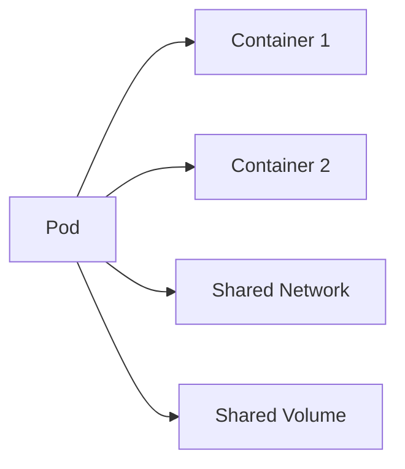

</details>

### Try it live
```bash
kubectl run mypod --image=nginx
kubectl get pods
kubectl describe pod mypod
kubectl exec -it mypod -- sh
kubectl delete pod mypod
```

## 2. Deployment — A baker that makes 5 cookies and replaces eaten ones

### Analogy
The Deployment is a baker. You tell the baker: I always want 5 chocolate-chip cookies on the plate. If a kid eats one, the baker bakes another. If you say change to oatmeal, the baker swaps them out one at a time so the plate is never empty.

### Real explanation
A Deployment manages a ReplicaSet, which manages Pods. It guarantees the desired replica count, performs rolling updates with configurable surge and unavailable, and keeps revision history for rollback. It is the standard primitive for stateless workloads.

### Diagram
<!-- mermaid:rendered -->
<p align="center"></p>

<details><summary>Mermaid source</summary>

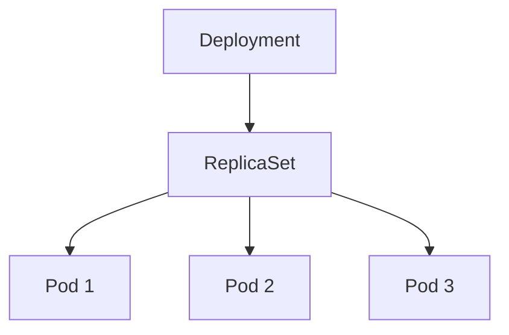

</details>

### Try it live
```bash
kubectl create deployment web --image=nginx --replicas=5
kubectl get deploy,rs,pods
kubectl set image deploy/web nginx=nginx:1.25
kubectl rollout status deploy/web
kubectl rollout undo deploy/web
```

## 3. Service — The school office that knows where every student is

### Analogy
The Service is the school office. Students (Pods) move classrooms all the time, but if you call the office and ask for "Sarah from grade 4", the office routes your call. You never need to know which classroom Sarah is in today.

### Real explanation
A Service is a stable virtual IP and DNS name that load-balances to a dynamic set of Pods selected by labels. It abstracts pod IP churn. Types: ClusterIP (in-cluster), NodePort (port on every node), LoadBalancer (cloud LB), ExternalName (DNS CNAME).

### Diagram
<!-- mermaid:rendered -->
<p align="center"></p>

<details><summary>Mermaid source</summary>

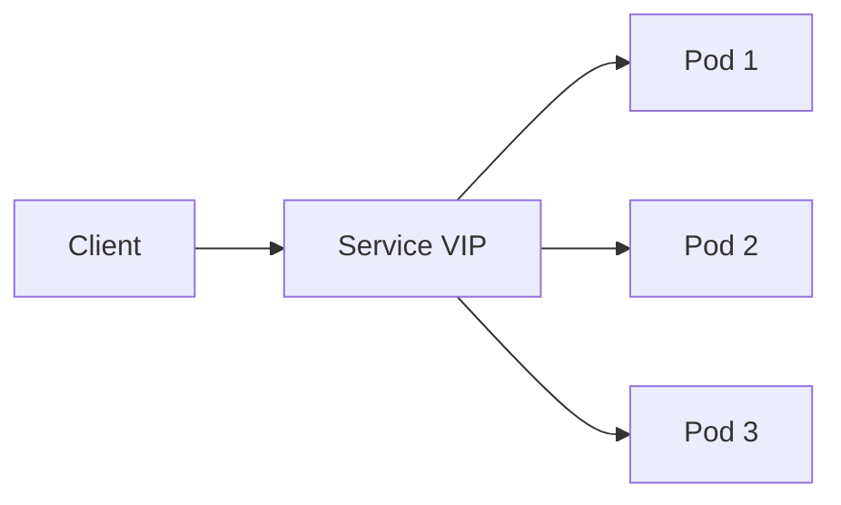

</details>

### Try it live
```bash
kubectl expose deploy/web --port=80 --target-port=80
kubectl get svc web
kubectl run tester --rm -it --image=busybox -- wget -qO- web
kubectl get endpoints web
```

## 4. ConfigMap — The recipe sheet

### Analogy
The ConfigMap is the recipe sheet pinned on the fridge. Anyone in the kitchen can read it. Change the sheet, and next time you cook the dish you use the new recipe. The recipe is not secret.

### Real explanation
A ConfigMap stores non-confidential key-value pairs. Pods consume it as environment variables, command-line args, or mounted files. Updates to mounted ConfigMaps propagate to running Pods after a sync delay (env vars do not update without pod restart).

### Diagram
<!-- mermaid:rendered -->
<p align="center"></p>

<details><summary>Mermaid source</summary>

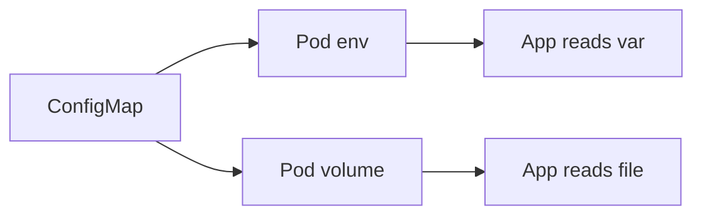

</details>

### Try it live
```bash
kubectl create configmap appcfg --from-literal=COLOR=blue
kubectl get cm appcfg -o yaml
kubectl run demo --image=busybox --env="COLOR=$(kubectl get cm appcfg -o jsonpath='{.data.COLOR}')" -- env
kubectl describe cm appcfg
```

## 5. Secret — Locked recipe sheet

### Analogy
The Secret is a locked recipe sheet inside the safe. Only people with the safe key can open it. The recipe is the same kind of thing as the ConfigMap, but the contents are sensitive (passwords, API keys).

### Real explanation
A Secret holds sensitive data (passwords, tokens, certificates). Stored base64-encoded in etcd (encrypt at rest with KMS in production). RBAC controls access. Mountable as env vars or files like ConfigMaps. Types include `Opaque`, `kubernetes.io/dockerconfigjson`, `kubernetes.io/tls`.

### Diagram
<!-- mermaid:rendered -->
<p align="center"></p>

<details><summary>Mermaid source</summary>

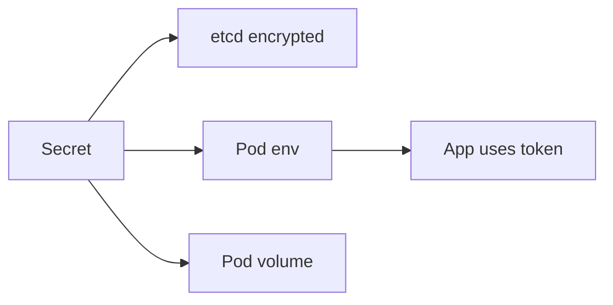

</details>

### Try it live
```bash
kubectl create secret generic dbpw --from-literal=PASSWORD=s3cret
kubectl get secret dbpw -o yaml
kubectl get secret dbpw -o jsonpath='{.data.PASSWORD}' | base64 -d
kubectl describe secret dbpw
```

## 6. PVC — The kid's locker

### Analogy
The PVC is your locker at school. You ask the office for a locker of a certain size. They assign one. Your stuff stays there even if you go home for the night. Next morning your stuff is still inside.

### Real explanation
A PersistentVolumeClaim is a Pod-friendly request for storage with a size and access mode. It binds to a PersistentVolume (provisioned dynamically by a StorageClass or pre-created). Data survives Pod restarts and reschedules.

### Diagram
<!-- mermaid:rendered -->
<p align="center"></p>

<details><summary>Mermaid source</summary>

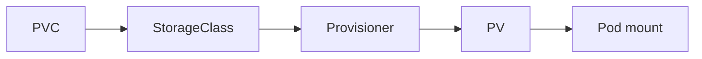

</details>

### Try it live
```bash
kubectl get sc
cat <<EOF | kubectl apply -f -
apiVersion: v1
kind: PersistentVolumeClaim
metadata:
  name: mydata
spec:
  accessModes: [ReadWriteOnce]
  resources:
    requests:
      storage: 1Gi
EOF
kubectl get pvc,pv
kubectl describe pvc mydata
```

## 7. Ingress — School front gate

### Analogy
The Ingress is the front gate of the school. Visitors from outside check in there. The guard looks at who they want to see and points them to the right office (Service), which then points to the right student (Pod).

### Real explanation
An Ingress is an HTTP/HTTPS L7 router. It defines hostnames, paths, and TLS, and forwards requests to backend Services. Requires an Ingress Controller (nginx, traefik, ALB) running in the cluster. Gateway API is the modern successor.

### Diagram
<!-- mermaid:rendered -->
<p align="center"></p>

<details><summary>Mermaid source</summary>

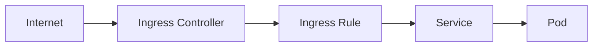

</details>

### Try it live
```bash
kubectl get ingressclass
cat <<EOF | kubectl apply -f -
apiVersion: networking.k8s.io/v1
kind: Ingress
metadata:
  name: web
spec:
  rules:
  - host: web.example.com
    http:
      paths:
      - path: /
        pathType: Prefix
        backend:
          service:
            name: web
            port:
              number: 80
EOF
kubectl get ingress web
kubectl describe ingress web
```

## 8. Bonus — Namespace as a classroom

### Analogy
A Namespace is a classroom. Each classroom has its own desks (resources), its own teacher's rules (RBAC), and its own supply cabinet (quotas). Sarah in Room A is different from Sarah in Room B.

### Real explanation
Namespaces are virtual clusters within a cluster. They scope names, RBAC, ResourceQuotas, NetworkPolicies, and most resources. Cluster-scoped resources (Nodes, PVs, ClusterRoles) are not namespaced.

### Diagram
<!-- mermaid:rendered -->
<p align="center"></p>

<details><summary>Mermaid source</summary>

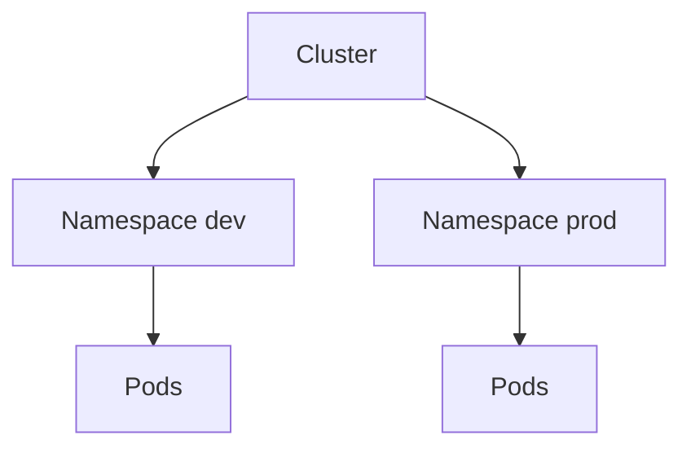

</details>

### Try it live
```bash
kubectl create namespace dev
kubectl run hello --image=nginx -n dev
kubectl get pods -n dev
kubectl get pods --all-namespaces
kubectl delete namespace dev
```

## 9. Bonus — Node as a school building

### Analogy
A Node is a school building. It has classrooms (Pods), a janitor (kubelet) who keeps things tidy, and a security guard (kube-proxy) at the door routing visitors. The principal (control plane) decides which kid goes in which building.

### Real explanation
A Node is a worker machine (VM or physical) running kubelet, container runtime, and kube-proxy. The scheduler places Pods on Nodes based on resource requests, taints, affinity, and topology constraints.

### Diagram
<!-- mermaid:rendered -->
<p align="center"></p>

<details><summary>Mermaid source</summary>

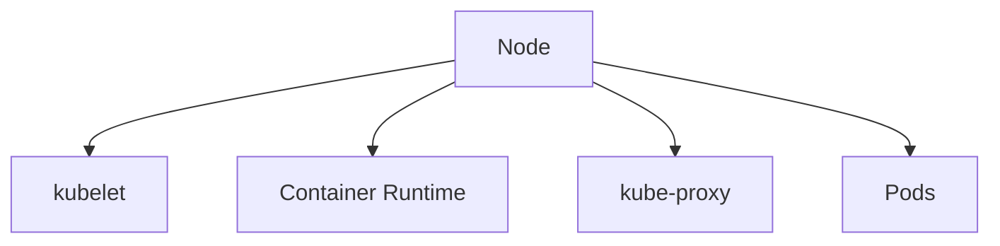

</details>

### Try it live
```bash
kubectl get nodes -o wide
kubectl describe node NODE_NAME
kubectl top node
kubectl get pods -o wide --all-namespaces | grep NODE_NAME
```

## Recap Table

| Object | Analogy | Real role |
|--------|---------|-----------|
| Pod | Tent of friends | Smallest deployable unit |
| Deployment | Baker replacing cookies | Manages stateless replicas |
| Service | School office | Stable VIP for pods |
| ConfigMap | Recipe sheet | Non-secret config |
| Secret | Locked recipe | Sensitive config |
| PVC | School locker | Persistent storage request |
| Ingress | Front gate | HTTP router |
| Namespace | Classroom | Virtual cluster scope |
| Node | School building | Worker machine |

## End
