# Visual Flows — Kubernetes Core

12 simple mermaid flowcharts of the most important runtime paths. Max 6 nodes each.

## Flow 1 — Pod Scheduling

The scheduler picks a node for a pending Pod.

<!-- mermaid:rendered -->

Mermaid source

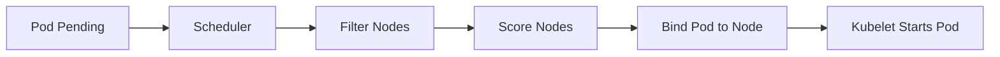

Notes: Filter eliminates nodes that cannot fit (resources, taints, affinity). Score ranks remaining nodes (least loaded, image locality). Binding writes the chosen node into the Pod spec.

## Flow 2 — kubectl apply Path

What happens when you apply a YAML.

<!-- mermaid:rendered -->

Mermaid source

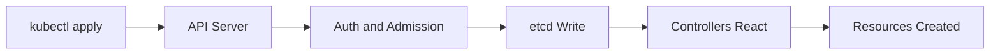

Notes: Authentication checks who you are. Authorization (RBAC) checks what you can do. Admission webhooks mutate or validate. etcd is the source of truth.

## Flow 3 — Service Routing to Backend

How traffic reaches a Pod via a Service.

<!-- mermaid:rendered -->

Mermaid source

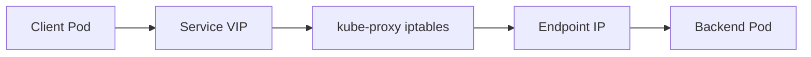

Notes: kube-proxy programs iptables (or IPVS) to DNAT the VIP to a real pod IP. Endpoints (or EndpointSlices) keep the live list updated.

## Flow 4 — ConfigMap into Env

How a ConfigMap value lands in the container's environment.

<!-- mermaid:rendered -->

Mermaid source

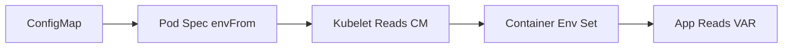

Notes: Env vars are evaluated at container start. Changes to the ConfigMap do not propagate to running containers via env (only via mounted volumes).

## Flow 5 — PVC Binding

How a PVC becomes a usable mounted volume.

<!-- mermaid:rendered -->

Mermaid source

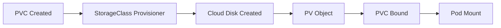

Notes: Dynamic provisioning is triggered by the StorageClass. The CSI driver creates the underlying disk. Binding is exclusive (one PVC to one PV).

## Flow 6 — Deployment Rollout

How a Deployment performs a rolling update.

<!-- mermaid:rendered -->

Mermaid source

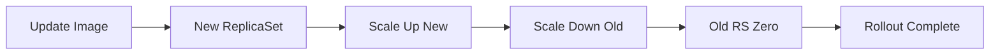

Notes: Surge and maxUnavailable control concurrency. ReadinessProbe must pass before old replicas are removed. Old ReplicaSets are kept for rollback.

## Flow 7 — RBAC Check

How an API request is authorized.

<!-- mermaid:rendered -->

Mermaid source

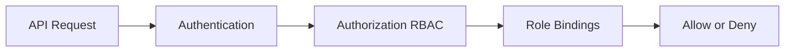

Notes: Multiple authorizers can be chained (RBAC, Node, Webhook). First allow wins. Default is deny.

## Flow 8 — HPA Scale-Up

How the Horizontal Pod Autoscaler reacts to load.

<!-- mermaid:rendered -->

Mermaid source

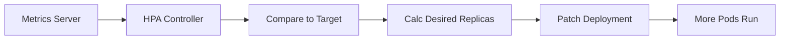

Notes: Default sync period is 15s. Scale-up is fast, scale-down has a stabilization window (5 min default) to avoid flapping.

## Flow 9 — Pod Termination

What happens when you delete a Pod.

<!-- mermaid:rendered -->

Mermaid source

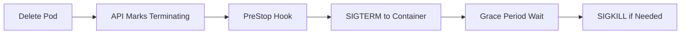

Notes: Default grace period is 30s. Endpoints removal happens in parallel; in-flight traffic may still hit the pod briefly.

## Flow 10 — Image Pull

How a container image arrives on a node.

<!-- mermaid:rendered -->

Mermaid source

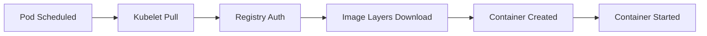

Notes: Image pull policy `IfNotPresent` is default for tagged images, `Always` for `:latest`. Use imagePullSecrets for private registries.

## Flow 11 — Liveness Probe Failure

What happens when liveness fails repeatedly.

<!-- mermaid:rendered -->

Mermaid source

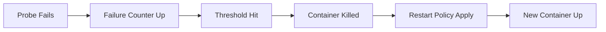

Notes: Restart policy `Always` is default for Deployments. Backoff is exponential capped at 5 min. Excessive restarts mark Pod CrashLoopBackOff.

## Flow 12 — Ingress Request Path

How an external HTTPS request reaches a Pod.

<!-- mermaid:rendered -->

Mermaid source

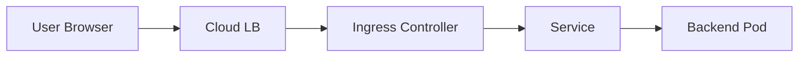

Notes: TLS terminates at the Ingress Controller (or LB). Host and path rules pick the backend Service. Service then routes to a Pod.

## Cross-Reference

| Flow | Related architect-qa | Related eli10 |
|------|---------------------|---------------|
| 1 Scheduling | Q24-Q31 | Pod, Node |
| 2 Apply | Q19-Q23 | All |
| 3 Service | Q39-Q42 | Service |
| 4 ConfigMap env | n/a | ConfigMap |
| 5 PVC | Q43-Q48 | PVC |
| 6 Rollout | Q21 | Deployment |
| 7 RBAC | Q2 | n/a |
| 8 HPA | Q62 | n/a |
| 9 Termination | Q65 | Pod |
| 10 Image pull | Q5 | Pod |
| 11 Liveness | n/a | Pod |
| 12 Ingress | Q42 | Ingress |

## Reading Tips

- Read flows top-to-bottom in the order above; they roughly follow the lifecycle of a workload (create, route, observe, scale, terminate).
- Pair each flow with the matching ELI10 section and architect Q&A for full coverage.
- Whiteboard each flow from memory as practice.

## Common Pitfalls Highlighted by Flows

- Flow 2: Skipping admission means no policy enforcement. Always run validating webhooks (Kyverno, OPA).
- Flow 3: kube-proxy iptables rules grow O(services). At 5k services, switch to IPVS or eBPF.
- Flow 4: Env vars are static. Use volumes for live config reload.
- Flow 5: WaitForFirstConsumer prevents cross-AZ binding mistakes.
- Flow 6: Without readiness probes, rollout declares success too early.
- Flow 7: Default deny — never grant cluster-admin to humans long-term.
- Flow 8: HPA without resource requests means division by zero — set requests.
- Flow 9: Apps must trap SIGTERM; otherwise SIGKILL after 30s loses in-flight requests.
- Flow 10: Pull credentials per namespace via imagePullSecrets.
- Flow 11: Liveness too aggressive causes restart storms. Use startupProbe for slow-starting apps.
- Flow 12: TLS at LB vs Ingress — pick one for cert management sanity.

## End
