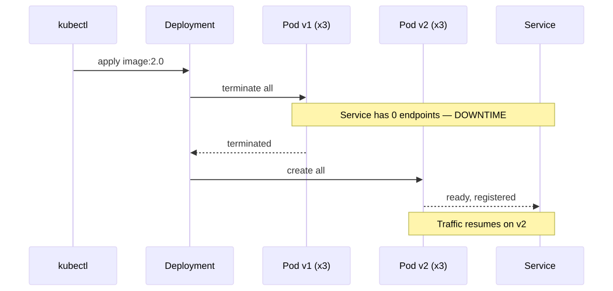
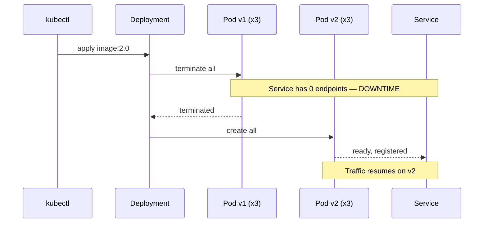

# 01 — Recreate Strategy

> Kill all old pods, then start new pods. Causes downtime. Use only when versions cannot co-exist.

## Concept

The `Recreate` strategy is the simplest possible release pattern:

1. Scale all old pods to zero.
2. Wait for them to terminate.
3. Create new pods with the new image.

There is a window (seconds to minutes depending on startup time) where **no pods are serving traffic**. The Service has no endpoints; clients get connection refused / 503.

## When to use

- Local / dev clusters where downtime is irrelevant.
- Batch jobs / cron workloads.
- Schema migrations or stateful workloads where v1 and v2 **must not** co-exist (e.g. exclusive file locks, shared DB locks, conflicting protocol versions).
- Single-replica apps that can't run two pods anyway.

## Drawbacks

- **Downtime is guaranteed.** Don't use for user-facing services in prod.
- No graceful traffic shift; full blast radius.
- No automatic rollback — if v2 is broken you have downtime *and* a broken app.

## Pod transition

<!-- mermaid:rendered -->
<p align="center"></p>

<details><summary>Mermaid source</summary>



</details>
## Files

- [`deployment.yaml`](./deployment.yaml) — annotated Deployment with `strategy.type: Recreate`
- [`demo.sh`](./demo.sh) — end-to-end demo with continuous curl

## Run

```bash
bash demo.sh
```

## Verify

```bash
kubectl rollout status deployment/hello-recreate
kubectl get pods -L version --watch
```

## Cleanup

```bash
kubectl delete -f deployment.yaml --ignore-not-found
kubectl delete svc hello-recreate --ignore-not-found
```

> **Gotcha:** `Recreate` ignores `maxSurge` / `maxUnavailable`. If your `terminationGracePeriodSeconds` is high, downtime is high. Tune readiness/liveness probes to fail fast.
