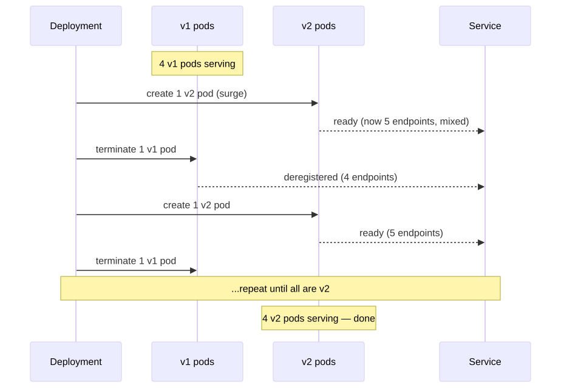
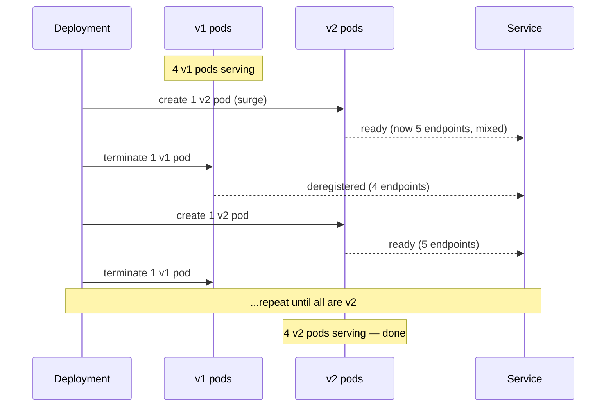

# 02 — Rolling Update Strategy

> The Kubernetes default. Replaces pods incrementally with no downtime. Tunable via `maxSurge` and `maxUnavailable`.

## Concept

Kubernetes brings up a few new pods, waits for them to be Ready, then terminates a few old pods — repeating until all replicas are on the new version.

Two knobs control the pace:

| Field | Meaning | Default |
|-------|---------|---------|
| `maxSurge` | Extra pods above desired count during update | 25% |
| `maxUnavailable` | Pods that may be unavailable during update | 25% |

`maxSurge=1, maxUnavailable=0` is the safest config: always at full capacity, one extra pod at a time.

## When to use

- **Default** for any stateless service that can run two versions side by side.
- HTTP APIs, gRPC services, web frontends.

## Drawbacks

- During the rollout, **both versions serve traffic simultaneously** — your code must tolerate that (forward/backward compat for DB, APIs, message formats).
- Rollback means another rolling update — not instant.
- No traffic-percentage control; first new pod gets `replicas / total` share of requests immediately.

## Pod transition (replicas=4, maxSurge=1, maxUnavailable=0)

<!-- mermaid:rendered -->
<p align="center"></p>

<details><summary>Mermaid source</summary>



</details>
## Quick reference

=== ":material-lightbulb-outline: Concept"
    Rolling update replaces pods incrementally so the Service always has Ready endpoints. `maxSurge` controls extra pods above desired; `maxUnavailable` controls how many can go missing. Safest pairing: `maxSurge=1, maxUnavailable=0`.

=== ":material-file-code-outline: Manifest"
    ```yaml
    apiVersion: apps/v1
    kind: Deployment
    metadata:
      name: hello-rolling
    spec:
      replicas: 4
      strategy:
        type: RollingUpdate
        rollingUpdate:
          maxSurge: 1
          maxUnavailable: 0
      selector:
        matchLabels: { app: hello-rolling }
      template:
        metadata:
          labels: { app: hello-rolling, version: v1 }
        spec:
          containers:
            - name: hello
              image: gcr.io/google-samples/hello-app:1.0
              ports: [{ containerPort: 8080 }]
              readinessProbe:
                httpGet: { path: /, port: 8080 }
                initialDelaySeconds: 2
                periodSeconds: 2
    ```

=== ":material-console: kubectl"
    ```bash
    kubectl apply -f deployment.yaml
    kubectl set image deployment/hello-rolling hello=gcr.io/google-samples/hello-app:2.0
    kubectl rollout status deployment/hello-rolling
    kubectl get pods -L version --watch
    ```

=== ":material-text-box-outline: Expected output"
    ```text
    Waiting for deployment "hello-rolling" rollout to finish: 1 out of 4 new replicas have been updated...
    Waiting for deployment "hello-rolling" rollout to finish: 2 of 4 updated replicas are available...
    Waiting for deployment "hello-rolling" rollout to finish: 3 of 4 updated replicas are available...
    deployment "hello-rolling" successfully rolled out
    ```

## Files

- [`deployment.yaml`](./deployment.yaml) — `RollingUpdate` with `maxSurge=1, maxUnavailable=0`
- [`demo.sh`](./demo.sh)

## Run

```bash
bash demo.sh
```

## Verify

```bash
kubectl rollout status deployment/hello-rolling
kubectl rollout history deployment/hello-rolling
kubectl get pods -L version --watch
```

## Cleanup

```bash
kubectl delete -f deployment.yaml --ignore-not-found
```

> **Gotcha:** Without proper `readinessProbe`, K8s thinks pods are ready the second they start. Bad readiness = users get 503s during rollout. Always define a real probe.

> **Gotcha:** `maxUnavailable=0` requires headroom on your nodes. If the cluster is full, the surge pod can't be scheduled and the rollout stalls.
