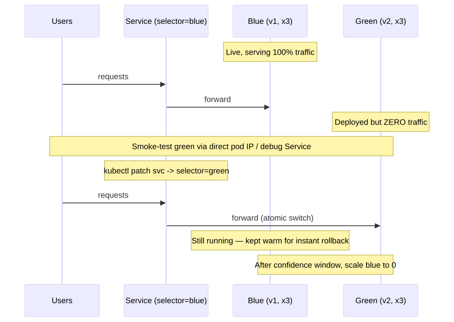
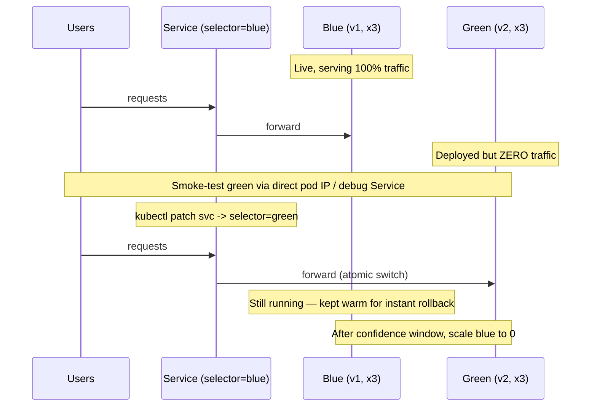

# 03 — Blue / Green Deployment

> Run two full environments side by side. Switch traffic atomically by changing the Service selector. Instant rollback.

## Concept

- **Blue** = current production (v1).
- **Green** = the new version (v2), running at full capacity but receiving zero traffic.
- A single Service selects whichever color is "live" via a label (e.g. `color: blue`).
- Cutover = `kubectl patch svc ... -p '{"spec":{"selector":{"color":"green"}}}'` — atomic.
- Rollback = patch the selector back. Instant.

## When to use

- Apps that must support **instant rollback**.
- Releases where you want to fully smoke-test the new version in-cluster before any user sees it.
- Critical paths (payments, auth) where ambiguity during a rolling update is unacceptable.

## Drawbacks

- **2x compute and memory** during the cutover window.
- DB / shared-state migrations are still hard — you still need backward-compat schemas.
- All users flip at once — no gradual exposure (use Canary if you want that).

## Pod transition

<!-- mermaid:rendered -->
<p align="center"></p>

<details><summary>Mermaid source</summary>



</details>
## Quick reference

=== ":material-lightbulb-outline: Concept"
    Two full deployments (blue and green) run in parallel. The Service selector decides which color users hit. Cutover is one `kubectl patch` away, and rollback is the same patch in reverse — instant, no rebuild required.

=== ":material-file-code-outline: Manifest"
    ```yaml
    apiVersion: v1
    kind: Service
    metadata:
      name: hello-bg
    spec:
      selector:
        app: hello-bg
        color: blue          # flip to green for cutover
      ports:
        - port: 80
          targetPort: 8080
    ```

=== ":material-console: kubectl"
    ```bash
    kubectl apply -f deployment-blue.yaml -f deployment-green.yaml -f service.yaml
    # cutover blue -> green
    kubectl patch svc hello-bg -p '{"spec":{"selector":{"app":"hello-bg","color":"green"}}}'
    # rollback
    kubectl patch svc hello-bg -p '{"spec":{"selector":{"app":"hello-bg","color":"blue"}}}'
    ```

=== ":material-text-box-outline: Expected output"
    ```text
    service/hello-bg patched
    $ kubectl get svc hello-bg -o jsonpath='{.spec.selector.color}'
    green
    $ kubectl get endpoints hello-bg
    NAME       ENDPOINTS                                   AGE
    hello-bg   10.244.1.5:8080,10.244.1.6:8080,10.244.2.4:8080   3m
    ```

## Files

- [`deployment-blue.yaml`](./deployment-blue.yaml) — v1 with `color: blue`
- [`deployment-green.yaml`](./deployment-green.yaml) — v2 with `color: green`
- [`service.yaml`](./service.yaml) — selector starts on `color: blue`
- [`demo.sh`](./demo.sh) — full switchover walkthrough

## Run

```bash
bash demo.sh
```

## Verify

```bash
# Which color is live?
kubectl get svc hello-bg -o jsonpath='{.spec.selector.color}'; echo

# All pods regardless of color
kubectl get pods -L color,version
```

## Cleanup

```bash
kubectl delete -f deployment-blue.yaml -f deployment-green.yaml -f service.yaml --ignore-not-found
```

> **Gotcha:** Sticky sessions / long-lived connections (websockets, gRPC streams) survive the selector switch. Plan for graceful drain on blue before scaling it down.

> **Gotcha:** If your app writes to shared storage / DB, blue and green write concurrently during the test window. Ensure schema is forward-compatible.
