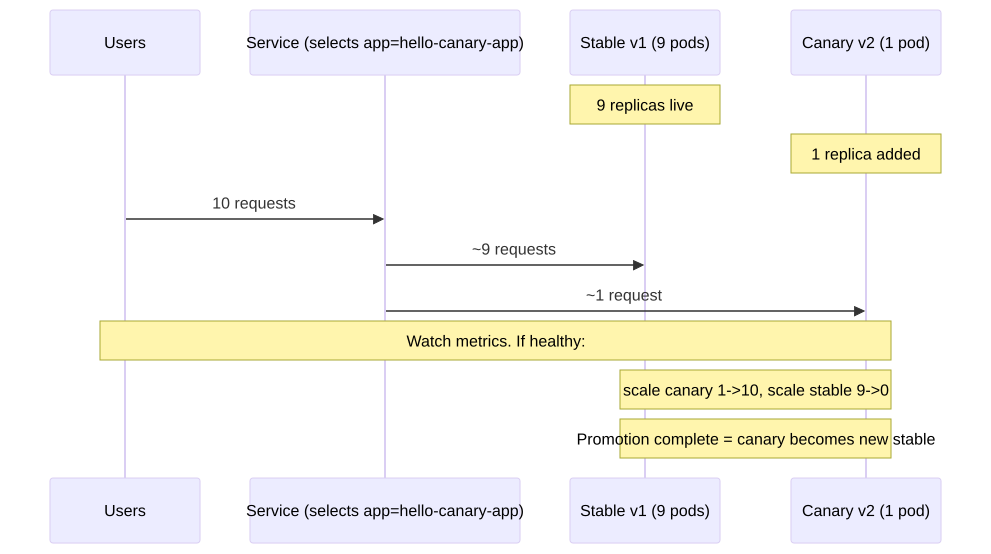
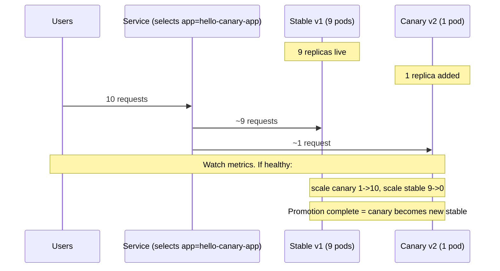

# 04 — Manual Canary

> Two Deployments, one Service. Replica ratio = traffic ratio. Rough but works without any extra tooling.

## Concept

- `hello-stable` = v1 with **9 replicas**.
- `hello-canary` = v2 with **1 replica**.
- A single Service selects both via a shared label (`app: hello-canary-app`).
- Endpoints are pooled, so traffic ~= replica share = **90/10 split**.
- Promote = scale canary up + scale stable down. Abort = scale canary to 0.

## When to use

- You want gradual rollout but don't have Argo Rollouts / Flagger / a service mesh.
- You have observability (Prometheus, Datadog, logs) so you can manually decide whether to promote.

## Drawbacks

- **Replica-based traffic split is coarse.** 1/10 = ~10% but real distribution depends on kube-proxy load balancing (random for iptables, round-robin for IPVS).
- No header- or user-based routing. Can't say "only beta users".
- No automatic abort. You're the SLI evaluator.
- Doubles control-plane object count for every service.

## Pod transition

<!-- mermaid:rendered -->
<p align="center"></p>

<details><summary>Mermaid source</summary>



</details>
## Quick reference

=== ":material-lightbulb-outline: Concept"
    Two Deployments share one Service via a common label. Replica ratio approximates the traffic split (9 stable + 1 canary ~= 90/10). Promote by scaling canary up and stable down; abort by scaling canary to zero.

=== ":material-file-code-outline: Manifest"
    ```yaml
    apiVersion: v1
    kind: Service
    metadata:
      name: hello-canary-app
    spec:
      selector:
        app: hello-canary-app   # selects BOTH stable + canary pods
      ports:
        - port: 80
          targetPort: 8080
    ```

=== ":material-console: kubectl"
    ```bash
    kubectl apply -f deployment-stable.yaml -f deployment-canary.yaml -f service.yaml
    kubectl get endpoints hello-canary-app
    # promote
    kubectl scale deploy hello-canary --replicas=10
    kubectl scale deploy hello-stable --replicas=0
    # abort
    kubectl scale deploy hello-canary --replicas=0
    ```

=== ":material-text-box-outline: Expected output"
    ```text
    NAME               ENDPOINTS                                                 AGE
    hello-canary-app   10.244.1.5:8080,10.244.1.6:8080,10.244.1.7:8080 + 7 more  2m
    $ for i in $(seq 1 50); do curl -s http://hello-canary-app/; done | sort | uniq -c
      45 Hello, world! Version: 1.0.0
       5 Hello, world! Version: 2.0.0
    ```

## Files

- [`deployment-stable.yaml`](./deployment-stable.yaml)
- [`deployment-canary.yaml`](./deployment-canary.yaml)
- [`service.yaml`](./service.yaml)
- [`demo.sh`](./demo.sh)

## Run

```bash
bash demo.sh
```

## Verify

```bash
# Endpoint count behind the Service
kubectl get endpoints hello-canary-app

# Hit it many times to see the split
for i in $(seq 1 50); do curl -s http://<svc>/; done | sort | uniq -c
```

## Cleanup

```bash
kubectl delete -f deployment-stable.yaml -f deployment-canary.yaml -f service.yaml --ignore-not-found
```

> **Gotcha:** Service-mesh-free canary depends on kube-proxy randomness. With low traffic volume, the split is noisy — don't draw conclusions from 100 requests.

> **Gotcha:** HPA on either Deployment will mess up your ratio. Disable autoscaling during canary, or use Argo Rollouts which handles this properly.
