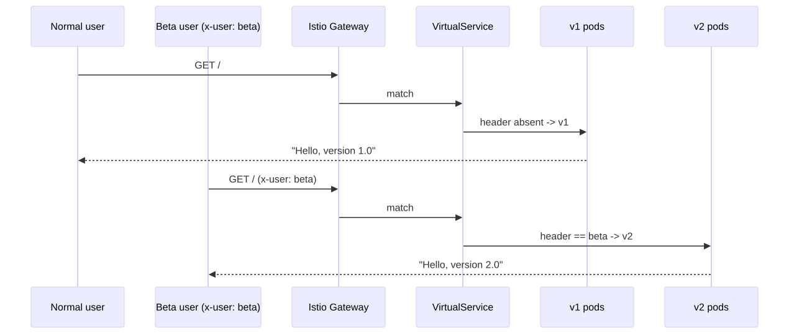
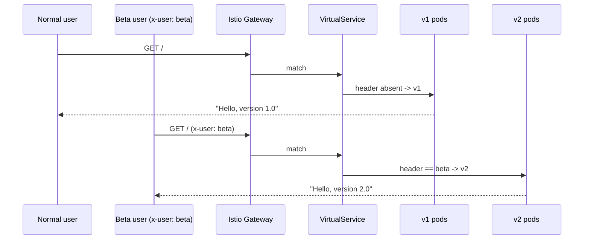

# 06 — A/B Testing (header-based routing)

> Route specific users (by HTTP header, cookie, geo, etc.) to v2 while everyone else stays on v1.

## Concept

Unlike a canary (which shifts a *percentage* of all traffic), A/B testing routes a **named segment** of users to the new version. The split is deterministic, not random.

Most common: `x-user: beta` header → v2 pods. Everyone else → v1 pods.

Achieved with Istio `VirtualService` (this demo) or Argo Rollouts' header matching.

## When to use

- Beta programs, internal dogfooding.
- Controlled rollout to a customer cohort (region, plan tier).
- Feature experiments where you want clean attribution between groups.

## Drawbacks

- Needs a service mesh or smart ingress (Istio, NGINX with header matching, Traefik, ALB rules).
- Requires upstream clients to set the routing header — usually via your edge gateway based on auth claims.
- Two versions in production for as long as the experiment runs.

## Traffic flow

<!-- mermaid:rendered -->
<p align="center"></p>

<details><summary>Mermaid source</summary>

<!-- mermaid:rendered -->
<p align="center"></p>

<details><summary>Mermaid source</summary>

<!-- mermaid:rendered -->
<p align="center"></p>

<details><summary>Mermaid source</summary>



</details>

</details>

</details>

## Files

- [`virtualservice.yaml`](./virtualservice.yaml) — Istio VirtualService with header match
- Plus the Deployments/Services from `04-canary-manual` (or use the snippet below)

## Walkthrough

```bash
# 1) Install Istio (one-time)
istioctl install --set profile=demo -y
kubectl label namespace default istio-injection=enabled --overwrite

# 2) Reuse stable+canary Deployments and Services from 04-canary-manual
#    BUT split them into TWO Services: hello-v1 (selects track=stable) and
#    hello-v2 (selects track=canary). The VirtualService below assumes that.
cat <<'EOF' | kubectl apply -f -
apiVersion: v1
kind: Service
metadata: { name: hello-v1 }
spec:
  selector: { app: hello-canary-app, track: stable }
  ports: [{ port: 80, targetPort: 8080 }]
---
apiVersion: v1
kind: Service
metadata: { name: hello-v2 }
spec:
  selector: { app: hello-canary-app, track: canary }
  ports: [{ port: 80, targetPort: 8080 }]
EOF

# 3) Apply the VirtualService
kubectl apply -f virtualservice.yaml

# 4) Test
GW=$(kubectl -n istio-system get svc istio-ingressgateway \
       -o jsonpath='{.status.loadBalancer.ingress[0].ip}')

curl -s   http://$GW/                       # -> Hello, version 1.0
curl -s -H "x-user: beta" http://$GW/       # -> Hello, version 2.0
```

## Verify

```bash
kubectl get virtualservice hello-ab -o yaml
istioctl proxy-config routes deploy/istio-ingressgateway -n istio-system
```

## Cleanup

```bash
kubectl delete -f virtualservice.yaml --ignore-not-found
kubectl delete svc hello-v1 hello-v2 --ignore-not-found
```

> **Gotcha:** A/B routing rules are sticky as long as the header is set. Make sure your auth gateway or feature-flag service consistently injects the header — otherwise users bounce between versions and break sessions.

> **Gotcha:** Don't conflate A/B testing with statistical experimentation. The mesh routes traffic; you still need an analytics pipeline to draw conclusions.
