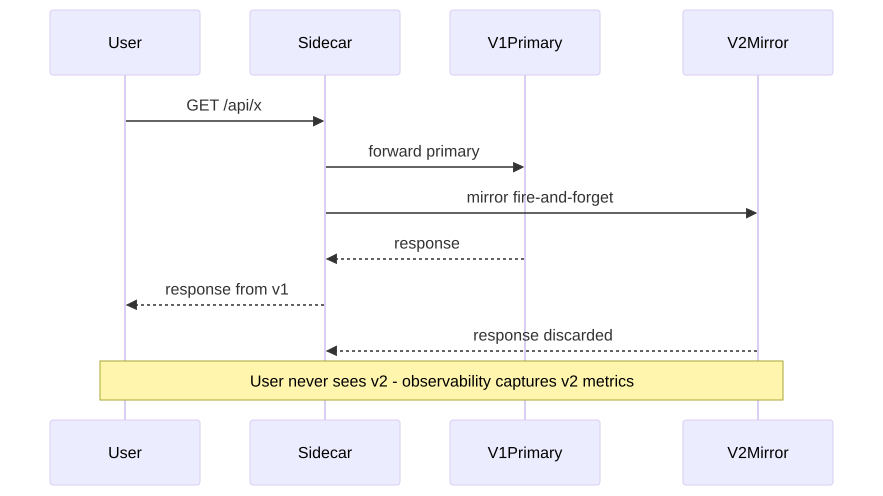
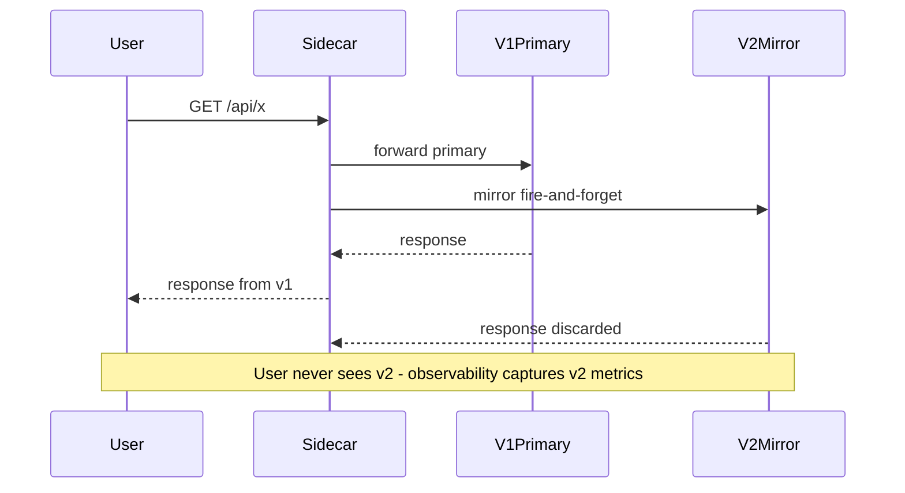

# 07 — Shadow / Mirror Traffic

> Send a copy of every production request to v2 alongside v1. Users only see v1's response. Zero user impact, full real-traffic validation.

## Concept

The mesh proxy duplicates incoming requests:

- The **primary** copy goes to v1 → response returned to the user.
- The **mirrored** copy goes to v2 → response is discarded (proxy doesn't wait for it).

You can now load-test, performance-profile, and bug-hunt v2 with **real production traffic** without exposing users to it.

## When to use

- Validating performance or memory behavior before a real release.
- "Dark launching" a rewrite (e.g., new search backend, new pricing engine).
- Stress-testing dependencies (DBs, caches) with realistic patterns.

## Drawbacks

- Mirrored requests **still hit downstream systems** — your DB sees double writes if v2 is not read-only. Most teams point shadowed v2 at a separate write-isolated environment or use shadow-safe code paths.
- 2x cost for the shadowed service.
- Requires a service mesh (Istio, Linkerd) or smart proxy (Envoy).
- Doesn't validate user-facing behavior — only the server side.

## Traffic flow

<!-- mermaid:rendered -->
<p align="center"></p>

<details><summary>Mermaid source</summary>



</details>

## Files

- [`virtualservice-mirror.yaml`](./virtualservice-mirror.yaml) — Istio VirtualService with `mirror` and `mirrorPercentage`

## Walkthrough

```bash
# Prerequisite: Istio installed, sidecar injection enabled in target namespace.
# Reuse hello-v1 + hello-v2 Services from 06-ab-testing.

kubectl apply -f virtualservice-mirror.yaml

# Drive load
for i in $(seq 1 200); do curl -s http://hello-v1/ >/dev/null; done

# Verify v2 saw the requests
kubectl logs -l app=hello-canary-app,track=canary --tail=50
```

## Verify

```bash
kubectl get virtualservice hello-mirror -o yaml
# Watch mirror RPS in Istio metrics
kubectl exec -it deploy/<v2-pod> -- wget -qO- localhost:8080/metrics
```

## Cleanup

```bash
kubectl delete -f virtualservice-mirror.yaml --ignore-not-found
```

> **Gotcha:** If v2 writes to a shared DB, mirrored requests cause **double writes / duplicate side effects**. Ensure idempotency or route v2 at a shadow database.

> **Gotcha:** Mirrored requests count toward downstream rate limits and quotas. Watch for limit exhaustion in dependencies you don't own.

> **Gotcha:** Response time for the user is bounded by v1 only — Envoy doesn't wait for the mirror — but mirror latency can still affect the v2 instance's load.
