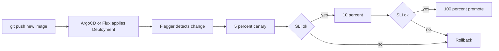

# 08 — Progressive Delivery with Flagger

> Flagger watches your `Deployment`, automatically creates a canary, shifts traffic in steps, queries Prometheus for SLIs, and promotes or rolls back based on pre-defined thresholds — all without human intervention.

## Concept

Flagger is the GitOps-native progressive-delivery controller. It:

1. Watches a `Canary` CR you create.
2. Detects changes to the underlying `Deployment` (e.g. new image).
3. Spins up a canary Deployment + Service automatically.
4. Shifts traffic 5% → 10% → 15% … through a service mesh or ingress.
5. At each step, runs a **metric query** (latency, success rate, custom).
6. If thresholds pass for N intervals → promote. If they fail → rollback.

<!-- mermaid:rendered -->
<p align="center"></p>

<details><summary>Mermaid source</summary>



</details>

## When to use

- You have GitOps + service mesh + Prometheus already.
- You want fully automated, no-touch releases for many services.
- You need objective, measurable rollout gating (SLOs).

## Drawbacks

- Heaviest stack of all the strategies. Flagger + mesh + metrics + ingress.
- Failure modes are spread across many components.
- Steeper learning curve; debugging a stuck canary requires understanding all layers.

## Files

- [`canary.yaml`](./canary.yaml) — Flagger `Canary` CR

## Walkthrough

```bash
# 1) Install Flagger (with Istio or NGINX ingress; example uses NGINX)
helm repo add flagger https://flagger.app
kubectl apply -k github.com/fluxcd/flagger//kustomize/crd
helm upgrade -i flagger flagger/flagger \
  --namespace ingress-nginx \
  --set meshProvider=nginx \
  --set metricsServer=http://prometheus.monitoring:9090

# 2) Create your normal Deployment + Service + Ingress (any standard config)

# 3) Apply the Canary CR
kubectl apply -f canary.yaml

# 4) Trigger a release (Flagger watches the Deployment)
kubectl set image deployment/hello hello=gcr.io/google-samples/hello-app:2.0

# 5) Watch the canary
kubectl describe canary hello | tail -50
kubectl -n test get events --watch --field-selector involvedObject.kind=Canary
```

## Verify

```bash
kubectl get canary
# Phase: Initialized | Progressing | Promoting | Succeeded | Failed
```

## Cleanup

```bash
kubectl delete -f canary.yaml --ignore-not-found
```

> **Gotcha:** Flagger creates `<name>-primary` and `<name>-canary` Deployments + Services. Don't manage those manually — they're owned by the controller.

> **Gotcha:** If your Prometheus query returns no data (e.g. no traffic during canary window), Flagger may treat that as "unknown" and stall. Generate synthetic load with the `webhooks` field if real traffic is sparse.

> **Gotcha:** First-time Canary creation **scales your deployment to 0** while Flagger sets up `-primary`. Plan the initial cutover during a quiet window.
