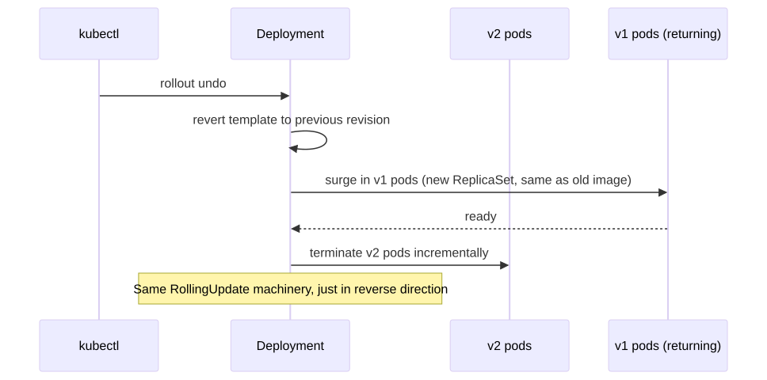
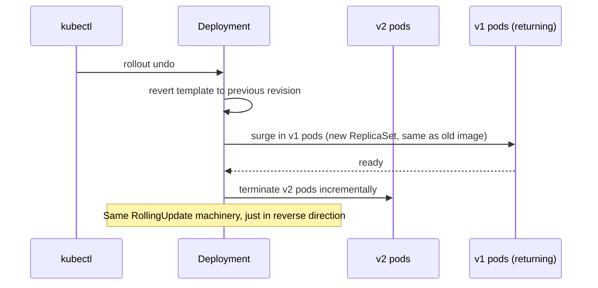

# 09 — Rollback Patterns

> Every release strategy needs a rollback story. This folder documents the kubectl primitives.

## Concept

Kubernetes Deployments keep a **revision history** (controlled by `revisionHistoryLimit`, default 10). Each `kubectl apply` / `set image` / `edit` that changes the pod template creates a new revision.

You can:

- List revisions: `kubectl rollout history`
- Inspect one: `kubectl rollout history deployment/X --revision=3`
- Roll back to previous: `kubectl rollout undo deployment/X`
- Roll back to specific: `kubectl rollout undo deployment/X --to-revision=3`
- Pause an in-progress rollout: `kubectl rollout pause deployment/X`
- Resume: `kubectl rollout resume deployment/X`
- Restart all pods (e.g., to re-pull config): `kubectl rollout restart deployment/X`

## When to use which

| Situation | Command |
|-----------|---------|
| New release is bad, want previous | `kubectl rollout undo deployment/X` |
| Want to pin to a known-good older revision | `kubectl rollout undo --to-revision=N` |
| Rollout in progress is going badly | `kubectl rollout pause` then `undo` |
| Config change with no image change (Secret/CM updated) | `kubectl rollout restart` |
| Need to re-promote a previously rolled-back image | `kubectl rollout undo` again (ping-pong) |

## Pod transition (rollback = a new RollingUpdate to the old image)

<!-- mermaid:rendered -->
<p align="center"></p>

<details><summary>Mermaid source</summary>



</details>
## Quick reference

=== ":material-lightbulb-outline: Concept"
    Every Deployment keeps a revision history (size = `revisionHistoryLimit`). Rollback is a normal RollingUpdate that re-applies an older pod template. It only reverts the template — Secrets, ConfigMaps, and CRDs need their own rollback path.

=== ":material-file-code-outline: Manifest"
    ```yaml
    apiVersion: apps/v1
    kind: Deployment
    metadata:
      name: hello-rollback
      annotations:
        kubernetes.io/change-cause: "release v2.0 — bumped hello-app image"
    spec:
      replicas: 3
      revisionHistoryLimit: 10        # keep 10 old ReplicaSets for undo
      selector:
        matchLabels: { app: hello-rollback }
      template:
        metadata:
          labels: { app: hello-rollback }
        spec:
          containers:
            - name: hello
              image: gcr.io/google-samples/hello-app:2.0
              ports: [{ containerPort: 8080 }]
    ```

=== ":material-console: kubectl"
    ```bash
    kubectl rollout history deployment/hello-rollback
    kubectl rollout undo    deployment/hello-rollback
    kubectl rollout undo    deployment/hello-rollback --to-revision=3
    kubectl rollout pause   deployment/hello-rollback
    kubectl rollout resume  deployment/hello-rollback
    kubectl rollout restart deployment/hello-rollback
    ```

=== ":material-text-box-outline: Expected output"
    ```text
    $ kubectl rollout history deployment/hello-rollback
    deployment.apps/hello-rollback
    REVISION  CHANGE-CAUSE
    1         release v1.0 — initial
    2         release v2.0 — bumped hello-app image
    $ kubectl rollout undo deployment/hello-rollback
    deployment.apps/hello-rollback rolled back
    $ kubectl rollout status deployment/hello-rollback
    deployment "hello-rollback" successfully rolled out
    ```

## Files

- [`demo.sh`](./demo.sh) — apply v1, upgrade to v2, roll back to v1, then forward to v2 again

## Run

```bash
bash demo.sh
```

## Verify

```bash
kubectl rollout history deployment/hello-rollback
kubectl get rs -l app=hello-rollback
kubectl describe deployment hello-rollback | grep -i image
```

## Cleanup

```bash
kubectl delete deployment hello-rollback svc hello-rollback --ignore-not-found
```

> **Gotcha:** `kubectl rollout undo` only reverts the **pod template**. If your release also included a Secret, ConfigMap, ServiceAccount, NetworkPolicy or CRD change, you must roll those back separately. GitOps (Argo/Flux) solves this — rollback = `git revert`.

> **Gotcha:** `revisionHistoryLimit: 0` disables history entirely → you cannot roll back. Always keep a sensible value (5–10).

> **Gotcha:** A rollback is itself a new rollout — it takes the same `maxSurge`/`maxUnavailable` time. Not instant.

> **Gotcha:** If the image tag has been **deleted from the registry** since the original deploy, undo will fail to pull. Use immutable digest pins (`@sha256:...`) for critical releases.
