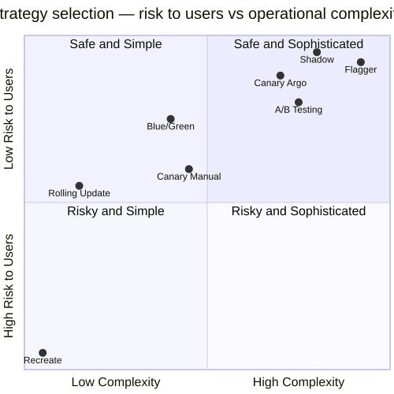
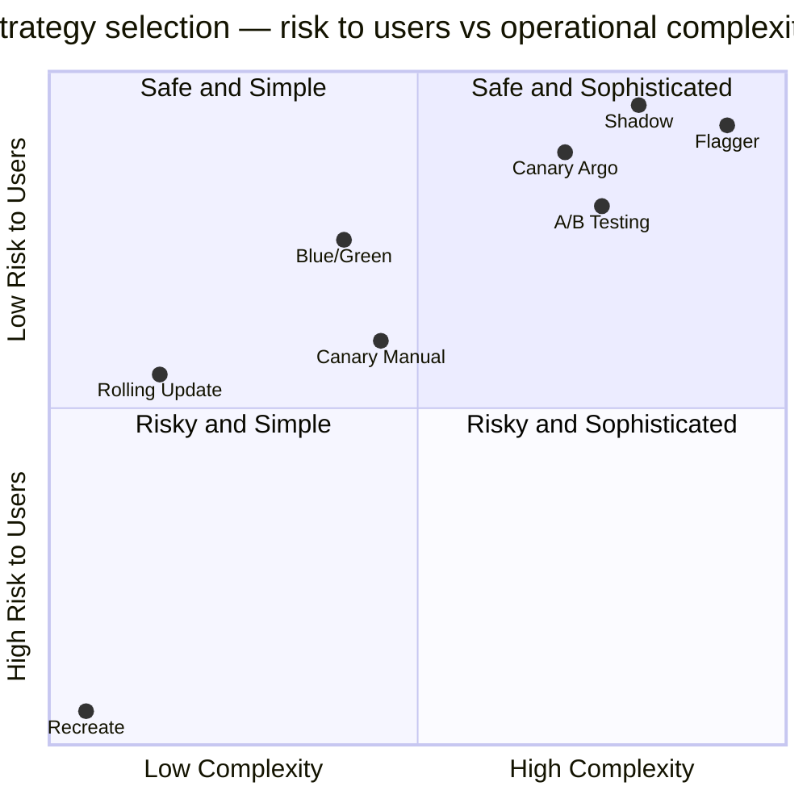
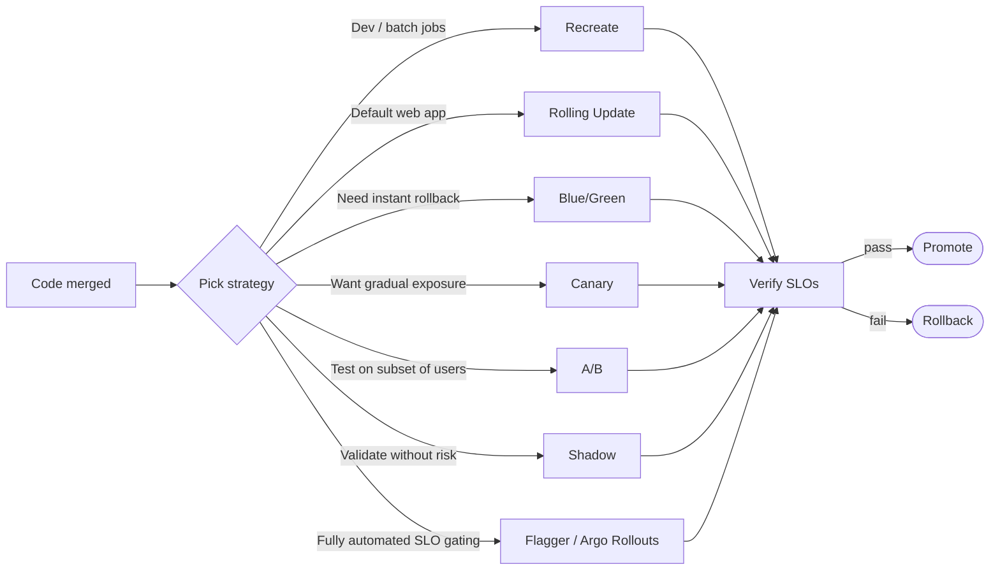

# Kubernetes Deployment Strategies

A complete, hands-on tour of every release strategy used in production Kubernetes — from the dead-simple `Recreate` to fully automated, SLI-driven progressive delivery with Flagger.

Every demo uses the same two images so version differences are obvious in `curl` output:

| Version | Image |
|---------|-------|
| v1 | `gcr.io/google-samples/hello-app:1.0` |
| v2 | `gcr.io/google-samples/hello-app:2.0` |

---

## Strategy Index

| # | Strategy | Folder | Downtime | Risk | Complexity | Extra Infra |
|---|----------|--------|----------|------|------------|-------------|
| 1 | Recreate | [01-recreate](./01-recreate) | Yes | Low | Trivial | None |
| 2 | Rolling Update (default) | [02-rolling-update](./02-rolling-update) | None | Low | Trivial | None |
| 3 | Blue / Green | [03-blue-green](./03-blue-green) | None | Low | Medium | 2x resources |
| 4 | Canary (manual) | [04-canary-manual](./04-canary-manual) | None | Medium | Medium | None |
| 5 | Canary (Argo Rollouts) | [05-canary-argo-rollouts](./05-canary-argo-rollouts) | None | Low | High | Argo Rollouts + Prometheus |
| 6 | A/B Testing | [06-ab-testing](./06-ab-testing) | None | Low | High | Istio / Argo Rollouts |
| 7 | Shadow / Mirror | [07-shadow-traffic](./07-shadow-traffic) | None | Very Low | High | Istio |
| 8 | Progressive Delivery (Flagger) | [08-progressive-delivery-flagger](./08-progressive-delivery-flagger) | None | Very Low | Very High | Flagger + Mesh + Prometheus |
| 9 | Rollback patterns | [09-rollback](./09-rollback) | depends | — | Trivial | None |

See [decision-matrix.md](./decision-matrix.md) for detailed selection guidance.

---

## Risk vs Complexity Map

<!-- mermaid:rendered -->
<p align="center"></p>

<details><summary>Mermaid source</summary>

<!-- mermaid:rendered -->
<p align="center"></p>

<details><summary>Mermaid source</summary>

<!-- mermaid:rendered -->
<p align="center"></p>

<details><summary>Mermaid source</summary>



</details>

</details>

</details>

---

## How releases progress over time

<!-- mermaid:rendered -->
<p align="center"></p>

<details><summary>Mermaid source</summary>

<!-- mermaid:rendered -->
<p align="center"></p>

<details><summary>Mermaid source</summary>

<!-- mermaid:rendered -->
<p align="center"></p>

<details><summary>Mermaid source</summary>



</details>

</details>

</details>

---

## How to use this folder

```bash
# Pick a strategy
cd 02-rolling-update

# Read the concept
cat README.md

# Run the demo (assumes a working kubectl context)
bash demo.sh

# Cleanup
kubectl delete -f deployment.yaml
```

Every demo is self-contained, idempotent and cleans up after itself.

---

## Prerequisites

- A Kubernetes cluster (kind, minikube, k3d, EKS, GKE, AKS, Kyma — anything)
- `kubectl` configured against it
- For 05–08: Argo Rollouts / Istio / Flagger installed (each folder has install steps)

> Tip: run `kubectl get pods -L version --watch` in a separate terminal during every demo — it's the fastest way to *see* what each strategy actually does.
