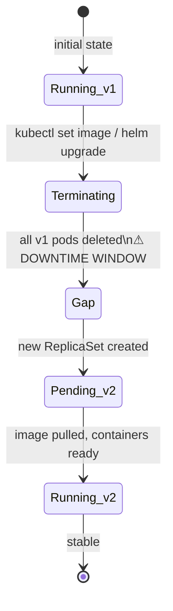
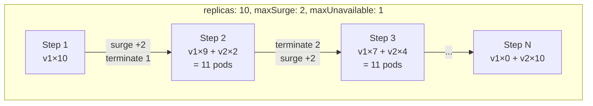
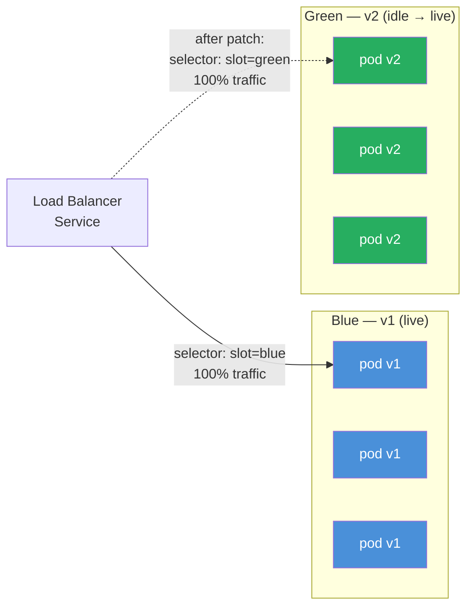
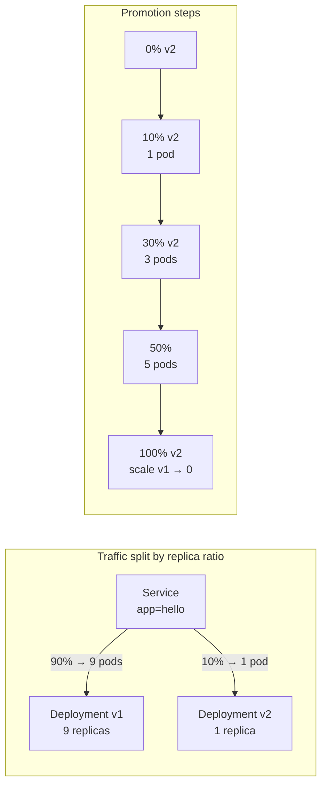
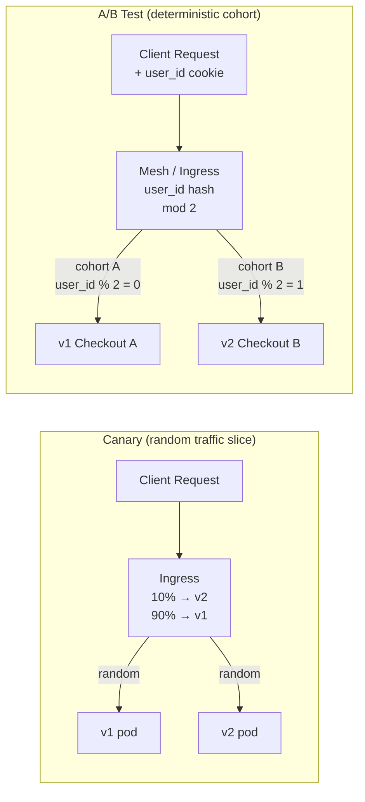
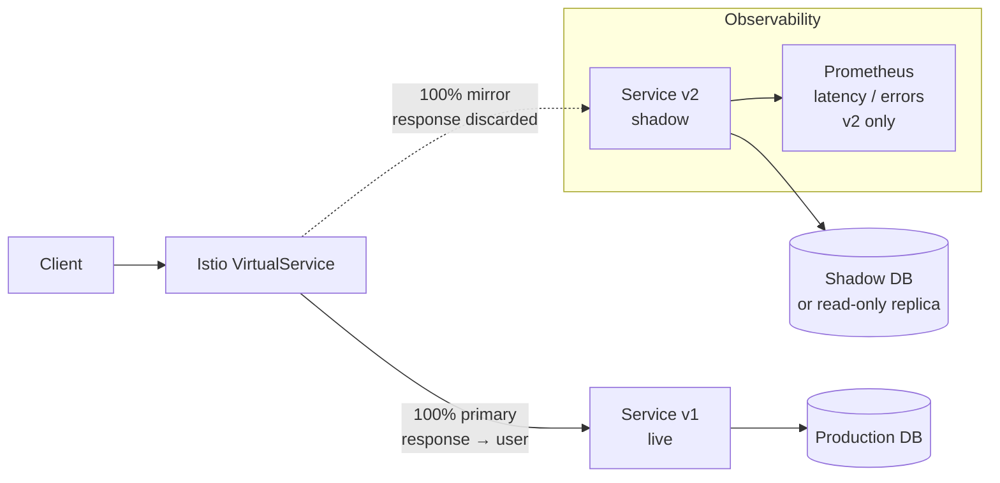
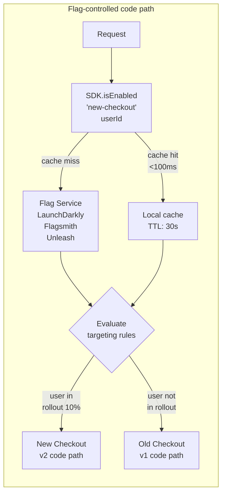
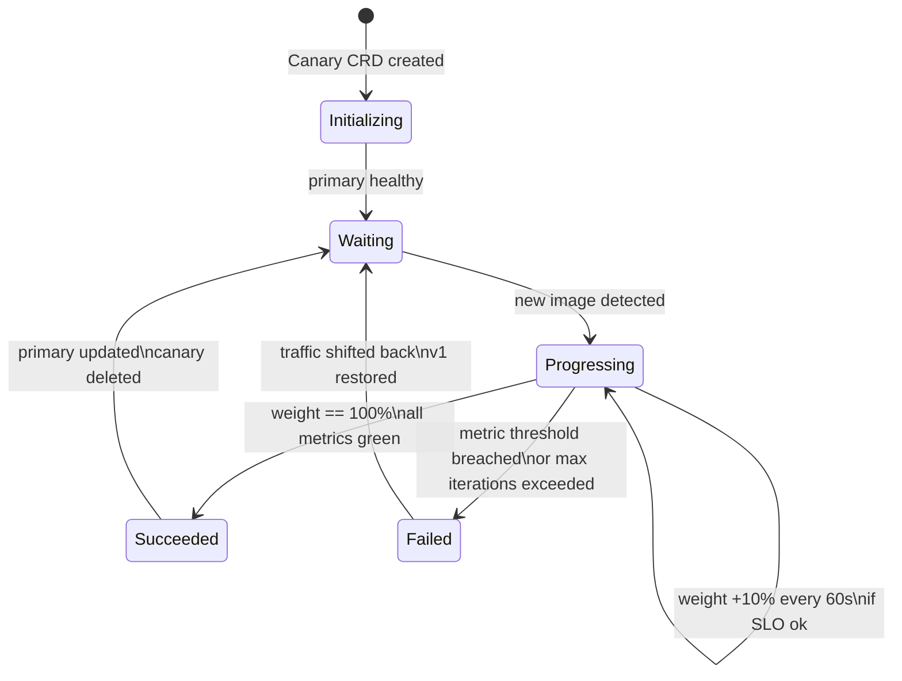
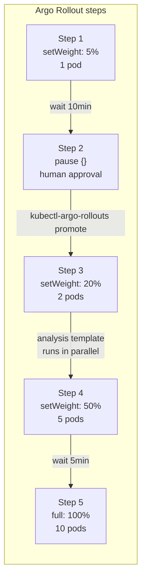
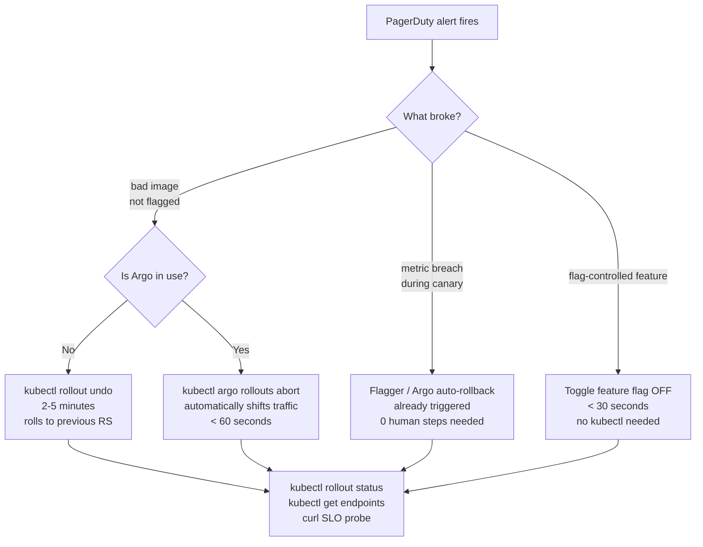

# Kubernetes Deployment Strategies

<p class="hero strategies"><h1>03 · Kubernetes <em>Deployment Strategies</em></h1><p class="tagline">Ten patterns that put you in control of every release — from a two-second Recreate to a fully automated SLO-gated progressive delivery pipeline.</p></p>

## Roadmap — your learning path

<div class="roadmap" markdown>

<div class="stop" data-step="1" markdown>
#### Recreate
Accept downtime deliberately — the only honest strategy for schema migrations.
</div>

<div class="stop" data-step="2" markdown>
#### RollingUpdate
Kubernetes default. Math behind maxSurge and maxUnavailable.
</div>

<div class="stop" data-step="3" markdown>
#### Blue-Green
Instant traffic flip. Two full environments, one DNS record.
</div>

<div class="stop" data-step="4" markdown>
#### Canary
1 pod takes 10% of real traffic. Metrics decide the rest.
</div>

<div class="stop" data-step="5" markdown>
#### A/B Testing vs Canary
User cohorts, not traffic percentages. Session stickiness matters.
</div>

<div class="stop" data-step="6" markdown>
#### Shadow / Mirror Traffic
Run v2 in parallel. Zero user impact. Stripe's reliability weapon.
</div>

<div class="stop" data-step="7" markdown>
#### Feature Flags
Decouple deploy from release. LaunchDarkly, Flagsmith, Unleash.
</div>

<div class="stop" data-step="8" markdown>
#### Progressive Delivery with Flagger
Automated metric-gated canary promotion. Weaveworks invented this.
</div>

<div class="stop" data-step="9" markdown>
#### Traffic Shifting with Argo Rollouts
Step-based analysis templates. Intuit runs 200 rollouts per day.
</div>

<div class="stop" data-step="10" markdown>
#### Rollback Strategies
Manual kubectl, automated circuit-breaker, Argo auto-rollback.
</div>

</div>

---

## Quick reference — strategy selector

| Strategy | Downtime | Risk | Extra infra | When to use |
|---|---|---|---|---|
| Recreate | Yes | Low | None | Batch jobs, DB migrations |
| RollingUpdate | None | Low | None | Default web services |
| Blue-Green | None | Low | 2× cost | Need instant rollback |
| Canary | None | Medium | Ingress / mesh | Gradual user exposure |
| A/B Testing | None | Medium | Mesh + session | User cohort experiments |
| Shadow | None | Very Low | Mesh | Validate v2 risk-free |
| Feature Flags | None | Very Low | Flag service | Decouple deploy/release |
| Flagger | None | Very Low | Mesh + Prometheus | Auto-gated promotion |
| Argo Rollouts | None | Very Low | Argo controller | Step-based CI/CD |
| Rollback | Depends | — | None | Incident recovery |

---

## 1. Recreate

<div class="concept" markdown>

<span class="stage reason">🧭 Reason</span>

**Why this exists.** Your PostgreSQL migration adds a `NOT NULL` column. v1 pods cannot run alongside v2 — they will crash the moment v2 writes to the schema. You need every v1 pod dead before v2 starts. Recreate is the only Kubernetes-native strategy that guarantees this. Pretending you can avoid downtime for a schema migration is how on-call engineers get paged at 03:00.

<span class="stage thinking">🧠 Thinking</span>

**Mental model.** Recreate is a two-phase hard-stop. All running replicas are terminated first, then the new replicas start. No overlap, no race condition.



Key facts:
- Kubernetes sets `spec.strategy.type: Recreate` — that's it. No tuning parameters.
- The Deployment controller scales the old ReplicaSet to 0, waits for all pods to reach `Terminating`, then creates the new ReplicaSet.
- Downtime = pod termination time + image pull time + container startup time + readiness probe delay. Budget 30–120 seconds for typical workloads.
- Acceptable because batch jobs, workers, and migrating services are downstream of a queue — callers retry automatically.

<span class="stage execution">⚡ Execution</span>

**Run it yourself.**

```bash
# Deploy v1 with Recreate strategy
kubectl apply -f - <<'EOF'
apiVersion: apps/v1
kind: Deployment
metadata:
  name: hello
  namespace: default
spec:
  replicas: 4
  strategy:
    type: Recreate            # <-- the only required field
  selector:
    matchLabels:
      app: hello
  template:
    metadata:
      labels:
        app: hello
    spec:
      containers:
      - name: hello
        image: gcr.io/google-samples/hello-app:1.0
        ports:
        - containerPort: 8080
        readinessProbe:
          httpGet:
            path: /
            port: 8080
          initialDelaySeconds: 5
          periodSeconds: 3
EOF

# Watch in a separate terminal while you trigger the update
kubectl get pods -w --field-selector=metadata.name!=dummy

# Trigger the upgrade (runs schema migration job first in real life)
kubectl set image deployment/hello hello=gcr.io/google-samples/hello-app:2.0

# Verify rollout complete
kubectl rollout status deployment/hello

# Confirm version
kubectl exec -it $(kubectl get pod -l app=hello -o name | head -1) \
  -- wget -qO- http://localhost:8080
```

<span class="stage simulation">🔮 Simulation — what you'll see</span>

<pre class="sim"><code><span class="prompt">$</span> kubectl get pods -w
<span class="comment"># NAME                     READY   STATUS    RESTARTS   AGE</span>
<span class="comment"># hello-7d8c9b4f6-2xkpq   1/1     Running   0          2m</span>
<span class="comment"># hello-7d8c9b4f6-5lmrd   1/1     Running   0          2m</span>
<span class="comment"># hello-7d8c9b4f6-9qwtz   1/1     Running   0          2m</span>
<span class="comment"># hello-7d8c9b4f6-bnvcs   1/1     Running   0          2m</span>
<span class="comment">#</span>
<span class="comment"># --- kubectl set image triggered ---</span>
<span class="comment">#</span>
<span class="comment"># hello-7d8c9b4f6-2xkpq   1/1     Terminating   0   2m10s</span>
<span class="comment"># hello-7d8c9b4f6-5lmrd   1/1     Terminating   0   2m10s</span>
<span class="comment"># hello-7d8c9b4f6-9qwtz   1/1     Terminating   0   2m10s</span>
<span class="comment"># hello-7d8c9b4f6-bnvcs   1/1     Terminating   0   2m10s</span>
<span class="comment"># ⚠  DOWNTIME — no pods serving traffic</span>
<span class="comment">#</span>
<span class="comment"># hello-5f9c7b3d2-4rtkn   0/1     Pending       0   0s</span>
<span class="comment"># hello-5f9c7b3d2-4rtkn   0/1     ContainerCreating   0   1s</span>
<span class="comment"># hello-5f9c7b3d2-4rtkn   1/1     Running       0   8s</span>
</code></pre>

<span class="stage output">✅ Output — state change</span>

<div class="flow" markdown>

<div class="state before" markdown>
##### Before
<span class="diff-del">v1: 100% · 4 pods</span>
v2: 0% · 0 pods
schema: old
</div>

<div class="arrow">→</div>

<div class="state during" markdown>
##### During
<span class="diff-mod">v1: 0% · 0 pods (terminating)</span>
v2: 0% · 0 pods (pending)
⚠ DOWNTIME ~45s
</div>

<div class="arrow">→</div>

<div class="state after" markdown>
##### After
v1: 0% · 0 pods
<span class="diff-add">v2: 100% · 4 pods</span>
schema: migrated
zero-downtime: NO (intentional)
</div>

</div>

<span class="stage usecase">🌍 Real-world use case</span>

<div class="usecase-card" markdown>
**At Booking.com**, the payments team runs nightly fare-recalculation batch workers as `Recreate` deployments. The strategy guarantees that a mid-flight worker running old fare logic never conflicts with the new pricing schema applied at 01:00 UTC. Downtime is measured in seconds during low-traffic overnight windows, and the `CronJob` that triggers the batch simply retries if it starts during the gap.
</div>

</div>

---

## 2. RollingUpdate

<div class="concept" markdown>

<span class="stage reason">🧭 Reason</span>

**Why this exists.** Your API service has 10 pods serving live traffic. You want to ship a bug fix without a maintenance window. RollingUpdate replaces pods incrementally — Kubernetes never takes down more than `maxUnavailable` pods at once, and never adds more than `maxSurge` pods above your desired count. The math determines your blast radius if the new version is broken.

<span class="stage thinking">🧠 Thinking</span>

**Mental model.** RollingUpdate is a sliding window across your ReplicaSet. The two knobs are `maxSurge` (how much over capacity you'll temporarily run) and `maxUnavailable` (how many pods can be down simultaneously).



Key facts:
- `maxSurge: 2` means Kubernetes will start 2 new v2 pods before removing old ones — you temporarily pay for 12 pods.
- `maxUnavailable: 1` means at most 1 pod is unhealthy at any moment. With 10 replicas, 90% capacity is always available.
- The readiness probe is your traffic gate. A pod only receives traffic after its readiness probe passes. Set it correctly or you'll route requests to a pod still warming up.
- Surge capacity cost: if pods cost $0.02/hour each, 2 surge pods = $0.04/hour during rollout (~10 minutes) = $0.007 per deploy. Negligible.
- Default values are `maxSurge: 25%`, `maxUnavailable: 25%` — fine for most apps. High-traffic services should use `maxUnavailable: 0` to guarantee full capacity.

Math:
```text
minimum available = replicas - maxUnavailable
maximum running   = replicas + maxSurge
```

<span class="stage execution">⚡ Execution</span>

**Run it yourself.**

```bash
kubectl apply -f - <<'EOF'
apiVersion: apps/v1
kind: Deployment
metadata:
  name: hello-rolling
  namespace: default
spec:
  replicas: 10
  strategy:
    type: RollingUpdate
    rollingUpdate:
      maxSurge: 2          # 12 pods max during rollout
      maxUnavailable: 1    # 9 pods always available
  selector:
    matchLabels:
      app: hello-rolling
  template:
    metadata:
      labels:
        app: hello-rolling
    spec:
      containers:
      - name: hello
        image: gcr.io/google-samples/hello-app:1.0
        ports:
        - containerPort: 8080
        readinessProbe:
          httpGet:
            path: /
            port: 8080
          initialDelaySeconds: 5
          periodSeconds: 3
          failureThreshold: 3   # fail 3× before marking not-ready
EOF

# Watch rolling progress in real time
kubectl rollout status deployment/hello-rolling --watch

# Trigger the update
kubectl set image deployment/hello-rolling \
  hello=gcr.io/google-samples/hello-app:2.0

# Observe pod-by-pod replacement (run in parallel terminal)
kubectl get pods -l app=hello-rolling -L version --watch

# Verify zero downtime with a continuous probe (separate terminal)
while true; do
  curl -s http://$(kubectl get svc hello-rolling -o jsonpath='{.status.loadBalancer.ingress[0].ip}')/
  sleep 0.5
done

# Rollback if the new image is broken
kubectl rollout undo deployment/hello-rolling

# Cleanup
kubectl delete deployment hello-rolling
```

<span class="stage simulation">🔮 Simulation — what you'll see</span>

<pre class="sim"><code><span class="prompt">$</span> kubectl get pods -l app=hello-rolling -L version --watch
<span class="comment"># NAME                         READY  STATUS     VERSION</span>
<span class="comment"># hello-rolling-abc-r1         1/1    Running    v1</span>
<span class="comment"># hello-rolling-abc-r2         1/1    Running    v1</span>
<span class="comment"># ... (10 total v1 pods)</span>
<span class="comment">#</span>
<span class="comment"># --- update triggered ---</span>
<span class="comment">#</span>
<span class="comment"># hello-rolling-xyz-n1         0/1    Pending    v2      ← surge pod 1</span>
<span class="comment"># hello-rolling-xyz-n2         0/1    Pending    v2      ← surge pod 2</span>
<span class="comment"># hello-rolling-xyz-n1         1/1    Running    v2      ← readiness passed</span>
<span class="comment"># hello-rolling-abc-r1         1/1    Terminating v1</span>
<span class="comment"># hello-rolling-xyz-n3         0/1    Pending    v2</span>
<span class="comment"># ... (repeats until 10×v2)</span>
<span class="comment">#</span>
<span class="prompt">$</span> kubectl rollout status deployment/hello-rolling
<span class="comment"># Waiting for deployment "hello-rolling" rollout to finish: 4 out of 10 new replicas updated...</span>
<span class="comment"># Waiting for deployment "hello-rolling" rollout to finish: 5 out of 10 new replicas updated...</span>
<span class="comment"># deployment "hello-rolling" successfully rolled out</span>
</code></pre>

<span class="stage output">✅ Output — state change</span>

<div class="flow" markdown>

<div class="state before" markdown>
##### Before
<span class="diff-del">v1: 100% · 10 pods</span>
v2: 0% · 0 pods
capacity: 10/10
</div>

<div class="arrow">→</div>

<div class="state during" markdown>
##### Mid-rollout
<span class="diff-mod">v1: 50% · 5 pods</span>
<span class="diff-mod">v2: 50% · 5 pods</span>
capacity: 11/10 (surge +1)
zero-downtime: YES
</div>

<div class="arrow">→</div>

<div class="state after" markdown>
##### After
v1: 0% · 0 pods
<span class="diff-add">v2: 100% · 10 pods</span>
capacity: 10/10
zero-downtime: YES
</div>

</div>

<span class="stage usecase">🌍 Real-world use case</span>

<div class="usecase-card" markdown>
**At Spotify**, the backend-for-frontend team ships 40–60 deployments per day across their microservice fleet. They standardised on `maxSurge: 1, maxUnavailable: 0` for all HTTP services. This ensures 100% capacity throughout every rollout — critical during active listening sessions where a dropped request triggers a client retry storm. The `maxUnavailable: 0` constraint adds ~90 seconds per rollout (one extra pod cycle) but eliminated all rollout-related latency spikes from their SLO dashboards.
</div>

</div>

---

## 3. Blue-Green

<div class="concept" markdown>

<span class="stage reason">🧭 Reason</span>

**Why this exists.** Your e-commerce checkout service cannot tolerate even a partial canary failure during Black Friday. You need the ability to flip all traffic in one atomic operation and, if something is wrong, flip it back in under 10 seconds without waiting for a rolling update to drain. Blue-Green gives you exactly that: two full environments running in parallel, with a single label selector change routing all traffic between them.

<span class="stage thinking">🧠 Thinking</span>

**Mental model.** Two identical Deployments — blue (current) and green (new) — run side by side. The Service's `selector` points at one set at a time. Traffic flip is instantaneous.



Key facts:
- **Cost**: 2× pod count during the transition period. For large deployments this is expensive — budget for it.
- **Flip time**: `kubectl patch service` takes < 1 second. The Service endpoint controller propagates the change to kube-proxy on all nodes in ~1–5 seconds.
- **Rollback time**: re-patch the selector back to `blue`. Just as fast.
- **Warm-up**: run load against the green environment (behind a test header or internal URL) before the flip. Cold starts in green during peak traffic cause latency spikes.
- **Database compatibility**: blue and green must be able to share the same DB schema. Use expand/contract migrations.

<span class="stage execution">⚡ Execution</span>

**Run it yourself.**

```bash
# --- Deploy BLUE (v1) ---
kubectl apply -f - <<'EOF'
apiVersion: apps/v1
kind: Deployment
metadata:
  name: hello-blue
  labels:
    slot: blue
spec:
  replicas: 3
  selector:
    matchLabels:
      app: hello
      slot: blue
  template:
    metadata:
      labels:
        app: hello
        slot: blue
        version: v1
    spec:
      containers:
      - name: hello
        image: gcr.io/google-samples/hello-app:1.0
        ports:
        - containerPort: 8080
        readinessProbe:
          httpGet: { path: /, port: 8080 }
          initialDelaySeconds: 5
---
apiVersion: v1
kind: Service
metadata:
  name: hello
spec:
  selector:
    app: hello
    slot: blue        # <-- points at blue
  ports:
  - port: 80
    targetPort: 8080
EOF

# --- Deploy GREEN (v2) — traffic not yet routed ---
kubectl apply -f - <<'EOF'
apiVersion: apps/v1
kind: Deployment
metadata:
  name: hello-green
  labels:
    slot: green
spec:
  replicas: 3
  selector:
    matchLabels:
      app: hello
      slot: green
  template:
    metadata:
      labels:
        app: hello
        slot: green
        version: v2
    spec:
      containers:
      - name: hello
        image: gcr.io/google-samples/hello-app:2.0
        ports:
        - containerPort: 8080
        readinessProbe:
          httpGet: { path: /, port: 8080 }
          initialDelaySeconds: 5
EOF

# --- Wait for green to be fully ready ---
kubectl rollout status deployment/hello-green

# --- Smoke test green directly (optional pre-flight) ---
kubectl port-forward deployment/hello-green 9090:8080 &
curl -s http://localhost:9090/
kill %1

# --- FLIP: point Service at green ---
kubectl patch service hello \
  -p '{"spec":{"selector":{"app":"hello","slot":"green"}}}'

# --- Verify ---
kubectl get endpoints hello
# All endpoint IPs should now be green pods

# --- Rollback in < 5 seconds ---
# kubectl patch service hello \
#   -p '{"spec":{"selector":{"app":"hello","slot":"blue"}}}'

# --- Cleanup after confidence ---
kubectl delete deployment hello-blue hello-green
kubectl delete service hello
```

<span class="stage simulation">🔮 Simulation — what you'll see</span>

<pre class="sim"><code><span class="prompt">$</span> kubectl get pods -L slot,version
<span class="comment"># NAME                          READY   SLOT    VERSION</span>
<span class="comment"># hello-blue-6b9f7c-p1          1/1     blue    v1</span>
<span class="comment"># hello-blue-6b9f7c-p2          1/1     blue    v1</span>
<span class="comment"># hello-blue-6b9f7c-p3          1/1     blue    v1</span>
<span class="comment"># hello-green-7d4a2b-q1         1/1     green   v2</span>
<span class="comment"># hello-green-7d4a2b-q2         1/1     green   v2</span>
<span class="comment"># hello-green-7d4a2b-q3         1/1     green   v2</span>

<span class="prompt">$</span> kubectl patch service hello -p '{"spec":{"selector":{"slot":"green"}}}'
<span class="comment"># service/hello patched</span>

<span class="prompt">$</span> kubectl get endpoints hello
<span class="comment"># NAME    ENDPOINTS</span>
<span class="comment"># hello   10.244.1.12:8080,10.244.2.7:8080,10.244.3.4:8080</span>
<span class="comment">#  ↑ all three IPs belong to green pods now</span>
</code></pre>

<span class="stage output">✅ Output — state change</span>

<div class="flow" markdown>

<div class="state before" markdown>
##### Before flip
<span class="diff-del">blue: 100% · 3 pods (live)</span>
green: 0% · 3 pods (idle, warm)
traffic: → blue only
cost: 2× pod count
</div>

<div class="arrow">→</div>

<div class="state during" markdown>
##### Flip (~2s)
<span class="diff-mod">Service selector patching</span>
endpoint propagation in progress
both slots running
in-flight requests finish on blue
</div>

<div class="arrow">→</div>

<div class="state after" markdown>
##### After flip
blue: 0% · 3 pods (standby 30min)
<span class="diff-add">green: 100% · 3 pods (live)</span>
zero-downtime: YES
rollback: patch selector back
</div>

</div>

<span class="stage usecase">🌍 Real-world use case</span>

<div class="usecase-card" markdown>
**At Amazon**, the Prime Day team uses blue-green deployments for the checkout path. In 2022, a payments service bug was caught 4 minutes after the green flip via Canary CloudWatch alarms. The selector was flipped back to blue in under 3 seconds — before a single customer order failed. The green deployment sat idle for 2 hours while the bug was patched, then the flip was re-attempted successfully. The 2× cost of idle green pods during the 2-hour window was immaterial compared to preventing a Prime Day outage.
</div>

</div>

---

## 4. Canary

<div class="concept" markdown>

<span class="stage reason">🧭 Reason</span>

**Why this exists.** You are not confident enough for a full Blue-Green flip. You want 5% of real production requests to hit v2 so your monitoring can tell you whether error rates, latency p99, and business metrics (conversion rate, add-to-cart) are healthy before you expose the rest. If v2 is bad, only 5% of users were affected. The name comes from canaries in coal mines — early warning at minimal cost.

<span class="stage thinking">🧠 Thinking</span>

**Mental model.** Traffic splits by pod count ratio. A Service with `selector: app=hello` will round-robin across all matching pods regardless of which Deployment owns them. You control the ratio by controlling replica counts.



Key facts:
- Traffic ratio = v2 replicas / (v1 replicas + v2 replicas). With 9+1=10 pods total, 1 v2 pod = 10%.
- You need both Deployments to share the **same Service selector** — only the `version` label differs.
- **Readiness gate**: the new pod must pass its readiness probe before it enters the endpoint pool. A failing v2 pod gets removed from rotation automatically.
- **Header-based canary**: more precise targeting — Nginx Ingress `canary-by-header: X-Canary: always` routes that user to v2 regardless of pod count. Use this for internal QA.
- **Metrics gate**: after each step, check your SLO dashboard. Automate this with Flagger (concept 8).

<span class="stage execution">⚡ Execution</span>

**Run it yourself.**

```bash
# --- Stable v1 with 9 replicas ---
kubectl apply -f - <<'EOF'
apiVersion: apps/v1
kind: Deployment
metadata:
  name: hello-stable
spec:
  replicas: 9
  selector:
    matchLabels:
      app: hello-canary
      track: stable
  template:
    metadata:
      labels:
        app: hello-canary
        track: stable
        version: v1
    spec:
      containers:
      - name: hello
        image: gcr.io/google-samples/hello-app:1.0
        ports:
        - containerPort: 8080
        readinessProbe:
          httpGet: { path: /, port: 8080 }
          initialDelaySeconds: 3
---
apiVersion: v1
kind: Service
metadata:
  name: hello-canary
spec:
  selector:
    app: hello-canary     # matches BOTH stable and canary
  ports:
  - port: 80
    targetPort: 8080
EOF

# --- Canary v2 — starts at 1 replica (10%) ---
kubectl apply -f - <<'EOF'
apiVersion: apps/v1
kind: Deployment
metadata:
  name: hello-canary
spec:
  replicas: 1             # 1/(9+1) = 10%
  selector:
    matchLabels:
      app: hello-canary
      track: canary
  template:
    metadata:
      labels:
        app: hello-canary
        track: canary
        version: v2
    spec:
      containers:
      - name: hello
        image: gcr.io/google-samples/hello-app:2.0
        ports:
        - containerPort: 8080
        readinessProbe:
          httpGet: { path: /, port: 8080 }
          initialDelaySeconds: 3
EOF

# --- Observe split ---
kubectl get pods -l app=hello-canary -L track,version

# --- Promote: 30% canary ---
kubectl scale deployment hello-canary --replicas=4   # 4/(6+4)=40%
kubectl scale deployment hello-stable --replicas=6

# --- Promote: 50% canary ---
kubectl scale deployment hello-canary --replicas=5
kubectl scale deployment hello-stable --replicas=5

# --- Full promotion: 100% canary ---
kubectl scale deployment hello-stable --replicas=0
kubectl scale deployment hello-canary --replicas=9

# --- Rollback: bump stable back, kill canary ---
# kubectl scale deployment hello-stable --replicas=9
# kubectl scale deployment hello-canary --replicas=0

# Cleanup
kubectl delete deployment hello-stable hello-canary
kubectl delete service hello-canary
```

<span class="stage simulation">🔮 Simulation — what you'll see</span>

<pre class="sim"><code><span class="prompt">$</span> kubectl get pods -l app=hello-canary -L track,version
<span class="comment"># NAME                        READY  TRACK    VERSION</span>
<span class="comment"># hello-stable-6bc-s1         1/1    stable   v1</span>
<span class="comment"># hello-stable-6bc-s2         1/1    stable   v1</span>
<span class="comment"># hello-stable-6bc-s3         1/1    stable   v1</span>
<span class="comment"># hello-stable-6bc-s4         1/1    stable   v1</span>
<span class="comment"># hello-stable-6bc-s5         1/1    stable   v1</span>
<span class="comment"># hello-stable-6bc-s6         1/1    stable   v1</span>
<span class="comment"># hello-stable-6bc-s7         1/1    stable   v1</span>
<span class="comment"># hello-stable-6bc-s8         1/1    stable   v1</span>
<span class="comment"># hello-stable-6bc-s9         1/1    stable   v1</span>
<span class="comment"># hello-canary-9df-c1         1/1    canary   v2   ← 10% traffic</span>
<span class="comment">#</span>
<span class="comment"># After scale: 5 stable + 5 canary</span>
<span class="comment"># hello-stable-6bc-s1..5      1/1    stable   v1   ← 50%</span>
<span class="comment"># hello-canary-9df-c1..5      1/1    canary   v2   ← 50%</span>
</code></pre>

<span class="stage output">✅ Output — state change</span>

<div class="flow" markdown>

<div class="state before" markdown>
##### Initial canary
<span class="diff-del">v1: 90% · 9 pods</span>
<span class="diff-add">v2: 10% · 1 pod</span>
monitoring: watching
errors: baseline
</div>

<div class="arrow">→</div>

<div class="state during" markdown>
##### 50% step
<span class="diff-mod">v1: 50% · 5 pods</span>
<span class="diff-mod">v2: 50% · 5 pods</span>
SLOs: green for 30min
p99 latency: +2ms (ok)
</div>

<div class="arrow">→</div>

<div class="state after" markdown>
##### Full promotion
v1: 0% · 0 pods
<span class="diff-add">v2: 100% · 9 pods</span>
zero-downtime: YES
affected on failure: max 10%
</div>

</div>

<span class="stage usecase">🌍 Real-world use case</span>

<div class="usecase-card" markdown>
**At Netflix**, the streaming team runs canary deployments for every change to the video playback service. They start at 1% (roughly 1.4 million requests/hour at peak). Their "canary analysis" framework — open-sourced as Kayenta — compares error rate, latency distributions, and business metrics (play-start success rate, rebuffer ratio) between canary and baseline using Mann-Whitney U tests. If the canary's p99 latency exceeds baseline + 10ms over a 30-minute window, the canary is automatically killed and the on-call engineer receives a Slack alert with the specific metric that failed.
</div>

</div>

---

## 5. A/B Testing vs Canary

<div class="concept" markdown>

<span class="stage reason">🧭 Reason</span>

**Why this exists.** A canary releases v2 to a random slice of traffic to validate stability. An A/B test releases a variant to a *specific user cohort* to measure a *business outcome*. The question changes from "is v2 broken?" to "does this checkout button colour increase conversion by 3%?". Confusing these two patterns causes you to either over-complicate a stability check or under-instrument a business experiment.

<span class="stage thinking">🧠 Thinking</span>

**Mental model.** The routing key changes from "random 10% of requests" to "user ID hash mod N" or "header cookie matches cohort ID". Session stickiness is mandatory — a user must stay in the same variant for the duration of the experiment.



Key facts:
- **Canary**: validates infrastructure/code safety. Metric = error rate, latency, crash rate.
- **A/B test**: validates product hypothesis. Metric = conversion, revenue per user, engagement.
- **Session stickiness**: set `nginx.ingress.kubernetes.io/canary-by-cookie: "abtest-group"`. Users without the cookie are assigned a group and the cookie is set on first response. All subsequent requests from that user hit the same variant.
- **Sample size**: use a power analysis before starting. With 0.5% expected conversion lift, you need ~50k users per group. A 1% canary slice on low-traffic services runs experiments for months.
- **Istio approach**: `VirtualService` with `match.headers` routing. Supports `exact`, `regex`, `prefix` on any header or cookie.
- **Concurrent experiments**: use Unleash or LaunchDarkly to manage experiment assignment centrally rather than encoding it in your Ingress config.

<span class="stage execution">⚡ Execution</span>

**Run it yourself.**

```bash
# Prerequisites: Nginx Ingress controller installed
# kubectl apply -f https://raw.githubusercontent.com/kubernetes/ingress-nginx/controller-v1.10.0/deploy/static/provider/cloud/deploy.yaml

# --- Deploy both variants ---
kubectl apply -f - <<'EOF'
# Variant A — control
apiVersion: apps/v1
kind: Deployment
metadata:
  name: checkout-a
spec:
  replicas: 3
  selector:
    matchLabels: { app: checkout, variant: a }
  template:
    metadata:
      labels: { app: checkout, variant: a }
    spec:
      containers:
      - name: checkout
        image: gcr.io/google-samples/hello-app:1.0
        ports: [{ containerPort: 8080 }]
---
apiVersion: v1
kind: Service
metadata:
  name: checkout-a
spec:
  selector: { app: checkout, variant: a }
  ports: [{ port: 80, targetPort: 8080 }]
---
# Variant B — treatment
apiVersion: apps/v1
kind: Deployment
metadata:
  name: checkout-b
spec:
  replicas: 3
  selector:
    matchLabels: { app: checkout, variant: b }
  template:
    metadata:
      labels: { app: checkout, variant: b }
    spec:
      containers:
      - name: checkout
        image: gcr.io/google-samples/hello-app:2.0
        ports: [{ containerPort: 8080 }]
---
apiVersion: v1
kind: Service
metadata:
  name: checkout-b
spec:
  selector: { app: checkout, variant: b }
  ports: [{ port: 80, targetPort: 8080 }]
EOF

# --- Primary Ingress (variant A — default) ---
kubectl apply -f - <<'EOF'
apiVersion: networking.k8s.io/v1
kind: Ingress
metadata:
  name: checkout-primary
  annotations:
    kubernetes.io/ingress.class: nginx
spec:
  rules:
  - host: checkout.example.com
    http:
      paths:
      - path: /
        pathType: Prefix
        backend:
          service:
            name: checkout-a
            port: { number: 80 }
EOF

# --- Canary Ingress (variant B — cookie-based cohort) ---
kubectl apply -f - <<'EOF'
apiVersion: networking.k8s.io/v1
kind: Ingress
metadata:
  name: checkout-canary-b
  annotations:
    kubernetes.io/ingress.class: nginx
    nginx.ingress.kubernetes.io/canary: "true"
    nginx.ingress.kubernetes.io/canary-by-cookie: "ab-group"
    # Users with cookie ab-group=always → variant B
    # Users with cookie ab-group=never  → variant A
spec:
  rules:
  - host: checkout.example.com
    http:
      paths:
      - path: /
        pathType: Prefix
        backend:
          service:
            name: checkout-b
            port: { number: 80 }
EOF

# --- Test assignment ---
# Assign user to variant B
curl -s -H "Cookie: ab-group=always" \
  http://checkout.example.com/

# Force variant A
curl -s -H "Cookie: ab-group=never" \
  http://checkout.example.com/

# Cleanup
kubectl delete ingress checkout-primary checkout-canary-b
kubectl delete deployment checkout-a checkout-b
kubectl delete service checkout-a checkout-b
```

<span class="stage simulation">🔮 Simulation — what you'll see</span>

<pre class="sim"><code><span class="prompt">$</span> curl -s -H "Cookie: ab-group=always" http://checkout.example.com/
<span class="comment"># Hello, world!</span>
<span class="comment"># Version: 2.0.0  ← variant B confirmed</span>

<span class="prompt">$</span> curl -s -H "Cookie: ab-group=never" http://checkout.example.com/
<span class="comment"># Hello, world!</span>
<span class="comment"># Version: 1.0.0  ← variant A confirmed</span>

<span class="prompt">$</span> # No cookie = random assignment (50/50 by default)
<span class="prompt">$</span> for i in $(seq 1 6); do
    curl -s http://checkout.example.com/ | grep Version
  done
<span class="comment"># Version: 1.0.0</span>
<span class="comment"># Version: 2.0.0</span>
<span class="comment"># Version: 1.0.0</span>
<span class="comment"># Version: 1.0.0</span>
<span class="comment"># Version: 2.0.0</span>
<span class="comment"># Version: 2.0.0</span>
</code></pre>

<span class="stage output">✅ Output — state change</span>

<div class="flow" markdown>

<div class="state before" markdown>
##### Before A/B test
<span class="diff-del">A: 100% · 3 pods (all users)</span>
B: 0% (not deployed)
experiment: not started
conversion: baseline 3.2%
</div>

<div class="arrow">→</div>

<div class="state during" markdown>
##### Experiment running (2 weeks)
<span class="diff-mod">A: cohort-0 · 3 pods (50% users)</span>
<span class="diff-mod">B: cohort-1 · 3 pods (50% users)</span>
stickiness: cookie enforced
p-value: < 0.05 at day 12
</div>

<div class="arrow">→</div>

<div class="state after" markdown>
##### Variant B wins
A: 0% · 0 pods (deprecated)
<span class="diff-add">B: 100% · 3 pods (all users)</span>
conversion lift: +3.8%
zero-downtime: YES
</div>

</div>

<span class="stage usecase">🌍 Real-world use case</span>

<div class="usecase-card" markdown>
**At Facebook**, the Ads team runs over 1,000 simultaneous A/B experiments at any given time using their internal "GateKeeper" system (the public equivalent is LaunchDarkly). When they changed the call-to-action button on the Ads Manager, they ran a cohort experiment on 2% of advertisers for 14 days. The experiment used user-ID-based consistent hashing so each advertiser always saw the same UI. The variant increased campaign creation rates by 7.2%, an effect that would have been invisible in a random-traffic canary because the signal was in repeat-session behaviour, not first-request error rate.
</div>

</div>

---

## 6. Shadow / Mirror Traffic

<div class="concept" markdown>

<span class="stage reason">🧭 Reason</span>

**Why this exists.** You are rewriting a payment processing service in Rust. Before you route a single real charge to it, you want to run every production request through it in parallel — seeing how it handles real load, real edge cases, real malformed inputs — without risking a single customer transaction. Shadow traffic lets you validate v2 with 100% production fidelity and zero user impact.

<span class="stage thinking">🧠 Thinking</span>

**Mental model.** The service mesh (Istio) duplicates every inbound request: one copy goes to v1 (primary, user-facing), the other goes to v2 (shadow). Responses from v2 are discarded. The user only ever sees the v1 response.



Key facts:
- Responses from the shadow service are **always discarded** — Istio does not wait for them. If v2 crashes, v1 and the user are completely unaffected.
- Shadow requests carry the same headers, body, and timing as the originals.
- **DB isolation**: if v2 writes to a real DB, those writes are real. You must route v2 to a shadow DB or use read-only mode. This is the hardest part of shadow deployments.
- **Rate limiting**: at peak, shadow doubles your backend load. Use `mirror_percent: 10` to sample 10% of traffic instead of 100%.
- **Istio VirtualService** field: `spec.http[].mirror` + `spec.http[].mirrorPercentage`.
- Stripe uses this for payment gateway rewrites — they mirror 5% of production payment requests to the new gateway and compare response payloads.

<span class="stage execution">⚡ Execution</span>

**Run it yourself.**

```bash
# Prerequisites: Istio installed
# istioctl install --set profile=demo -y
# kubectl label namespace default istio-injection=enabled

kubectl apply -f - <<'EOF'
# v1 — primary service
apiVersion: apps/v1
kind: Deployment
metadata:
  name: payments-v1
spec:
  replicas: 3
  selector:
    matchLabels: { app: payments, version: v1 }
  template:
    metadata:
      labels: { app: payments, version: v1 }
    spec:
      containers:
      - name: payments
        image: gcr.io/google-samples/hello-app:1.0
        ports: [{ containerPort: 8080 }]
---
# v2 — shadow service (Rust rewrite)
apiVersion: apps/v1
kind: Deployment
metadata:
  name: payments-v2
spec:
  replicas: 3
  selector:
    matchLabels: { app: payments, version: v2 }
  template:
    metadata:
      labels: { app: payments, version: v2 }
    spec:
      containers:
      - name: payments
        image: gcr.io/google-samples/hello-app:2.0
        ports: [{ containerPort: 8080 }]
---
apiVersion: v1
kind: Service
metadata:
  name: payments
spec:
  selector: { app: payments }
  ports: [{ port: 80, targetPort: 8080 }]
---
apiVersion: v1
kind: Service
metadata:
  name: payments-shadow
spec:
  selector: { app: payments, version: v2 }
  ports: [{ port: 80, targetPort: 8080 }]
---
apiVersion: networking.istio.io/v1alpha3
kind: VirtualService
metadata:
  name: payments
spec:
  hosts: [payments]
  http:
  - route:
    - destination:
        host: payments
        subset: v1
      weight: 100
    mirror:
      host: payments-shadow   # shadow receives copy
    mirrorPercentage:
      value: 100.0            # mirror 100% of traffic
---
apiVersion: networking.istio.io/v1alpha3
kind: DestinationRule
metadata:
  name: payments
spec:
  host: payments
  subsets:
  - name: v1
    labels: { version: v1 }
  - name: v2
    labels: { version: v2 }
EOF

# Send test traffic
kubectl run curl-test --image=curlimages/curl --rm -it \
  -- curl -s http://payments/

# Watch shadow logs (v2 receives mirrored requests)
kubectl logs -l version=v2 -f --tail=20

# Check v2 error rate in Prometheus (if installed)
# rate(istio_requests_total{destination_app="payments-shadow",response_code!~"2.."}[5m])

# Cleanup
kubectl delete -f - # (the above YAML)
```

<span class="stage simulation">🔮 Simulation — what you'll see</span>

<pre class="sim"><code><span class="prompt">$</span> kubectl logs -l version=v2 -f --tail=20
<span class="comment"># 2026-04-27T10:15:32Z GET /api/payment 200 12ms shadow-req-id=a1b2c3</span>
<span class="comment"># 2026-04-27T10:15:32Z GET /api/payment 200 14ms shadow-req-id=d4e5f6</span>
<span class="comment"># 2026-04-27T10:15:33Z POST /api/charge  200 45ms shadow-req-id=g7h8i9</span>
<span class="comment"># 2026-04-27T10:15:33Z POST /api/charge  500 3ms  shadow-req-id=j0k1l2</span>
<span class="comment"># ↑ v2 is throwing 500s on POST /charge — caught with zero user impact</span>

<span class="prompt">$</span> # Meanwhile, v1 is serving all users correctly:
<span class="prompt">$</span> kubectl logs -l version=v1 --tail=5
<span class="comment"># 2026-04-27T10:15:33Z POST /api/charge  200 48ms req-id=j0k1l2</span>
<span class="comment"># ↑ Same request, v1 succeeded. User saw 200. v2 500 was discarded.</span>
</code></pre>

<span class="stage output">✅ Output — state change</span>

<div class="flow" markdown>

<div class="state before" markdown>
##### Before shadow
<span class="diff-del">v1: 100% · 3 pods (user traffic)</span>
v2: 0% · 0 pods
v2 bugs: unknown
risk to users: untested code
</div>

<div class="arrow">→</div>

<div class="state during" markdown>
##### Shadow active
<span class="diff-mod">v1: 100% · 3 pods (users see this)</span>
<span class="diff-mod">v2: 100% mirrored · 3 pods (shadow)</span>
user impact: zero
v2 errors visible in metrics
</div>

<div class="arrow">→</div>

<div class="state after" markdown>
##### Bug found, fixed, promoted
v1: 0% · 0 pods (decommissioned)
<span class="diff-add">v2: 100% · 3 pods (promoted safely)</span>
zero-downtime: YES
confidence: battle-tested at prod load
</div>

</div>

<span class="stage usecase">🌍 Real-world use case</span>

<div class="usecase-card" markdown>
**At Stripe**, the payments infrastructure team spent 18 months rewriting their charge-routing service in Go (from Ruby). Before enabling a single real transaction on the new service, they mirrored 5% of production charge requests to it for 90 days. During this period they identified 14 edge cases — including a currency-rounding bug for JPY transactions that only appeared at high decimal precision — that were invisible in their test suite. Every one of these bugs was caught without a customer ever seeing a failed payment. Shadow traffic was the difference between a risky cutover and a confident one.
</div>

</div>

---

## 7. Feature Flags

<div class="concept" markdown>

<span class="stage reason">🧭 Reason</span>

**Why this exists.** You deploy code 20 times a day but release features once a week. Feature flags decouple those two actions. You ship the new checkout flow to production behind a `flag: new-checkout=false` on Tuesday. On Thursday, you flip the flag for 1% of users. Monday, you flip it for everyone. If anything goes wrong, the rollback is a flag toggle — no redeploy, no kubectl, no downtime. The code is already there; the flag controls whether users see it.

<span class="stage thinking">🧠 Thinking</span>

**Mental model.** The flag service is a real-time configuration layer. Your application SDK calls the flag service on each request (with local caching) to determine which code path to execute.



Key facts:
- **LaunchDarkly**: SaaS, 30ms p99 flag evaluation, streaming updates. $10k+/year for large orgs.
- **Flagsmith**: open-source, self-hostable on Kubernetes. `helm install flagsmith flagsmith/flagsmith`.
- **Unleash**: open-source, enterprise version, battle-tested at GitLab. `helm install unleash unleash/unleash`.
- **Flag types**: boolean (on/off), multivariate (A/B/C), percentage rollout, user targeting, segment targeting.
- **Stale flags are technical debt**: enforce a TTL policy. Every flag gets a `removal_date` in the flag service. Facebook calls unremoved flags "flag debt" and runs quarterly cleanup sprints.
- **Runtime config vs feature flag**: feature flags are for user-facing features. Runtime config (feature flags for infrastructure) should use ConfigMaps or cloud parameter stores, not a feature flag service.

<span class="stage execution">⚡ Execution</span>

**Run it yourself.**

```bash
# --- Deploy Unleash (self-hosted open-source) ---
helm repo add unleash https://docs.getunleash.io/helm-charts
helm repo update

kubectl create namespace unleash

helm install unleash unleash/unleash \
  --namespace unleash \
  --set postgresql.auth.password=unleash123 \
  --set unleash.auth.adminPassword=admin123 \
  --wait

# --- Port-forward Unleash UI ---
kubectl port-forward -n unleash svc/unleash 4242:4242 &
# Open http://localhost:4242 — login: admin / admin123

# --- Create a feature flag via API ---
curl -s -X POST http://localhost:4242/api/admin/features \
  -H "Authorization: *:*.unleash-insecure-api-token" \
  -H "Content-Type: application/json" \
  -d '{
    "name": "new-checkout",
    "description": "New checkout flow",
    "type": "release",
    "enabled": false,
    "strategies": [
      {
        "name": "gradualRolloutUserId",
        "parameters": {
          "percentage": "10",
          "groupId": "new-checkout"
        }
      }
    ]
  }'

# --- SDK usage in your application (Python example) ---
cat > /tmp/flag_demo.py << 'PYEOF'
from UnleashClient import UnleashClient

client = UnleashClient(
    url="http://localhost:4242/api",
    app_name="checkout-service",
    custom_headers={"Authorization": "*:*.unleash-insecure-api-token"}
)
client.initialize_client()

# Evaluate flag for user
user_id = "user-12345"
if client.is_enabled("new-checkout", {"userId": user_id}):
    print(f"[{user_id}] → new checkout flow")
else:
    print(f"[{user_id}] → old checkout flow")
PYEOF
# pip install UnleashClient && python /tmp/flag_demo.py

# --- Enable flag for 100% of users ---
curl -s -X POST \
  http://localhost:4242/api/admin/features/new-checkout/toggles/on \
  -H "Authorization: *:*.unleash-insecure-api-token"

# --- Instant rollback: disable flag ---
curl -s -X POST \
  http://localhost:4242/api/admin/features/new-checkout/toggles/off \
  -H "Authorization: *:*.unleash-insecure-api-token"

# Cleanup
helm uninstall unleash -n unleash
kubectl delete namespace unleash
kill %1
```

<span class="stage simulation">🔮 Simulation — what you'll see</span>

<pre class="sim"><code><span class="prompt">$</span> # Flag at 10% rollout — testing with different user IDs
<span class="prompt">$</span> python /tmp/flag_demo.py  # user-12345
<span class="comment"># [user-12345] → old checkout flow   (in 90% bucket)</span>

<span class="prompt">$</span> # Test with user in 10% bucket
<span class="comment"># [user-98765] → new checkout flow   (in 10% bucket)</span>

<span class="prompt">$</span> # After toggling flag ON for all users:
<span class="comment"># [user-12345] → new checkout flow</span>
<span class="comment"># [user-98765] → new checkout flow</span>

<span class="prompt">$</span> # After emergency rollback (toggle OFF):
<span class="comment"># [user-12345] → old checkout flow   (instant, no redeploy)</span>
<span class="comment"># SDK cache TTL: 30s until all instances reflect the change</span>
</code></pre>

<span class="stage output">✅ Output — state change</span>

<div class="flow" markdown>

<div class="state before" markdown>
##### Code deployed, flag off
<span class="diff-del">new-checkout: disabled</span>
users: 0% see new flow
deploy: already shipped
risk: zero
</div>

<div class="arrow">→</div>

<div class="state during" markdown>
##### Gradual rollout
<span class="diff-mod">new-checkout: 10% → 50% → 100%</span>
deploy: no change needed
rollback: flag toggle only
metrics: A/B comparison live
</div>

<div class="arrow">→</div>

<div class="state after" markdown>
##### Full release
<span class="diff-add">new-checkout: 100% users</span>
flag: scheduled for removal
deploy: unchanged
zero-downtime: YES
</div>

</div>

<span class="stage usecase">🌍 Real-world use case</span>

<div class="usecase-card" markdown>
**At Facebook**, the feature flag system ("GK" — GateKeeper) controls virtually every user-facing change. When they redesigned the News Feed ranking algorithm in 2023, the new algorithm was deployed to all servers weeks before any user saw it. The rollout started at 0.01% (roughly 30k users), stayed there for 72 hours for automated metric collection, then progressed in 5% weekly increments. When engagement metrics dipped below threshold at 35% rollout, GateKeeper automatically paused the rollout and paged the team — no engineer had to manually monitor dashboards. The entire rollout took 6 weeks; the code deploy took 2 hours.
</div>

</div>

---

## 8. Progressive Delivery with Flagger

<div class="concept" markdown>

<span class="stage reason">🧭 Reason</span>

**Why this exists.** Manual canary promotions require an engineer watching dashboards and running `kubectl scale` commands every 30 minutes. At Monzo, with 1,500 microservices, that human cost is unsustainable. Flagger — created by Weaveworks — automates this loop: it runs the canary, queries Prometheus for your SLOs, promotes automatically if metrics pass, and rolls back automatically if they fail. You define the policy once; Flagger runs every deployment after that.

<span class="stage thinking">🧠 Thinking</span>

**Mental model.** Flagger installs a controller that watches `Canary` CRDs. When you change a Deployment's image, Flagger intercepts it, creates a shadow `primary` Deployment, and incrementally shifts traffic using weighted VirtualServices while polling Prometheus.



Key facts:
- Flagger supports Istio, Linkerd, Contour, Nginx, App Mesh, Gloo as traffic providers.
- **Metric templates**: you define a `MetricTemplate` pointing at your Prometheus query. Flagger calls it every `interval` and checks it against `threshold`.
- **stepWeight**: traffic increment per analysis iteration (default 10%).
- **maxWeight**: maximum canary traffic (default 50% — half your users).
- **iterations**: number of checks before promotion. `iterations * interval` = total analysis time.
- Webhooks can trigger load tests, run e2e tests, or notify Slack before/during/after promotion.
- Weaveworks coined the term "progressive delivery" to describe this automated, metric-gated release pattern.

<span class="stage execution">⚡ Execution</span>

**Run it yourself.**

```bash
# Prerequisites: Istio + Prometheus installed
# helm repo add flagger https://flagger.app
helm repo add flagger https://flagger.app
helm repo update

# Install Flagger for Istio
helm upgrade -i flagger flagger/flagger \
  --namespace=istio-system \
  --set crd.create=true \
  --set meshProvider=istio \
  --set metricsServer=http://prometheus:9090

# --- Deploy the app ---
kubectl apply -f - <<'EOF'
apiVersion: apps/v1
kind: Deployment
metadata:
  name: hello
  labels:
    app: hello
spec:
  replicas: 3
  selector:
    matchLabels:
      app: hello
  template:
    metadata:
      labels:
        app: hello
    spec:
      containers:
      - name: hello
        image: gcr.io/google-samples/hello-app:1.0
        ports:
        - containerPort: 8080
        readinessProbe:
          httpGet: { path: /, port: 8080 }
          initialDelaySeconds: 5
---
apiVersion: v1
kind: Service
metadata:
  name: hello
spec:
  selector: { app: hello }
  ports: [{ port: 80, targetPort: 8080 }]
EOF

# --- Create Flagger Canary resource ---
kubectl apply -f - <<'EOF'
apiVersion: flagger.app/v1beta1
kind: Canary
metadata:
  name: hello
spec:
  targetRef:
    apiVersion: apps/v1
    kind: Deployment
    name: hello
  service:
    port: 80
    targetPort: 8080
  analysis:
    interval: 60s          # check every 60 seconds
    threshold: 5           # max 5 failed metric checks before rollback
    maxWeight: 50          # promote up to 50% traffic max
    stepWeight: 10         # increment by 10% per step
    metrics:
    - name: request-success-rate
      thresholdRange:
        min: 99            # success rate must be > 99%
      interval: 1m
    - name: request-duration
      thresholdRange:
        max: 500           # p99 latency must be < 500ms
      interval: 30s
    webhooks:
    - name: load-test
      url: http://flagger-loadtester/
      timeout: 5s
      metadata:
        cmd: "hey -z 1m -q 10 -c 2 http://hello/"
EOF

# --- Trigger canary by updating the image ---
kubectl set image deployment/hello \
  hello=gcr.io/google-samples/hello-app:2.0

# --- Watch Flagger progress ---
kubectl get canary hello --watch
kubectl describe canary hello

# --- Check events ---
kubectl get events --field-selector=reason=Synced

# Cleanup
kubectl delete canary hello
kubectl delete deployment hello
kubectl delete service hello
```

<span class="stage simulation">🔮 Simulation — what you'll see</span>

<pre class="sim"><code><span class="prompt">$</span> kubectl get canary hello --watch
<span class="comment"># NAME    STATUS        WEIGHT  LASTTRANSITIONTIME</span>
<span class="comment"># hello   Initialized   0       2026-04-27T10:00:00Z</span>
<span class="comment"># hello   Progressing   10      2026-04-27T10:01:00Z</span>
<span class="comment"># hello   Progressing   20      2026-04-27T10:02:00Z</span>
<span class="comment"># hello   Progressing   30      2026-04-27T10:03:00Z</span>
<span class="comment"># hello   Progressing   40      2026-04-27T10:04:00Z</span>
<span class="comment"># hello   Progressing   50      2026-04-27T10:05:00Z</span>
<span class="comment"># hello   Succeeded     0       2026-04-27T10:06:00Z</span>
<span class="comment">#  ↑ primary updated, canary cleaned up</span>

<span class="prompt">$</span> # If v2 has errors:
<span class="comment"># hello   Progressing   20      10:02:00Z</span>
<span class="comment"># hello   Progressing   20      10:03:00Z  ← metric failed, no increment</span>
<span class="comment"># hello   Failed        0       10:07:00Z  ← 5 failures → rollback</span>
<span class="comment"># hello   Waiting       0       10:07:05Z  ← back to v1</span>
</code></pre>

<span class="stage output">✅ Output — state change</span>

<div class="flow" markdown>

<div class="state before" markdown>
##### Stable state
<span class="diff-del">primary: v1 · 3 pods · 100%</span>
canary: none
Flagger: Waiting
engineer: doing other work
</div>

<div class="arrow">→</div>

<div class="state during" markdown>
##### Auto-promotion
<span class="diff-mod">primary: v1 · 3 pods · 90%→0%</span>
<span class="diff-mod">canary: v2 · 1 pod · 10%→50%</span>
Flagger: Progressing
metrics: green at each step
</div>

<div class="arrow">→</div>

<div class="state after" markdown>
##### Succeeded
primary: v2 · 3 pods · 100%
<span class="diff-add">canary: deleted</span>
zero-downtime: YES
human intervention: zero
</div>

</div>

<span class="stage usecase">🌍 Real-world use case</span>

<div class="usecase-card" markdown>
**At Monzo**, the UK challenger bank runs over 1,500 microservices. Before Flagger, promoting a canary required an engineer to sit at a dashboard for 30 minutes per service. After adopting Flagger with Linkerd in 2020, they automated canary promotions for all non-critical services. Their `MetricTemplate` checks a single SLO: success rate > 99.9% at each 1-minute interval. In their first year, Flagger automatically rolled back 23 deployments that would have otherwise required on-call intervention — each rollback took under 2 minutes, compared to a 15-minute mean manual rollback time.
</div>

</div>

---

## 9. Traffic Shifting with Argo Rollouts

<div class="concept" markdown>

<span class="stage reason">🧭 Reason</span>

**Why this exists.** Flagger is declarative and opinionated. Argo Rollouts is imperative and flexible. You need step-based control: send 5% for 10 minutes, pause for human approval, send 20%, run a specific analysis job, continue. Intuit uses Argo Rollouts to run 200+ rollouts per day across their TurboTax and QuickBooks platforms with custom analysis templates that check business KPIs, not just technical metrics.

<span class="stage thinking">🧠 Thinking</span>

**Mental model.** Argo Rollouts extends Kubernetes with a `Rollout` CRD that replaces your Deployment. Each rollout follows a `steps` array — you control every increment, every pause, every analysis job.



Key facts:
- `AnalysisTemplate` runs a Prometheus query, a web hook, or a k6 load test job. If it fails, the rollout is automatically aborted and traffic shifted back.
- `pause: {}` = indefinite pause requiring human `kubectl argo rollouts promote <name>`.
- `pause: {duration: 10m}` = timed pause, auto-resumes.
- Argo Rollouts has a full-featured CLI plugin: `kubectl argo rollouts`.
- The Argo Rollouts dashboard (port 3100) shows live traffic weights and analysis results.
- **Analysis templates** can check: Prometheus metrics, Datadog metrics, NewRelic metrics, web response codes, or run arbitrary Kubernetes Jobs.
- Blue-green is also supported via `spec.strategy.blueGreen` — Argo Rollouts handles the selector patching automatically.

<span class="stage execution">⚡ Execution</span>

**Run it yourself.**

```bash
# Install Argo Rollouts
kubectl create namespace argo-rollouts
kubectl apply -n argo-rollouts \
  -f https://github.com/argoproj/argo-rollouts/releases/latest/download/install.yaml

# Install kubectl plugin
curl -LO https://github.com/argoproj/argo-rollouts/releases/latest/download/kubectl-argo-rollouts-darwin-amd64
chmod +x kubectl-argo-rollouts-darwin-amd64
sudo mv kubectl-argo-rollouts-darwin-amd64 /usr/local/bin/kubectl-argo-rollouts

# --- Create AnalysisTemplate ---
kubectl apply -f - <<'EOF'
apiVersion: argoproj.io/v1alpha1
kind: AnalysisTemplate
metadata:
  name: success-rate
spec:
  args:
  - name: service-name
  metrics:
  - name: success-rate
    interval: 5m
    successCondition: result[0] >= 0.99
    failureLimit: 3
    provider:
      prometheus:
        address: http://prometheus-operated:9090
        query: |
          sum(irate(
            istio_requests_total{
              reporter="source",
              destination_service_name="{{args.service-name}}",
              response_code!~"5.*"
            }[5m]
          )) /
          sum(irate(
            istio_requests_total{
              reporter="source",
              destination_service_name="{{args.service-name}}"
            }[5m]
          ))
EOF

# --- Create Rollout ---
kubectl apply -f - <<'EOF'
apiVersion: argoproj.io/v1alpha1
kind: Rollout
metadata:
  name: hello-rollout
spec:
  replicas: 10
  selector:
    matchLabels: { app: hello-rollout }
  template:
    metadata:
      labels: { app: hello-rollout }
    spec:
      containers:
      - name: hello
        image: gcr.io/google-samples/hello-app:1.0
        ports: [{ containerPort: 8080 }]
        readinessProbe:
          httpGet: { path: /, port: 8080 }
          initialDelaySeconds: 5
  strategy:
    canary:
      steps:
      - setWeight: 5              # Step 1: 5% → 1 pod
      - pause: { duration: 10m }  # Step 2: soak 10 minutes
      - setWeight: 20             # Step 3: 20% → 2 pods
      - analysis:                 # Step 4: run analysis in parallel
          templates:
          - templateName: success-rate
          args:
          - name: service-name
            value: hello-rollout
      - setWeight: 50             # Step 5: 50% → 5 pods
      - pause: {}                 # Step 6: wait for human approval
      - setWeight: 100            # Step 7: full promotion
EOF

# --- Trigger update ---
kubectl argo rollouts set image hello-rollout \
  hello=gcr.io/google-samples/hello-app:2.0

# --- Watch live ---
kubectl argo rollouts get rollout hello-rollout --watch

# --- Resume after pause ---
kubectl argo rollouts promote hello-rollout

# --- Manual abort (triggers rollback) ---
kubectl argo rollouts abort hello-rollout

# Cleanup
kubectl delete rollout hello-rollout
kubectl delete analysistemplate success-rate
```

<span class="stage simulation">🔮 Simulation — what you'll see</span>

<pre class="sim"><code><span class="prompt">$</span> kubectl argo rollouts get rollout hello-rollout --watch
<span class="comment"># Name:            hello-rollout</span>
<span class="comment"># Namespace:       default</span>
<span class="comment"># Status:          ॥ Paused</span>
<span class="comment"># Strategy:        Canary</span>
<span class="comment">#   Step:          2/7</span>
<span class="comment">#   SetWeight:     5</span>
<span class="comment">#   ActualWeight:  5</span>
<span class="comment">#</span>
<span class="comment"># NAME                                     KIND        STATUS   AGE  INFO</span>
<span class="comment"># ⟳ hello-rollout                          Rollout     Paused   2m</span>
<span class="comment"># ├──# revision:2</span>
<span class="comment"># │  └──⧉ hello-rollout-5d9f7b-canary      ReplicaSet  1/1      60s  canary</span>
<span class="comment"># └──# revision:1</span>
<span class="comment">#    └──⧉ hello-rollout-6bc8d4-stable      ReplicaSet  9/9      2m   stable</span>
<span class="comment">#</span>
<span class="comment"># v1: 90% · 9 pods / v2: 10% · 1 pod  (after promote → 5 pods each)</span>
</code></pre>

<span class="stage output">✅ Output — state change</span>

<div class="flow" markdown>

<div class="state before" markdown>
##### Step 1: 5%
<span class="diff-del">v1: 95% · 9 pods (stable)</span>
<span class="diff-add">v2: 5% · 1 pod (canary)</span>
status: Paused (10min soak)
analysis: not yet running
</div>

<div class="arrow">→</div>

<div class="state during" markdown>
##### Step 4: analysis running
<span class="diff-mod">v1: 80% · 8 pods</span>
<span class="diff-mod">v2: 20% · 2 pods</span>
analysis: success-rate 99.3% ✓
status: Progressing
</div>

<div class="arrow">→</div>

<div class="state after" markdown>
##### Step 7: full promotion
v1: 0% · 0 pods
<span class="diff-add">v2: 100% · 10 pods</span>
zero-downtime: YES
analysis: passed all steps
</div>

</div>

<span class="stage usecase">🌍 Real-world use case</span>

<div class="usecase-card" markdown>
**At Intuit**, the platform engineering team manages deployments for TurboTax, QuickBooks, and Mint — three platforms that collectively process millions of financial transactions daily. They run 200+ Argo Rollouts per day during peak tax season. Their `AnalysisTemplate` checks two custom metrics: API success rate (Prometheus) and ACH transaction success rate (a Datadog metric queried via their custom metric provider). During the 2024 tax season, Argo Rollouts automatically aborted 17 deployments that would have degraded transaction processing, each within 5 minutes of the canary step starting — well before the degradation would have reached 10% of users.
</div>

</div>

---

## 10. Rollback Strategies

<div class="concept" markdown>

<span class="stage reason">🧭 Reason</span>

**Why this exists.** Every deployment strategy must have a corresponding rollback strategy. The rollback is not a fallback — it is a first-class procedure that you test in your staging environment as often as your forward deploys. An untested rollback is a disaster waiting to happen at 02:00 on a Friday.

<span class="stage thinking">🧠 Thinking</span>

**Mental model.** Three levels of rollback, ordered by response time.



Key facts:
- **`kubectl rollout undo`**: rolls back to the previous `RevisionHistoryLimit` entry (default: 10). You can roll back to a specific revision with `--to-revision=N`.
- **Revision history**: each `kubectl set image` or `kubectl apply` with a new image creates a new revision. `kubectl rollout history deployment/X` lists them.
- **Automated circuit-breaker**: Flagger's `threshold` field is your circuit breaker. After N consecutive metric failures, Flagger triggers rollback automatically.
- **Argo auto-rollback**: `spec.strategy.canary.analysis.unsuccessfulRunPolicy: Abort` ensures the rollout is aborted if the analysis run fails, not just paused.
- **Rollback does not fix data**: if v2 wrote corrupt data, rolling back the code leaves the data corrupt. Always have a data rollback plan (point-in-time recovery, event log replay).
- **Test rollbacks in staging**: run a rollback drill every sprint. An untested rollback is slower than a tested one by an order of magnitude under incident pressure.

<span class="stage execution">⚡ Execution</span>

**Run it yourself.**

```bash
# --- Set up a deployment with history ---
kubectl create deployment hello \
  --image=gcr.io/google-samples/hello-app:1.0 \
  --replicas=4

kubectl set image deployment/hello \
  hello=gcr.io/google-samples/hello-app:2.0

kubectl rollout status deployment/hello

# --- Check revision history ---
kubectl rollout history deployment/hello
# REVISION  CHANGE-CAUSE
# 1         <none>
# 2         <none>

# Annotate for better history (do this in production)
kubectl annotate deployment/hello \
  kubernetes.io/change-cause="deploy v2.0 — new checkout flow" \
  --overwrite

# --- Option 1: Rollback to previous revision ---
kubectl rollout undo deployment/hello
kubectl rollout status deployment/hello

# --- Option 2: Rollback to specific revision ---
kubectl rollout undo deployment/hello --to-revision=1

# --- Option 3: Argo Rollouts abort ---
# kubectl argo rollouts abort hello-rollout
# (automatically shifts weight back to stable)

# --- Option 4: Blue-Green instant rollback ---
# kubectl patch service hello \
#   -p '{"spec":{"selector":{"slot":"blue"}}}'

# --- Verify after rollback ---
kubectl rollout status deployment/hello
kubectl get pods -l app=hello -L version

# Confirm endpoints are healthy
SVC_IP=$(kubectl get svc hello -o jsonpath='{.spec.clusterIP}')
kubectl run curl-verify --image=curlimages/curl --rm -it \
  -- curl -s http://$SVC_IP/

# --- Automated circuit-breaker via Flagger (view events) ---
kubectl get events --field-selector=reason=Synced \
  --sort-by='.lastTimestamp' | tail -20

# Cleanup
kubectl delete deployment hello
kubectl delete service hello
```

<span class="stage simulation">🔮 Simulation — what you'll see</span>

<pre class="sim"><code><span class="prompt">$</span> kubectl rollout history deployment/hello
<span class="comment"># REVISION  CHANGE-CAUSE</span>
<span class="comment"># 1         initial deploy v1.0</span>
<span class="comment"># 2         deploy v2.0 — new checkout flow</span>

<span class="prompt">$</span> kubectl rollout undo deployment/hello
<span class="comment"># deployment.apps/hello rolled back</span>

<span class="prompt">$</span> kubectl rollout status deployment/hello
<span class="comment"># Waiting for deployment "hello" rollout to finish: 2 out of 4 new replicas updated...</span>
<span class="comment"># Waiting for deployment "hello" rollout to finish: 3 out of 4 new replicas updated...</span>
<span class="comment"># deployment "hello" successfully rolled out</span>

<span class="prompt">$</span> kubectl get pods -l app=hello -L version
<span class="comment"># NAME                     READY   VERSION</span>
<span class="comment"># hello-7d8c9b4f6-2xkpq   1/1     v1    ← back on v1</span>
<span class="comment"># hello-7d8c9b4f6-5lmrd   1/1     v1</span>
<span class="comment"># hello-7d8c9b4f6-9qwtz   1/1     v1</span>
<span class="comment"># hello-7d8c9b4f6-bnvcs   1/1     v1</span>

<span class="prompt">$</span> # Argo Rollouts auto-abort output:
<span class="comment"># NAME           KIND        STATUS      AGE</span>
<span class="comment"># ⟳ hello        Rollout     ✖ Degraded  8m</span>
<span class="comment"># ├──# revision:2</span>
<span class="comment"># │  └──⧉ hello-canary   ReplicaSet  0/1  Unhealthy  2m  abort:analysis failed</span>
<span class="comment"># └──# revision:1</span>
<span class="comment">#    └──⧉ hello-stable   ReplicaSet  4/4  Running    8m  stable</span>
</code></pre>

<span class="stage output">✅ Output — state change</span>

<div class="flow" markdown>

<div class="state before" markdown>
##### Incident: v2 degraded
<span class="diff-del">v2: 100% · 4 pods (errors 8%)</span>
v1: 0% · 0 pods (scaled down)
SLO: breached
MTTD: alert fired T+3min
</div>

<div class="arrow">→</div>

<div class="state during" markdown>
##### Rolling back (~90s)
<span class="diff-mod">v2: 50% · 2 pods (draining)</span>
<span class="diff-mod">v1: 50% · 2 pods (recovering)</span>
kubectl rollout undo running
error rate: dropping
</div>

<div class="arrow">→</div>

<div class="state after" markdown>
##### Stable restored
<span class="diff-add">v1: 100% · 4 pods (healthy)</span>
v2: 0% · 0 pods
SLO: recovering
MTTR: 3min (manual) / 60s (auto)
</div>

</div>

<span class="stage usecase">🌍 Real-world use case</span>

<div class="usecase-card" markdown>
**At Google**, the SRE team for Google Search introduced automated rollback in 2018 as part of their "progressive rollout" system. Their circuit-breaker logic monitors serving latency p99 and error rate. If either metric crosses a threshold within 5 minutes of a binary push to a serving colo, the system automatically stops the rollout, rolls back all affected nodes, and files an incident ticket with the metric charts attached. This automated rollback prevented the 2019 Search outage from spreading beyond 3% of colos — the on-call engineer received the alert, saw the automated rollback already completed, and was able to diagnose the root cause without manual intervention during the incident window.
</div>

</div>

---

## Decision matrix — which strategy to pick

| Scenario | Recommended strategy | Reason |
|---|---|---|
| Schema migration (breaking change) | Recreate | Zero overlap required |
| Default web service | RollingUpdate | Built-in, zero config |
| Need < 5s rollback | Blue-Green | Selector flip is instant |
| Gradual user exposure | Canary (manual or Argo) | Traffic % control |
| Product experiment | A/B Testing + feature flags | Cohort + stickiness |
| Risky rewrite, zero risk | Shadow traffic | v2 never serves users |
| Fully automated releases | Flagger | SLO-gated, no human needed |
| Step-based + human gates | Argo Rollouts | Pause/approve control |
| Emergency at 02:00 | `kubectl rollout undo` | Fastest manual path |

---

## Sub-folder demos

Each strategy has a hands-on demo folder with a `demo.sh` script:

| Folder | What you build |
|---|---|
| [01-recreate](./01-recreate) | Deployment with `type: Recreate`, observe the downtime gap |
| [02-rolling-update](./02-rolling-update) | maxSurge/maxUnavailable tuning, zero-downtime probe |
| [03-blue-green](./03-blue-green) | Two Deployments, selector flip, instant rollback |
| [04-canary-manual](./04-canary-manual) | Replica-count traffic split, step-by-step promotion |
| [05-canary-argo-rollouts](./05-canary-argo-rollouts) | Full Argo Rollout with AnalysisTemplate |
| [06-ab-testing](./06-ab-testing) | Nginx cookie-based cohort routing |
| [07-shadow-traffic](./07-shadow-traffic) | Istio VirtualService mirror config |
| [08-progressive-delivery-flagger](./08-progressive-delivery-flagger) | Flagger Canary CRD with Prometheus metrics |
| [09-rollback](./09-rollback) | Manual undo, Argo abort, circuit-breaker demo |

See [decision-matrix.md](./decision-matrix.md) for extended selection guidance with cost modelling.
