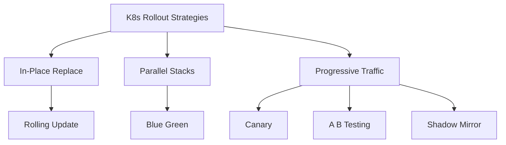
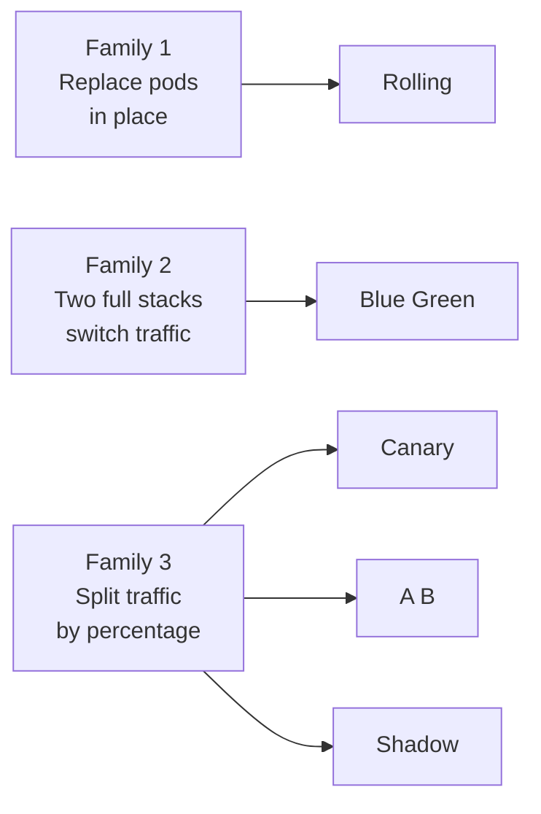

# Kubernetes Deployment Strategies — Mastery Pack

A consolidated learning kit for mastering Kubernetes rollout strategies — from
the simplest cookie-swap analogy to multi-cluster blue/green with mesh-driven
traffic splits and SLO-gated canaries.

> Audience: anyone from a curious 10-year-old to a principal architect designing
> regulated, multi-region rollouts.

---

## What is in this folder

| File | Purpose | Audience |
|------|---------|----------|
| `README.md` | You are here. Index + org chart. | Everyone |
| `architect-qa.md` | 40+ deep Q&A: SLO gates, blue/green at cluster scope, mesh vs ingress traffic split, rollback economics, regulated rollouts. | Architects, SREs, Platform leads |
| `eli10.md` | Strategies explained for a 10-year-old. Each strategy: analogy, real meaning, simple diagram, kubectl/argo steps. | Beginners, onboarding |
| `visual-flows.md` | 8 simple mermaid flowcharts of strategies in motion: pods replaced, services flipped, traffic shifted. | Visual learners, trainers |

---

## Strategy taxonomy (org chart)

---

## When to pick which (one-line decision guide)

| Need | Pick |
|------|------|
| Default for stateless services | Rolling |
| Zero-downtime + instant rollback for critical paths | Blue/Green |
| Risk-controlled progressive exposure with metrics | Canary |
| Behavioural experimentation (segment-based) | A/B |
| Validate new version under real traffic without serving users | Shadow |
| Regulated workloads (PCI, HIPAA, banking) | Blue/Green + Canary hybrid |
| Multi-region active-active | Cluster-level Blue/Green |

---

## Mental model: three families

---

## Tooling map

| Layer | Tools |
|-------|-------|
| Vanilla | `kubectl rollout`, Deployment.spec.strategy |
| GitOps | ArgoCD, Flux |
| Progressive Delivery | Argo Rollouts, Flagger |
| Traffic shaping | Istio, Linkerd, NGINX Ingress, Gateway API, AWS ALB |
| Analysis | Prometheus, Datadog, New Relic, Kayenta |
| Multi-cluster | Cluster API, Karmada, ArgoCD ApplicationSets |

---

## Reading order

1. Start with `eli10.md` — get the analogies in your head.
2. Skim `visual-flows.md` — see each strategy moving.
3. Deep-dive `architect-qa.md` — make production-grade decisions.

---

## Critical rules (top 10 from production scars)

1. Never canary without an SLI-based abort gate. Manual eyeballs do not scale.
2. Blue/green doubles cost during the cutover window — budget for it.
3. Database schemas must be backward-compatible across the rollout window.
4. Sticky sessions break canaries — design stateless or use session affinity at the edge.
5. Always test rollback in staging — most teams test only roll-forward.
6. Mesh-based traffic split is precise; ingress-based is coarse but simpler.
7. Multi-cluster blue/green needs global DNS or anycast, not just a Service.
8. Shadow traffic must NOT mutate downstream state — use a write-firewall.
9. Canary analysis windows under 5 minutes catch nothing useful.
10. Regulated rollouts require an audit trail per traffic-shift step.

---

## Cross-references

- Cluster manifests: `03-kubernetes/02-strategies/`
- ArgoCD app-of-apps reference: `apple-repos/`
- Mesh patterns: see `istio-traffic-management` skill

---

## Glossary (quick)

| Term | Meaning |
|------|---------|
| SLI | Service Level Indicator — what you measure |
| SLO | Service Level Objective — your target |
| Error budget | 1 - SLO; how much you can burn |
| Surge | Extra pods allowed above desired count during rolling |
| Unavailable | Pods allowed below desired count during rolling |
| Pre-promotion analysis | Argo Rollouts term for canary checks before full promote |
| Stable / Canary | Argo Rollouts naming for the two ReplicaSets |

---

## Next steps after reading

- Build a sample app with each strategy in `02-strategies/`
- Wire Prometheus + AnalysisTemplate (Argo Rollouts)
- Practice rollback drills in a sandbox cluster
- Document your org's chosen default in a platform ADR

---

## Maturity ladder

Where is your platform on the rollout-maturity ladder? Pick the row that
matches reality, then aim one row higher per quarter.

| Level | Practice | Tooling |
|-------|----------|---------|
| 0 | kubectl apply, hope | none |
| 1 | Rolling update with probes | vanilla Deployment |
| 2 | Manual canary via two Deployments | Ingress weighted annotations |
| 3 | Progressive delivery automated | Argo Rollouts or Flagger |
| 4 | SLO-gated rollouts with abort | Prometheus + AnalysisTemplate |
| 5 | Multi-cluster, audited, regulated | Argo + GLB + SLSA + audit log |

---

## Anti-patterns to retire

- "We do canary" but the canary is one pod with no metrics gate.
- Blue/green with shared database that breaks on rollback.
- Rolling update without `readinessProbe` — pods receive traffic before ready.
- Strategy chosen by tribal knowledge instead of workload class.
- No rollback drills; the team has never tested reverting in prod.
- Canary windows of 30 seconds — statistically meaningless.

---

## Suggested learning sprint (2 weeks)

| Day | Activity |
|-----|----------|
| 1 | Read `eli10.md`, sketch the analogies on a whiteboard |
| 2 | Read `visual-flows.md`, render diagrams in your wiki |
| 3-4 | Walk through `architect-qa.md` Sections 1-3 |
| 5 | Lab: rolling update with probes in a sandbox cluster |
| 6 | Lab: blue/green with Service selector flip |
| 7 | Read `architect-qa.md` Sections 4-6 |
| 8-9 | Lab: install Argo Rollouts, run a stepped canary |
| 10 | Lab: add Prometheus AnalysisTemplate to gate the canary |
| 11 | Read `architect-qa.md` Sections 7-8 |
| 12 | Lab: shadow traffic with Istio mirror |
| 13 | Lab: simulate a failed canary, observe auto-abort |
| 14 | Write your team's ADR on default rollout strategy |

---

## Where this fits in the broader platform

The strategies in this folder live in the `Strat` box. They consume from
GitOps and feed into observability. Without good observability upstream,
SLO-gated rollouts cannot work — wire Prometheus or equivalent first.

---

## Decision matrix (expanded)

| Workload trait | Rolling | Blue/Green | Canary | A/B | Shadow |
|----------------|---------|-----------|--------|-----|--------|
| Stateless web | yes | optional | yes | optional | rarely |
| Stateful database | no | careful | no | no | no |
| Long-lived connections | poor | yes | poor | poor | n/a |
| Cold-start heavy | poor | yes | medium | medium | yes |
| Regulated payments | no | yes | yes | careful | yes |
| Internal admin tool | yes | overkill | overkill | no | no |
| Pre-prod validation | n/a | n/a | n/a | n/a | yes |

---

## Common pitfalls cheat-sheet

| Pitfall | Symptom | Fix |
|---------|---------|-----|
| Probes mistuned | Pods marked ready before app starts | Add startupProbe, raise initialDelay |
| PDB too strict | Rollout stalls indefinitely | Loosen minAvailable to N-1 |
| HPA fights rollout | Replicas oscillate during deploy | Pause HPA during rollout via webhook |
| Sticky sessions | Canary metrics noisy | Use consistent-hash on user cookie |
| Schema break | v1 errors after v2 deploys | Two-phase migration with both columns |
| Mirror writes | Duplicate emails sent during shadow | Write firewall on shadow stack |

---

## Glossary expansion (architect terms)

| Term | Meaning |
|------|---------|
| Pre-promotion AnalysisRun | Argo Rollouts step that runs queries before promoting next step |
| Background AnalysisRun | Continuously checks SLIs throughout the rollout |
| TrafficRouting | Argo Rollouts integration with mesh / ingress for fine-grained split |
| ExperimentTemplate | Reusable definition for short-lived experiment ReplicaSets |
| AnalysisTemplate | Reusable metric query bundle (Prometheus, Datadog, Wavefront, web) |
| BlueGreen.previewService | Second Service exposing green for testing pre-flip |
| Burn rate | Rate at which error budget is being consumed |

---

End of index. Continue to `eli10.md` for the gentle entry, or jump to
`architect-qa.md` for the deep dive.
