# Deployment Strategies — Explained for a 10-Year-Old

Imagine you have a cookie shop. Every week you invent a new cookie recipe.
You need to swap the old cookies for new cookies — without making any kid
sad or sick. That is exactly what Kubernetes deployment strategies do.

Five ways to swap cookies = five deployment strategies.

---

## 1. Rolling — Swap one cookie at a time

### The analogy
You have 10 cookies on a tray. You pick up cookie number 1, throw it away,
put a new cookie in its place. Then cookie 2. Then cookie 3. Slowly slowly,
the whole tray becomes new cookies. Kids always see cookies on the tray —
nobody goes hungry.

### What it really means
Kubernetes runs many copies (pods) of your app. In a rolling update it
deletes one old pod, starts one new pod, waits until it is healthy, and
then moves on to the next. Users never see the app go down.

### Simple diagram

<!-- mermaid:rendered -->
<p align="center"></p>

<details><summary>Mermaid source</summary>

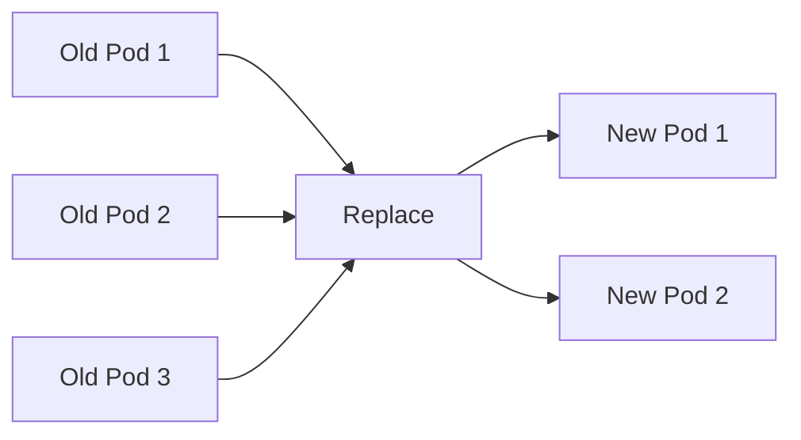

</details>

### How to do it
```bash
kubectl set image deployment/cookies cookies=cookies:v2
kubectl rollout status deployment/cookies
```

### When to use
- Your app is stateless (each pod is the same).
- You don't mind a small mix of old and new running together for a few minutes.
- Default for most web services.

### Watch out
- If new cookie is poison (broken), some kids already ate it before you noticed.
- Database changes must be backward compatible.

---

## 2. Blue-Green — Two identical kitchens, switch the door

### The analogy
You build a second kitchen (the green one) right next to your first
kitchen (the blue one). The green kitchen makes the new cookies. Once
you are sure the new cookies are tasty, you flip a sign on the door:
"Enter the green kitchen." Everyone goes to green. Blue stays ready in
case green burns down — you can flip the sign back instantly.

### What it really means
You run two complete copies of your app at the same time — old (blue) and
new (green). A Kubernetes Service (the door sign) points to one of them.
You change the Service selector to flip traffic.

### Simple diagram

<!-- mermaid:rendered -->
<p align="center"></p>

<details><summary>Mermaid source</summary>

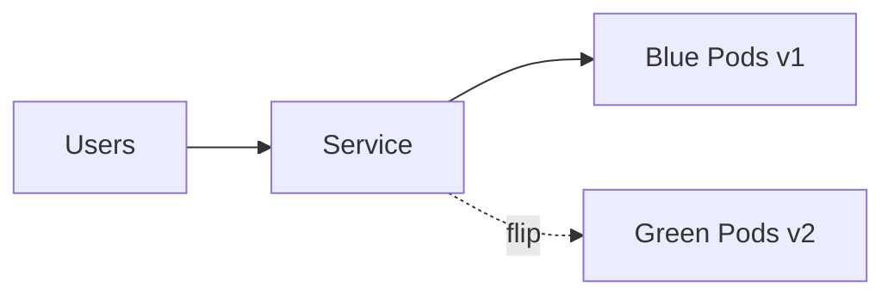

</details>

### How to do it
```bash
kubectl apply -f green-deployment.yaml
kubectl patch service cookies -p '{"spec":{"selector":{"version":"green"}}}'
```

With Argo Rollouts:
```bash
kubectl argo rollouts promote cookies-rollout
```

### When to use
- You need instant rollback (flip the door back).
- You can afford to run two full kitchens at once (costs double for a bit).
- Critical services where mixing versions is dangerous.

### Watch out
- Twice the infrastructure cost during the swap window.
- Database has to work for both blue and green at the same time.

---

## 3. Canary — Give 1 kid the new cookie first

### The analogy
You baked a brand new cookie. You don't trust it yet. So you give it to
ONE kid — the brave volunteer. If that kid smiles, you give it to 5 more
kids. Then 50. Then everyone. If the brave kid spits it out, you take the
new cookies away and nobody else has to try them.

### What it really means
You send a tiny percentage of real user traffic (1 percent) to the new
version. You measure: are users happy? Are errors low? Slowly increase to
10, 50, 100. If any step looks bad, abort and roll back.

### Simple diagram

<!-- mermaid:rendered -->
<p align="center"></p>

<details><summary>Mermaid source</summary>

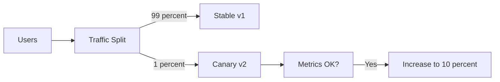

</details>

### How to do it (Argo Rollouts)
```bash
kubectl apply -f rollout.yaml   # has steps: 1 percent, 10 percent, 50, 100
kubectl argo rollouts get rollout cookies --watch
kubectl argo rollouts promote cookies   # to next step manually
kubectl argo rollouts abort cookies     # if bad
```

### When to use
- High-traffic production services.
- You want to catch bugs before they hit everyone.
- You have good metrics (Prometheus, Datadog).

### Watch out
- Need real measurement — eyeballs don't scale.
- Sticky sessions can mess up the split.

---

## 4. A/B — Different cookies for different kids

### The analogy
You bake two flavours: chocolate and vanilla. You give chocolate to kids
wearing red shirts, vanilla to kids wearing blue shirts. You measure
which group is happier, eats more cookies, comes back tomorrow. The
winning flavour becomes the new default.

### What it really means
You route users based on a rule (header, cookie, geography, user ID) to
different versions. This is for *experiments* — testing if version B
makes more money or has better engagement than version A. Not for safety,
for learning.

### Simple diagram

<!-- mermaid:rendered -->
<p align="center"></p>

<details><summary>Mermaid source</summary>

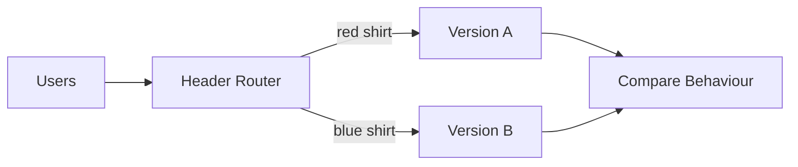

</details>

### How to do it (Istio)
```yaml
http:
  - match:
      - headers:
          shirt-color:
            exact: red
    route:
      - destination: { host: cookies, subset: choco }
  - route:
      - destination: { host: cookies, subset: vanilla }
```

### When to use
- You want to *learn* what works better.
- Product teams running experiments.
- Feature flagging with statistical significance.

### Watch out
- Need a real analytics pipeline to interpret results.
- Two versions must coexist with the same database for a long time.

---

## 5. Shadow — Make the cookie but don't serve it

### The analogy
The new cookie recipe is risky. So your kitchen bakes it — but instead
of giving it to kids, it puts it on a hidden shelf. You taste it
yourself, check if it cooked properly, see how long it took. The kids
keep eating the OLD cookies. They never know about the new ones. After
many tests you decide if the new recipe is safe to actually serve.

### What it really means
Production traffic is *mirrored* (copied) to the new version. The new
version processes it but its responses are thrown away — users get
responses from the old version. You watch the new version under real
load without risk to users.

### Simple diagram

<!-- mermaid:rendered -->
<p align="center"></p>

<details><summary>Mermaid source</summary>

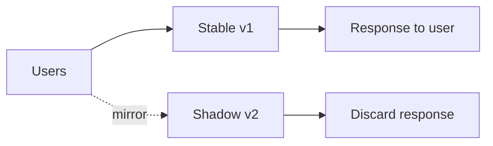

</details>

### How to do it (Istio)
```yaml
http:
  - route:
      - destination: { host: cookies, subset: stable }
        weight: 100
    mirror:
      host: cookies
      subset: shadow
    mirrorPercentage:
      value: 100.0
```

### When to use
- New version has performance unknowns.
- You want to test under real production load before any user impact.
- Migration from legacy systems.

### Watch out
- Shadow must NOT write to databases (use a write firewall).
- Costs CPU and memory to run shadow stack.
- External API calls from shadow can double-charge or send duplicate emails.

---

## Quick comparison table

| Strategy | Risk | Cost | Speed | Rollback | Best for |
|----------|------|------|-------|----------|----------|
| Rolling | Medium | 1x | Medium | Slow | Default web apps |
| Blue/Green | Low | 2x | Fast flip | Instant | Critical services |
| Canary | Very Low | 1.1x | Slow | Easy | High-traffic prod |
| A/B | Low | 2x | Slow | Easy | Experiments |
| Shadow | Zero | 2x | N/A | N/A | Pre-prod validation |

---

## One more analogy to tie it together

<!-- mermaid:rendered -->
<p align="center"></p>

<details><summary>Mermaid source</summary>

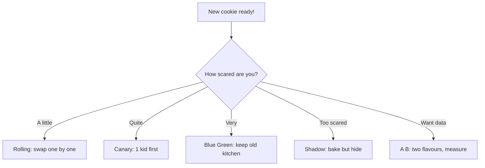

</details>

---

## Kid-test understanding

If you can explain it back like this, you got it:
- Rolling = "Replace the team one player at a time."
- Blue/Green = "Two teams; switch which one plays."
- Canary = "Try the new player in one game, watch the score."
- A/B = "Two teams play different games; see who wins more."
- Shadow = "New player practices but doesn't play in the real match."

---

End. Read `visual-flows.md` next for the moving pictures.
