# Visual Flows — 8 Mermaid Diagrams of Strategies in Motion

Each diagram shows a strategy at a specific moment of the rollout: pods
being replaced, services flipping, traffic shifting. Read top to bottom —
each diagram is a "snapshot" of one phase.

---

## Flow 1 — Rolling Update: pod-by-pod replacement

A 4-pod Deployment swapping v1 to v2 with maxSurge 1, maxUnavailable 0.

<!-- mermaid:rendered -->

Mermaid source

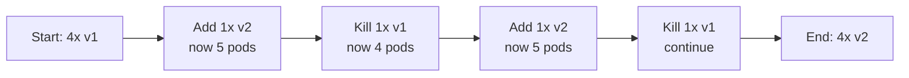

**What is moving:** ReplicaSet count. Old RS scales down, new RS scales up,
in lockstep, controlled by surge / unavailable settings.

---

## Flow 2 — Blue/Green: Service selector flip

Two ReplicaSets exist simultaneously. The Service points to one at a time.

<!-- mermaid:rendered -->


Mermaid source

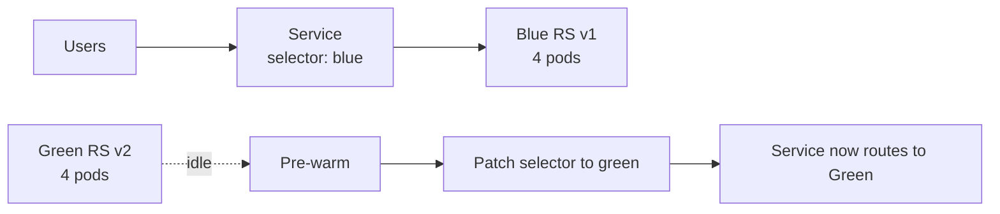

**What is moving:** A label-selector edit on the Service. Pod count stays
constant; only the routing flips. Rollback = flip the label back.

---

## Flow 3 — Canary: progressive traffic shift

Argo Rollouts moving traffic 0 -> 10 -> 50 -> 100.

<!-- mermaid:rendered -->

Mermaid source

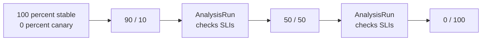

**What is moving:** Weights in the TrafficRouting resource (Istio
VirtualService, SMI TrafficSplit, or NGINX canary annotation). Pods stay
running on both sides until promotion completes.

---

## Flow 4 — Shadow / Mirror: traffic copied, responses discarded

Real users hit stable. A copy of each request goes to shadow.

<!-- mermaid:rendered -->


Mermaid source

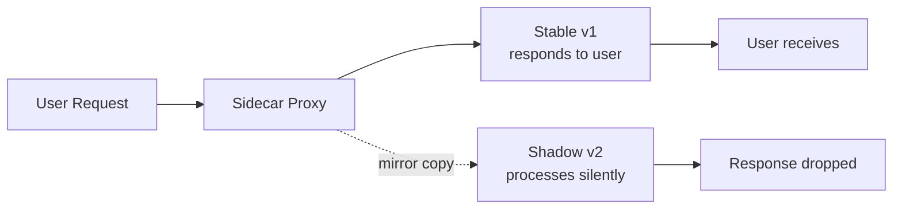

**What is moving:** A `mirror` directive in the VirtualService. The proxy
duplicates the request; only the original path returns to the user.

---

## Flow 5 — A/B Testing: header-based routing

Routes are decided per-request based on a header value.

<!-- mermaid:rendered -->


Mermaid source

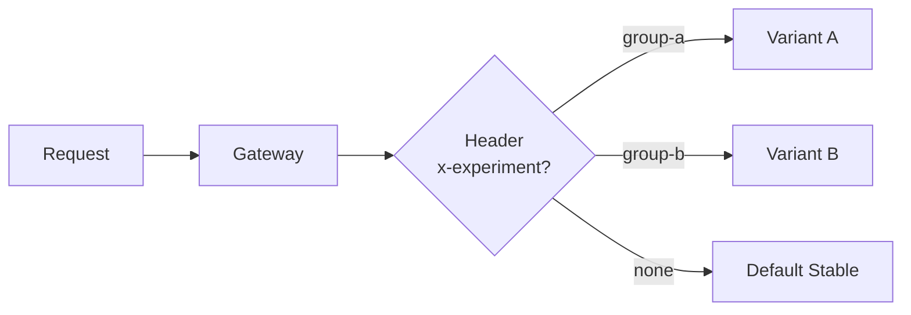

**What is moving:** Nothing on the cluster after setup. The router
evaluates each request and picks a destination subset based on rules.
Experiments are observed via downstream analytics.

---

## Flow 6 — Multi-cluster Blue/Green: global LB flip

Two full clusters. A global load balancer steers traffic.

<!-- mermaid:rendered -->


Mermaid source

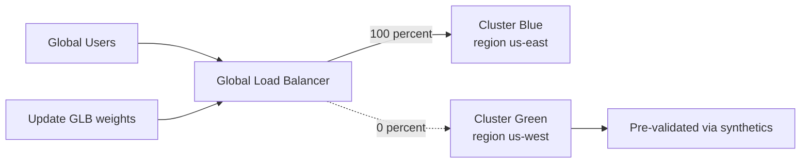

**What is moving:** GLB backend weights (or weighted DNS records). A single
config change at the edge swings all global traffic between clusters.

---

## Flow 7 — Canary with SLO gate (auto-abort path)

Argo Rollouts AnalysisRun fails — rollout reverses.

<!-- mermaid:rendered -->


Mermaid source

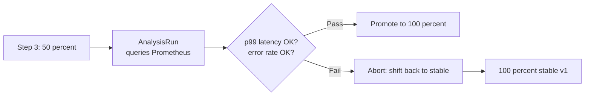

**What is moving:** The AnalysisRun executes metric queries. On failure,
Argo flips traffic back to stable and scales the canary RS down. On
success, it advances to the next step in the strategy spec.

---

## Flow 8 — Rolling Update with PDB and HPA interactions

Real-world rolling: probes, PDB, and HPA all engage simultaneously.

<!-- mermaid:rendered -->


Mermaid source

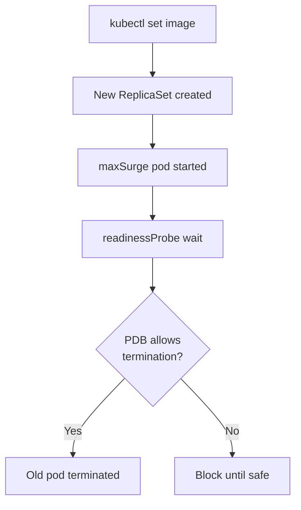

**What is moving:** ReplicaSet controller, kubelet probes, PDB controller,
and optionally HPA all coordinate. The PDB acts as a brake — if too few
pods would remain ready, the rollout pauses until availability returns.

---

## Bonus: lifecycle of a single pod during rolling update

<!-- mermaid:rendered -->

Mermaid source

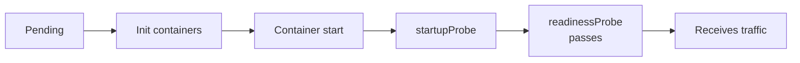

**What is moving:** Pod phase transitions. A new pod is "Ready" only after
all probes pass; only then does the Service endpoint controller add it to
the active pool. Old pods enter `Terminating` phase, drained via
preStop hook + terminationGracePeriodSeconds.

---

## Flow comparison: traffic shape over time

<!-- mermaid:rendered -->


Mermaid source

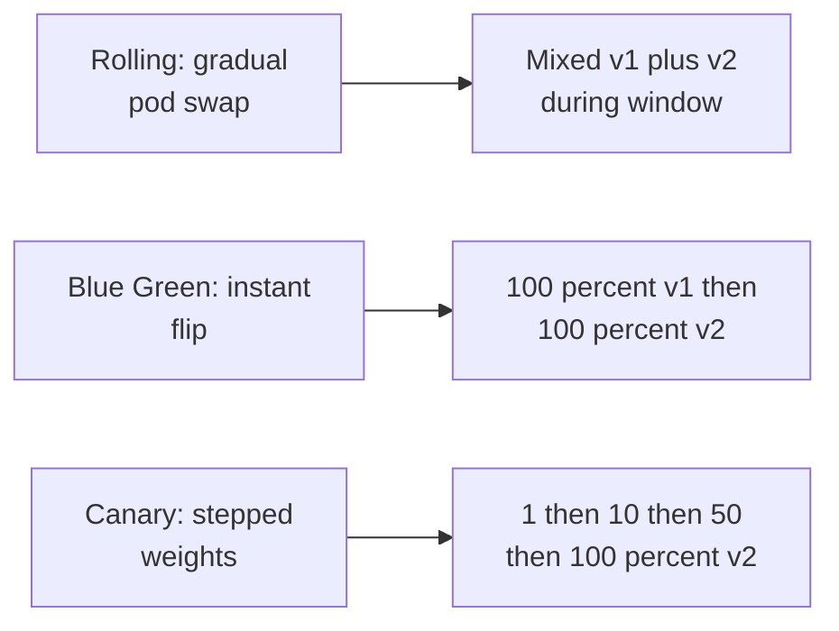

---

## Reading the diagrams

- Solid arrow = active traffic or state transition.
- Dotted arrow = mirror, idle, or alternate path.
- Diamond = decision gate (probe, analysis, PDB).
- Rectangle = pod, RS, Service, or controller action.

---

## How to extend these for your team

1. Replace generic labels with your service names.
2. Add observability hooks (Prometheus targets, Datadog tags).
3. Annotate each transition with the kubectl / argo command that triggers it.
4. Render in Backstage or your wiki for onboarding.

---

## Cross-references

- For the "why" behind each flow: see `architect-qa.md`.
- For analogies: see `eli10.md`.
- For real manifests: see `02-strategies/` examples folder.

---

## Flow 9 — Argo Rollouts BlueGreen with preview Service

A second Service (the preview Service) lets you test green before flipping
the active Service.

<!-- mermaid:rendered -->


Mermaid source

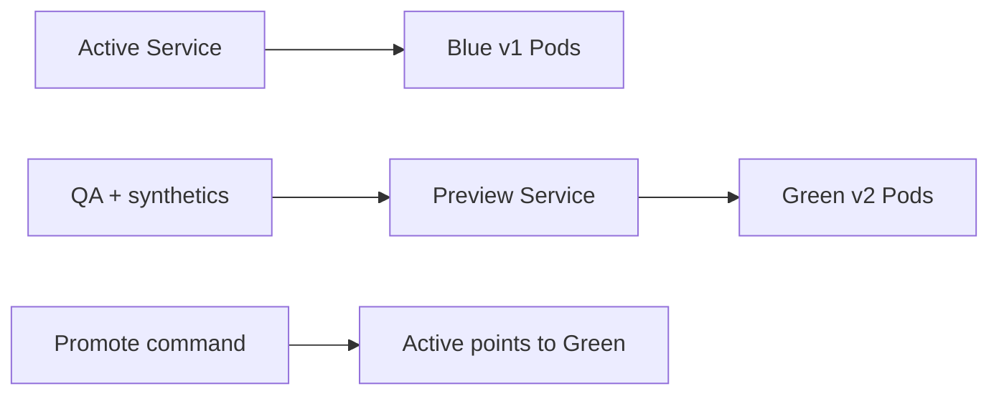

**What is moving:** Two Services with different selectors. The Rollout
controller swaps both selectors when promoted. The preview Service is the
secret weapon — full smoke testing on green before any user is touched.

---

## Flow 10 — Flagger canary with automatic rollback

Flagger watches metrics each interval and auto-aborts on breach.

<!-- mermaid:rendered -->


Mermaid source

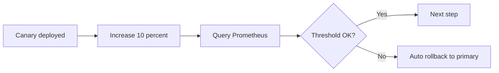

---

## Flow 11 — Database-backward-compat dance

The danger zone — schema must serve both versions during the rollout.

<!-- mermaid:rendered -->


Mermaid source

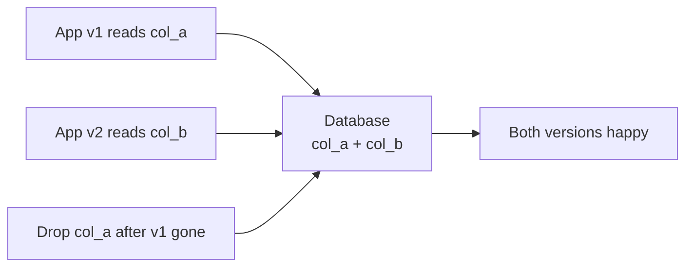

**What is moving:** Two-phase migration. Add new column, deploy code that
writes both, deploy code that reads new, then drop old. Never combine
schema change with code change in one rollout.

---

## Flow 12 — Argo Rollouts experiment (sidecar canary for analysis)

An Experiment runs a temporary canary purely for measurement, separate
from the user-facing rollout.

<!-- mermaid:rendered -->


Mermaid source

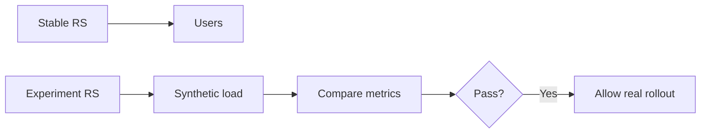

---

## Reading-the-code map

When you open a Rollout manifest, here is which YAML field maps to which
visual element above:

| YAML field | Visual element |
|------------|----------------|
| `strategy.canary.steps` | Flow 3 traffic shift |
| `strategy.canary.analysis` | Flow 7 SLO gate |
| `strategy.blueGreen.activeService` | Flow 2 active arrow |
| `strategy.blueGreen.previewService` | Flow 9 preview arrow |
| `trafficRouting.istio.virtualService` | Flow 4 mirror, Flow 5 header match |

---

End of visual flows.
