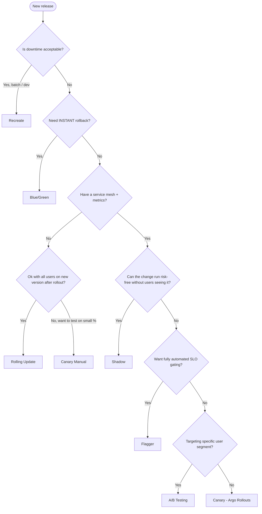

# Deployment Strategy Decision Matrix

Pick the strategy that matches your **risk tolerance**, **infra maturity** and **rollback speed** requirement.

## Full comparison

| Strategy | Downtime | User Risk | Rollback Speed | Resource Cost | Complexity | Infra Required | Best Use Case |
|----------|----------|-----------|----------------|---------------|------------|----------------|---------------|
| Recreate | Yes (seconds–minutes) | High during outage | Re-deploy old image | 1x | Trivial | None | Dev, batch jobs, schema migrations that forbid two versions |
| Rolling Update | None | Low–Medium (some users hit new version immediately) | Re-deploy old image (slow) | ~1.1x (maxSurge) | Trivial | None | Default for stateless web apps |
| Blue / Green | None | Low (flip is atomic) | Instant (re-flip selector) | 2x during cutover | Medium | LoadBalancer / Service | Apps needing instant rollback, financial systems |
| Canary (manual) | None | Medium (1–10% see new) | Scale canary to 0 | 1.05x–1.1x | Medium | None | When you have monitoring but no progressive-delivery tooling |
| Canary (Argo Rollouts) | None | Low (auto-paused on bad metrics) | Automatic abort | ~1.1x | High | Argo Rollouts + metrics provider | Production rollouts with measurable SLIs |
| A/B Testing | None | Low (segmented users) | Drop route rule | ~1.1x | High | Istio / Argo Rollouts | Feature experiments, beta cohorts |
| Shadow | None | Zero (no user response) | Stop mirroring | 2x for shadowed paths | High | Service mesh (Istio/Linkerd) | Validating perf, dark-launching dangerous changes |
| Progressive Delivery (Flagger) | None | Very Low (SLO-gated) | Automatic, fast | ~1.1x | Very High | Flagger + Mesh/Ingress + Prometheus | Mature platforms, fully automated CD |

## Decision tree

<!-- mermaid:rendered -->

Mermaid source

## Cheat sheet

- **You just want it deployed:** Rolling Update.
- **You can't afford 5 seconds of inconsistency:** Blue/Green.
- **Your release broke prod last quarter:** Canary (manual or Argo).
- **You're scared of the new caching code:** Shadow.
- **Marketing wants beta users to test:** A/B Testing.
- **You have SLOs and want to sleep at night:** Flagger.
- **Your DB migration breaks v1:** Recreate (planned downtime window).
