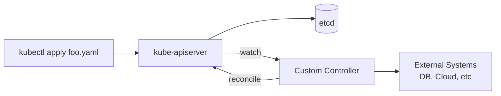

# 01 — CRDs and Operators

CustomResourceDefinitions extend the Kubernetes API with new object kinds. An **operator** is a CRD plus a controller that reconciles the desired state.

<!-- mermaid:rendered -->
<p align="center"></p>

<details><summary>Mermaid source</summary>



</details>
## Quick reference

=== ":material-lightbulb-outline: Concept"
    A CRD adds a new resource kind to the Kubernetes API. An operator pairs that CRD with a controller that watches instances and reconciles desired state — usually managing complex stateful apps (DBs, queues) the way a human SRE would.

=== ":material-file-code-outline: Manifest"
    ```yaml
    apiVersion: apiextensions.k8s.io/v1
    kind: CustomResourceDefinition
    metadata:
      name: foos.example.com
    spec:
      group: example.com
      scope: Namespaced
      names:
        plural: foos
        singular: foo
        kind: Foo
        shortNames: [fo]
      versions:
        - name: v1
          served: true
          storage: true
          schema:
            openAPIV3Schema:
              type: object
              properties:
                spec:
                  type: object
                  required: [size, image]
                  properties:
                    size:  { type: integer, minimum: 1, maximum: 10 }
                    image: { type: string }
                status:
                  type: object
                  properties:
                    phase: { type: string, enum: [Pending, Running, Failed] }
          subresources:
            status: {}
            scale:
              specReplicasPath: .spec.size
              statusReplicasPath: .status.readyReplicas
    ```

=== ":material-console: kubectl"
    ```bash
    kubectl apply -f example-crd.yaml
    kubectl get crd foos.example.com
    kubectl explain foo.spec
    kubectl get foo
    kubectl scale foo my-foo --replicas=5    # uses the scale subresource
    ```

=== ":material-text-box-outline: Expected output"
    ```text
    customresourcedefinition.apiextensions.k8s.io/foos.example.com created
    foo.example.com/my-foo created
    NAME     SIZE   PHASE     AGE
    my-foo   3      Running   12s
    ```

## CRD anatomy
- `group` + `version` + `kind` + `plural` define the API surface.
- `schema.openAPIV3Schema` validates the spec.
- `subresources.status` separates spec from status.
- `additionalPrinterColumns` controls `kubectl get` columns.

## Controller pattern
1. **Watch** resources via informers (cached, event-driven).
2. **Enqueue** keys on add/update/delete.
3. **Reconcile**: read desired (spec), read actual (cluster + external), diff, act.
4. Reconciliation must be **idempotent** — it will run many times.

See [controller-pattern.md](controller-pattern.md).

## Operator pattern
An operator encodes operational knowledge (backup, failover, upgrade) for a specific app (Postgres, Kafka, Elasticsearch).

| Aspect | Kubebuilder | Operator SDK |
|--------|-------------|--------------|
| Language | Go (primary) | Go, Ansible, Helm |
| Project layout | controller-runtime | controller-runtime + scaffolding |
| Maturer | upstream SIG | RedHat-led, builds on Kubebuilder |
| OLM integration | manual | first-class |

Pick **Kubebuilder** if you want a thin Go-only operator. Pick **Operator SDK** if you want OLM bundles, Helm-based operators, or multi-language support.

## Files
- [example-crd.yaml](example-crd.yaml)
- [controller-pattern.md](controller-pattern.md)
