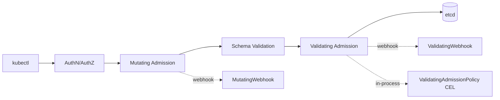

# 02 — Admission Controllers

Admission controllers intercept API requests **after authentication/authorization** but **before persistence**. They can mutate or validate.

<!-- mermaid:rendered -->
<p align="center"></p>

<details><summary>Mermaid source</summary>



</details>
## Quick reference

=== ":material-lightbulb-outline: Concept"
    Admission controllers run inside the API server flow after authn/authz, before persistence. Mutating webhooks patch objects (defaults, sidecars); validating webhooks and CEL `ValidatingAdmissionPolicy` accept or reject. Kyverno and OPA Gatekeeper are the dominant policy engines.

=== ":material-file-code-outline: Manifest"
    ```yaml
    apiVersion: kyverno.io/v1
    kind: ClusterPolicy
    metadata:
      name: require-labels
    spec:
      validationFailureAction: Enforce
      background: true
      rules:
        - name: check-required-labels
          match:
            any:
              - resources:
                  kinds: [Pod, Deployment, StatefulSet]
          validate:
            message: "Labels 'app.kubernetes.io/name' and 'owner' are required."
            pattern:
              metadata:
                labels:
                  app.kubernetes.io/name: "?*"
                  owner: "?*"
    ```

=== ":material-console: kubectl"
    ```bash
    kubectl apply -f kyverno-policy.yaml
    kubectl get clusterpolicy require-labels
    # try a non-compliant pod
    kubectl run test --image=nginx --dry-run=server -o yaml
    ```

=== ":material-text-box-outline: Expected output"
    ```text
    clusterpolicy.kyverno.io/require-labels created
    Error from server: admission webhook "validate.kyverno.svc-fail" denied the request:

    resource Pod/default/test was blocked due to the following policies:

    require-labels:
      check-required-labels: 'validation error: Labels ''app.kubernetes.io/name''
        and ''owner'' are required. rule check-required-labels failed at path /metadata/labels/'
    ```

## Three flavors

| Type | Where it runs | Use |
|------|---------------|-----|
| Built-in (compiled) | inside kube-apiserver | NamespaceLifecycle, ResourceQuota, PodSecurity, etc |
| Webhook (Mutating/Validating) | external HTTPS service | Custom logic in any language |
| ValidatingAdmissionPolicy (CEL) | inside kube-apiserver, GA in 1.30 | Declarative validation, no webhook to operate |

## Mutating vs Validating
- Mutating runs first, can patch the object (defaults, sidecar injection).
- Validating runs after schema check, can only accept/reject.
- All mutating webhooks must be idempotent and run before all validating ones.

## Policy engines
| Engine | Language | Scope |
|--------|----------|-------|
| OPA Gatekeeper | Rego (ConstraintTemplate + Constraint) | Validation, audit |
| Kyverno | YAML-native policies | Validate / Mutate / Generate / VerifyImages |
| jsPolicy | JavaScript | Validate / Mutate |

For most teams Kyverno is the lowest-friction choice. Use Gatekeeper if you already have Rego skills or need OPA elsewhere.

## Files
- [kyverno-policy.yaml](kyverno-policy.yaml)
- [opa-constraint.yaml](opa-constraint.yaml)
