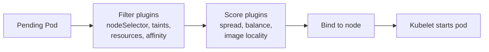

# 03 — Scheduling

The kube-scheduler picks a node for each unscheduled pod via filter (predicates) and score (priorities) plugins.

<!-- mermaid:rendered -->

Mermaid source

<!-- mermaid:rendered -->

Mermaid source

<!-- mermaid:rendered -->

Mermaid source

## Knobs

| Mechanism | Use |
|-----------|-----|
| `nodeSelector` | Hard match on node labels (simple) |
| `nodeAffinity` | Required (hard) or preferred (soft) expressions |
| `podAffinity` / `podAntiAffinity` | Co-locate or spread relative to other pods |
| `taints` + `tolerations` | Repel pods from nodes unless they tolerate |
| `topologySpreadConstraints` | Even spread across zones / nodes |
| `priorityClass` + preemption | Critical pods evict lower-priority ones |
| `descheduler` | Periodic rebalancing of already-running pods |

## Topology spread vs anti-affinity
- Anti-affinity is **per-pod**; cost grows O(N^2) at scale.
- Topology spread is **declarative balance** (`maxSkew`); cheaper for large fleets.

## Priority and preemption
- A `PriorityClass` with high `value` lets the scheduler preempt lower-priority pods to make room.
- `system-cluster-critical` and `system-node-critical` are reserved for control-plane components.

## Descheduler
Runs as a Job/CronJob, evicts pods that violate policies (low utilization, duplicate replicas on a node, topology violations) so they get rescheduled.

## Files
- [affinity.yaml](affinity.yaml)
- [tolerations.yaml](tolerations.yaml)
- [topology-spread.yaml](topology-spread.yaml)
