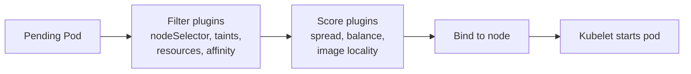

# 03 — Scheduling

The kube-scheduler picks a node for each unscheduled pod via filter (predicates) and score (priorities) plugins.

<!-- mermaid:rendered -->
<p align="center"></p>

<details><summary>Mermaid source</summary>



</details>
## Quick reference

=== ":material-lightbulb-outline: Concept"
    The kube-scheduler filters nodes (predicates) then scores them (priorities). Workloads steer placement with `nodeSelector`, affinity, taints/tolerations, and `topologySpreadConstraints`. Spread is the cheap way to keep replicas balanced across zones.

=== ":material-file-code-outline: Manifest"
    ```yaml
    apiVersion: apps/v1
    kind: Deployment
    metadata:
      name: web
    spec:
      replicas: 6
      selector:
        matchLabels: { app: web }
      template:
        metadata:
          labels: { app: web }
        spec:
          topologySpreadConstraints:
            - maxSkew: 1
              topologyKey: topology.kubernetes.io/zone
              whenUnsatisfiable: DoNotSchedule
              labelSelector:
                matchLabels: { app: web }
            - maxSkew: 1
              topologyKey: kubernetes.io/hostname
              whenUnsatisfiable: ScheduleAnyway
              labelSelector:
                matchLabels: { app: web }
          containers:
            - name: nginx
              image: nginx:1.27
    ```

=== ":material-console: kubectl"
    ```bash
    kubectl apply -f topology-spread.yaml
    kubectl get pods -l app=web -o wide
    kubectl get pods -l app=web \
      -o custom-columns=POD:.metadata.name,NODE:.spec.nodeName,ZONE:.metadata.labels.topology\\.kubernetes\\.io/zone
    ```

=== ":material-text-box-outline: Expected output"
    ```text
    NAME                   READY   STATUS    NODE                ZONE
    web-7b9f-aaaaa         1/1     Running   ip-10-0-1-10        us-east-1a
    web-7b9f-bbbbb         1/1     Running   ip-10-0-2-20        us-east-1b
    web-7b9f-ccccc         1/1     Running   ip-10-0-3-30        us-east-1c
    web-7b9f-ddddd         1/1     Running   ip-10-0-1-11        us-east-1a
    web-7b9f-eeeee         1/1     Running   ip-10-0-2-21        us-east-1b
    web-7b9f-fffff         1/1     Running   ip-10-0-3-31        us-east-1c
    ```

## Knobs

| Mechanism | Use |
|-----------|-----|
| `nodeSelector` | Hard match on node labels (simple) |
| `nodeAffinity` | Required (hard) or preferred (soft) expressions |
| `podAffinity` / `podAntiAffinity` | Co-locate or spread relative to other pods |
| `taints` + `tolerations` | Repel pods from nodes unless they tolerate |
| `topologySpreadConstraints` | Even spread across zones / nodes |
| `priorityClass` + preemption | Critical pods evict lower-priority ones |
| `descheduler` | Periodic rebalancing of already-running pods |

## Topology spread vs anti-affinity
- Anti-affinity is **per-pod**; cost grows O(N^2) at scale.
- Topology spread is **declarative balance** (`maxSkew`); cheaper for large fleets.

## Priority and preemption
- A `PriorityClass` with high `value` lets the scheduler preempt lower-priority pods to make room.
- `system-cluster-critical` and `system-node-critical` are reserved for control-plane components.

## Descheduler
Runs as a Job/CronJob, evicts pods that violate policies (low utilization, duplicate replicas on a node, topology violations) so they get rescheduled.

## Files
- [affinity.yaml](affinity.yaml)
- [tolerations.yaml](tolerations.yaml)
- [topology-spread.yaml](topology-spread.yaml)
