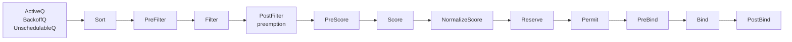
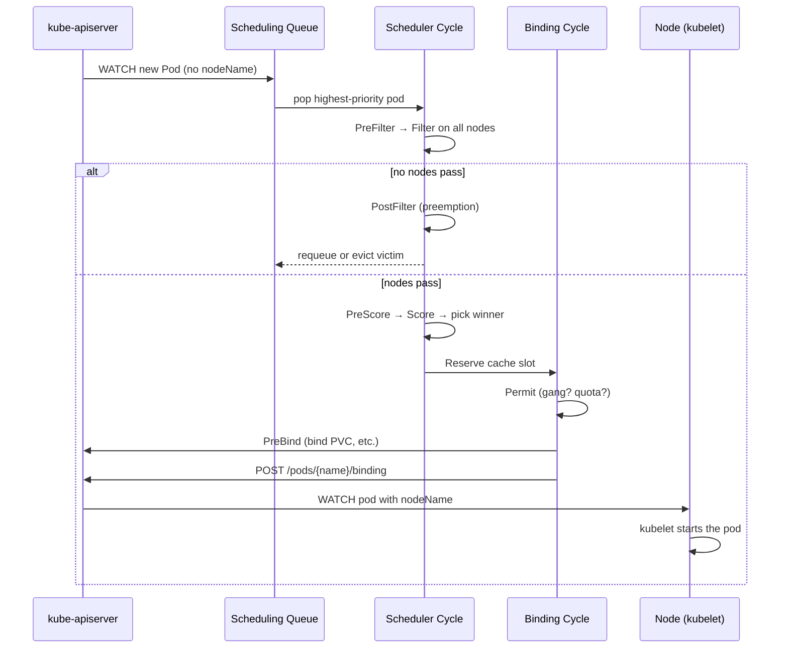

# Deep Dive: Scheduler Framework

## Why this matters

The kube-scheduler decides where every Pod runs. In a non-trivial cluster — multi-tenant, GPU, spot/on-demand mixes, topology-aware workloads — the default scheduler is rarely enough. You need to know:

- the **two-phase pipeline** (filter → score) and the 12 extension points around it,
- how to configure **profiles** so different workloads use different policies,
- when to write an **out-of-tree plugin** vs. a second scheduler instance vs. a webhook,
- and what changed since 1.30: PodSchedulingReadiness GA, in-place pod resize beta, dynamic resource allocation (DRA) GA in 1.34.

The "predicates → priorities" terminology is **legacy** (pre-1.19). Modern Kubernetes uses the **Scheduling Framework**.

---

## Mental Model

> The scheduler is a **single-threaded loop** that pops one pod at a time off the active queue, runs it through a fixed sequence of **extension points** wired with **plugins**, and writes a `Binding` back to the apiserver. It is stateless; all state lives in the cache rebuilt from API watches.

Two phases:

1. **Scheduling cycle** (synchronous, one pod at a time)
   - filter out infeasible nodes
   - score the survivors
   - pick the winner
2. **Binding cycle** (asynchronous, can overlap pods)
   - reserve, permit, bind
   - write `Pod.spec.nodeName` via Binding subresource

---

## Diagram 1 — The Scheduling Framework extension points



| Extension point | Purpose | Built-in example |
|---|---|---|
| `QueueSort` | order the queue (only one allowed) | `PrioritySort` |
| `PreFilter` | per-pod precompute, may declare infeasibility | `InterPodAffinity` |
| `Filter` | drop nodes (= old "predicates") | `NodeAffinity`, `TaintToleration`, `NodeResourcesFit` |
| `PostFilter` | runs only if no node passed Filter; preemption lives here | `DefaultPreemption` |
| `PreScore` | per-pod precompute for scoring | `TopologySpread` |
| `Score` | rank surviving nodes 0–100 (= old "priorities") | `NodeResourcesBalancedAllocation`, `ImageLocality` |
| `NormalizeScore` | rescale a plugin's scores | — |
| `Reserve` | mark resources as taken in cache (revertible) | `VolumeBinding` |
| `Permit` | approve / deny / wait (custom approvals like gang-scheduling) | — |
| `PreBind` | prep work before binding (e.g., bind PVC) | `VolumeBinding` |
| `Bind` | write the Binding object | `DefaultBinder` |
| `PostBind` | cleanup / metrics | — |

---

## Diagram 2 — Lifecycle of a single pod



---

## Profiles: multiple schedulers in one binary

Since 1.19, a single kube-scheduler binary can serve **multiple profiles** under the same process. A pod selects one with `spec.schedulerName`.

```yaml
apiVersion: kubescheduler.config.k8s.io/v1
kind: KubeSchedulerConfiguration
profiles:
  - schedulerName: default-scheduler
    plugins:
      score:
        enabled:
          - name: NodeResourcesBalancedAllocation
            weight: 1
        disabled:
          - name: ImageLocality

  - schedulerName: gpu-scheduler        # workloads opt in via spec.schedulerName
    plugins:
      filter:
        enabled:
          - name: MyGPUTopologyFilter   # out-of-tree plugin
      score:
        enabled:
          - name: MyGPUBinPack
            weight: 5
    pluginConfig:
      - name: MyGPUTopologyFilter
        args:
          requireNVLink: true
```

Why profiles beat running two scheduler binaries: shared cache, no split-brain over node state, single leader election.

---

## Walkthrough: writing an out-of-tree plugin (Go, 1.30+)

```go
package mybinpack

import (
    "context"
    v1 "k8s.io/api/core/v1"
    "k8s.io/apimachinery/pkg/runtime"
    "k8s.io/kubernetes/pkg/scheduler/framework"
)

type MyBinPack struct {
    handle framework.Handle
}

// implement two interfaces: ScorePlugin and ScoreExtensions
var _ framework.ScorePlugin = &MyBinPack{}

const Name = "MyBinPack"

func (m *MyBinPack) Name() string { return Name }

// Score: prefer the most-loaded feasible node (bin packing).
func (m *MyBinPack) Score(ctx context.Context, state *framework.CycleState,
    pod *v1.Pod, nodeName string) (int64, *framework.Status) {

    nodeInfo, err := m.handle.SnapshotSharedLister().NodeInfos().Get(nodeName)
    if err != nil {
        return 0, framework.AsStatus(err)
    }
    used := nodeInfo.Requested.MilliCPU
    cap  := nodeInfo.Allocatable.MilliCPU
    if cap == 0 { return 0, nil }
    return (used * 100) / cap, nil   // 0..100
}

func (m *MyBinPack) ScoreExtensions() framework.ScoreExtensions { return nil }

// Factory registered in main.go via app.NewSchedulerCommand(WithPlugin(...))
func New(_ context.Context, _ runtime.Object, h framework.Handle) (framework.Plugin, error) {
    return &MyBinPack{handle: h}, nil
}
```

Then in `KubeSchedulerConfiguration`:

```yaml
profiles:
  - schedulerName: binpack-scheduler
    plugins:
      score:
        enabled:
          - {name: MyBinPack, weight: 10}
```

Build the scheduler binary that imports your plugin and ship it as the kube-scheduler image.

---

## Notable recent changes (1.30+)

- **PodSchedulingReadiness** (GA 1.30): `spec.schedulingGates` lets a controller hold a pod out of the queue (e.g., wait for capacity provisioner). No more "create then immediately fail".
- **MinDomains for TopologySpreadConstraints** (GA 1.30).
- **In-place pod vertical scaling** (beta 1.33): updating `resources.requests` triggers re-evaluation, not eviction.
- **Dynamic Resource Allocation (DRA)** (GA 1.34): `ResourceClaim` API replaces device plugins for GPUs / FPGAs / specialized hardware, fully integrated with the scheduler.
- **Scheduler queueing hints** (beta 1.30): plugins can tell the queue "this event might unblock my pod" → fewer wasted requeues.

---

## Interview Q&A

**Q1. How does the scheduler decide where a pod goes?**
Two phases: filter (drop infeasible nodes via plugins like NodeAffinity, TaintToleration, NodeResourcesFit), then score (rank survivors 0–100 via plugins like NodeResourcesBalancedAllocation, ImageLocality, TopologySpread). Highest score wins. Tied scores → random pick.

**Q2. What's the difference between predicates/priorities and the Scheduling Framework?**
Pre-1.19 had hard-coded predicate and priority lists with limited extension via `Extender` HTTP webhooks (slow). The Scheduling Framework (1.19 GA) replaced this with 12 in-process extension points and a typed Go plugin interface — same behaviour, but composable and faster.

**Q3. How do I run multiple schedulers?**
Easiest: define multiple `profiles` in one KubeSchedulerConfiguration and have pods opt in via `spec.schedulerName`. Hardest: deploy a second kube-scheduler with a different `--leader-elect-resource-name` — but this risks racing on the cache.

**Q4. What is preemption, and where in the framework does it live?**
When no node passes the Filter phase, `PostFilter` runs. The default `DefaultPreemption` plugin finds lower-priority victim pods that, if evicted, would let the new pod fit. Victims are deleted with grace; the pending pod waits for the next cycle.

**Q5. How do nodeSelector, nodeAffinity, taints/tolerations, and topologySpreadConstraints differ?**
nodeSelector: simple `=` match on labels. nodeAffinity: richer expressions (In/NotIn/Exists), supports `preferred` (soft). Taints+tolerations: NODE-side opt-out — only tolerating pods may land. TopologySpreadConstraints: distribute replicas across zones/racks/nodes for HA.

**Q6. What is `spec.schedulingGates` (1.30 GA) and why is it useful?**
A list of string gates the pod waits on before entering the queue. The scheduler ignores gated pods entirely. A controller (e.g., capacity provisioner, batch admission) removes a gate when conditions are met. Replaces the old anti-pattern of creating doomed pods that thrash the queue.

**Q7. When would you write a plugin vs. an Extender vs. a mutating webhook?**
Plugin: full power, in-process, lowest latency, must build/ship custom kube-scheduler. Extender: HTTP webhook called during Filter/Score — slow, deprecated, avoid. Mutating webhook: doesn't change scheduling logic, only mutates the pod spec (e.g., inject nodeSelector) — best when you can express your intent declaratively.

**Q8. The scheduler is binding pods slowly. What do you check?**
`scheduler_scheduling_attempt_duration_seconds` histogram, `scheduler_pending_pods` gauge. Common causes: too many pending pods (queue starvation by priority), PreemptionPolicy thrashing, slow PreBind (PVC binding), apiserver latency on Bind, custom plugin doing IO in Filter (cardinal sin — Filter runs N times per pod).

---

## Sources

- [Kubernetes Scheduler](https://kubernetes.io/docs/concepts/scheduling-eviction/kube-scheduler/)
- [Scheduling Framework](https://kubernetes.io/docs/concepts/scheduling-eviction/scheduling-framework/)
- [Scheduler Configuration](https://kubernetes.io/docs/reference/scheduling/config/)
- [Pod Scheduling Readiness](https://kubernetes.io/docs/concepts/scheduling-eviction/pod-scheduling-readiness/) (GA 1.30)
- [Topology Spread Constraints](https://kubernetes.io/docs/concepts/scheduling-eviction/topology-spread-constraints/)
- [Dynamic Resource Allocation](https://kubernetes.io/docs/concepts/scheduling-eviction/dynamic-resource-allocation/) (GA 1.34)
- [KEP-624: Scheduling Framework](https://github.com/kubernetes/enhancements/tree/master/keps/sig-scheduling/624-scheduling-framework)
- [scheduler-plugins repo](https://github.com/kubernetes-sigs/scheduler-plugins) — reference out-of-tree plugins
- [SIG Scheduling](https://github.com/kubernetes/community/tree/master/sig-scheduling)
