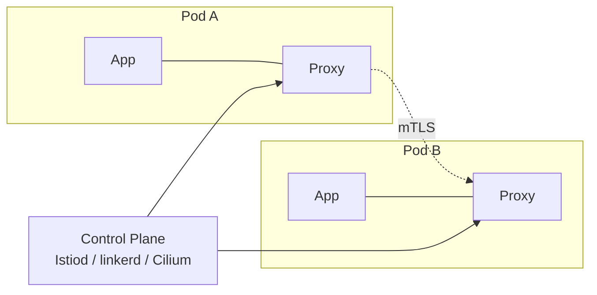

# 04 — Service Mesh

A service mesh adds L7 traffic management, mTLS, and telemetry **without code changes**, by injecting a data plane next to (or under) every workload.

<!-- mermaid:rendered -->
<p align="center"></p>

<details><summary>Mermaid source</summary>



</details>
## Quick reference

=== ":material-lightbulb-outline: Concept"
    A service mesh adds L7 routing, mTLS, and golden-signal telemetry to every workload without code changes. A control plane (Istiod / linkerd / Cilium) programs a data plane (Envoy sidecar, Rust micro-proxy, or eBPF + waypoint) so apps see plain HTTP while operators get traffic shifting and zero-trust crypto.

=== ":material-file-code-outline: Manifest"
    ```yaml
    apiVersion: networking.istio.io/v1
    kind: VirtualService
    metadata:
      name: reviews
    spec:
      hosts: [reviews]
      http:
        - match:
            - headers:
                x-user-tier: { exact: beta }
          route:
            - destination: { host: reviews, subset: v3 }
        - route:
            - destination: { host: reviews, subset: v1 }
              weight: 80
            - destination: { host: reviews, subset: v2 }
              weight: 20
    ---
    apiVersion: networking.istio.io/v1
    kind: DestinationRule
    metadata:
      name: reviews
    spec:
      host: reviews
      trafficPolicy:
        outlierDetection:
          consecutive5xxErrors: 5
          interval: 30s
          baseEjectionTime: 30s
      subsets:
        - { name: v1, labels: { version: v1 } }
        - { name: v2, labels: { version: v2 } }
        - { name: v3, labels: { version: v3 } }
    ```

=== ":material-console: kubectl"
    ```bash
    kubectl apply -f istio-virtualservice.yaml
    kubectl get virtualservice reviews -o yaml
    istioctl proxy-config routes deploy/istio-ingressgateway -n istio-system | grep reviews
    curl -s http://reviews/                          # 80% v1, 20% v2
    curl -s -H "x-user-tier: beta" http://reviews/   # always v3
    ```

=== ":material-text-box-outline: Expected output"
    ```text
    virtualservice.networking.istio.io/reviews created
    destinationrule.networking.istio.io/reviews created
    NAME      DOMAINS    MATCH                  VIRTUAL SERVICE
    reviews   reviews    /*                     reviews.default
    ```

## Comparison

| | Istio | Linkerd | Cilium Service Mesh |
|---|-------|---------|---------------------|
| Data plane | Envoy sidecar (or ambient ztunnel + waypoint) | Linkerd2-proxy (Rust, micro-proxy) | eBPF + optional Envoy waypoint |
| mTLS | yes | yes (default-on, simple) | yes |
| API | Istio CRDs + Gateway API | Linkerd CRDs + Gateway API | Cilium CRDs + Gateway API |
| Footprint | larger, most features | smallest, fewer features | shares CNI, no per-pod sidecar |
| Mode | sidecar OR ambient | sidecar | sidecarless (eBPF) |

## Sidecar vs Ambient/eBPF
- **Sidecar**: each pod gets a proxy container — strong isolation, higher resource cost, requires pod restarts on upgrade.
- **Ambient (Istio)**: shared per-node `ztunnel` for L4/mTLS, optional `waypoint` proxy for L7 — lower cost, no pod restart for mesh upgrades.
- **eBPF (Cilium)**: kernel-level redirection, no userspace proxy for L4 — best performance, L7 still uses Envoy waypoint.

## When to use what
- Need lots of L7 features today + multi-cluster: **Istio**.
- Want simplicity and "it just works" mTLS: **Linkerd**.
- Already on Cilium CNI and value performance: **Cilium**.

## Files
- [istio-install.md](istio-install.md)
- [istio-virtualservice.yaml](istio-virtualservice.yaml)
