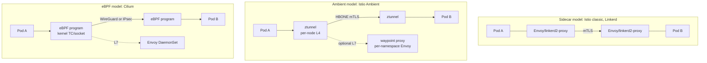
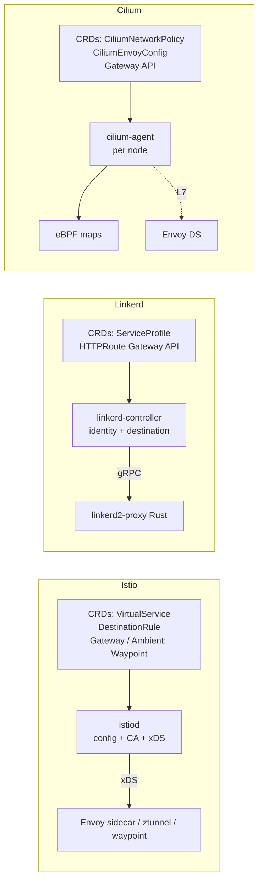

# Deep Dive: Istio vs Linkerd vs Cilium Service Mesh

## Why this matters

"Use a service mesh" is no longer a single decision. The architectural choice splits three ways:

- **Sidecar proxies** (the original model): Istio classic, Linkerd, Consul.
- **Ambient / per-node proxies** (sidecar-less): Istio Ambient (GA 1.23 in Istio, late 2024), Linkerd's policy controller.
- **eBPF in-kernel** (no userspace proxy at all for L4): Cilium Service Mesh, with optional Envoy for L7.

The wrong choice burns 30%+ of cluster CPU and adds 1–5 ms tail latency per hop. The right choice is invisible. This doc maps the three architectures, their control planes, and the perf trade-offs so you can pick deliberately.

---

## Mental Model

> A service mesh does **three jobs**: secure transport (mTLS), traffic control (routing, retries, splits), and observability (RED metrics, traces). Where you put the code that does these jobs is the architectural decision.

| Where the dataplane runs | Memory cost | Latency cost | L7 features |
|---|---|---|---|
| Sidecar (per pod) | ~50–150 MiB × pods | +0.5–2 ms | Full HTTP/2, gRPC, JWT |
| Per-node proxy (ambient) | ~50–150 MiB × nodes | +0.3–1.5 ms | Full at L7 tier |
| eBPF (kernel) | ~10–30 MiB × nodes | +0.05–0.2 ms (L4) | L4 only without Envoy |

---

## Diagram 1 — The three architectures

<!-- mermaid:rendered -->
<p align="center"></p>

<details><summary>Mermaid source</summary>



</details>

---

## Diagram 2 — Control plane comparison

<!-- mermaid:rendered -->
<p align="center"></p>

<details><summary>Mermaid source</summary>



</details>

---

## Comparison matrix

| Dimension | Istio (sidecar) | Istio Ambient | Linkerd | Cilium SM |
|---|---|---|---|---|
| Dataplane | Envoy C++ | ztunnel (Rust) + waypoint (Envoy) | linkerd2-proxy (Rust) | eBPF + Envoy (optional) |
| Memory / pod | 50–150 MiB | 0 in pod, ztunnel per node | 10–30 MiB | 0 in pod |
| L4 latency | +0.5–2 ms | +0.3–1 ms | +0.4–1.5 ms | +0.05–0.2 ms |
| mTLS | SPIFFE / Istio CA | SPIFFE / Istio CA | SPIFFE-like (linkerd identity) | SPIFFE or WG/IPsec |
| L7 features | Full (Envoy) | Full via waypoint | Subset (HTTP/2, gRPC, retries) | Full when Envoy enabled |
| Multi-cluster | Excellent (multi-primary, primary-remote) | Good (alpha → beta) | Multicluster gateway model | ClusterMesh (eBPF native) |
| Gateway API | Yes | Yes | Yes (default) | Yes |
| Observability | Kiali, Jaeger, Prom | Same | Linkerd Viz built-in | Hubble (eBPF flows) |
| Operational complexity | High | Medium | Lowest | Medium-high |
| CNI required | any | any | any | replaces CNI |

---

## Walkthrough: a canonical mTLS + traffic split

### Istio (sidecar / ambient)

```yaml
apiVersion: security.istio.io/v1
kind: PeerAuthentication
metadata: {name: default, namespace: prod}
spec:
  mtls: {mode: STRICT}                 # cluster-wide mTLS enforcement
---
apiVersion: gateway.networking.k8s.io/v1
kind: HTTPRoute
metadata: {name: web, namespace: prod}
spec:
  parentRefs: [{name: web-waypoint, kind: Service}]
  rules:
    - matches: [{path: {value: /}}]
      backendRefs:                     # 90/10 canary
        - {name: web-v1, port: 80, weight: 90}
        - {name: web-v2, port: 80, weight: 10}
```

In **ambient mode**, no sidecar injection annotation needed. Add `istio.io/dataplane-mode: ambient` to the namespace; ztunnel handles L4 mTLS automatically. A waypoint proxy is provisioned only for L7 features.

### Linkerd

```yaml
apiVersion: policy.linkerd.io/v1beta3
kind: Server
metadata: {name: web, namespace: prod}
spec:
  podSelector: {matchLabels: {app: web}}
  port: http
  proxyProtocol: HTTP/2
---
apiVersion: gateway.networking.k8s.io/v1
kind: HTTPRoute
metadata: {name: web, namespace: prod}
spec:
  parentRefs: [{group: policy.linkerd.io, kind: Server, name: web}]
  rules:
    - backendRefs:
        - {name: web-v1, port: 80, weight: 90}
        - {name: web-v2, port: 80, weight: 10}
```

Linkerd auto-injects on namespaces labeled `linkerd.io/inject: enabled`. mTLS is on by default — no flag needed.

### Cilium Service Mesh

```yaml
apiVersion: cilium.io/v2
kind: CiliumNetworkPolicy
metadata: {name: web-l7, namespace: prod}
spec:
  endpointSelector: {matchLabels: {app: web}}
  ingress:
    - fromEndpoints: [{matchLabels: {app: client}}]
      toPorts:
        - ports: [{port: "80", protocol: TCP}]
          rules:
            http:
              - method: GET
                path: "/api/.*"
---
apiVersion: gateway.networking.k8s.io/v1
kind: HTTPRoute
metadata: {name: web, namespace: prod}
spec:
  parentRefs: [{name: cilium-gateway}]
  rules:
    - backendRefs:
        - {name: web-v1, port: 80, weight: 90}
        - {name: web-v2, port: 80, weight: 10}
```

Cilium handles L4 mTLS via WireGuard or IPsec encryption between nodes (`encryption.enabled: true`) — not per-connection mTLS. SPIFFE-based pod identity mTLS is in beta.

---

## Performance trade-offs (rule-of-thumb numbers)

For a 1KB HTTP request between pods in the same cluster:

| Solution | p50 added | p99 added | CPU per RPS |
|---|---|---|---|
| No mesh | baseline | baseline | baseline |
| Linkerd sidecar | +0.4 ms | +1.5 ms | +1.5x |
| Istio sidecar (Envoy) | +0.6 ms | +2.5 ms | +2.0x |
| Istio Ambient (L4 only) | +0.3 ms | +1.0 ms | +1.2x |
| Istio Ambient (L7 via waypoint) | +0.7 ms | +2.0 ms | +1.8x |
| Cilium L4 (eBPF only) | +0.05 ms | +0.3 ms | +1.05x |
| Cilium L7 (Envoy DS) | +0.5 ms | +2.0 ms | +1.5x |

These are rough order-of-magnitude figures from public benchmarks; numbers shift with hardware, workload mix, and version. **Always measure on your workload.**

---

## When to pick what

- **Greenfield, want simplicity, mostly HTTP** → Linkerd. Smallest blast radius, opinionated, secure by default.
- **Need rich routing (header-based, canary by user, JWT auth)** → Istio (Ambient if you can, classic otherwise).
- **Already running Cilium CNI, want NetworkPolicy + mTLS at line rate** → Cilium Service Mesh. Add Envoy DS only when you need L7.
- **Multi-cluster federation, multi-tenant L7 policy** → Istio remains the most mature.
- **Bare-metal / latency-critical (HFT, gaming, voice)** → Cilium eBPF. Sidecar tax is unacceptable.

---

## Interview Q&A

**Q1. Why does the sidecar model exist if it's so heavy?**
Originally because the kernel had no way to inject HTTP-aware logic into a pod without changing the application. Sidecars solved that with zero app changes (auto-injection). The cost (~100 MiB per pod, +1 ms latency) was acceptable when meshes had hundreds of pods, not thousands.

**Q2. What does Istio Ambient solve?**
Two things: (1) the per-pod memory tax (ztunnel runs once per node, not per pod), (2) the upgrade pain (sidecar version coupled to pod restart). Trade-off: L7 features now require explicit waypoint proxies, and the architecture is younger.

**Q3. Cilium replaces kube-proxy — what does that change?**
kube-proxy programs iptables/nftables for Service VIPs. Cilium's eBPF datapath programs the same logic into eBPF socket-level programs, bypassing iptables entirely. Result: O(1) lookup regardless of service count, much lower CPU, and observability via Hubble.

**Q4. How does mTLS work in each mesh?**
Istio: SPIFFE identity per workload, certs minted by istiod's CA, rotated every 24h, presented by Envoy/ztunnel. Linkerd: similar but uses its own identity controller, certs every 24h, presented by linkerd2-proxy. Cilium: SPIFFE-based pod identity with mTLS in beta; production today usually means node-to-node WireGuard or IPsec encryption (not per-connection identity).

**Q5. What is HBONE and why does Istio Ambient use it?**
HTTP-Based Overlay Network Environment. ztunnels tunnel pod-to-pod traffic over HTTP/2 CONNECT with mTLS. It allows L4 transport with metadata (source identity, dest identity) preserved for waypoint policy enforcement, while running on standard ports.

**Q6. What does Linkerd give up to be simple?**
Rich L7 policy (no JWT auth, no complex routing rules, no rate-limiting at the proxy), narrower multi-cluster topology options, no built-in egress gateway. In exchange: smaller proxy (Rust, ~10 MiB), lower latency, far less yak-shaving.

**Q7. If I already have Cilium as CNI, do I need Istio for a mesh?**
Often no. Cilium Service Mesh covers L4 mTLS, NetworkPolicy, transparent encryption, and Gateway API for ingress. You add Istio only if you need its L7 feature surface (subset routing, fault injection, rich auth) and the team can absorb the operational cost.

**Q8. What is the biggest operational risk with a sidecar mesh?**
The sidecar lifecycle vs. main app lifecycle race. Pre-Kubernetes 1.29 native sidecars, Envoy could be killed before the app finished draining, causing connection resets during rollouts. Native sidecars (KEP-753, GA 1.33) fix this — Envoy is restartable and terminated AFTER main containers.

---

## Sources

- [Istio docs](https://istio.io/latest/docs/) and [Ambient overview](https://istio.io/latest/docs/ambient/overview/)
- [Linkerd docs](https://linkerd.io/2.16/overview/)
- [Cilium Service Mesh](https://docs.cilium.io/en/stable/network/servicemesh/)
- [Gateway API](https://gateway-api.sigs.k8s.io/)
- [SPIFFE](https://spiffe.io/) — workload identity standard underpinning all three
- [CNCF service mesh comparison](https://layer5.io/service-mesh-landscape)
- [Cilium kube-proxy replacement](https://docs.cilium.io/en/stable/network/kubernetes/kubeproxy-free/)
- [Istio Ambient KEP-equivalent design docs](https://github.com/istio/istio/tree/master/architecture/ambient)
- [SIG Network](https://github.com/kubernetes/community/tree/master/sig-network)
