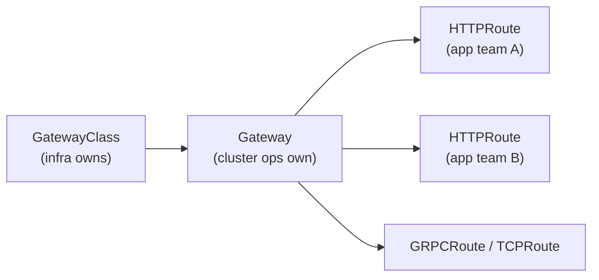

# 05 — Gateway API

Gateway API is the successor to Ingress: role-oriented (infra / cluster ops / app dev), portable across implementations, and richer (header-based routing, traffic split, gRPC, TCP/UDP/TLS routes).

<!-- mermaid:rendered -->
<p align="center"></p>

<details><summary>Mermaid source</summary>



</details>
## Quick reference

=== ":material-lightbulb-outline: Concept"
    Gateway API splits the old Ingress object into roles: infra owns `GatewayClass`, cluster ops own `Gateway`, app teams own `HTTPRoute` / `GRPCRoute` / `TCPRoute`. Routing primitives (header match, weighted backends, request mirroring) are first-class typed fields, not vendor annotations.

=== ":material-file-code-outline: Manifest"
    ```yaml
    apiVersion: gateway.networking.k8s.io/v1
    kind: HTTPRoute
    metadata:
      name: app
      namespace: team-a
    spec:
      parentRefs:
        - name: prod-gateway
          namespace: infra
      hostnames: ["app.example.com"]
      rules:
        - matches:
            - path: { type: PathPrefix, value: /api }
          backendRefs:
            - { name: api-v1, port: 8080, weight: 90 }
            - { name: api-v2, port: 8080, weight: 10 }
        - matches:
            - path: { type: PathPrefix, value: / }
          filters:
            - type: RequestHeaderModifier
              requestHeaderModifier:
                add:
                  - { name: X-Routed-By, value: gateway-api }
          backendRefs:
            - { name: web, port: 80 }
    ```

=== ":material-console: kubectl"
    ```bash
    kubectl apply -f gateway.yaml
    kubectl apply -f httproute.yaml
    kubectl get gateway prod-gateway -n infra
    kubectl get httproute -n team-a
    kubectl describe httproute app -n team-a
    ```

=== ":material-text-box-outline: Expected output"
    ```text
    NAME           CLASS   ADDRESS         PROGRAMMED   AGE
    prod-gateway   istio   34.120.10.20    True         42s
    NAME   HOSTNAMES               AGE
    app    ["app.example.com"]     20s
    Status:
      Parents:
        Conditions:
          Type:    Accepted        Status: True   Reason: Accepted
          Type:    ResolvedRefs    Status: True   Reason: ResolvedRefs
    ```

## Ingress vs Gateway API

| | Ingress | Gateway API |
|---|--------|-------------|
| Roles | one resource | GatewayClass / Gateway / *Route |
| Extensibility | annotations (vendor-specific) | typed fields, ReferenceGrant |
| Protocols | HTTP(S) only | HTTP, HTTPS, gRPC, TCP, UDP, TLS |
| Traffic split / mirroring | annotations | first-class |
| Mesh integration | none | GAMMA (East-West for service mesh) |

## GAMMA (mesh)
GAMMA = "Gateway API for Mesh Management and Administration". Lets you use the **same `HTTPRoute`** to control east-west traffic inside a mesh (Istio, Linkerd, Cilium, kgateway, etc).

## Implementations (data planes)
- Envoy Gateway, Istio, Cilium, kgateway, NGINX Gateway Fabric, Traefik, Kong, HAProxy, Contour.

## Files
- [gateway.yaml](gateway.yaml)
- [httproute.yaml](httproute.yaml)
