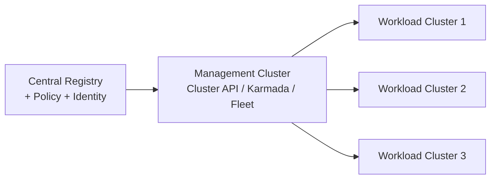

# 06 — Multi-Cluster Kubernetes

<!-- mermaid:rendered -->

Mermaid source

<!-- mermaid:rendered -->

Mermaid source

<!-- mermaid:rendered -->

Mermaid source

## Why multi-cluster
- Blast-radius isolation, regulatory boundaries, geo proximity, heterogeneous infra (cloud + on-prem), team autonomy.

## Approaches

| Tool | Style | Status |
|------|-------|--------|
| KubeFed v2 | API federation, pushed config from a host cluster | Archived (lessons learned, not recommended for new work) |
| Karmada | Policy-based propagation, OverridePolicies, scheduler across clusters | CNCF Incubating |
| Cluster API (CAPI) | Declarative **lifecycle** of clusters themselves (Cluster, Machine, MachineDeployment CRDs) | CNCF, widely used |
| Fleet (Rancher) | GitOps fan-out across many clusters | CNCF Sandbox |
| Open Cluster Management (OCM) | Hub-spoke, RedHat ACM upstream | CNCF Sandbox |
| Argo CD ApplicationSet | GitOps fan-out by generator (cluster, list, git) | CNCF Graduated |

## Patterns
- **Hub-and-spoke**: one management cluster, many workload clusters. Most common.
- **GitOps fan-out**: ApplicationSet/Fleet — each cluster pulls its own config.
- **Mesh federation**: Istio multi-primary or primary-remote, Linkerd multi-cluster, Cilium ClusterMesh — share services across clusters with mTLS.

## Cluster API in 30s
- Define a `Cluster` CR + provider-specific `*MachineTemplate` (AWS, vSphere, OpenStack, Docker for kind...).
- A management cluster reconciles them into real clusters.
- Same flow for upgrade, scale, delete.

## Files
- [clusterapi-example.yaml](clusterapi-example.yaml)
