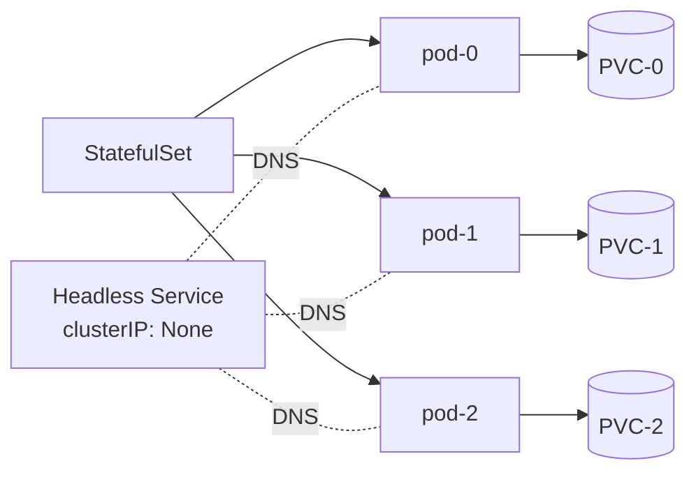

# 07 — Stateful Workloads

<!-- mermaid:rendered -->

Mermaid source

## StatefulSet guarantees
- **Stable network identity**: `pod-0`, `pod-1`, ... resolvable via the headless Service as `pod-0.svc.ns.svc.cluster.local`.
- **Stable storage**: each pod gets its own PVC from `volumeClaimTemplates`; PVC survives pod restarts and even StatefulSet deletion (default).
- **Ordered creation/deletion**: 0 before 1 before 2; reverse on scale-down. Use `podManagementPolicy: Parallel` to relax.
- **Ordered rolling updates** with `partition` for canary / phased rollouts.

## Headless Service
`clusterIP: None` returns A records for **every** pod, not a single VIP. Required for StatefulSet pod DNS.

## When NOT to use StatefulSet
- Stateless apps that just need stable DNS — use a regular Deployment + headless Service if needed.
- Distributed systems with their own membership (some prefer Operators that manage raw Pods).

## Operators for databases
| Workload | Operator(s) |
|----------|-------------|
| PostgreSQL | CloudNativePG, Zalando postgres-operator, Crunchy PGO |
| MySQL | Oracle MySQL Operator, Percona, Vitess (sharded) |
| Kafka | Strimzi (CNCF), Confluent for K8s |
| Redis | Redis Enterprise Operator, OT-Container-Kit redis-operator |
| MongoDB | MongoDB Enterprise / Community Operator, Percona |
| Elasticsearch | ECK (Elastic), OpenSearch Operator |

Operators encode failover, backup/restore, version upgrades, and PVC growth — things StatefulSets alone do not handle.

## Files
- [strimzi-kafka.yaml](strimzi-kafka.yaml)
