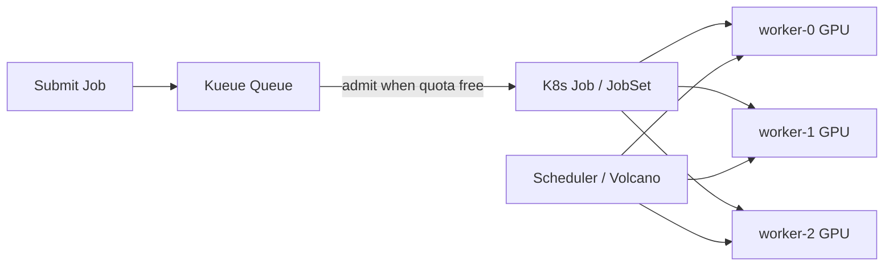

# 08 — Batch and AI Workloads

<!-- mermaid:rendered -->

Mermaid source

## Native primitives
- **Job**: run-to-completion pods. `completions`, `parallelism`, `backoffLimit`, `activeDeadlineSeconds`.
- **CronJob**: cron-scheduled Jobs.
- **IndexedJob** (`completionMode: Indexed`, GA 1.24): each pod gets a unique index 0..N-1 — perfect for embarrassingly parallel and rank-based MPI/training.
- **JobSet** (SIG-apps, beta): groups multiple Jobs (driver + workers + parameter server) with fixed naming and DNS — used by Kubeflow, JAX, MPI, Ray.

## Queueing & quota
- **Kueue** (SIG-scheduling): job-level quota and queueing **before** admission to the cluster scheduler. ClusterQueue + LocalQueue + ResourceFlavor.
- **Volcano**: gang scheduling, fair-share, batch-style scheduler used by AI/ML training.
- **YuniKorn**: Apache project, similar batch-scheduler niche.

## ML stacks
- **Kubeflow**: pipelines, training operators (TFJob, PyTorchJob, MPIJob), Katib for HPO, KServe for inference.
- **Ray on K8s** (KubeRay operator): RayCluster, RayJob, RayService.

## GPU scheduling
- NVIDIA device plugin exposes `nvidia.com/gpu` as a schedulable resource.
- **Time-slicing** and **MIG** for multi-tenant GPUs.
- **Dynamic Resource Allocation (DRA)** (alpha 1.26 → beta 1.32) is the next-gen API for accelerators.

## Files
- [indexed-job.yaml](indexed-job.yaml)
- [kueue-localqueue.yaml](kueue-localqueue.yaml)
