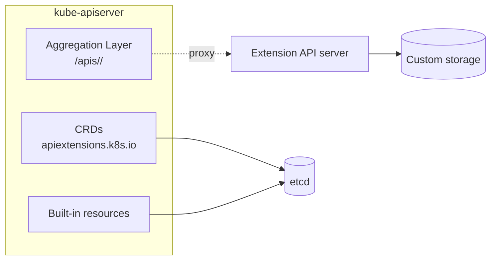

# 09 — Extending the Kubernetes API

Three ways to add API surface:

<!-- mermaid:rendered -->

Mermaid source

<!-- mermaid:rendered -->

Mermaid source

<!-- mermaid:rendered -->

Mermaid source

## CRDs
- Easiest. Stored in etcd by kube-apiserver. Validation via OpenAPI schema or CEL (`x-kubernetes-validations`).
- Use when you just want a new declarative object kind.

## Aggregated API server
- Register a separate server under a URL path; kube-apiserver proxies requests to it.
- Use when you need: custom storage (not etcd), custom subresources beyond status/scale, server-side admission/conversion you fully own. Examples: `metrics.k8s.io`, `external.metrics.k8s.io`, `custom.metrics.k8s.io`.

## API Priority and Fairness (APF)
- Replaces the old max-in-flight throttling. Categorizes requests into **PriorityLevels** via **FlowSchemas**, gives each a fair share so a noisy controller cannot starve `kubectl get` for humans.
- GA in 1.29.

## Finalizers
- A string in `metadata.finalizers` blocks deletion until removed.
- Used by controllers to perform cleanup (release cloud LB, drop external rows) before the object disappears.
- Watch out for **stuck deletions** when a controller is gone — patch the object to remove the finalizer manually.

## Files
- [apf-example.yaml](apf-example.yaml)
