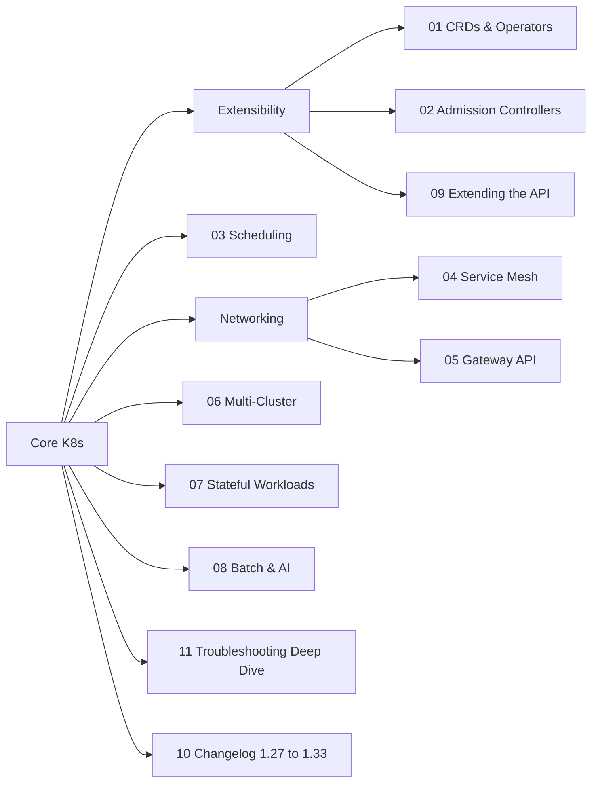

# 05 — Kubernetes Advanced Topics + Changelog

Advanced/extensibility topics for learners who already know core Kubernetes (pods, deployments, services, configmaps, RBAC), plus a tracker of what changed across recent K8s releases (1.27 → 1.33).

## Map

<!-- mermaid:rendered -->

Mermaid source

## Index

| # | Topic | Folder |
|---|-------|--------|
| 01 | CRDs & Operators | [01-crds-and-operators](01-crds-and-operators/) |
| 02 | Admission Controllers | [02-admission-controllers](02-admission-controllers/) |
| 03 | Scheduling | [03-scheduling](03-scheduling/) |
| 04 | Service Mesh | [04-service-mesh](04-service-mesh/) |
| 05 | Gateway API | [05-gateway-api](05-gateway-api/) |
| 06 | Multi-Cluster | [06-multi-cluster](06-multi-cluster/) |
| 07 | Stateful Workloads | [07-stateful-workloads](07-stateful-workloads/) |
| 08 | Batch & AI Workloads | [08-batch-and-ai-workloads](08-batch-and-ai-workloads/) |
| 09 | Extending the API | [09-extending-the-api](09-extending-the-api/) |
| 10 | Changelog 1.27 → 1.33 | [10-changelog](10-changelog/) |
| 11 | Troubleshooting Deep Dive | [11-troubleshooting-deep-dive](11-troubleshooting-deep-dive/) |
| -- | Cheatsheet | [cheatsheet.md](cheatsheet.md) |

## How to use this folder

1. Pick a topic, read the folder README first (each starts with a mermaid diagram).
2. Apply the YAML examples on a kind/minikube cluster.
3. Cross-reference 10-changelog when something behaves differently than expected — defaults change every release.
