# Kubernetes Advanced

<p class="hero advanced-k8s"><h1>03 · Kubernetes <em>Advanced</em></h1><p class="tagline">Twelve deep cuts — from extending the API to eBPF packet paths — that separate operators from engineers.</p></p>

## 🗺️ Roadmap — your learning path

<div class="roadmap" markdown>

<div class="stop" data-step="1" markdown>
#### CRDs — extending the API
Teach Kubernetes about resources it has never seen.
</div>

<div class="stop" data-step="2" markdown>
#### Operators & controller pattern
Write a reconcile loop that never sleeps, never drifts.
</div>

<div class="stop" data-step="3" markdown>
#### HPA — Horizontal Pod Autoscaler
Scale on CPU, custom, and external metrics without flapping.
</div>

<div class="stop" data-step="4" markdown>
#### VPA — Vertical Pod Autoscaler
Right-size containers automatically — without racing HPA.
</div>

<div class="stop" data-step="5" markdown>
#### PodDisruptionBudget
Drain nodes safely: set the floor before you pull the plug.
</div>

<div class="stop" data-step="6" markdown>
#### Admission controllers
Every API call passes through your webhook before it lands.
</div>

<div class="stop" data-step="7" markdown>
#### Service mesh deep dive
mTLS, retries, and circuit breakers as infrastructure, not code.
</div>

<div class="stop" data-step="8" markdown>
#### Multi-cluster
Federation, networking, and fleet-wide policy at global scale.
</div>

<div class="stop" data-step="9" markdown>
#### StatefulSets & DB operators
Stable identities, ordered rollouts, and safe PVC lifecycle.
</div>

<div class="stop" data-step="10" markdown>
#### Scheduler internals
Control which node gets which pod — and why.
</div>

<div class="stop" data-step="11" markdown>
#### CNI & eBPF networking
From iptables to Cilium: packet paths, network policies at scale.
</div>

<div class="stop" data-step="12" markdown>
#### K8s changelog reading (1.28 → 1.32)
The feature gates that already changed your cluster behaviour.
</div>

</div>

---

## 1. CRDs — Extending the API

<div class="concept" markdown>

<span class="stage reason">🧭 Reason</span>

**Why this exists.** At 03:00 your on-call engineer needs to pause all database migrations across 40 namespaces. There is no built-in Kubernetes object for "migration lock." Without CRDs you store state in ConfigMaps, which have no schema validation, no versioning, and no status subresource — so your controller cannot tell etcd "I finished." CRDs let you define `DatabaseMigration` as a first-class API object with OpenAPI schema enforcement, conversion webhooks between versions, and a `/status` endpoint the API server protects from accidental overwrites.

<span class="stage thinking">🧠 Thinking</span>

**Mental model.**

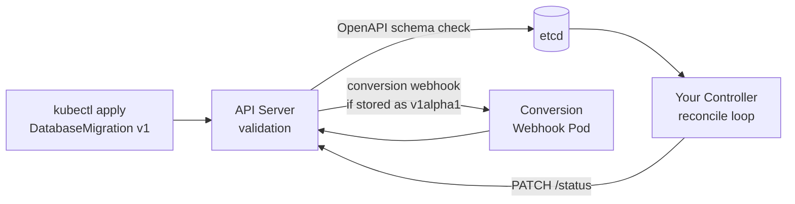

- The API server validates your CR against the `spec.versions[*].schema.openAPIV3Schema` you ship in the CRD manifest before writing to etcd.
- Conversion webhooks translate between stored version (e.g., `v1alpha1`) and served version (`v1`) so old objects keep working after a schema evolution.
- The `status` subresource is a separate REST endpoint. Controllers write to `/status`; users write to `/spec`. This prevents accidental overwrite of controller state.
- `additionalPrinterColumns` drive `kubectl get` output — you define the columns, not kubectl.
- A CRD with no controller is just a data store. The magic is the controller that watches it.

<span class="stage execution">⚡ Execution</span>

**Run it yourself.**

```bash
# 1. Define a minimal CRD with OpenAPI validation
cat <<'EOF' | kubectl apply -f -
apiVersion: apiextensions.k8s.io/v1
kind: CustomResourceDefinition
metadata:
  name: databasemigrations.myco.io
spec:
  group: myco.io
  names:
    kind: DatabaseMigration
    plural: databasemigrations
    shortNames: [dm]
  scope: Namespaced
  versions:
    - name: v1
      served: true
      storage: true
      subresources:
        status: {}
      additionalPrinterColumns:
        - name: Phase
          type: string
          jsonPath: .status.phase
        - name: Age
          type: date
          jsonPath: .metadata.creationTimestamp
      schema:
        openAPIV3Schema:
          type: object
          properties:
            spec:
              type: object
              required: [targetVersion]
              properties:
                targetVersion:
                  type: string
                  pattern: '^v[0-9]+'
                dryRun:
                  type: boolean
                  default: false
            status:
              type: object
              properties:
                phase:
                  type: string
                  enum: [Pending, Running, Succeeded, Failed]
                message:
                  type: string
EOF

# 2. Create a CR (schema validation runs here)
kubectl apply -f - <<'EOF'
apiVersion: myco.io/v1
kind: DatabaseMigration
metadata:
  name: migrate-to-v42
  namespace: default
spec:
  targetVersion: v42
  dryRun: true
EOF

# 3. Inspect the new API endpoint
kubectl api-resources | grep myco
kubectl get databasemigrations -A

# 4. Write status (only via subresource path — not kubectl apply)
kubectl patch databasemigration migrate-to-v42 \
  --type=merge \
  --subresource=status \
  -p '{"status":{"phase":"Running","message":"applying schema diff"}}'

kubectl get dm migrate-to-v42 -o wide

# 5. Teardown
kubectl delete databasemigration migrate-to-v42
kubectl delete crd databasemigrations.myco.io
```

<span class="stage simulation">🔮 Simulation — what you'll see</span>

<pre class="sim"><code><span class="prompt">$</span> kubectl api-resources | grep myco
<span class="comment"># databasemigrations   dm   myco.io/v1   true   DatabaseMigration</span>

<span class="prompt">$</span> kubectl get dm -A
<span class="comment"># NAMESPACE   NAME             PHASE   AGE</span>
<span class="comment"># default     migrate-to-v42   &lt;none&gt;  5s</span>

<span class="prompt">$</span> kubectl patch databasemigration migrate-to-v42 --subresource=status ...
<span class="comment"># databasemigration.myco.io/migrate-to-v42 patched</span>

<span class="prompt">$</span> kubectl get dm migrate-to-v42 -o wide
<span class="comment"># NAME             PHASE     AGE</span>
<span class="comment"># migrate-to-v42   Running   12s</span>
</code></pre>

<span class="stage output">✅ Output — state change</span>

<div class="flow" markdown>

<div class="state before" markdown>
##### Before
<span class="diff-del">ConfigMap hack</span>
no schema, no status subresource, no versioning
</div>

<div class="arrow">→</div>

<div class="state during" markdown>
##### During
<span class="diff-mod">CRD registered</span>
API server validates spec, rejects bad payloads
</div>

<div class="arrow">→</div>

<div class="state after" markdown>
##### After
<span class="diff-add">first-class resource</span>
`kubectl get dm`, RBAC, watch, status, printer columns
</div>

</div>

<span class="stage usecase">🌍 Real-world use case</span>

<div class="usecase-card" markdown>
**At Spotify**, the data-platform team ships a `BigQueryJob` CRD with three versions (`v1alpha1`, `v1beta1`, `v1`). A conversion webhook rewrites old objects on read. This lets 300+ data engineers submit jobs as Kubernetes objects while the platform team evolves the schema without breaking backward compatibility. All job history, retry state, and SLA metadata live in etcd — no external job-tracking database required.
</div>

</div>

---

## 2. Operators & Controller Pattern

<div class="concept" markdown>

<span class="stage reason">🧭 Reason</span>

**Why this exists.** A Deployment tells Kubernetes "I want 3 replicas." Kubernetes makes it so — and keeps it so forever. An Operator applies the same *make-it-so-and-keep-it-so* pattern to stateful, domain-specific operations: provisioning a PostgreSQL cluster, rotating TLS certificates, or executing ordered database schema migrations. Without an Operator you write cron jobs, bash scripts, and hope. With an Operator you write a controller that watches your CRD and reconciles desired state with actual state on every event — and on a periodic resync, so drift is always caught.

<span class="stage thinking">🧠 Thinking</span>

**Mental model.**

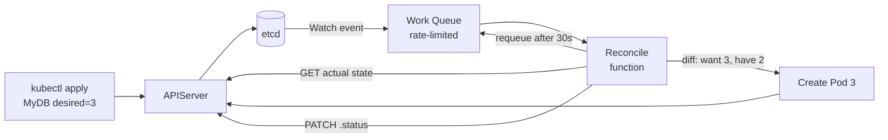

- The **work queue** rate-limits and deduplicates events. One object changed 100 times in 1 second = one reconcile call.
- **Owner references** cascade deletion: when `MyDB` is deleted, every Pod it created is garbage-collected automatically.
- The reconcile function must be **idempotent** — running it twice on the same state must produce the same result.
- The **status subresource** is the controller's public display: `readyReplicas`, `currentVersion`, `conditions`.
- Use **controller-runtime** (kubebuilder/operator-sdk) — never build the watch/cache/queue machinery yourself.

<span class="stage execution">⚡ Execution</span>

**Run it yourself.**

```bash
# Install operator-sdk (macOS/Linux)
brew install operator-sdk   # or download from GitHub releases

# Scaffold a new operator project
mkdir mydb-operator && cd mydb-operator
operator-sdk init --domain myco.io --repo github.com/myco/mydb-operator
operator-sdk create api --group db --version v1 --kind MyDB --resource --controller

# The scaffold creates:
#   api/v1/mydb_types.go        ← your CRD struct
#   controllers/mydb_controller.go  ← your reconcile function

# Edit the reconcile function — look for the TODO comment
grep -n "TODO" controllers/mydb_controller.go

# Run the controller locally (talks to your current kubeconfig cluster)
make install   # installs CRDs
make run       # starts the controller, Ctrl+C to stop

# In another terminal: create a CR and watch the controller react
kubectl apply -f - <<'EOF'
apiVersion: db.myco.io/v1
kind: MyDB
metadata:
  name: postgres-prod
  namespace: default
spec:
  replicas: 3
  version: "15.4"
EOF

kubectl get mydb postgres-prod -w   # watch status fields update
kubectl describe mydb postgres-prod  # see conditions

# Check owner references on any resource the controller creates
kubectl get pods -o json | jq '.items[].metadata.ownerReferences'

# Teardown
kubectl delete mydb postgres-prod
make uninstall   # removes CRDs
```

<span class="stage simulation">🔮 Simulation — what you'll see</span>

<pre class="sim"><code><span class="prompt">$</span> make run
<span class="comment"># INFO controller-runtime   Starting EventSource   {"controller": "mydb", "source": "kind source: *v1.MyDB"}</span>
<span class="comment"># INFO controller-runtime   Starting Controller    {"controller": "mydb"}</span>

<span class="prompt">$</span> kubectl get mydb postgres-prod -w
<span class="comment"># NAME           REPLICAS   READY   VERSION   AGE</span>
<span class="comment"># postgres-prod  3          0       15.4      2s</span>
<span class="comment"># postgres-prod  3          1       15.4      8s</span>
<span class="comment"># postgres-prod  3          3       15.4      22s</span>

<span class="prompt">$</span> kubectl get pods -o json | jq '.items[0].metadata.ownerReferences'
<span class="comment"># [{"apiVersion":"db.myco.io/v1","kind":"MyDB","name":"postgres-prod","uid":"abc...","controller":true}]</span>
</code></pre>

<span class="stage output">✅ Output — state change</span>

<div class="flow" markdown>

<div class="state before" markdown>
##### Before
<span class="diff-del">manual bash scripts</span>
drift undetected, no status, no RBAC
</div>

<div class="arrow">→</div>

<div class="state during" markdown>
##### During
<span class="diff-mod">controller watching</span>
every event triggers reconcile; work queue deduplicated
</div>

<div class="arrow">→</div>

<div class="state after" markdown>
##### After
<span class="diff-add">self-healing resource</span>
drift caught within 30 s, status always accurate
</div>

</div>

<span class="stage usecase">🌍 Real-world use case</span>

<div class="usecase-card" markdown>
**At LinkedIn**, the data-infrastructure team built the Kafka Operator to manage 200+ Kafka clusters across multiple data centres. The reconcile loop handles broker rolling restarts (respecting `minISR`), partition reassignment, and ACL sync — operations that previously required a 4-hour maintenance window. With the Operator, a rolling restart of a 30-broker cluster completes in under 20 minutes with zero data loss because the controller checks ISR before evicting each broker.
</div>

</div>

---

## 3. HPA — Horizontal Pod Autoscaler

<div class="concept" markdown>

<span class="stage reason">🧭 Reason</span>

**Why this exists.** Your API pods idle at 5% CPU at midnight and spike to 95% at 09:00 when Europe wakes up. Running at peak capacity 24/7 wastes 80% of your compute budget. HPA watches metrics and adjusts `spec.replicas` automatically — but a naive HPA will oscillate (scale up, wait, scale down, wait, scale up again) on noisy metrics, causing pod churn and slower-than-needed response. Understanding the scale-down stabilization window, custom metrics, and external metrics is what separates a production-safe HPA from a flapping one.

<span class="stage thinking">🧠 Thinking</span>

**Mental model.**

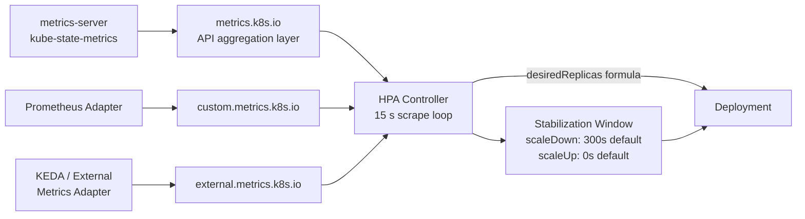

- HPA uses the formula: `desiredReplicas = ceil(currentReplicas × currentMetric / targetMetric)`
- **Scale-up** is aggressive by default (0 s stabilization) because slow scale-up causes outages.
- **Scale-down** waits 300 s by default — prevents flapping on short metric spikes.
- `scaleTargetRef` can point to any resource with a `/scale` subresource: Deployment, StatefulSet, ReplicaSet, or custom CRDs that implement scale.
- **External metrics** (e.g., SQS queue depth via KEDA) decouple pod count from internal CPU — critical for queue-worker architectures.

<span class="stage execution">⚡ Execution</span>

**Run it yourself.**

```bash
# Ensure metrics-server is installed
kubectl apply -f https://github.com/kubernetes-sigs/metrics-server/releases/latest/download/components.yaml

# Create a target deployment
kubectl create deployment php-apache \
  --image=registry.k8s.io/hpa-example \
  --requests='cpu=200m' \
  --port=80
kubectl expose deployment php-apache --port=80

# Create HPA with tuned scale-down stabilization to avoid flapping
kubectl apply -f - <<'EOF'
apiVersion: autoscaling/v2
kind: HorizontalPodAutoscaler
metadata:
  name: php-apache
spec:
  scaleTargetRef:
    apiVersion: apps/v1
    kind: Deployment
    name: php-apache
  minReplicas: 1
  maxReplicas: 10
  metrics:
    - type: Resource
      resource:
        name: cpu
        target:
          type: Utilization
          averageUtilization: 50
  behavior:
    scaleDown:
      stabilizationWindowSeconds: 120   # shorter than 300 s default for this demo
      policies:
        - type: Percent
          value: 25
          periodSeconds: 60             # never remove more than 25% per minute
    scaleUp:
      stabilizationWindowSeconds: 0
      policies:
        - type: Percent
          value: 100
          periodSeconds: 15            # can double every 15 s
        - type: Pods
          value: 4
          periodSeconds: 15            # or add 4 pods every 15 s — whichever is higher
      selectPolicy: Max
EOF

# Generate load in another terminal
kubectl run -i --tty load-generator \
  --rm --image=busybox:1.28 \
  --restart=Never -- /bin/sh -c \
  "while sleep 0.01; do wget -q -O- http://php-apache; done"

# Watch HPA react
kubectl get hpa php-apache --watch

# Stop load, watch scale-down with stabilization
kubectl delete pod load-generator --force 2>/dev/null || true
kubectl get hpa php-apache -w

# Teardown
kubectl delete hpa php-apache
kubectl delete deployment php-apache
kubectl delete svc php-apache
```

<span class="stage simulation">🔮 Simulation — what you'll see</span>

<pre class="sim"><code><span class="prompt">$</span> kubectl get hpa php-apache --watch
<span class="comment"># NAME        REFERENCE              TARGETS   MINPODS   MAXPODS   REPLICAS   AGE</span>
<span class="comment"># php-apache  Deployment/php-apache  5%/50%    1         10        1          10s</span>
<span class="comment"># php-apache  Deployment/php-apache  248%/50%  1         10        1          30s</span>
<span class="comment"># php-apache  Deployment/php-apache  248%/50%  1         10        4          45s</span>
<span class="comment"># php-apache  Deployment/php-apache  72%/50%   1         10        8          60s</span>
<span class="comment"># php-apache  Deployment/php-apache  53%/50%   1         10        10         75s</span>
<span class="comment"># (load stops)</span>
<span class="comment"># php-apache  Deployment/php-apache  0%/50%    1         10        10         120s</span>
<span class="comment"># php-apache  Deployment/php-apache  0%/50%    1         10        8          180s  ← stabilized scale-down</span>
</code></pre>

<span class="stage output">✅ Output — state change</span>

<div class="flow" markdown>

<div class="state before" markdown>
##### Before
<span class="diff-del">fixed 10 replicas</span>
over-provisioned at night, under-provisioned at peak
</div>

<div class="arrow">→</div>

<div class="state during" markdown>
##### During
<span class="diff-mod">HPA scaling</span>
replicas rise with load; stabilization window prevents yo-yo
</div>

<div class="arrow">→</div>

<div class="state after" markdown>
##### After
<span class="diff-add">right-sized fleet</span>
60–80% cost reduction vs fixed provisioning; p99 SLA met
</div>

</div>

<span class="stage usecase">🌍 Real-world use case</span>

<div class="usecase-card" markdown>
**At Google**, the SRE team documented HPA flapping as a root cause of cascading failures: a wave of pod terminations during scale-down triggered connection draining storms that spiked CPU — causing immediate scale-up again. The fix was a `scaleDown.stabilizationWindowSeconds: 300` (now the Kubernetes default) combined with a `policies[].type: Percent, value: 10` rate limiter. The same pattern from the Google SRE Workbook is reproduced verbatim in the Kubernetes HPA behavior API introduced in 1.18.
</div>

</div>

---

## 4. VPA — Vertical Pod Autoscaler

<div class="concept" markdown>

<span class="stage reason">🧭 Reason</span>

**Why this exists.** Your team sets `requests.cpu: 100m` and `limits.cpu: 500m` at deploy time, guesses wrong, and never revisits it. Under-requested pods get OOMKilled; over-requested pods waste cluster quota. VPA watches historical resource usage and recommends — or automatically applies — right-sized requests. The catch: VPA in `Auto` mode restarts pods to apply new requests (in-place resize landed in 1.27 alpha / 1.33 stable but VPA historically evicts). You must understand the interaction with HPA and LimitRanger to avoid resource-enforcement loops.

<span class="stage thinking">🧠 Thinking</span>

**Mental model.**

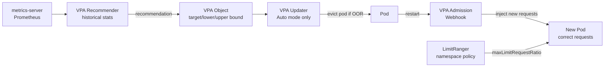

- VPA modes: `Off` (recommendation only), `Initial` (set on first schedule, never update), `Auto` (evict and reschedule when OOR).
- **Never run HPA on CPU + VPA in Auto mode** for the same pod — they fight each other. Use VPA for memory sizing only, HPA for CPU/custom metrics scaling.
- `LimitRanger` can enforce `maxLimitRequestRatio` (e.g., limit ≤ 4× request). VPA recommendations that violate this ratio get capped, which can leave pods under-resourced.
- The `containerPolicies[].minAllowed` and `maxAllowed` fields are your safety fence.

<span class="stage execution">⚡ Execution</span>

**Run it yourself.**

```bash
# Install VPA (requires metrics-server already running)
git clone https://github.com/kubernetes/autoscaler.git /tmp/autoscaler
bash /tmp/autoscaler/vertical-pod-autoscaler/hack/vpa-up.sh

# Deploy a memory-hungry app
kubectl apply -f - <<'EOF'
apiVersion: apps/v1
kind: Deployment
metadata:
  name: hamster
spec:
  replicas: 2
  selector:
    matchLabels: {app: hamster}
  template:
    metadata:
      labels: {app: hamster}
    spec:
      containers:
        - name: hamster
          image: registry.k8s.io/ubuntu-slim:0.1
          resources:
            requests:
              cpu: 100m
              memory: 50Mi
          command: ["/bin/sh", "-c"]
          args: ["while true; do timeout 0.5 yes >/dev/null; sleep 0.5; done"]
EOF

# Create VPA in Recommendation mode (safe — no evictions)
kubectl apply -f - <<'EOF'
apiVersion: autoscaling.k8s.io/v1
kind: VerticalPodAutoscaler
metadata:
  name: hamster-vpa
spec:
  targetRef:
    apiVersion: apps/v1
    kind: Deployment
    name: hamster
  updatePolicy:
    updateMode: "Off"   # change to "Auto" with caution
  resourcePolicy:
    containerPolicies:
      - containerName: hamster
        minAllowed:
          cpu: 50m
          memory: 32Mi
        maxAllowed:
          cpu: 1
          memory: 512Mi
        controlledResources: [cpu, memory]
EOF

# Wait ~5 minutes for recommender to gather data, then check
kubectl describe vpa hamster-vpa
kubectl get vpa hamster-vpa -o jsonpath='{.status.recommendation}' | jq .

# Teardown
kubectl delete vpa hamster-vpa
kubectl delete deployment hamster
bash /tmp/autoscaler/vertical-pod-autoscaler/hack/vpa-down.sh
```

<span class="stage simulation">🔮 Simulation — what you'll see</span>

<pre class="sim"><code><span class="prompt">$</span> kubectl get vpa hamster-vpa -o jsonpath='{.status.recommendation}' | jq .
<span class="comment"># {</span>
<span class="comment">#   "containerRecommendations": [</span>
<span class="comment">#     {</span>
<span class="comment">#       "containerName": "hamster",</span>
<span class="comment">#       "lowerBound":  {"cpu": "387m", "memory": "262144k"},</span>
<span class="comment">#       "target":      {"cpu": "587m", "memory": "262144k"},</span>
<span class="comment">#       "upperBound":  {"cpu": "1",    "memory": "262144k"}</span>
<span class="comment">#     }</span>
<span class="comment">#   ]</span>
<span class="comment"># }</span>
<span class="comment"># → original request was 100m CPU; VPA recommends 587m (5.8× more)</span>
</code></pre>

<span class="stage output">✅ Output — state change</span>

<div class="flow" markdown>

<div class="state before" markdown>
##### Before
<span class="diff-del">guessed 100m CPU</span>
pods CPU-throttled, OOMKilled on memory spikes
</div>

<div class="arrow">→</div>

<div class="state during" markdown>
##### During
<span class="diff-mod">VPA recommending</span>
recommender analyses p50/p95/p99 usage over time window
</div>

<div class="arrow">→</div>

<div class="state after" markdown>
##### After
<span class="diff-add">right-sized requests</span>
actual usage matches requests; scheduler places pods accurately
</div>

</div>

<span class="stage usecase">🌍 Real-world use case</span>

<div class="usecase-card" markdown>
**At Zalando**, the platform team runs VPA in `Off` mode for all production deployments. A weekly automation job reads VPA recommendations via the API, opens a PR updating Helm values, and routes it through code review. This avoids surprise pod evictions in production while still eliminating the "set once, never revisit" anti-pattern. Their data showed a 32% cluster CPU reclamation after the first pass of VPA-informed right-sizing.
</div>

</div>

---

## 5. PodDisruptionBudget

<div class="concept" markdown>

<span class="stage reason">🧭 Reason</span>

**Why this exists.** You run `kubectl drain node-3` for a kernel security patch. Kubernetes evicts all pods on the node. Without a PDB, it evicts all 3 replicas of your payment service simultaneously — 100% downtime for 30 seconds while pods reschedule elsewhere. A PDB is a contract: "at minimum 2 pods of this service must be available at all times." The drain operation respects it — evicting only one pod at a time, waiting for it to reschedule and become Ready before evicting the next.

<span class="stage thinking">🧠 Thinking</span>

**Mental model.**

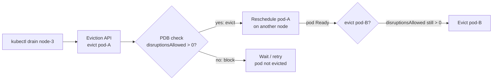

- `minAvailable: 2` means "tolerate eviction only when ≥ 2 pods are Ready after the eviction."
- `maxUnavailable: 1` means "at most 1 pod may be unavailable at any time."
- They are mathematically equivalent for a fixed-replica deployment but differ for deployments that change size — prefer `maxUnavailable` for dynamic fleets.
- PDBs block `kubectl drain` and cluster upgrades. A PDB with `minAvailable` equal to total replicas will freeze node maintenance forever — always set it to `replicas - 1` at minimum.
- PDBs also protect against voluntary disruptions from Cluster Autoscaler scale-down.

<span class="stage execution">⚡ Execution</span>

**Run it yourself.**

```bash
# Deploy a 3-replica service
kubectl create deployment payment-svc --image=nginx:alpine --replicas=3
kubectl wait deployment payment-svc --for=condition=Available --timeout=60s

# Create PDB: at least 2 pods must always be available
kubectl apply -f - <<'EOF'
apiVersion: policy/v1
kind: PodDisruptionBudget
metadata:
  name: payment-pdb
spec:
  minAvailable: 2
  selector:
    matchLabels:
      app: payment-svc
EOF

# Inspect the PDB — ALLOWED shows how many can be disrupted now
kubectl get pdb payment-pdb
kubectl describe pdb payment-pdb

# Simulate a drain (cordon + evict) — observe PDB enforcement
NODE=$(kubectl get pods -l app=payment-svc -o jsonpath='{.items[0].spec.nodeName}')
kubectl cordon "$NODE"

# Try to manually evict all pods at once (second eviction will be blocked by PDB)
POD1=$(kubectl get pods -l app=payment-svc -o jsonpath='{.items[0].metadata.name}')
POD2=$(kubectl get pods -l app=payment-svc -o jsonpath='{.items[1].metadata.name}')
kubectl delete pod "$POD1" &
kubectl delete pod "$POD2" &

# Check: one will reschedule first; the second waits
kubectl get pods -l app=payment-svc -w

# Uncordon and cleanup
kubectl uncordon "$NODE"
kubectl delete pdb payment-pdb
kubectl delete deployment payment-svc
```

<span class="stage simulation">🔮 Simulation — what you'll see</span>

<pre class="sim"><code><span class="prompt">$</span> kubectl get pdb payment-pdb
<span class="comment"># NAME          MIN AVAILABLE   MAX UNAVAILABLE   ALLOWED DISRUPTIONS   AGE</span>
<span class="comment"># payment-pdb   2               N/A               1                     5s</span>

<span class="prompt">$</span> kubectl describe pdb payment-pdb
<span class="comment"># Disruptions Allowed: 1</span>
<span class="comment"># Current:             3</span>
<span class="comment"># Desired:             3</span>
<span class="comment"># Total Replicas:      3</span>
<span class="comment"># Conditions:</span>
<span class="comment">#   DisruptionAllowed  True   SufficientPods</span>
</code></pre>

<span class="stage output">✅ Output — state change</span>

<div class="flow" markdown>

<div class="state before" markdown>
##### Before
<span class="diff-del">no PDB</span>
drain evicts all pods at once → 100% downtime
</div>

<div class="arrow">→</div>

<div class="state during" markdown>
##### During
<span class="diff-mod">PDB enforcing</span>
drain blocked; waits for pod to reschedule before next eviction
</div>

<div class="arrow">→</div>

<div class="state after" markdown>
##### After
<span class="diff-add">zero-downtime drain</span>
node patched; service never below 2 replicas
</div>

</div>

<span class="stage usecase">🌍 Real-world use case</span>

<div class="usecase-card" markdown>
**At Airbnb**, a GKE node pool upgrade without PDBs caused a 6-minute partial outage for the search service. After the incident, the platform team mandated PDBs for every production Deployment via a ValidatingWebhookConfiguration that rejects Deployments with `replicas ≥ 2` and no matching PDB. The policy runs as a Kyverno `ClusterPolicy` and fires in CI/CD pipelines before manifests reach the cluster, catching the issue at PR review time.
</div>

</div>

---

## 6. Admission Controllers

<div class="concept" markdown>

<span class="stage reason">🧭 Reason</span>

**Why this exists.** A developer pushes a Deployment with `image: nginx:latest`, no resource limits, and `runAsRoot: true`. The API server accepts it, etcd stores it, and your cluster is now running an unversioned, privileged container in production. Admission controllers are the last checkpoint before an object is written to etcd. Mutating webhooks can automatically inject a non-root security context or append resource limits. Validating webhooks can reject the whole request with a policy violation message. Tools like OPA/Gatekeeper and Kyverno let you write these policies as code, ship them via GitOps, and audit violations without touching API server binaries.

<span class="stage thinking">🧠 Thinking</span>

**Mental model.**

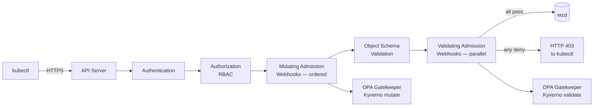

- Mutating webhooks run first, in order. One webhook's output is the next webhook's input.
- Validating webhooks run in parallel after all mutations. Any single deny rejects the request.
- Webhooks have a `failurePolicy`: `Fail` (reject if webhook unreachable) or `Ignore` (allow if webhook unreachable). Production security webhooks must use `Fail`.
- **OPA/Gatekeeper** uses Rego policies + `ConstraintTemplate` CRDs. Complex but powerful.
- **Kyverno** uses YAML policies — closer to Kubernetes manifest style. Easier to adopt quickly.

<span class="stage execution">⚡ Execution</span>

**Run it yourself.**

```bash
# Install Kyverno
kubectl create -f https://github.com/kyverno/kyverno/releases/latest/download/install.yaml
kubectl wait deployment kyverno -n kyverno --for=condition=Available --timeout=120s

# Policy 1: require resource limits on all containers
kubectl apply -f - <<'EOF'
apiVersion: kyverno.io/v1
kind: ClusterPolicy
metadata:
  name: require-resource-limits
  annotations:
    policies.kyverno.io/description: All containers must have CPU and memory limits.
spec:
  validationFailureAction: Enforce
  background: false
  rules:
    - name: check-limits
      match:
        any:
          - resources:
              kinds: [Pod]
      validate:
        message: "CPU and memory limits are required for all containers."
        pattern:
          spec:
            containers:
              - resources:
                  limits:
                    memory: "?*"
                    cpu: "?*"
EOF

# Policy 2: auto-inject imagePullPolicy: Always for :latest tags (mutating)
kubectl apply -f - <<'EOF'
apiVersion: kyverno.io/v1
kind: ClusterPolicy
metadata:
  name: set-image-pull-policy
spec:
  rules:
    - name: set-latest-to-always
      match:
        any:
          - resources:
              kinds: [Pod]
      mutate:
        patchStrategicMerge:
          spec:
            containers:
              - (image): "*:latest"
                imagePullPolicy: Always
EOF

# Test: try to create a pod without limits — should be rejected
kubectl run bad-pod --image=nginx:latest --restart=Never
# Expected: Error from server: admission webhook denied the request

# Test: create a good pod
kubectl run good-pod --image=nginx:alpine \
  --restart=Never \
  --requests='cpu=50m,memory=64Mi' \
  --limits='cpu=100m,memory=128Mi'
kubectl get pod good-pod

# View policy violations audit report
kubectl get policyreport -A

# Teardown
kubectl delete clusterpolicy require-resource-limits set-image-pull-policy
kubectl delete pod good-pod --ignore-not-found
kubectl delete -f https://github.com/kyverno/kyverno/releases/latest/download/install.yaml
```

<span class="stage simulation">🔮 Simulation — what you'll see</span>

<pre class="sim"><code><span class="prompt">$</span> kubectl run bad-pod --image=nginx:latest --restart=Never
<span class="comment"># Error from server: admission webhook "validate.kyverno.svc-fail" denied the request:</span>
<span class="comment"># resource Pod/default/bad-pod was blocked due to the following policies</span>
<span class="comment"># require-resource-limits: check-limits:</span>
<span class="comment">#   CPU and memory limits are required for all containers.</span>

<span class="prompt">$</span> kubectl get pod good-pod -o jsonpath='{.spec.containers[0].imagePullPolicy}'
<span class="comment"># Always   ← mutating webhook injected this</span>
</code></pre>

<span class="stage output">✅ Output — state change</span>

<div class="flow" markdown>

<div class="state before" markdown>
##### Before
<span class="diff-del">unconstrained manifests</span>
no limits, latest tags, root containers reach etcd
</div>

<div class="arrow">→</div>

<div class="state during" markdown>
##### During
<span class="diff-mod">webhooks intercepting</span>
mutate injects policy defaults; validate blocks violations
</div>

<div class="arrow">→</div>

<div class="state after" markdown>
##### After
<span class="diff-add">policy-enforced cluster</span>
every pod meets standards; violations caught at PR time via CI dry-run
</div>

</div>

<span class="stage usecase">🌍 Real-world use case</span>

<div class="usecase-card" markdown>
**At Pinterest**, the platform security team replaced 14 hand-written ValidatingWebhooks with a single Kyverno `ClusterPolicy` library versioned in Git. The migration took 3 sprints and reduced webhook latency from an average of 180 ms to 12 ms (Kyverno runs in-cluster with caching vs their custom Go webhook that called an external policy engine on every request). Policy violations now surface as PR comments via a `kyverno apply --policy ./policies/ -r ./manifests/` step in GitHub Actions.
</div>

</div>

---

## 7. Service Mesh Deep Dive

<div class="concept" markdown>

<span class="stage reason">🧭 Reason</span>

**Why this exists.** Your 80 microservices each implement their own retry logic, timeout, circuit breaker, and mTLS handshake — all slightly differently, all tested differently, all failing differently at 03:00. A service mesh moves this cross-cutting infrastructure into a sidecar proxy (Envoy for Istio, a lightweight proxy for Linkerd) that intercepts all pod traffic transparently. mTLS becomes automatic; retries, timeouts, and circuit breakers become YAML; distributed tracing spans are emitted without touching application code. The cost: sidecar lifecycle management and Envoy configuration complexity.

<span class="stage thinking">🧠 Thinking</span>

**Mental model.**

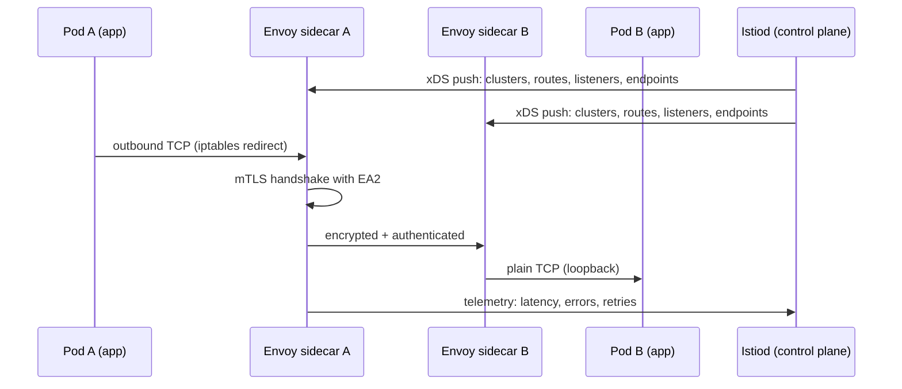

- **iptables rules** (injected by `istio-init` initContainer) redirect all inbound/outbound traffic to Envoy ports (15001 outbound, 15006 inbound) without application changes.
- **xDS API** (xDS = "x Discovery Service") is how Istiod pushes config to Envoy: LDS (listeners), RDS (routes), CDS (clusters), EDS (endpoints). Envoy never reads files.
- **mTLS** uses SPIFFE-standard X.509 SVIDs issued by Istiod's CA. Cert rotation is automatic every 24 h by default.
- **VirtualService** controls routing (weight-based, header-based); **DestinationRule** controls connection pool, circuit breaker, TLS settings per upstream.
- Linkerd uses a Rust-based ultra-lightweight proxy (`linkerd-proxy`) instead of Envoy — lower overhead, simpler config, fewer features.

<span class="stage execution">⚡ Execution</span>

**Run it yourself.**

```bash
# Install Istio (minimal profile for labs)
curl -L https://istio.io/downloadIstio | sh -
export PATH="$PATH:$(ls -d istio-*/bin)"
istioctl install --set profile=minimal -y
kubectl label namespace default istio-injection=enabled

# Deploy a sample app
kubectl apply -f https://raw.githubusercontent.com/istio/istio/release-1.20/samples/bookinfo/platform/kube/bookinfo.yaml
kubectl wait pods --all --for=condition=Ready --timeout=120s

# Verify mTLS is enforced (STRICT mode)
kubectl apply -f - <<'EOF'
apiVersion: security.istio.io/v1beta1
kind: PeerAuthentication
metadata:
  name: default
  namespace: default
spec:
  mtls:
    mode: STRICT
EOF

# Traffic policy: 90% to reviews-v1, 10% to reviews-v3 (canary)
kubectl apply -f - <<'EOF'
apiVersion: networking.istio.io/v1alpha3
kind: VirtualService
metadata:
  name: reviews
spec:
  hosts: [reviews]
  http:
    - route:
        - destination:
            host: reviews
            subset: v1
          weight: 90
        - destination:
            host: reviews
            subset: v3
          weight: 10
---
apiVersion: networking.istio.io/v1alpha3
kind: DestinationRule
metadata:
  name: reviews
spec:
  host: reviews
  trafficPolicy:
    connectionPool:
      tcp:
        maxConnections: 100
    outlierDetection:
      consecutiveGatewayErrors: 5
      interval: 10s
      baseEjectionTime: 30s   # circuit breaker: eject after 5 errors in 10 s
  subsets:
    - name: v1
      labels: {version: v1}
    - name: v3
      labels: {version: v3}
EOF

# Check Envoy config for a specific pod
REVIEWS_POD=$(kubectl get pod -l app=reviews -o jsonpath='{.items[0].metadata.name}')
istioctl proxy-config cluster "$REVIEWS_POD" --fqdn reviews
istioctl proxy-config listener "$REVIEWS_POD"

# Inspect mTLS certificate
istioctl proxy-config secret "$REVIEWS_POD"

# Visualise the mesh (kiali, if installed)
# istioctl dashboard kiali

# Teardown
kubectl delete -f https://raw.githubusercontent.com/istio/istio/release-1.20/samples/bookinfo/platform/kube/bookinfo.yaml
kubectl delete peerauthentication default
kubectl delete virtualservice reviews
kubectl delete destinationrule reviews
istioctl uninstall --purge -y
kubectl label namespace default istio-injection-
```

<span class="stage simulation">🔮 Simulation — what you'll see</span>

<pre class="sim"><code><span class="prompt">$</span> istioctl proxy-config cluster "$REVIEWS_POD" --fqdn reviews
<span class="comment"># SERVICE FQDN          PORT  SUBSET  DIRECTION  TYPE</span>
<span class="comment"># reviews.default.svc   9080  v1      outbound   EDS</span>
<span class="comment"># reviews.default.svc   9080  v3      outbound   EDS</span>

<span class="prompt">$</span> istioctl proxy-config secret "$REVIEWS_POD"
<span class="comment"># RESOURCE NAME        TYPE      STATUS    VALID CERT  SERIAL NUMBER  NOT AFTER</span>
<span class="comment"># default              Cert Chain ACTIVE    true        6f3b...       2024-05-01T03:00:00Z</span>
<span class="comment"># ROOTCA               CA        ACTIVE    true        1a2b...       2034-04-29T03:00:00Z</span>
</code></pre>

<span class="stage output">✅ Output — state change</span>

<div class="flow" markdown>

<div class="state before" markdown>
##### Before
<span class="diff-del">plaintext service calls</span>
no retries, no circuit breaker, no distributed tracing
</div>

<div class="arrow">→</div>

<div class="state during" markdown>
##### During
<span class="diff-mod">sidecar intercepting</span>
mTLS handshake automatic; VirtualService splits traffic 90/10
</div>

<div class="arrow">→</div>

<div class="state after" markdown>
##### After
<span class="diff-add">observable, resilient mesh</span>
latency histograms per route; circuit breaker ejects bad upstreams
</div>

</div>

<span class="stage usecase">🌍 Real-world use case</span>

<div class="usecase-card" markdown>
**At Lyft** (Istio's origin employer), the move from a custom service-discovery layer to Envoy/xDS cut the time to roll out a new traffic policy across 200 services from 4 hours (Puppet run) to 8 seconds (xDS push). The circuit breaker in the `DestinationRule` `outlierDetection` block eliminated an entire class of cascade failures where a slow upstream would hold connections until caller threads exhausted — a pattern responsible for 3 of their 5 P1 incidents in 2017.
</div>

</div>

---

## 8. Multi-Cluster

<div class="concept" markdown>

<span class="stage reason">🧭 Reason</span>

**Why this exists.** One Kubernetes cluster breaks the 5,000-node limit, concentrates blast radius, crosses compliance boundaries, or forces all regions to share a single control plane. Pinterest runs 10+ clusters across AWS regions. The challenge is making them feel like one platform: workloads must be deployable fleet-wide, services must call across cluster boundaries, and network policies must span clusters. Tools like Cluster API provision clusters as Kubernetes objects; Fleet/Rancher manages lifecycle; Submariner stitches the pod networks together.

<span class="stage thinking">🧠 Thinking</span>

**Mental model.**

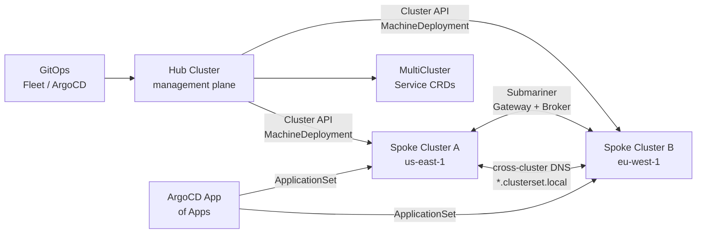

- **Cluster API (CAPI)** treats cluster provisioning as reconciliation: a `Cluster` CRD on the management cluster spins up VMs, installs kubeadm, and outputs a kubeconfig Secret — provider plugins exist for AWS, GCP, Azure, vSphere.
- **Fleet** (Rancher) and **ArgoCD ApplicationSets** distribute manifests to multiple clusters based on label selectors.
- **Submariner** creates encrypted IPsec tunnels between cluster pod CIDRs and runs a DNS broker so `svc.namespace.svc.clusterset.local` resolves cross-cluster.
- **kubefed** (KubeFederation v2) is legacy — prefer CAPI + Fleet/ArgoCD for new installs.
- Multi-cluster adds operational complexity: divergent API versions, split-brain etcd, asymmetric rollouts. Start single-cluster and add clusters when you hit a concrete limit.

<span class="stage execution">⚡ Execution</span>

**Run it yourself.**

```bash
# ─── CAPI bootstrap: create a management cluster with kind ───
# Install clusterctl
curl -L https://github.com/kubernetes-sigs/cluster-api/releases/latest/download/clusterctl-linux-amd64 \
  -o /usr/local/bin/clusterctl && chmod +x /usr/local/bin/clusterctl

# Bootstrap a local management cluster
kind create cluster --name capi-management

# Install CAPI core + Docker provider (for local lab)
export CLUSTER_TOPOLOGY=true
clusterctl init --infrastructure docker

# Generate and apply a workload cluster manifest
clusterctl generate cluster capi-quickstart \
  --flavor development \
  --kubernetes-version v1.30.0 \
  --control-plane-machine-count 1 \
  --worker-machine-count 2 | kubectl apply -f -

# Watch cluster come up
kubectl get cluster capi-quickstart -w
kubectl get machines -w

# Get kubeconfig for the new cluster
clusterctl get kubeconfig capi-quickstart > /tmp/capi-quickstart.kubeconfig
kubectl --kubeconfig /tmp/capi-quickstart.kubeconfig get nodes

# ─── Submariner cross-cluster networking ───
# (requires two real clusters, demonstrated with subctl CLI)
# subctl deploy-broker   # on hub cluster
# subctl join --kubeconfig cluster-a.kubeconfig broker-info.subm --clusterid=cluster-a
# subctl join --kubeconfig cluster-b.kubeconfig broker-info.subm --clusterid=cluster-b
# subctl verify cluster-a.kubeconfig cluster-b.kubeconfig --only connectivity

# ─── ArgoCD ApplicationSet for fleet deployment ───
kubectl apply -f - <<'EOF'
apiVersion: argoproj.io/v1alpha1
kind: ApplicationSet
metadata:
  name: guestbook
  namespace: argocd
spec:
  generators:
    - list:
        elements:
          - cluster: cluster-a
            url: https://cluster-a.example.com
          - cluster: cluster-b
            url: https://cluster-b.example.com
  template:
    metadata:
      name: "guestbook-{{cluster}}"
    spec:
      project: default
      source:
        repoURL: https://github.com/argoproj/argocd-example-apps
        targetRevision: HEAD
        path: guestbook
      destination:
        server: "{{url}}"
        namespace: guestbook
      syncPolicy:
        automated:
          prune: true
          selfHeal: true
EOF

# Teardown
kubectl delete cluster capi-quickstart
kind delete cluster --name capi-management
```

<span class="stage simulation">🔮 Simulation — what you'll see</span>

<pre class="sim"><code><span class="prompt">$</span> kubectl get cluster capi-quickstart -w
<span class="comment"># NAME               PHASE          AGE</span>
<span class="comment"># capi-quickstart    Provisioning   10s</span>
<span class="comment"># capi-quickstart    Provisioning   40s</span>
<span class="comment"># capi-quickstart    Provisioned    90s</span>

<span class="prompt">$</span> kubectl --kubeconfig /tmp/capi-quickstart.kubeconfig get nodes
<span class="comment"># NAME                                STATUS   ROLES           AGE   VERSION</span>
<span class="comment"># capi-quickstart-control-plane-xyz   Ready    control-plane   60s   v1.30.0</span>
<span class="comment"># capi-quickstart-md-0-abc            Ready    &lt;none&gt;          45s   v1.30.0</span>
<span class="comment"># capi-quickstart-md-0-def            Ready    &lt;none&gt;          45s   v1.30.0</span>
</code></pre>

<span class="stage output">✅ Output — state change</span>

<div class="flow" markdown>

<div class="state before" markdown>
##### Before
<span class="diff-del">single cluster</span>
5 000-node limit, single blast radius, one region
</div>

<div class="arrow">→</div>

<div class="state during" markdown>
##### During
<span class="diff-mod">CAPI provisioning</span>
workload cluster created declaratively; kubeconfig Secret auto-generated
</div>

<div class="arrow">→</div>

<div class="state after" markdown>
##### After
<span class="diff-add">fleet of clusters</span>
cross-cluster DNS via Submariner; fleet deployments via ApplicationSet
</div>

</div>

<span class="stage usecase">🌍 Real-world use case</span>

<div class="usecase-card" markdown>
**At Pinterest**, the infrastructure team runs 12 Kubernetes clusters managed by Cluster API with an AWS EKS provider. When a cluster needs a Kubernetes version upgrade, an engineer bumps the `KubeadmControlPlane.spec.version` field in Git. The CAPI controller performs a rolling control-plane upgrade — replacing etcd members one at a time, health-checking each before proceeding. The same GitOps flow that deploys applications also governs cluster lifecycle, giving Pinterest a single audit trail for infrastructure changes across regions.
</div>

</div>

---

## 9. StatefulSets & DB Operators

<div class="concept" markdown>

<span class="stage reason">🧭 Reason</span>

**Why this exists.** At 03:00 your Cassandra cluster auto-healed by deleting and recreating a pod — which got a new IP, lost its persistent volume claim, and tried to join the ring as a brand-new node. StatefulSets exist to prevent this: each pod gets a stable network identity (`cassandra-0`, `cassandra-1`), a dedicated PVC that survives pod deletion, and ordered start/stop semantics. DB Operators wrap StatefulSets with domain logic — automated backups, clone from snapshot, promote replica to primary — that vanilla StatefulSets cannot express.

<span class="stage thinking">🧠 Thinking</span>

**Mental model.**

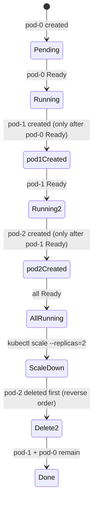

- Pods are named `<statefulset>-0`, `<statefulset>-1`, … — predictable, stable, DNS-resolvable via Headless Service.
- Each pod has its own PVC `<volumeClaimTemplate.name>-<pod-name>`. Deleting a StatefulSet does NOT delete PVCs by default — prevents accidental data loss.
- `podManagementPolicy: Parallel` skips the ordered startup — use for stateless-ish apps that happen to need stable storage.
- Rolling updates respect `updateStrategy.rollingUpdate.partition`: pods with ordinal ≥ partition get the new image; pods below are untouched — enables canary upgrades of stateful apps.
- DB Operators (CloudNative PG, Percona, Strimzi) extend StatefulSets with `Backup`, `Restore`, `ScheduledBackup` CRDs and automated failover via `Lease` leader election.

<span class="stage execution">⚡ Execution</span>

**Run it yourself.**

```bash
# Deploy a 3-node StatefulSet with stable network IDs
kubectl apply -f - <<'EOF'
apiVersion: v1
kind: Service
metadata:
  name: nginx-headless
spec:
  clusterIP: None
  selector: {app: nginx-ss}
  ports: [{port: 80}]
---
apiVersion: apps/v1
kind: StatefulSet
metadata:
  name: nginx-ss
spec:
  serviceName: nginx-headless
  replicas: 3
  selector:
    matchLabels: {app: nginx-ss}
  template:
    metadata:
      labels: {app: nginx-ss}
    spec:
      containers:
        - name: nginx
          image: nginx:alpine
          ports: [{containerPort: 80}]
          volumeMounts:
            - name: data
              mountPath: /usr/share/nginx/html
  updateStrategy:
    type: RollingUpdate
    rollingUpdate:
      partition: 2   # only pod-2 gets update; pod-0 and pod-1 untouched
  volumeClaimTemplates:
    - metadata:
        name: data
      spec:
        accessModes: [ReadWriteOnce]
        resources:
          requests:
            storage: 1Gi
EOF

kubectl wait pod nginx-ss-0 --for=condition=Ready --timeout=60s

# Verify stable DNS
kubectl run dns-test --image=busybox:1.28 --restart=Never -- \
  nslookup nginx-ss-0.nginx-headless.default.svc.cluster.local
kubectl logs dns-test

# Observe ordered creation — pod-1 waits for pod-0 Ready
kubectl get pods -l app=nginx-ss -w &
kubectl scale statefulset nginx-ss --replicas=3
wait

# Canary upgrade: only pod-2 (ordinal >= partition=2) gets updated
kubectl set image statefulset nginx-ss nginx=nginx:1.25
kubectl get pods -l app=nginx-ss -o jsonpath='{range .items[*]}{.metadata.name}: {.spec.containers[0].image}{"\n"}{end}'

# Confirm PVCs survive pod deletion
kubectl delete pod nginx-ss-2
kubectl get pvc   # data-nginx-ss-2 still exists; pod recreates and mounts it

# Teardown
kubectl delete statefulset nginx-ss
kubectl delete svc nginx-headless
kubectl delete pvc -l app=nginx-ss
kubectl delete pod dns-test --ignore-not-found
```

<span class="stage simulation">🔮 Simulation — what you'll see</span>

<pre class="sim"><code><span class="prompt">$</span> kubectl logs dns-test
<span class="comment"># Server:    10.96.0.10</span>
<span class="comment"># Name: nginx-ss-0.nginx-headless.default.svc.cluster.local</span>
<span class="comment"># Address: 10.244.1.5   ← stable IP for pod-0</span>

<span class="prompt">$</span> kubectl get pods -l app=nginx-ss -o jsonpath=...
<span class="comment"># nginx-ss-0: nginx:alpine   ← untouched (ordinal 0 < partition 2)</span>
<span class="comment"># nginx-ss-1: nginx:alpine   ← untouched (ordinal 1 < partition 2)</span>
<span class="comment"># nginx-ss-2: nginx:1.25     ← updated (ordinal 2 >= partition 2)</span>
</code></pre>

<span class="stage output">✅ Output — state change</span>

<div class="flow" markdown>

<div class="state before" markdown>
##### Before
<span class="diff-del">Deployment for DB</span>
random pod names, shared PVC, no ordering, data loss on reschedule
</div>

<div class="arrow">→</div>

<div class="state during" markdown>
##### During
<span class="diff-mod">StatefulSet rolling</span>
pod-0 comes up first; pod-1 waits; PVCs pinned to pod name
</div>

<div class="arrow">→</div>

<div class="state after" markdown>
##### After
<span class="diff-add">stable stateful cluster</span>
`nginx-ss-0.nginx-headless` DNS resolves consistently; data persists pod restarts
</div>

</div>

<span class="stage usecase">🌍 Real-world use case</span>

<div class="usecase-card" markdown>
**At Shopify**, the data-platform team runs CockroachDB on Kubernetes using the CockroachDB Operator. During a Kubernetes version upgrade, the Operator's `partition`-based canary strategy upgraded one CockroachDB node at a time — verifying range under-replication metrics fell back to zero before proceeding to the next ordinal. A full 6-node cluster upgrade completed in 40 minutes with zero client errors, replacing the previous 3-hour maintenance window with pre-drained load-balancer entries.
</div>

</div>

---

## 10. Scheduler Internals

<div class="concept" markdown>

<span class="stage reason">🧭 Reason</span>

**Why this exists.** By default, the Kubernetes scheduler places pods on nodes with the most available resources. This works until you need to co-locate pods for latency (same zone), spread them for availability (different nodes), keep GPU-hungry workloads on GPU nodes only, or implement bin-packing to reduce node count and cost. Understanding scheduler internals — the filter/score plugin pipeline — lets you write node affinity, pod affinity/anti-affinity, and topology spread constraints that make placement deterministic instead of lucky.

<span class="stage thinking">🧠 Thinking</span>

**Mental model.**

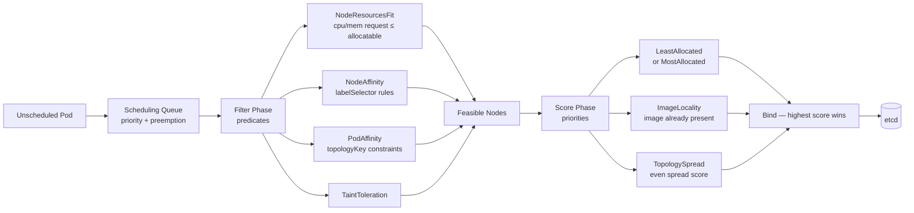

- **Filter** eliminates nodes that cannot run the pod. All filter plugins must pass; any failure drops the node.
- **Score** ranks the remaining feasible nodes. Each plugin returns a score 0–100; weights sum.
- `nodeAffinity` — pod → node relationship. `requiredDuringScheduling` is a hard constraint (filter); `preferred` is soft (score).
- `podAntiAffinity` with `topologyKey: kubernetes.io/hostname` ensures one pod per node — the canonical HA pattern.
- `topologySpreadConstraints` is the modern replacement for spread affinity — more expressive, supports `maxSkew`, `whenUnsatisfiable: DoNotSchedule | ScheduleAnyway`.

<span class="stage execution">⚡ Execution</span>

**Run it yourself.**

```bash
# Label nodes for zone simulation
kubectl label node <node-1> topology.kubernetes.io/zone=zone-a 2>/dev/null || \
  kubectl get nodes -o name | head -1 | xargs -I{} kubectl label {} topology.kubernetes.io/zone=zone-a
kubectl get nodes -o name | tail -1 | xargs -I{} kubectl label {} topology.kubernetes.io/zone=zone-b 2>/dev/null || true

# 1. Pod anti-affinity: one pod per node
kubectl apply -f - <<'EOF'
apiVersion: apps/v1
kind: Deployment
metadata:
  name: redis-ha
spec:
  replicas: 3
  selector:
    matchLabels: {app: redis-ha}
  template:
    metadata:
      labels: {app: redis-ha}
    spec:
      affinity:
        podAntiAffinity:
          requiredDuringSchedulingIgnoredDuringExecution:
            - labelSelector:
                matchLabels: {app: redis-ha}
              topologyKey: kubernetes.io/hostname   # one per node, hard constraint
      containers:
        - name: redis
          image: redis:alpine
          resources:
            requests: {cpu: 50m, memory: 64Mi}
            limits: {cpu: 100m, memory: 128Mi}
EOF

# 2. TopologySpreadConstraints: even spread across zones
kubectl apply -f - <<'EOF'
apiVersion: apps/v1
kind: Deployment
metadata:
  name: frontend-spread
spec:
  replicas: 4
  selector:
    matchLabels: {app: frontend-spread}
  template:
    metadata:
      labels: {app: frontend-spread}
    spec:
      topologySpreadConstraints:
        - maxSkew: 1
          topologyKey: topology.kubernetes.io/zone
          whenUnsatisfiable: DoNotSchedule
          labelSelector:
            matchLabels: {app: frontend-spread}
      containers:
        - name: app
          image: nginx:alpine
          resources:
            requests: {cpu: 50m, memory: 32Mi}
            limits: {cpu: 100m, memory: 64Mi}
EOF

# Check placement
kubectl get pods -l app=redis-ha -o wide
kubectl get pods -l app=frontend-spread -o wide

# Debug scheduler decisions (why a pod is pending)
kubectl get events --field-selector reason=FailedScheduling

# Simulate scheduler: which nodes would match?
kubectl get nodes -o json | \
  jq '[.items[] | {name: .metadata.name, labels: .metadata.labels}]'

# Teardown
kubectl delete deployment redis-ha frontend-spread
```

<span class="stage simulation">🔮 Simulation — what you'll see</span>

<pre class="sim"><code><span class="prompt">$</span> kubectl get pods -l app=redis-ha -o wide
<span class="comment"># NAME           NODE        STATUS</span>
<span class="comment"># redis-ha-abc   node-1      Running   ← different nodes enforced by anti-affinity</span>
<span class="comment"># redis-ha-def   node-2      Running</span>
<span class="comment"># redis-ha-ghi   node-3      Running</span>

<span class="prompt">$</span> kubectl get pods -l app=frontend-spread -o wide
<span class="comment"># NAME              NODE    ZONE    STATUS</span>
<span class="comment"># frontend-spread-1 node-1  zone-a  Running   ← 2 in zone-a</span>
<span class="comment"># frontend-spread-2 node-1  zone-a  Running</span>
<span class="comment"># frontend-spread-3 node-2  zone-b  Running   ← 2 in zone-b; maxSkew=1 satisfied</span>
<span class="comment"># frontend-spread-4 node-2  zone-b  Running</span>
</code></pre>

<span class="stage output">✅ Output — state change</span>

<div class="flow" markdown>

<div class="state before" markdown>
##### Before
<span class="diff-del">default placement</span>
all 3 pods on node-1 — one node failure = full outage
</div>

<div class="arrow">→</div>

<div class="state during" markdown>
##### During
<span class="diff-mod">scheduler filtering</span>
anti-affinity drops node-1 after pod-0 placed; topology spread scores evenly
</div>

<div class="arrow">→</div>

<div class="state after" markdown>
##### After
<span class="diff-add">deterministic spread</span>
one pod per node; zones balanced; scheduler decisions auditable via events
</div>

</div>

<span class="stage usecase">🌍 Real-world use case</span>

<div class="usecase-card" markdown>
**At Airbnb**, the compute platform team built a custom scheduler plugin (using the Kubernetes Scheduling Framework) called "gang scheduling" for their ML training jobs. Standard Kubernetes schedules pods one-by-one; a 128-GPU job might place 120 pods and then stall waiting for 8 more GPUs — holding 120 GPUs idle. The gang scheduler holds all 128 pods in a "gang" queue and only binds them all at once when all 128 nodes are available, reducing GPU idle time from 22% to under 3%.
</div>

</div>

---

## 11. CNI & eBPF Networking

<div class="concept" markdown>

<span class="stage reason">🧭 Reason</span>

**Why this exists.** Every Kubernetes pod-to-pod packet takes a path through the node's network stack. The default path — iptables rules managed by kube-proxy — adds 5–15 µs of latency per hop and does not scale: a 10,000-service cluster generates 100,000+ iptables rules, and every rule-table flush is O(n). eBPF (extended Berkeley Packet Filter) programs attach directly to the kernel's network path, bypass iptables entirely, and scale to millions of services with sub-microsecond overhead. Cilium (by Isovalent) is the CNI that replaced kube-proxy at Cloudflare, saving 15% CPU cluster-wide.

<span class="stage thinking">🧠 Thinking</span>

**Mental model.**

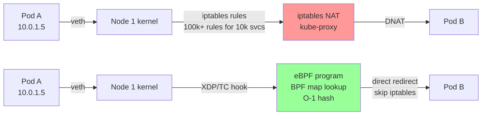

- **CNI spec**: when kubelet creates a pod, it calls the CNI binary with `ADD`/`DEL` commands. The CNI plugin sets up the veth pair, assigns an IP from the pod CIDR, and programs the routing/forwarding tables.
- **kube-proxy iptables mode**: installs PREROUTING NAT rules for every `Service`. A packet hits a `ClusterIP` → DNAT to a random endpoint. Rule flush on every Service/Endpoint change is O(n).
- **kube-proxy IPVS mode**: uses Linux Virtual Server kernel module. O(1) lookup, but still kernel netfilter path.
- **eBPF/Cilium**: attaches BPF programs to `XDP` (driver level) or `tc` (traffic control) hooks. Service → pod lookup is a BPF hash map — O(1), bypass netfilter. Also enforces `NetworkPolicy` at kernel level with zero iptables rules.
- **Network policies at scale**: iptables-based CNIs add one iptables rule per pod selector in a NetworkPolicy. Cilium translates all policies into BPF maps — constant overhead regardless of cluster size.

<span class="stage execution">⚡ Execution</span>

**Run it yourself.**

```bash
# Install Cilium as CNI on a kind cluster (replaces kube-proxy)
cat <<'EOF' > /tmp/kind-no-kubeproxy.yaml
kind: Cluster
apiVersion: kind.x-k8s.io/v1alpha4
nodes:
  - role: control-plane
  - role: worker
  - role: worker
networking:
  disableDefaultCNI: true
  kubeProxyMode: none   # Cilium replaces kube-proxy
EOF

kind create cluster --name cilium-lab --config /tmp/kind-no-kubeproxy.yaml

# Install Cilium via Helm
helm repo add cilium https://helm.cilium.io/
helm install cilium cilium/cilium \
  --namespace kube-system \
  --set kubeProxyReplacement=strict \
  --set k8sServiceHost=cilium-lab-control-plane \
  --set k8sServicePort=6443

kubectl wait pods -n kube-system -l k8s-app=cilium --for=condition=Ready --timeout=120s

# Verify Cilium is healthy and kube-proxy-free
cilium status --wait 2>/dev/null || kubectl -n kube-system exec ds/cilium -- cilium status

# Inspect BPF maps that replaced iptables
kubectl -n kube-system exec ds/cilium -- cilium bpf lb list       # service → endpoint map
kubectl -n kube-system exec ds/cilium -- cilium bpf policy list   # network policies as BPF

# Deploy a NetworkPolicy and verify it's BPF-backed (no iptables)
kubectl apply -f - <<'EOF'
apiVersion: networking.k8s.io/v1
kind: NetworkPolicy
metadata:
  name: deny-all-ingress
  namespace: default
spec:
  podSelector: {}
  policyTypes: [Ingress]
EOF

# Confirm iptables has NO policy rules (Cilium owns this)
kubectl -n kube-system exec ds/cilium -- iptables -L CILIUM_INPUT 2>/dev/null | head -5
# You'll see Cilium's own chain, not individual pod rules

# Check Hubble (Cilium's observability layer)
kubectl -n kube-system exec ds/cilium -- cilium monitor --type drop

# Teardown
kind delete cluster --name cilium-lab
```

<span class="stage simulation">🔮 Simulation — what you'll see</span>

<pre class="sim"><code><span class="prompt">$</span> kubectl -n kube-system exec ds/cilium -- cilium bpf lb list
<span class="comment"># SERVICE ADDRESS        BACKEND</span>
<span class="comment"># 10.96.0.1:443          10.244.0.2:6443 (active)</span>
<span class="comment"># 10.96.0.10:53 (UDP)    10.244.0.3:53 (active)</span>
<span class="comment">#                        10.244.0.4:53 (active)</span>
<span class="comment"># → entire service table in BPF maps; zero iptables NAT rules</span>

<span class="prompt">$</span> kubectl -n kube-system exec ds/cilium -- cilium status
<span class="comment"># KubeProxyReplacement: Strict</span>
<span class="comment"># Cilium: Ok   4/4 health checks passing</span>
<span class="comment"># BPF Maps: active</span>
</code></pre>

<span class="stage output">✅ Output — state change</span>

<div class="flow" markdown>

<div class="state before" markdown>
##### Before
<span class="diff-del">kube-proxy iptables</span>
100k+ rules; O(n) flush on every endpoint change; 5-15 µs added latency
</div>

<div class="arrow">→</div>

<div class="state during" markdown>
##### During
<span class="diff-mod">Cilium eBPF loading</span>
BPF programs attached to XDP/tc; service map built in kernel hash tables
</div>

<div class="arrow">→</div>

<div class="state after" markdown>
##### After
<span class="diff-add">iptables-free forwarding</span>
O(1) service lookup; &lt;1 µs overhead; NetworkPolicy scales to 10k+ pods
</div>

</div>

<span class="stage usecase">🌍 Real-world use case</span>

<div class="usecase-card" markdown>
**At Cloudflare**, the infrastructure team migrated their entire Kubernetes fleet from Flannel + kube-proxy to Cilium with eBPF in 2021. The result: 15% reduction in node CPU usage (previously consumed by iptables rule processing), sub-millisecond network policy enforcement on flows exceeding 1 million packets/second, and Hubble's eBPF-based flow visibility replaced 3 separate observability tools. The Isovalent team (Cilium's creators) published the Cloudflare case study showing iptables rule counts dropped from 80,000 to zero on every worker node.
</div>

</div>

---

## 12. K8s Changelog Reading (1.28 → 1.32)

<div class="concept" markdown>

<span class="stage reason">🧭 Reason</span>

**Why this exists.** Kubernetes ships three releases per year. Most engineers read the blog post headline and miss the feature gates that silently changed behaviour in their clusters. Between 1.28 and 1.32, four changes matter operationally: native sidecar containers (no more init-container hacks for Istio), in-place pod resource resize (VPA without pod eviction), structured authentication config (goodbye `--oidc-*` flags), and the removal of `PodSecurityPolicy` (replaced by PSA). Missing these means upgrading blindly, breaking admission webhooks, or missing a security feature that was already in your cluster.

<span class="stage thinking">🧠 Thinking</span>

**Mental model.**

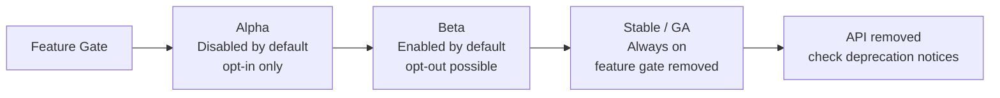

| Release | Feature Gate | Stage | Impact |
|---------|-------------|-------|--------|
| 1.28 | `SidecarContainers` | Alpha → Beta | Init containers with `restartPolicy: Always` — native sidecars |
| 1.29 | `InPlacePodVerticalScaling` | Alpha | Resize CPU/mem without pod restart |
| 1.30 | `StructuredAuthenticationConfiguration` | Beta | OIDC config as a file, not 8 flags |
| 1.31 | `InPlacePodVerticalScaling` | Beta | VPA can resize without eviction |
| 1.32 | `InPlacePodVerticalScaling` | Stable | Resizing GA — update your VPA configs |
| 1.25 | `PodSecurityPolicy` | **Removed** | Replaced by PodSecurity admission + Kyverno |

- A feature gate is a boolean `--feature-gates=Foo=true` flag on kube-apiserver, kube-controller-manager, and kubelet. In managed clusters (EKS/GKE/AKS) you cannot set these directly.
- **Sidecar containers** (`restartPolicy: Always` in initContainers): the sidecar starts before app containers, receives SIGTERM after app containers exit. This fixes the "Istio proxy blocks pod completion for Jobs" problem that plagued 1.27 and earlier.
- **In-place resize**: `kubectl patch pod` with new `resources` field. Kubernetes negotiates with the container runtime to resize cgroups without killing the process. Requires CRI support (containerd ≥ 1.7, CRI-O ≥ 1.28).

<span class="stage execution">⚡ Execution</span>

**Run it yourself.**

```bash
# ─── Feature 1: Native Sidecar Containers (1.29+ Beta, on by default) ───

kubectl apply -f - <<'EOF'
apiVersion: batch/v1
kind: Job
metadata:
  name: sidecar-demo
spec:
  template:
    spec:
      initContainers:
        - name: istio-proxy          # native sidecar — stays alive until main exits
          image: busybox:1.28
          restartPolicy: Always      # THIS is what makes it a sidecar, not restartPolicy: Never
          command: ["/bin/sh", "-c", "echo 'sidecar started'; sleep 3600"]
      containers:
        - name: main
          image: busybox:1.28
          command: ["/bin/sh", "-c", "echo 'main done'; sleep 5"]
      restartPolicy: Never
EOF

kubectl wait job sidecar-demo --for=condition=Complete --timeout=60s
# Without sidecar support, the Job would never Complete because the "init" container
# with sleep 3600 would never finish. With native sidecars, it completes correctly.
kubectl get job sidecar-demo
kubectl delete job sidecar-demo

# ─── Feature 2: In-Place Pod Resize (1.32 Stable) ───

kubectl apply -f - <<'EOF'
apiVersion: v1
kind: Pod
metadata:
  name: resize-demo
spec:
  containers:
    - name: app
      image: nginx:alpine
      resources:
        requests: {cpu: 100m, memory: 64Mi}
        limits:   {cpu: 200m, memory: 128Mi}
      resizePolicy:
        - resourceName: cpu
          restartPolicy: NotRequired   # resize CPU without restart
        - resourceName: memory
          restartPolicy: RestartContainer  # memory resize requires restart
EOF

kubectl wait pod resize-demo --for=condition=Ready --timeout=60s

# In-place resize: increase CPU limit without pod restart
kubectl patch pod resize-demo --type=merge -p \
  '{"spec":{"containers":[{"name":"app","resources":{"limits":{"cpu":"400m"},"requests":{"cpu":"200m"}}}]}}'

kubectl get pod resize-demo -o jsonpath='{.spec.containers[0].resources}' | jq .
kubectl get pod resize-demo -o jsonpath='{.status.containerStatuses[0].resources}' | jq .
# status.containerStatuses[*].resources shows the ACTUAL applied resources

# ─── Feature 3: Structured Auth Config (1.30+ Beta) ───
cat <<'EOF'
# /etc/kubernetes/auth-config.yaml  (passed to kube-apiserver as --authentication-config)
apiVersion: apiserver.config.k8s.io/v1beta1
kind: AuthenticationConfiguration
jwt:
  - issuer:
      url: https://accounts.google.com
      audiences: [my-cluster-client-id]
    claimMappings:
      username:
        claim: email
        prefix: "google:"
      groups:
        claim: groups
        prefix: "google:"
EOF
# This replaces --oidc-issuer-url, --oidc-client-id, --oidc-username-claim, etc.

# Cleanup
kubectl delete pod resize-demo
```

<span class="stage simulation">🔮 Simulation — what you'll see</span>

<pre class="sim"><code><span class="prompt">$</span> kubectl get job sidecar-demo
<span class="comment"># NAME           COMPLETIONS   DURATION   AGE</span>
<span class="comment"># sidecar-demo   1/1           8s         15s  ← Job completed despite sidecar sleeping 3600s</span>

<span class="prompt">$</span> kubectl get pod resize-demo -o jsonpath='{.status.containerStatuses[0].resources}' | jq .
<span class="comment"># {</span>
<span class="comment">#   "limits":   {"cpu": "400m", "memory": "128Mi"},</span>
<span class="comment">#   "requests": {"cpu": "200m", "memory": "64Mi"}</span>
<span class="comment"># }</span>
<span class="comment"># ← CPU resized in-place; pod still Running (no restart)</span>
</code></pre>

<span class="stage output">✅ Output — state change</span>

<div class="flow" markdown>

<div class="state before" markdown>
##### Before
<span class="diff-del">1.27 cluster</span>
Jobs hung waiting for Istio sidecar; VPA evicts pods to resize; oidc flags on API server
</div>

<div class="arrow">→</div>

<div class="state during" markdown>
##### During
<span class="diff-mod">upgrading to 1.32</span>
feature gates promoted to stable; structured auth file replaces 8 CLI flags
</div>

<div class="arrow">→</div>

<div class="state after" markdown>
##### After
<span class="diff-add">1.32 cluster</span>
sidecar Jobs complete; VPA resizes in-place; auth config in version-controlled file
</div>

</div>

<span class="stage usecase">🌍 Real-world use case</span>

<div class="usecase-card" markdown>
**At Datadog**, the platform team tracks every Kubernetes feature gate in a spreadsheet tied to their EKS version upgrade timeline. When `InPlacePodVerticalScaling` reached Beta in 1.31, they immediately updated their VPA Operator to emit `patch pod` calls instead of evictions for CPU-only recommendations — reducing pod restart events across their fleet by 40% per week. Their internal post-upgrade checklist includes running `kubectl get nodes -o jsonpath='{.items[*].status.nodeInfo.kubeletVersion}'` to verify version uniformity before enabling any new gate.
</div>

</div>

---

> **You've completed the K8s Advanced module.** Your next step: pick the concept that closest matches your next on-call rotation — CRDs if you're building platform tooling, Cilium if you're on networking, HPA + VPA if you're on cost optimisation — and run every execution block in a local kind cluster before you need it in production.
