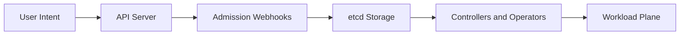
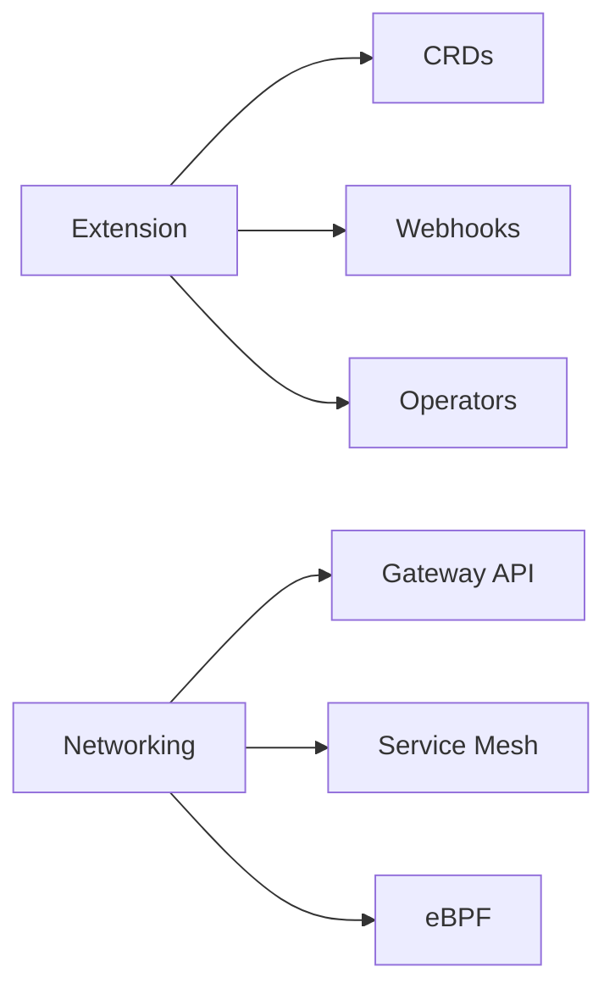
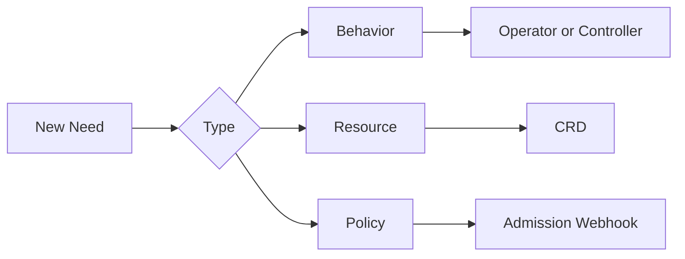
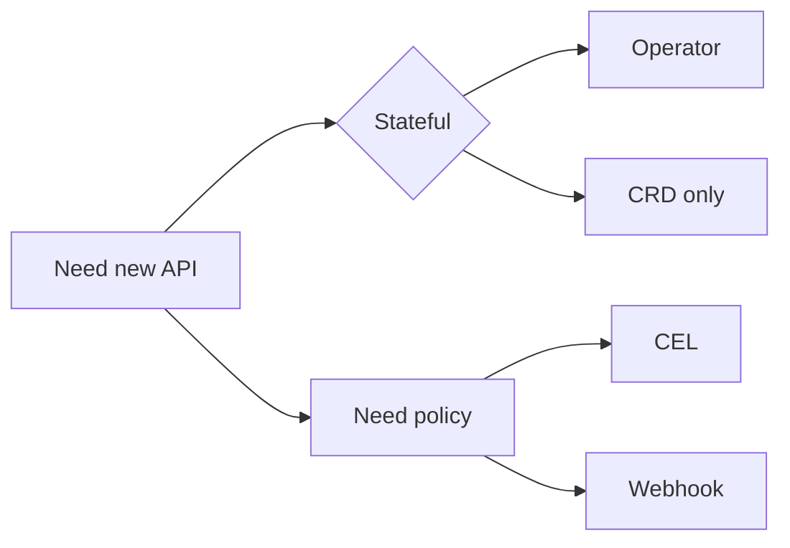

# Kubernetes Advanced Mastery

Architect-level pack for Kubernetes extension, multi-cluster, mesh, and gateway topics.

## Index

| File | Audience | What it covers |
|------|----------|----------------|
| [architect-qa.md](architect-qa.md) | Architects, staff engineers | 60+ deep Q&A across CRDs, operators, webhooks, scheduler, gateway, mesh, multi-cluster, eBPF, multi-tenancy |
| [eli10.md](eli10.md) | Beginners, kids, juniors | Plain-language analogies for every advanced concept with diagrams + kubectl steps |
| [visual-flows.md](visual-flows.md) | Visual learners | 10 mermaid flowcharts of internal control loops, sidecar inject, gateway routing, eBPF hooks |

## How the advanced topics fit together



## Reading order

1. Start with eli10 to ground every concept in a metaphor.
2. Skim visual-flows to see how control plane and data plane interact.
3. Sit with architect-qa for the design tradeoffs and decision frameworks.

## Mastery rubric

| Level | Signal |
|-------|--------|
| Aware | You can name CRD, webhook, mesh, gateway-api, eBPF |
| Operating | You can install Istio, write a basic operator, debug a webhook timeout |
| Designing | You can choose between operator and helm, pick CRD storage version, design mesh adoption |
| Architecting | You can defend tradeoffs across multi-cluster, DRA, eBPF dataplane, federation |

## Topic map



## Cross-links to base content

| Subject | Path |
|---------|------|
| CRDs and operators | ../01-crds-and-operators/ |
| Admission controllers | ../02-admission-controllers/ |
| Scheduling | ../03-scheduling/ |
| Service mesh | ../04-service-mesh/ |
| Gateway API | ../05-gateway-api/ |
| Multi-cluster | ../06-multi-cluster/ |
| Stateful workloads | ../07-stateful-workloads/ |
| Batch and AI | ../08-batch-and-ai-workloads/ |
| Extending the API | ../09-extending-the-api/ |
| Troubleshooting | ../11-troubleshooting-deep-dive/ |

## Conventions

- Architect Q&A items are problem-first. Read the question, think for 30 seconds, then read the answer.
- ELI10 entries always carry: analogy, real meaning, mermaid picture, kubectl steps.
- Visual flows are deliberately small. They model the decision moment, not every edge.

## When to reach for what



## Common pitfalls

- Building an operator when a helm chart suffices.
- Using a single CRD storage version forever and never bumping it.
- Adding mutating webhooks to the hot path without timeout budgets.
- Adopting a service mesh before observability is in place.
- Choosing federation when GitOps fan-out would solve the problem.

## Anti-patterns to avoid

| Anti-pattern | Why it hurts | Better |
|--------------|--------------|--------|
| Mutating webhook on every pod | Adds latency, breaks API server during outages | Defaulting via CRD or admission policy |
| One mega CRD with 200 fields | Hard to evolve, hard to RBAC | Multiple small CRDs |
| Cluster-wide operator for tenant resources | Blast radius, RBAC nightmare | Namespaced operator |
| Mesh for east-west only | Half the value, full the cost | All traffic or none |
| Custom scheduler from day one | Operational overhead | Scheduler plugins or scoring extender |

## Quick start

```bash
ls ../
cat architect-qa.md | less
cat eli10.md | less
cat visual-flows.md | less
```

## Suggested study cadence

| Week | Focus |
|------|-------|
| 1 | CRDs and operators, write one |
| 2 | Admission webhooks, write a validating one |
| 3 | Scheduler plugins or extenders, deploy one |
| 4 | Service mesh installation and traffic management |
| 5 | Gateway API migration from Ingress |
| 6 | Multi-cluster topology and federation tradeoffs |
| 7 | eBPF dataplane evaluation |
| 8 | Multi-tenant scheduling, DRA |

## Hot context for the architect interview

- CRD vs ConfigMap: CRD when you want typed validation, status, and controllers.
- Operator vs Helm: Operator when day-2 ops require runtime decisions.
- Mutating vs Validating webhooks: Mutating defaults, Validating enforces.
- Gateway API vs Ingress: Gateway for multi-tenant, role-split, protocol-rich.
- Cilium vs Calico: Cilium for eBPF and mesh-lite, Calico for policy maturity.
- DRA vs device plugins: DRA for sharable, scheduled, lifecycle-aware devices.

## Versioning of this pack

| Date | Change |
|------|--------|
| 2026-04 | Initial mastery pack created |

## Pointers to authoritative sources

- kubernetes.io for API reference
- KEPs in kubernetes/enhancements for design intent
- SIG-API-Machinery for CRD evolution
- SIG-Network for Gateway API
- SIG-Scheduling for DRA and plugins

## Decision frameworks at a glance



## Glossary of acronyms

| Term | Meaning |
|------|---------|
| CRD | Custom Resource Definition |
| CR | Custom Resource (instance of a CRD) |
| CEL | Common Expression Language |
| DRA | Dynamic Resource Allocation |
| HPA | Horizontal Pod Autoscaler |
| VPA | Vertical Pod Autoscaler |
| PDB | Pod Disruption Budget |
| KEP | Kubernetes Enhancement Proposal |
| GW API | Gateway API |
| mTLS | mutual TLS |

## Cluster maturity ladder

| Stage | Marker | Risk if skipped |
|-------|--------|-----------------|
| 1 | Single cluster, manifests | Drift between envs |
| 2 | Helm and GitOps | Snowflake clusters |
| 3 | CRDs and first operators | Day-2 toil |
| 4 | Admission policy at platform layer | Security gaps |
| 5 | Service mesh and Gateway API | Inconsistent traffic policy |
| 6 | Multi-cluster with fleet GitOps | Single-region blast radius |
| 7 | DRA, eBPF, custom scheduling | Resource waste at scale |

## Tools you should be familiar with

- kubebuilder and operator-sdk for CRDs and controllers.
- kustomize and helm for manifests.
- kyverno or OPA gatekeeper for policy.
- istio, linkerd, cilium for mesh and dataplane.
- argo cd and flux for GitOps.
- cluster-api for fleet provisioning.
- velero for backup and restore.
- karpenter or cluster-autoscaler for elasticity.

## Suggested labs

1. Bootstrap a CRD with kubebuilder and write a reconciler.
2. Add a validating webhook with cert-manager certificates.
3. Replace the webhook with a ValidatingAdmissionPolicy.
4. Install a service mesh and migrate one app to mTLS strict.
5. Migrate one Ingress to Gateway API HTTPRoute.
6. Stand up two clusters and federate one app via Argo CD.
7. Deploy Cilium and replace kube-proxy.
8. Write a scheduler plugin that scores by GPU memory.

## Reading list

- Programming Kubernetes by Hausenblas and Schimanski.
- Kubernetes Operators by Dobies and Wood.
- Production Kubernetes by Strong, Volz, and others.
- Istio in Action by Posta and Maloku.
- KEPs in the kubernetes/enhancements repository for forward-looking design.

## Self-assessment checklist

Before claiming mastery, you should be able to:

- Write a CRD with structural schema, defaulting, and CEL validation rules.
- Explain storage version vs served version and demonstrate a conversion webhook.
- Build a controller in Go with kubebuilder that reconciles to status conditions.
- Diagnose a webhook outage and recover the API server.
- Choose between ValidatingAdmissionPolicy and a webhook for a given problem.
- Defend a service mesh adoption plan including SLI, rollback, and cost.
- Compare Gateway API to Ingress in a multi-team environment.
- Diagram a multi-cluster topology and identify the failure domains.
- Justify Cilium vs Calico for a specific workload mix.
- Explain DRA semantics and why device plugins do not suffice.

## Common interview traps

- Confusing controller and operator. Operator is a kind of controller bundled with a CRD.
- Forgetting that mutating webhook order is unspecified.
- Believing federation is the only multi-cluster pattern.
- Assuming mesh adds value without observability investment.
- Treating CRDs as configuration; they are typed APIs with their own contract.

## Mermaid health check

If your mermaid renders blank, the usual causes are:
- Unquoted brackets or quotes inside a label.
- Use of \n instead of br in HTML form.
- Subgraphs without a closing end keyword.
- Edges that reference undeclared node IDs.

## Performance budgets you should memorize

| Concern | Rule of thumb |
|---------|---------------|
| Admission webhook latency | under 100 ms p99 |
| Controller workqueue depth | under 100 sustained |
| Etcd db size | under 8 GB |
| CRD conversion webhook | under 30 ms p99 |
| Scheduler bind latency | under 1 s p99 |

## Closing

The advanced surface area of Kubernetes is large, but most decisions reduce to four levers: who owns the CRD, who runs the controller, where the policy lives, and how the data plane moves bytes. Keep these in mind while reading the rest of this pack.
