# ELI10 — Advanced Kubernetes for 10-Year-Olds

Each concept gets: an analogy, what it really is, a simple picture, and the kubectl steps to try it.

---

## 1. CRD — Custom Resource Definition

### Analogy
Imagine your toy box only has cars and dolls. A CRD is when you tell the toy box, please also accept Lego dragons. Now Lego dragon is a real type of toy your toy box knows about.

### Real meaning
A CRD teaches the Kubernetes API server a new kind of object. After you install one, kubectl get dragons works just like kubectl get pods.

### Picture

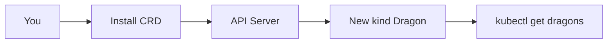

### Try it
```bash
kubectl apply -f dragon-crd.yaml
kubectl get crds | grep dragon
kubectl apply -f my-dragon.yaml
kubectl get dragons
kubectl describe dragon firstborn
```

### Why kids should care
Without CRDs, every team would invent secret YAML files. With CRDs, your custom thing becomes a first-class citizen with validation, RBAC, and tooling.

---

## 2. Operator — The Robot That Watches Your Toys

### Analogy
You have a goldfish. An operator is a robot helper that watches the bowl, refills water, feeds the fish, and tells you if it gets sick. You just say I want a healthy goldfish; the robot does the rest.

### Real meaning
An operator is a controller that watches a custom resource and takes care of the day-to-day work for it: install, upgrade, backup, repair.

### Picture

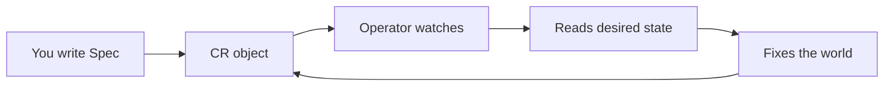

### Try it
```bash
kubectl apply -f goldfish-operator.yaml
kubectl apply -f my-goldfish.yaml
kubectl get goldfish
kubectl describe goldfish nemo
kubectl logs deploy/goldfish-operator
```

### Why kids should care
Robots never sleep. The operator notices a broken goldfish at 3 AM and fixes it before anyone wakes up.

---

## 3. Admission Webhook — The Bouncer at the Toy Store

### Analogy
A bouncer stands at the toy store door. Every toy that wants to enter must show a wristband. No wristband, no entry. Some bouncers also draw a stamp on your hand before letting you in.

### Real meaning
An admission webhook checks every object before it is saved in the cluster. Validating webhooks say yes or no. Mutating webhooks change the object on the way in.

### Picture

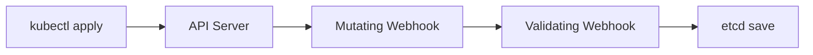

### Try it
```bash
kubectl apply -f bouncer-webhook.yaml
kubectl apply -f bad-pod.yaml
kubectl apply -f good-pod.yaml
kubectl describe validatingwebhookconfiguration bouncer
kubectl logs deploy/bouncer-webhook
```

### Why kids should care
Without bouncers, anybody can sneak in unsafe toys. The bouncer keeps the toy store safe and tidy.

---

## 4. Service Mesh — The Magical Phone Line

### Analogy
Every kid in your class has a magic phone. When they call each other, the call is private, you can hear who called whom, you can tell some kids not to call others, and if one phone breaks the system retries automatically.

### Real meaning
A service mesh wraps each pod with a tiny helper called a sidecar. The sidecars handle encryption, retries, observability, and policy without changing the app.

### Picture

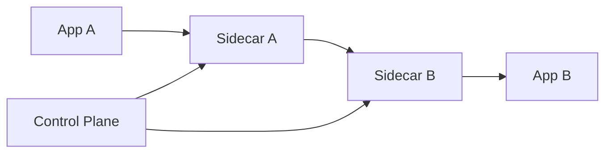

### Try it
```bash
istioctl install --set profile=demo
kubectl label namespace play istio-injection=enabled
kubectl apply -f bookinfo.yaml -n play
kubectl get pods -n play
istioctl proxy-status
```

### Why kids should care
Without the magic phone, every kid would have to learn how to whisper, retry, and check IDs. With the mesh, they can focus on the conversation.

---

## 5. Gateway API — The Smart School Gate

### Analogy
The school gate has rules: students enter from the left, parents from the right, teachers through the back. Each rule is written on a sign and the guard reads them. If the rules change, you update the signs, not the gate.

### Real meaning
Gateway API splits responsibility: platform team owns the Gateway, app teams own HTTPRoutes that attach to it. It supports HTTP, gRPC, TCP, UDP and replaces Ingress with a richer model.

### Picture

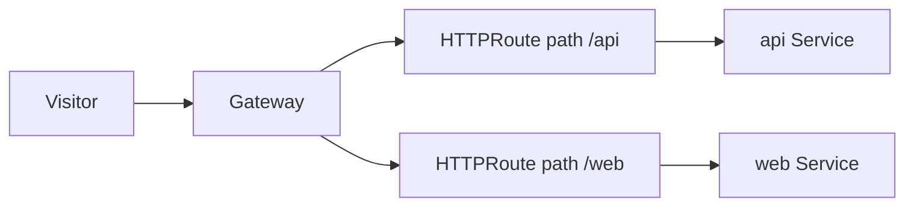

### Try it
```bash
kubectl apply -f gatewayclass.yaml
kubectl apply -f my-gateway.yaml
kubectl apply -f api-route.yaml
kubectl get gateway,httproute
kubectl describe httproute api-route
```

### Why kids should care
The gate stays the same, but the rules change without anyone climbing the wall.

---

## 6. DRA — Smart Cookie Ration System

### Analogy
There is a cookie jar in class. Old way: each kid grabs whatever cookie. New way: kids ask the cookie monitor for a cookie that matches their needs (chocolate, gluten-free, half-cookie). The monitor reserves the right cookie before the kid sits down.

### Real meaning
Dynamic Resource Allocation lets pods claim devices like GPUs through structured ResourceClaims. The scheduler reserves the device before binding the pod, supporting partial use, sharing, and lifecycle.

### Picture

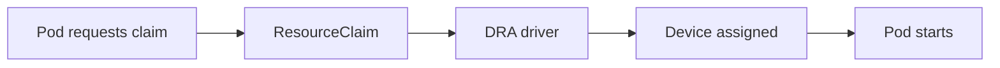

### Try it
```bash
kubectl apply -f resourceclass.yaml
kubectl apply -f resourceclaim.yaml
kubectl apply -f gpu-pod.yaml
kubectl get resourceclaim
kubectl describe pod gpu-pod
```

### Why kids should care
Everyone gets the right cookie. No fights, no waste, no kid sitting down hungry.

---

## 7. eBPF — Magic Goggles for the Network

### Analogy
You wear goggles that let you see every paper note flying around the classroom. You can also catch some notes, change a word, or send them faster. You do this without the kids knowing.

### Real meaning
eBPF runs tiny safe programs inside the Linux kernel. In Kubernetes it powers fast networking, observability, and security without modifying the kernel itself.

### Picture

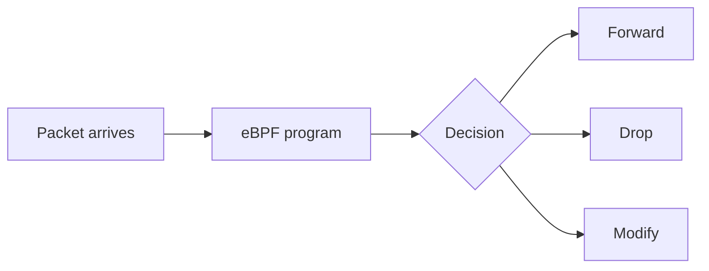

### Try it
```bash
cilium install
cilium status
kubectl exec -it test-pod -- curl other-svc
hubble observe --pod test-pod
cilium connectivity test
```

### Why kids should care
The classroom runs faster and everyone knows what is going on, but you do not have to rewrite anything.

---

## 8. Multi-Cluster — Many Classrooms, One School

### Analogy
Your school has classrooms in different buildings. Each room teaches the same lessons but the teachers and supplies are local. The principal makes sure all rooms follow the same school rules.

### Real meaning
Multi-cluster Kubernetes runs workloads across several clusters for blast-radius, geography, or compliance. Tools like Cluster API, Argo CD, and KubeFed coordinate.

### Picture

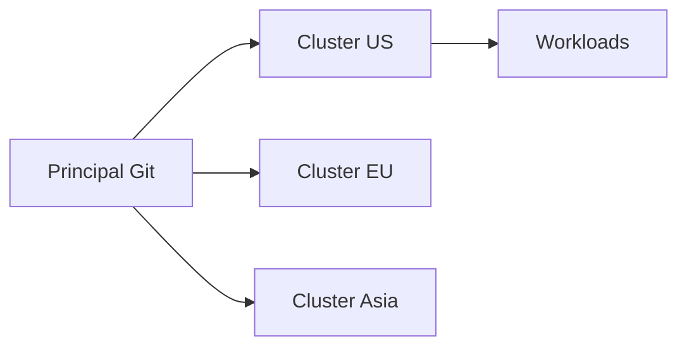

### Try it
```bash
kubectl config get-contexts
kubectl --context us get nodes
kubectl --context eu get nodes
argocd app list
argocd app sync my-app
```

### Why kids should care
If one classroom floods, the others keep teaching. Lessons keep flowing.

---

## 9. Scheduler Plugin — Picking Lunch Tables

### Analogy
At lunch, a smart helper picks where each kid sits. They check who likes whom, which tables are full, who needs the gluten-free table. They decide super fast and everyone sits down happy.

### Real meaning
The scheduler decides which node a pod runs on. Plugins extend this decision with custom Filter and Score logic, all in-process.

### Picture

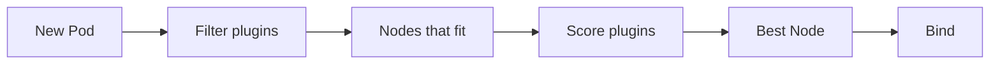

### Try it
```bash
kubectl get pods -n kube-system | grep scheduler
kubectl logs -n kube-system kube-scheduler-xxx
kubectl get pod my-pod -o yaml | grep schedulerName
kubectl describe pod my-pod | grep -A5 Events
```

### Why kids should care
A bad helper sits a peanut-allergy kid next to peanut butter. A great helper never does that.

---

## 10. Reconciliation Loop — The Tidy Robot

### Analogy
You have a robot whose only job is to keep your room tidy. It looks at how the room should be (bed made, books shelved), looks at how it is, and fixes the difference. It never stops checking.

### Real meaning
Every controller in Kubernetes runs a reconciliation loop: observe current state, compare to desired state, act to close the gap, repeat.

### Picture

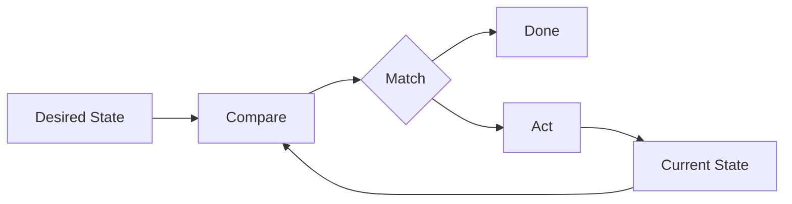

### Try it
```bash
kubectl apply -f deployment.yaml
kubectl get deployment my-app -w
kubectl scale deployment my-app --replicas=5
kubectl delete pod my-app-xxx
kubectl get pods -l app=my-app
```

### Why kids should care
You can sleep, the robot keeps tidying. Even if a meteor messes up your shelf, the robot fixes it.

---

## 11. Sidecar Injection — The Buddy System

### Analogy
On a field trip, every kid gets a buddy. The teacher does not ask, they pair you up automatically as you board the bus. The buddy walks with you, carries water, helps if you fall.

### Real meaning
A mutating webhook adds a sidecar container to your pod at admission time. You did not ask for it; the platform pairs you.

### Picture

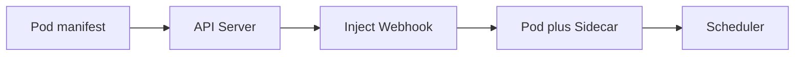

### Try it
```bash
kubectl label namespace play istio-injection=enabled
kubectl apply -f my-app.yaml -n play
kubectl get pod my-app -n play -o jsonpath='{.spec.containers[*].name}'
kubectl describe pod my-app -n play | grep istio-proxy
```

### Why kids should care
Every kid is safer with a buddy. You did not have to remember; the system did.

---

## 12. Validating Admission Policy — The Class Rule Sign

### Analogy
A sign on the wall says no running, no shouting, no candy. Every kid reads it and follows. No teacher needed at the door.

### Real meaning
ValidatingAdmissionPolicy uses CEL expressions inline in the API server. No webhook, no network call, just a rule the API server evaluates.

### Picture

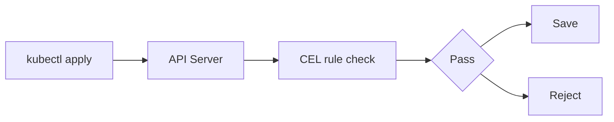

### Try it
```bash
kubectl apply -f no-privileged-policy.yaml
kubectl apply -f privileged-pod.yaml
kubectl get validatingadmissionpolicy
kubectl describe validatingadmissionpolicybinding no-privileged
```

### Why kids should care
Rules on the wall scale to a whole school. You do not need a teacher at every door.

---

## Closing for kids

Kubernetes is just a school full of helpers, robots, and rules. Each advanced feature is a way to add a new helper or write a new rule. If you can name what each helper does, you understand Kubernetes at the architect level.
