# Visual Flows — Advanced Kubernetes

Ten small mermaid flowcharts, each focused on one decision moment. Read top to bottom; do not try to extract every edge. The point is the shape.

---

## 1. CRD Reconciliation Loop

The core of every controller: observe, compare, act, repeat.

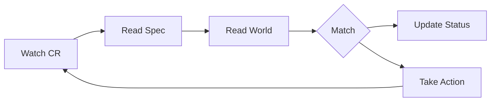

Notes:
- Level-triggered. Missed events are fine because the next loop re-reads.
- Status updates are also writes; they trigger another loop. Design for idempotence.
- Workqueue rate-limits retries; do not sleep inside Reconcile.

---

## 2. Admission Decision

What happens between kubectl apply and etcd write.

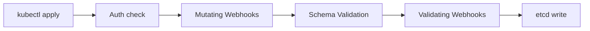

Notes:
- Mutating runs before Validating.
- Mutating webhooks may reinvoke if a later mutation triggers reinvocationPolicy.
- Schema validation runs between mutating and validating; CEL on the schema fires here.

---

## 3. Scheduler Plugin Chain

Where extension points fire as a Pod becomes a binding.

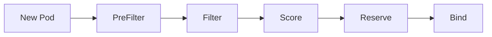

Notes:
- Filter eliminates nodes; Score ranks the survivors.
- Reserve grants in-memory account before Bind hits the API.
- Permit can wait or deny just before Bind, useful for gang scheduling.

---

## 4. Service Mesh Sidecar Inject

How a Pod gains a proxy without code changes.

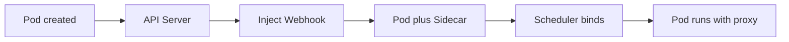

Notes:
- Webhook reads namespace label like istio-injection enabled.
- Adds an init container for iptables and a sidecar for the proxy.
- Removing the label affects only future pods, not running ones.

---

## 5. Gateway, HTTPRoute, Backend

How a request flows through the modern Gateway API.

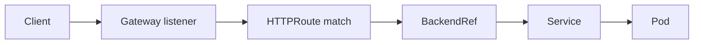

Notes:
- Gateway is the L4 entry, owned by the platform.
- HTTPRoute selects backends by hostname, path, header.
- ReferenceGrant required for cross-namespace BackendRef.

---

## 6. eBPF tc Hook Intercept

A packet meets an in-kernel program before it reaches userspace.

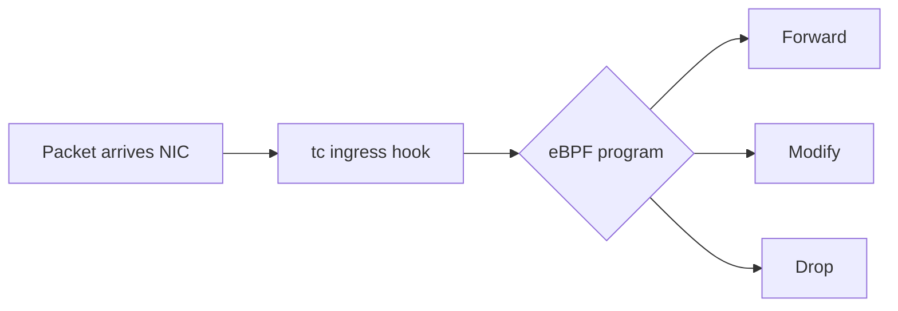

Notes:
- tc hook runs early, before iptables.
- Programs are verified for safety before load.
- Decisions are O of 1; no per-rule walk like iptables.

---

## 7. Operator Lifecycle for a Stateful Workload

The day-2 dance an operator performs.

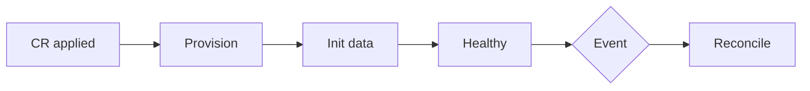

Notes:
- Events include scale, upgrade, node failure, backup window.
- Reconcile loops back to Healthy when the world matches Spec again.
- Finalizers gate deletion until external state is cleaned.

---

## 8. Multi-Cluster Service Resolution

How a client in cluster A reaches a Pod in cluster B.

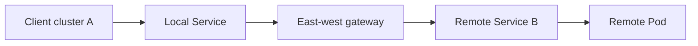

Notes:
- East-west gateway terminates and re-establishes mTLS.
- Locality routing prefers in-cluster endpoints first.
- ClusterSet model exposes services by exported name.

---

## 9. CRD Conversion Webhook Path

How two CRD versions coexist on the wire.

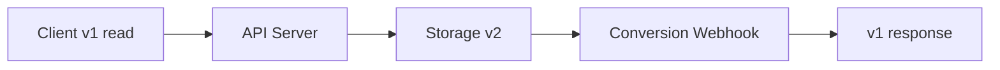

Notes:
- Storage version is single; served versions can be many.
- Conversion must be lossless and round-trip safe.
- Webhook should be stateless and fast; it is on every read and write.

---

## 10. DRA — Dynamic Resource Allocation Flow

How a Pod claims a GPU through structured DRA.

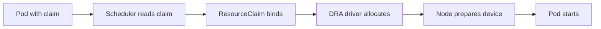

Notes:
- Claim is allocated before Pod is bound to a node.
- DRA driver runs on the node and prepares the device before kubelet starts the container.
- Supports sharing, partitioning, and lifecycle that device plugins cannot.

---

## How to read these flows

Each flow models the moment a decision is made. The arrows are not always the only path; they are the path you should defend in a design review. If you can re-draw any of these from memory and explain who owns each box, you can hold your own at the architect level.

## Where to go next

| Want | Read |
|------|------|
| The deep tradeoffs | architect-qa.md |
| Plain language | eli10.md |
| Hands-on labs | ../01-crds-and-operators/ through ../11-troubleshooting-deep-dive/ |

## Common questions about these flows

- Why are CRD reconciliation and operator lifecycle separate? Reconciliation is the engine; operator lifecycle is the journey. Both use the same loop but at different scopes.
- Why does the admission flow not show authentication? Authentication is upstream of admission; it gates whether the request enters the pipeline at all.
- Why is eBPF shown only at the tc hook? Because that is the single most consequential hook for Kubernetes networking. XDP is even earlier but rarely used in cluster dataplanes.
- Why is multi-cluster shown via a gateway and not flat L3? Most production multi-cluster setups cannot rely on flat L3; the gateway is the realistic path.
- Why is DRA shown end-to-end? Because the value of DRA is precisely that allocation happens before binding, which device plugins cannot do.

## Drawing tips for your own diagrams

- Keep node count small; six is the comfort limit.
- Use angle-bracket br for line breaks in labels.
- Quote labels with brackets if they include punctuation.
- Avoid quotes inside quoted labels.
- Prefer flowchart LR for control flow, TB for hierarchies, sequenceDiagram for timing.

## Mental model recap

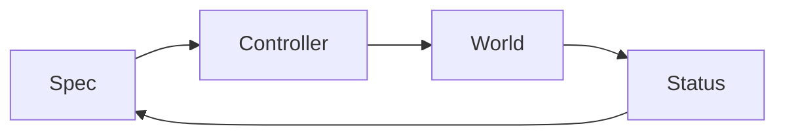

Every advanced Kubernetes pattern is some elaboration of this loop. CRDs add a new Spec type. Operators add a new Controller. Webhooks gate the Spec entering the loop. Mesh and gateway shape how the World responds. Multi-cluster fans the loop across boundaries. eBPF makes the World faster.
