# Kubernetes Production Best Practices

<p class="hero strategies"><h1>03 · Kubernetes <em>Production Best Practices</em></h1><p class="tagline">A visual audit of the 50-item LearnKube checklist — what holds up, what's stale, and what's missing for modern K8s (1.28+).</p></p>

<div class="learning-stages" markdown>
<span class="stage reason">Reason</span>
<span class="stage thinking">Thinking</span>
<span class="stage execution">Execution</span>
<span class="stage simulation">Simulation</span>
<span class="stage output">Output</span>
<span class="stage usecase">Use-case</span>
</div>

---

## Page Architecture — What LearnKube Covers

<div class="concept" markdown>

### The 50-Item Checklist Map

<span class="stage reason">Reason</span> — Before deploying to production, you need a **structured checklist** that covers application-level, governance, and cluster-level concerns. LearnKube organizes this into three nested layers.

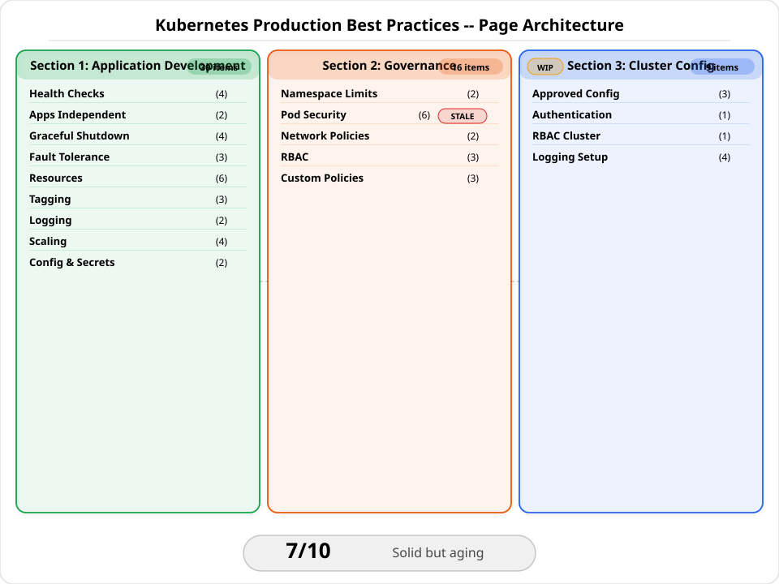

| Section | Items | Coverage | Status |
|---------|------:|----------|--------|
| **1. Application Development** | 30 | Health, shutdown, scaling, config | Current |
| **2. Governance** | 16 | Namespaces, security, RBAC, policies | Partially stale |
| **3. Cluster Configuration** | 9 | CIS, auth, logging | Incomplete (WIP) |

</div>

---

## Audit Findings — Issues Discovered

<div class="concept" markdown>

### What We Found Wrong

<span class="stage thinking">Thinking</span> — We audited every section, link, and code example. Here's the full findings map.

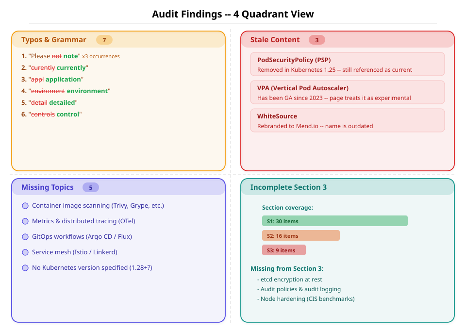

<div class="flow" markdown>
<div class="state before" markdown>

##### Typos & Grammar (7)

| # | Found | Should be | Section |
|---|-------|-----------|---------|
| 1 | "Please **not** that" | "Please **note** that" | Business labels (×2) |
| 2 | Same typo | Same fix | Security labels |
| 3 | "**curently**" | "**currently**" | VPA section |
| 4 | "version of the **appl**" | "**application**" | Technical labels |
| 5 | "**enviroment**" | "**environment**" | Secrets heading |
| 6 | "a **detail** explanation" | "a **detailed**" | Graceful shutdown |
| 7 | "easier to **controls**" | "easier to **control**" | RBAC governance |

</div>
<div class="arrow">→</div>
<div class="state after" markdown>

##### Stale Content (3 critical)

| Item | Impact | Modern replacement |
|------|--------|--------------------|
| **PodSecurityPolicy** | **HIGH** — removed K8s 1.25 | Pod Security Admission + Standards |
| **VPA "still in beta"** | **MED** — VPA is GA since 2023 | Remove beta warning, recommend VPA |
| **WhiteSource link** | LOW — rebranded to Mend.io | Update URL |

</div>
</div>

</div>

---

## Health Checks — Reasoning Flow

<div class="concept" markdown>

### Readiness vs Liveness vs Startup Probes

<span class="stage reason">Reason</span> — The single most impactful production decision: **how does Kubernetes know your app is ready?**

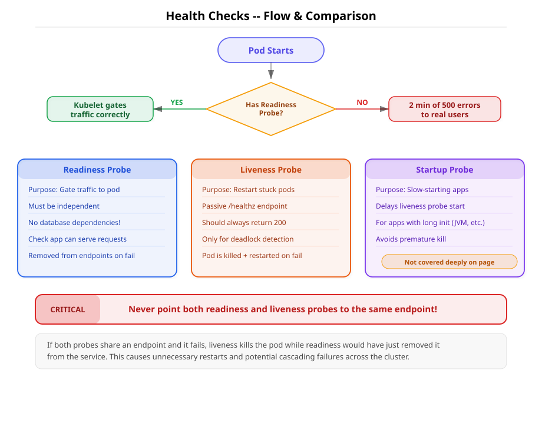

<span class="stage thinking">Thinking</span> — Let's trace the decision flow:

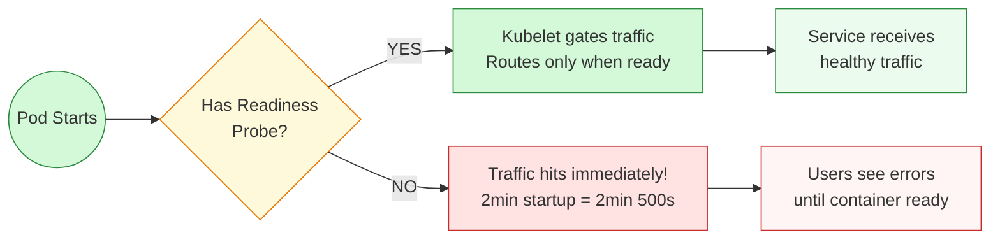

<span class="stage execution">Execution</span> — The three probe types serve distinct purposes:

| Probe | Purpose | When it fires | Kill action | Key rule |
|-------|---------|---------------|-------------|----------|
| **Readiness** | Gate traffic | Before routing | Remove from Service | Must be **independent** — no DB deps |
| **Liveness** | Restart stuck pods | Periodic check | Kill + restart container | **Passive** — always return 200 |
| **Startup** | Slow-start apps | Before liveness | Delays liveness checks | Use for Java/heavy init apps |

<div class="sim" markdown>
```yaml
# Correct probe configuration
apiVersion: v1
kind: Pod
spec:
  containers:
  - name: app
    readinessProbe:
      httpGet:
        path: /ready     # Separate endpoint!
        port: 8080
      initialDelaySeconds: 5
      periodSeconds: 10
    livenessProbe:
      httpGet:
        path: /healthz   # Different from readiness!
        port: 8080
      initialDelaySeconds: 15
      periodSeconds: 20
    startupProbe:
      httpGet:
        path: /healthz
        port: 8080
      failureThreshold: 30
      periodSeconds: 10
```
</div>

!!! danger "Critical anti-pattern"
    **Never point readiness and liveness probes to the same endpoint.** When both fail simultaneously, kubelet removes from Service AND kills the container — dropping all in-flight connections with no drain time.

<div class="usecase-card" markdown>
**Real-world scenario:** Your app connects to Redis. You add `redis.ping()` to the readiness probe. Redis goes down for 30 seconds. Result: every pod fails readiness → removed from Service → entire application offline. The correct approach: readiness checks only the app's own HTTP server, never downstream dependencies.
</div>

</div>

---

## Graceful Shutdown — Pod Deletion Sequence

<div class="concept" markdown>

### What Happens When a Pod is Deleted

<span class="stage reason">Reason</span> — Pod deletion is not instant. Two parallel paths race against each other, and if your app doesn't handle it correctly, users see dropped connections.

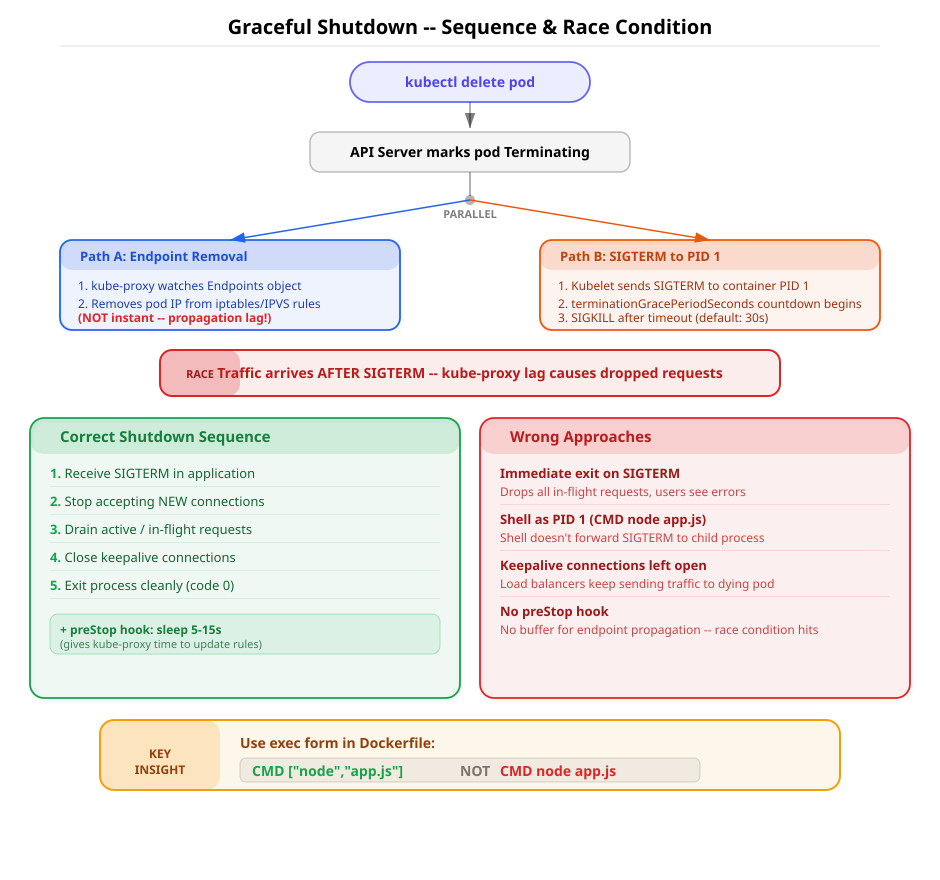

<span class="stage thinking">Thinking</span> — The timeline of a pod deletion:

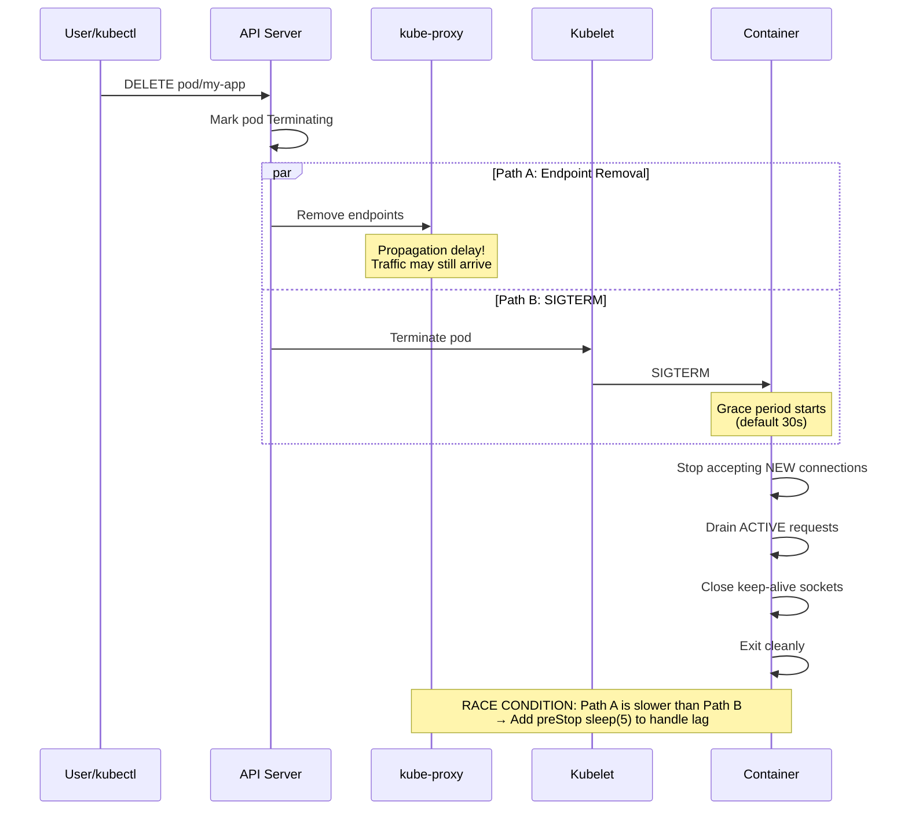

<span class="stage execution">Execution</span> — The correct vs wrong shutdown patterns:

<div class="flow" markdown>
<div class="state before" markdown>

##### Wrong Approaches

```
✗ Immediate process.exit(0)
  → Drops all in-flight requests

✗ Shell as PID 1 (CMD node app.js)
  → /bin/sh traps SIGTERM
  → Container killed at 30s timeout

✗ Keep-alive sockets left open
  → Clients still route to dead pod
```

</div>
<div class="arrow">→</div>
<div class="state after" markdown>

##### Correct Sequence

```
1. Receive SIGTERM
2. Stop accepting NEW connections
3. Complete all ACTIVE requests
4. Close idle keep-alive sockets
5. Exit process cleanly
+ preStop hook: sleep(5s) for race
```

</div>
</div>

!!! tip "Dockerfile key insight"
    Use `CMD ["node", "app.js"]` (**exec form**) — NOT `CMD node app.js` (**shell form**). Shell form wraps the process in `/bin/sh`, which **traps SIGTERM** and never forwards it to your application. Your app never knows it should shut down.

<div class="sim" markdown>
```yaml
# preStop hook to handle the race condition
lifecycle:
  preStop:
    exec:
      command: ["sh", "-c", "sleep 5"]
terminationGracePeriodSeconds: 30
```
</div>

</div>

---

## Fault Tolerance — Surviving Node Failures

<div class="concept" markdown>

### The Three Pillars of Pod Resilience

<span class="stage reason">Reason</span> — Nodes die. Cloud providers have outages. Kernel panics happen. Your deployment must survive any single point of failure.

<span class="stage execution">Execution</span> — Three mandatory controls:

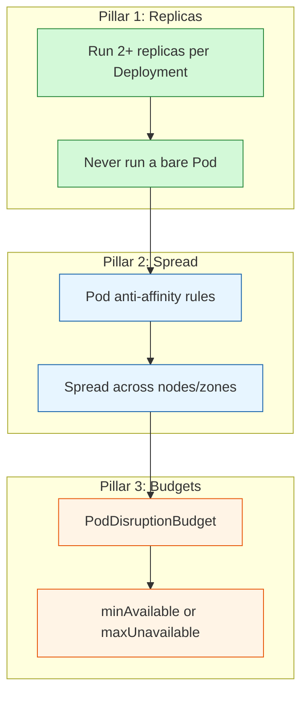

<div class="sim" markdown>
```yaml
# Pod anti-affinity + PDB combo
apiVersion: apps/v1
kind: Deployment
spec:
  replicas: 3
  template:
    spec:
      affinity:
        podAntiAffinity:
          preferredDuringSchedulingIgnoredDuringExecution:
          - weight: 100
            podAffinityTerm:
              labelSelector:
                matchExpressions:
                - key: app
                  operator: In
                  values: ["my-app"]
              topologyKey: kubernetes.io/hostname
---
apiVersion: policy/v1
kind: PodDisruptionBudget
spec:
  minAvailable: 2
  selector:
    matchLabels:
      app: my-app
```
</div>

<div class="usecase-card" markdown>
**Scenario:** You have 11 replicas — all scheduled on the same node (Kubernetes doesn't spread by default). Node goes down. Result: 100% downtime despite 11 replicas. The fix: `podAntiAffinity` with `topologyKey: kubernetes.io/hostname` ensures spread across nodes.
</div>

</div>

---

## Governance — Security Defense in Depth

<div class="concept" markdown>

### Six Layers of Kubernetes Security

<span class="stage reason">Reason</span> — Security is not a single control. It's nested layers — each layer catches what the previous one misses.

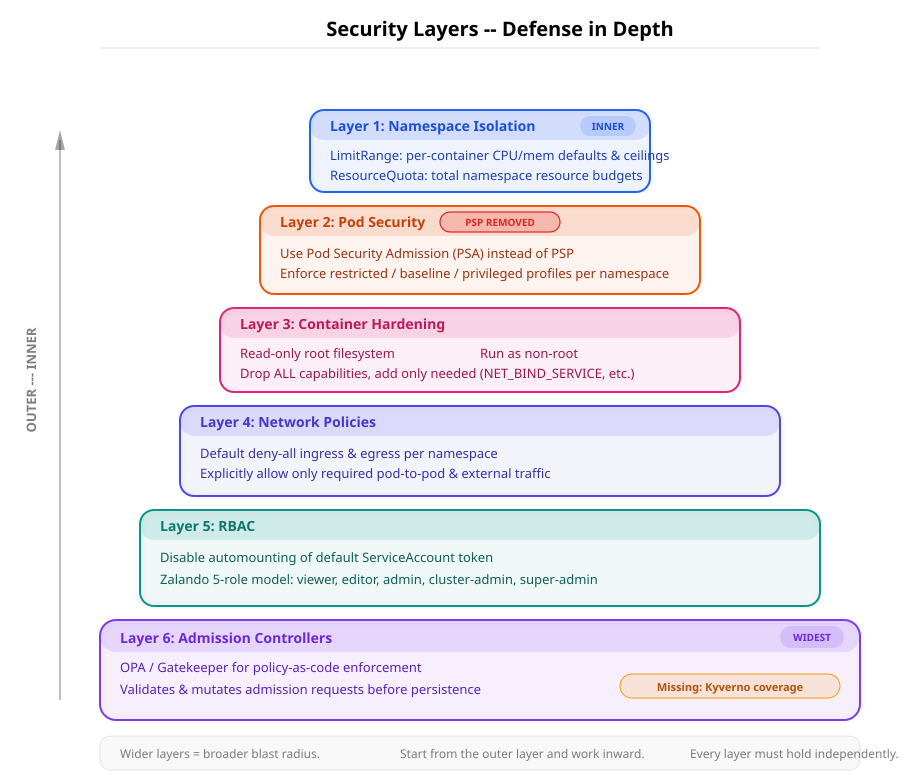

<span class="stage thinking">Thinking</span> — From outer (cluster-wide) to inner (per-container):

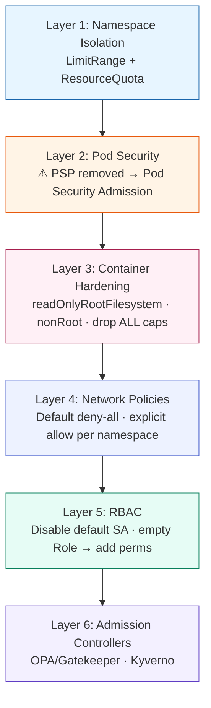

<span class="stage execution">Execution</span> — The modern security context every pod should have:

<div class="sim" markdown>
```yaml
# Production-hardened securityContext (K8s 1.28+)
apiVersion: v1
kind: Pod
spec:
  securityContext:
    runAsNonRoot: true
    runAsUser: 1000
    runAsGroup: 1000
    fsGroup: 1000
    seccompProfile:
      type: RuntimeDefault
  containers:
  - name: app
    securityContext:
      allowPrivilegeEscalation: false
      readOnlyRootFilesystem: true
      capabilities:
        drop: ["ALL"]
    volumeMounts:
    - name: tmp
      mountPath: /tmp
  volumes:
  - name: tmp
    emptyDir: {}
```
</div>

!!! warning "Stale advice on LearnKube"
    The page still references **PodSecurityPolicy (PSP)**, which was **removed in Kubernetes 1.25** (August 2022). The modern replacement is **Pod Security Admission** with three levels: `privileged`, `baseline`, `restricted`. Apply via namespace labels:

    ```yaml
    apiVersion: v1
    kind: Namespace
    metadata:
      name: production
      labels:
        pod-security.kubernetes.io/enforce: restricted
        pod-security.kubernetes.io/audit: restricted
        pod-security.kubernetes.io/warn: restricted
    ```

</div>

---

## Resource Management — Requests, Limits & Autoscaling

<div class="concept" markdown>

### The Resource Triangle

<span class="stage reason">Reason</span> — Every container needs defined resource boundaries. Without them, the scheduler flies blind and nodes crash from overcommitment.

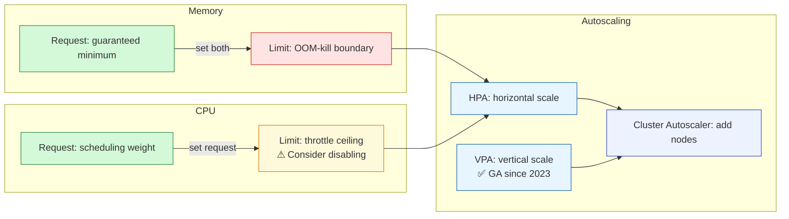

| Resource | Request | Limit | Recommendation |
|----------|---------|-------|----------------|
| **Memory** | Always set | Always set | OOM-kill if exceeded |
| **CPU** | Always set (≤1 CPU) | Consider **disabling** | Throttling wastes available cycles |

!!! info "LearnKube's VPA advice is outdated"
    The page says "Don't use VPA while it's still in beta." The **Vertical Pod Autoscaler** has been **GA since 2023** and is safe for production with `updateMode: Auto`. Use VPA in recommendation mode to right-size your requests.

</div>

---

## Configuration & Secrets

<div class="concept" markdown>

### Externalise Everything, Mount Secrets as Volumes

<span class="stage execution">Execution</span> — Two non-negotiable rules from the twelve-factor app:

1. **All config lives in ConfigMaps** — never hardcode
2. **Secrets mount as volumes, not env vars** — env vars leak in `docker inspect`, process listings, and crash dumps

<div class="sim" markdown>
```yaml
# Secrets as volume mount (correct)
volumes:
- name: db-creds
  secret:
    secretName: postgres-credentials
containers:
- name: app
  volumeMounts:
  - name: db-creds
    mountPath: /etc/secrets
    readOnly: true
```
</div>

<div class="flow" markdown>
<div class="state before" markdown>

##### Anti-pattern

```yaml
# WRONG: secrets as env vars
env:
- name: DB_PASSWORD
  valueFrom:
    secretKeyRef:
      name: postgres-credentials
      key: password
# Visible in: kubectl describe pod,
# docker inspect, /proc/1/environ
```

</div>
<div class="arrow">→</div>
<div class="state after" markdown>

##### Best practice

```yaml
# CORRECT: secrets as volume
volumeMounts:
- name: db-creds
  mountPath: /etc/secrets
  readOnly: true
# File-based, not in process env
# Supports rotation via CSI driver
```

</div>
</div>

</div>

---

## Tooling — Validate Your Cluster

<div class="concept" markdown>

### Automated Compliance & Security Scanning

<span class="stage execution">Execution</span> — Don't audit manually. Run these tools in CI/CD and on every PR:

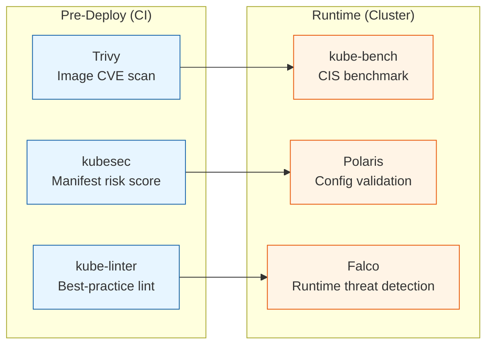

| Tool | What it checks | Run when | Install |
|------|----------------|----------|---------|
| **[Trivy](https://aquasecurity.github.io/trivy/)** | Image CVEs, misconfigs, secrets in code | CI pipeline, pre-push | `brew install trivy` |
| **[kube-bench](https://github.com/aquasecurity/kube-bench)** | CIS Kubernetes Benchmark (250+ checks) | Cluster audit, post-deploy | Job or DaemonSet |
| **[Polaris](https://polaris.docs.fairwinds.com/)** | Health checks, security, resources, networking | CI + dashboard | `helm install polaris fairwinds-stable/polaris` |
| **[kubesec](https://kubesec.io/)** | Risk score for manifests (0–100) | CI, pre-commit | `kubesec scan deployment.yaml` |
| **[kube-linter](https://github.com/stackrox/kube-linter)** | Anti-patterns in YAML manifests | CI, pre-commit | `brew install kube-linter` |
| **[Falco](https://falco.org/)** | Runtime syscall anomalies, container escapes | Always-on in cluster | Helm chart |

<div class="sim" markdown>
```bash
# CI pipeline example: scan before deploy
trivy image --severity HIGH,CRITICAL myregistry/app:v1.2.3
kubesec scan k8s/deployment.yaml
kube-linter lint k8s/

# Cluster audit: run kube-bench as a Job
kubectl apply -f https://raw.githubusercontent.com/aquasecurity/kube-bench/main/job.yaml
kubectl logs job/kube-bench

# Polaris dashboard
helm repo add fairwinds-stable https://charts.fairwinds.com/stable
helm install polaris fairwinds-stable/polaris --namespace polaris --create-namespace
kubectl port-forward svc/polaris-dashboard -n polaris 8080:80
```
</div>

!!! tip "Shift left"
    Run `kube-linter` and `kubesec` in pre-commit hooks or GitHub Actions. Catching misconfigurations before merge is 10x cheaper than fixing them in production.

</div>

---

## What's Missing — Gaps for Modern Kubernetes

<div class="concept" markdown>

### Five Topics LearnKube Should Add

<span class="stage usecase">Use-case</span> — The checklist was written for K8s ~1.18. Here's what a 2024+ production checklist needs:

| Missing Topic | Why it matters | Tools |
|---------------|----------------|-------|
| **Image scanning & supply chain** | Catch CVEs before deploy, verify image provenance | Trivy, cosign, Sigstore, Kyverno image verification |
| **Metrics & distributed tracing** | Only logging is covered — you need the full observability trio | Prometheus, Grafana, OpenTelemetry, Jaeger |
| **GitOps delivery** | Declarative, auditable, drift-detected deployments | ArgoCD, Flux, ApplicationSets |
| **Service mesh** | mTLS, traffic splitting, observability at L7 | Istio, Linkerd, Cilium Service Mesh |
| **Kubernetes version targeting** | Best practices change between versions | Note which K8s version each recommendation targets |

</div>

---

## Quick Reference — The Production Readiness Checklist

<div class="concept" markdown>

### Condensed 20-Point Checklist

<span class="stage output">Output</span> — Copy this into your team's deployment review process:

```
APPLICATION (10)
  □ Readiness probe set (independent, no downstream deps)
  □ Liveness probe set (passive, different endpoint)
  □ Graceful shutdown handles SIGTERM (exec form CMD)
  □ preStop hook with sleep(5) for endpoint propagation
  □ Multiple replicas with pod anti-affinity
  □ PodDisruptionBudget configured
  □ Memory requests AND limits set
  □ CPU requests set, limits disabled (or justified)
  □ Logs to stdout/stderr (no file logging)
  □ Config in ConfigMaps, secrets as volume mounts

GOVERNANCE (6)
  □ LimitRange + ResourceQuota per namespace
  □ Pod Security Admission: enforce restricted
  □ Non-root, read-only FS, drop ALL capabilities
  □ Network policies: default deny, explicit allow
  □ RBAC: disable default SA, least-privilege roles
  □ Admission controller for image registry allowlist

CLUSTER (4)
  □ CIS benchmark passing (kube-bench)
  □ Cloud metadata API disabled
  □ OIDC authentication for users
  □ Log aggregation + 30-45 day retention
```

</div>

---

## Official Kubernetes Documentation Links

<div class="concept" markdown>

### Reference Every Recommendation to Source

<span class="stage output">Output</span> — Every best practice above traces back to official Kubernetes documentation. Bookmark these:

| Topic | Official K8s Doc | Related |
|-------|------------------|---------|
| **Readiness / Liveness / Startup Probes** | [Configure Liveness, Readiness and Startup Probes](https://kubernetes.io/docs/tasks/configure-pod-container/configure-liveness-readiness-startup-probes/) | — |
| **Graceful Shutdown** | [Pod Lifecycle — Termination](https://kubernetes.io/docs/concepts/workloads/pods/pod-lifecycle/#pod-termination) | [Container Lifecycle Hooks](https://kubernetes.io/docs/concepts/containers/container-lifecycle-hooks/) |
| **Pod Disruption Budgets** | [Specifying a PodDisruptionBudget](https://kubernetes.io/docs/tasks/run-application/configure-pdb/) | — |
| **Pod Anti-Affinity** | [Assigning Pods to Nodes](https://kubernetes.io/docs/concepts/scheduling-eviction/assign-pod-node/#affinity-and-anti-affinity) | [Pod Topology Spread Constraints](https://kubernetes.io/docs/concepts/scheduling-eviction/topology-spread-constraints/) |
| **Resource Requests & Limits** | [Managing Resources for Containers](https://kubernetes.io/docs/concepts/configuration/manage-resources-containers/) | [LimitRange](https://kubernetes.io/docs/concepts/policy/limit-range/) |
| **Pod Security Admission** | [Pod Security Admission](https://kubernetes.io/docs/concepts/security/pod-security-admission/) | [Pod Security Standards](https://kubernetes.io/docs/concepts/security/pod-security-standards/) |
| **Security Context** | [Configure a Security Context](https://kubernetes.io/docs/tasks/configure-pod-container/security-context/) | — |
| **Network Policies** | [Network Policies](https://kubernetes.io/docs/concepts/services-networking/network-policies/) | — |
| **RBAC** | [Using RBAC Authorization](https://kubernetes.io/docs/reference/access-authn-authz/rbac/) | [Service Account Tokens](https://kubernetes.io/docs/concepts/security/service-accounts/) |
| **Secrets** | [Secrets](https://kubernetes.io/docs/concepts/configuration/secret/) | [Secrets Store CSI Driver](https://secrets-store-csi-driver.sigs.k8s.io/) |
| **VPA / HPA** | [Horizontal Pod Autoscaling](https://kubernetes.io/docs/tasks/run-application/horizontal-pod-autoscale/) | [VPA](https://github.com/kubernetes/autoscaler/tree/master/vertical-pod-autoscaler) |
| **Admission Controllers** | [Admission Controllers Reference](https://kubernetes.io/docs/reference/access-authn-authz/admission-controllers/) | [ValidatingAdmissionPolicy](https://kubernetes.io/docs/reference/access-authn-authz/validating-admission-policy/) |

</div>

---

## Sources & Further Reading

<div class="concept" markdown>

### Where This Content Comes From

| Source | What we used | URL |
|--------|-------------|-----|
| **LearnKube** | Original 50-item checklist (audited) | [learnkube.com/production-best-practices](https://learnkube.com/production-best-practices/) |
| **kubernetes.io** | Official docs for every K8s concept | [kubernetes.io/docs](https://kubernetes.io/docs/) |
| **roadmap.sh** | DevOps & K8s learning path structure | [roadmap.sh/kubernetes](https://roadmap.sh/kubernetes) |
| **Polaris / Fairwinds** | Cluster validation best practices & tooling | [polaris.docs.fairwinds.com](https://polaris.docs.fairwinds.com/) |
| **CIS Kubernetes Benchmark** | Cluster hardening standards | [cisecurity.org](https://www.cisecurity.org/benchmark/kubernetes) |
| **Aqua Security / Trivy** | Image scanning & kube-bench | [aquasecurity.github.io/trivy](https://aquasecurity.github.io/trivy/) |
| **OWASP Kubernetes** | Top 10 K8s risks | [owasp.org/kubernetes](https://owasp.org/www-project-kubernetes-top-ten/) |

</div>
