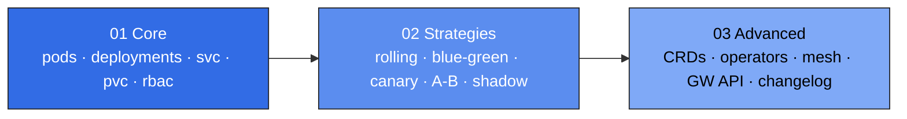

# 03 — Kubernetes

The Kubernetes track is split into three sub-modules. Walk them in order, or jump straight to the area you need.

<!-- mermaid:rendered -->
<p align="center"></p>

<details><summary>Mermaid source</summary>

<!-- mermaid:rendered -->
<p align="center"></p>

<details><summary>Mermaid source</summary>

<!-- mermaid:rendered -->
<p align="center"></p>

<details><summary>Mermaid source</summary>



</details>

</details>

</details>

| Sub-module | Audience | Hours | Pickup state |
|------------|----------|------:|--------------|
| [`01-core`](./01-core/) | New to K8s | 16 | `01-core/README.md` + `01-core/cheatsheet.md` |
| [`02-strategies`](./02-strategies/) | Knows core, ready for releases | 12 | `02-strategies/README.md` + each strategy's `commands.md` |
| [`03-advanced`](./03-advanced/) | Production engineer | 18 | `03-advanced/README.md` + `03-advanced/10-changelog/` |

## Pickup-state convention

Every leaf subfolder ships **two files**:

1. **`README.md`** — concept, mermaid diagram, walkthrough, lab.
2. **`commands.md`** — copy-pasteable command reference (the one-liner you came back for).

Drop into any folder, scan `commands.md`, dive deeper in `README.md` if needed.

## Cluster prerequisites

```bash
# kind (recommended for labs)
kind create cluster --config 01-core/00-cluster-setup/kind-cluster.yaml
kubectl cluster-info
```

See [`01-core/00-cluster-setup/`](./01-core/00-cluster-setup/) for minikube, k3d, and Docker Desktop alternatives.
