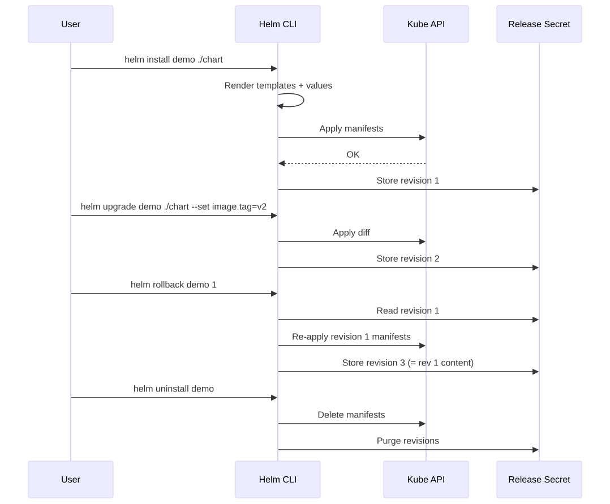
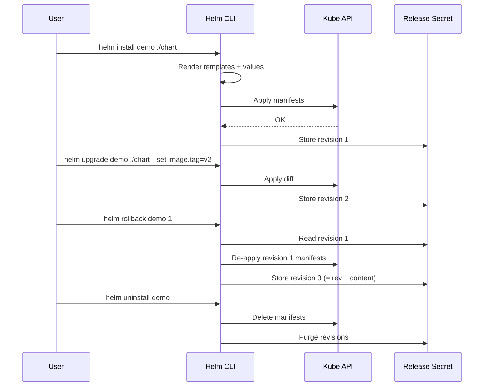

# 01 — Helm Concepts

## Core Vocabulary

| Term | What it is |
|---|---|
| **Chart** | A package — directory of templates + metadata. The "recipe". |
| **Release** | A running instance of a chart in a cluster. Same chart → many releases. |
| **Repository** | Hosted index of charts (HTTP or OCI). |
| **Values** | Configuration injected into templates (`values.yaml`, `--set`, `-f`). |
| **Template** | Go-templated YAML that renders into K8s manifests. |
| **Revision** | Each `helm install/upgrade` increments a revision number. |
| **Hook** | Annotated manifest run at lifecycle events (pre-install, etc.). |

## Release Lifecycle

<!-- mermaid:rendered -->
<p align="center"></p>

<details><summary>Mermaid source</summary>



</details>
## Helm 3 vs Helm 2

| Aspect | Helm 2 | Helm 3 |
|---|---|---|
| Server component | **Tiller** (cluster-wide RBAC) | None (client only) |
| Release storage | ConfigMap in `kube-system` | `Secret` in release namespace |
| Release scope | Global names | Namespaced |
| 3-way merge | No | Yes |
| Library charts | No | Yes |
| OCI registry | No | Yes (default) |
| CRDs | Templates | `crds/` directory, install-only |
| Security | Tiller = god mode | User RBAC only |

> Helm 2 reached EOL in Nov 2020. Always use Helm 3.

## Mental Model

```text
Chart (recipe) + Values (ingredients) → Manifests → Release (running dish)
```

Same chart + different values = different releases (e.g. `nginx-dev`, `nginx-prod`).
