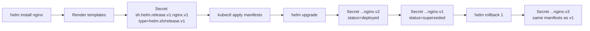
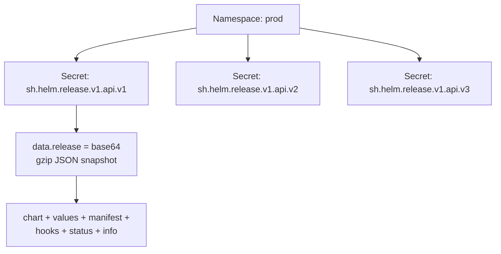
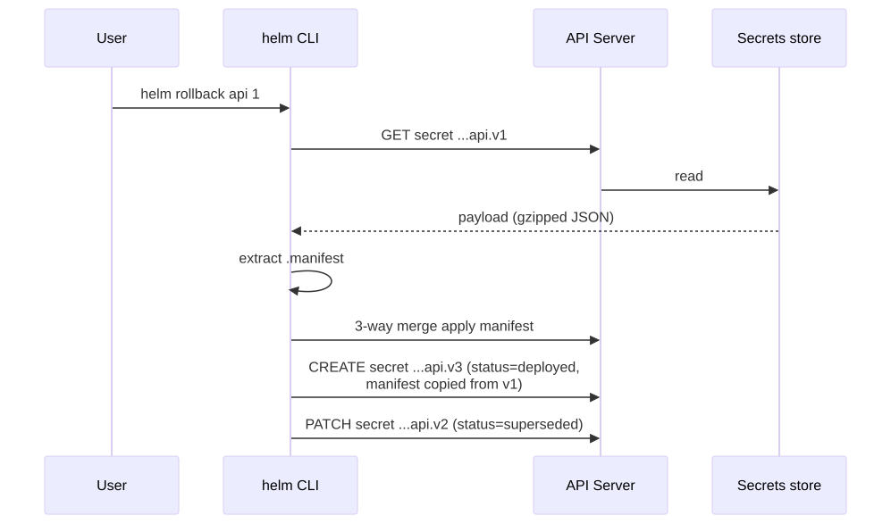
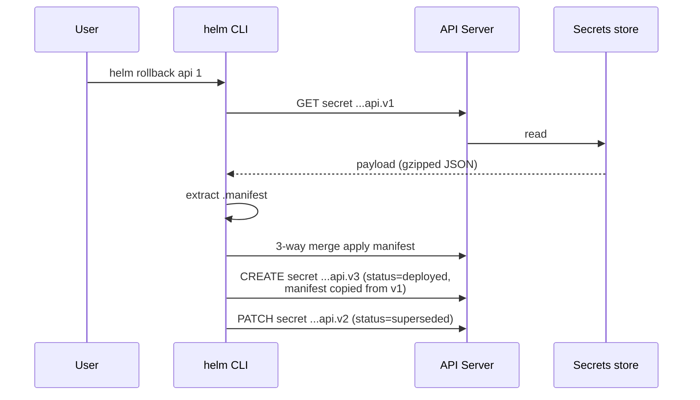

# Helm Release Storage Deep Dive

## Why this matters

Every `helm install`, `upgrade`, and `rollback` is a state transition. Helm 3 has no Tiller — release state lives entirely in the cluster as **Kubernetes Secrets** (default) in the release's namespace. Understanding this storage layer demystifies "release not found", history limits, rollback semantics, and the dreaded "another operation in progress" lock.

## Mental Model

A Helm release is just a sequence of immutable, base64-gzipped manifest snapshots stored as Secrets. Each `helm upgrade` appends a new revision Secret; nothing is ever mutated in place. Rollback = re-apply an older snapshot and append a new revision pointing at it.

<!-- mermaid:rendered -->
<p align="center"></p>

<details><summary>Mermaid source</summary>



</details>

## Storage Layout

<!-- mermaid:rendered -->
<p align="center"></p>

<details><summary>Mermaid source</summary>



</details>

Each Secret carries labels Helm queries on:

| Label | Purpose |
|-------|---------|
| `owner=helm` | Distinguish Helm-owned secrets |
| `name=<release>` | Release name |
| `version=<n>` | Revision number |
| `status=deployed\|superseded\|failed\|pending-upgrade\|uninstalling` | Lifecycle state |

## Walkthrough — inspect a release

```bash
# List Helm secrets in a namespace
kubectl get secret -n prod -l owner=helm

# NAME                            TYPE                 DATA   AGE
# sh.helm.release.v1.api.v1       helm.sh/release.v1   1      5d
# sh.helm.release.v1.api.v2       helm.sh/release.v1   1      1d

# Decode the latest release payload
kubectl get secret sh.helm.release.v1.api.v2 -n prod \
  -o jsonpath='{.data.release}' \
  | base64 -d | base64 -d | gunzip | jq '.info,.chart.metadata,.config'
```

The double base64 is intentional: Kubernetes base64-encodes Secret values, and Helm pre-encodes the gzipped JSON before storing. Decode twice, then gunzip.

### Annotated release payload (truncated)

```yaml
name: api
version: 2                      # revision number
namespace: prod
info:
  status: deployed              # state machine value
  first_deployed: "2026-04-20T10:00:00Z"
  last_deployed: "2026-04-25T14:30:00Z"
  description: "Upgrade complete"
chart:
  metadata:
    name: api
    version: 1.4.2              # chart SemVer
    appVersion: "2.1.0"
config:                         # values used for THIS revision
  image:
    tag: v2.1.0
manifest: |                     # rendered YAML applied to cluster
  apiVersion: apps/v1
  kind: Deployment
  ...
hooks: []                       # pre/post install/upgrade/delete hooks
```

## History Limit and Rollback

```bash
helm upgrade api ./chart --history-max 10   # keep last 10 revisions
```

Older Secrets are pruned automatically once `--history-max` is exceeded. **Pruned revisions cannot be rolled back to** — they're physically gone. Default is 10; set higher for compliance, lower for high-churn pipelines.

Rollback mechanics:

<!-- mermaid:rendered -->
<p align="center"></p>

<details><summary>Mermaid source</summary>



</details>

Rollback never modifies an old Secret — it creates a NEW revision that happens to contain v1's manifest. This preserves audit trail.

## The pending-upgrade lock

If `helm upgrade` crashes or the network drops mid-apply, the new Secret is left in `status=pending-upgrade`. Subsequent runs fail with `another operation in progress`. Recovery:

```bash
# Inspect the stuck revision
helm history api -n prod

# REVISION  STATUS            ...
# 2         pending-upgrade   ...

# Force-clear by deleting the stuck Secret (be sure no rollout is actually running)
kubectl delete secret sh.helm.release.v1.api.v2 -n prod
helm rollback api 1 -n prod
```

## Alternative drivers

```bash
helm install api ./chart --history-max 5
export HELM_DRIVER=configmap   # or: secret (default), sql, memory
```

| Driver | Use case | Trade-off |
|--------|----------|-----------|
| `secret` (default) | Production | Encrypted at rest if etcd encryption enabled |
| `configmap` | Legacy Helm 2 parity | Plaintext, no encryption |
| `sql` (PostgreSQL) | Centralized multi-cluster history | Operational burden |
| `memory` | Tests | State lost on restart |

## Common Interview Questions

> [!IMPORTANT]
> **Q1: Where does Helm 3 store release state?**
> A: As Kubernetes Secrets of type `helm.sh/release.v1` in the release's namespace, named `sh.helm.release.v1.<release>.v<revision>`. Helm 2 used Tiller + ConfigMaps in `kube-system`.
>
> **Q2: Why is the data field doubly base64-encoded?**
> A: Helm gzip+base64-encodes the JSON payload before storing; Kubernetes base64-encodes all Secret values on top. Decode twice then gunzip.
>
> **Q3: What does `--history-max` actually do?**
> A: Prunes superseded revision Secrets older than the limit. Pruned revisions cannot be rolled back to.
>
> **Q4: What happens to existing resources during a rollback?**
> A: Helm extracts the `.manifest` from the target revision Secret, performs a 3-way strategic merge, and writes a NEW revision Secret. Resources not in the old manifest are deleted; resources changed are patched.
>
> **Q5: How do you recover from `another operation in progress`?**
> A: Inspect with `helm history`. If the latest revision is stuck in `pending-*`, verify no live rollout, then `kubectl delete secret` the stuck revision and `helm rollback` to the last good one.
>
> **Q6: Can two clusters share Helm release state?**
> A: Only with the SQL driver (`HELM_DRIVER=sql`) pointed at a shared PostgreSQL. Default secret/configmap drivers are per-cluster, per-namespace.
>
> **Q7: What namespace are release secrets stored in?**
> A: The release's install namespace (`-n` flag), NOT a central namespace. `helm list -A` queries all namespaces.
>
> **Q8: How do you migrate releases between clusters?**
> A: `kubectl get secret -l owner=helm,name=<r> -o yaml`, edit `metadata.namespace`, apply on the target. Or use `helm get manifest > out.yaml` + `helm install --replace`.

## Sources

- Helm Architecture: https://helm.sh/docs/topics/architecture/
- Storage backends: https://helm.sh/docs/topics/advanced/#storage-backends
- Helm 3 release notes: https://helm.sh/blog/helm-3-released/
- Charts spec: https://helm.sh/docs/topics/charts/
