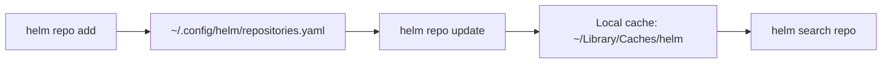

# 02 — Installing Helm & Configuring Repos

## Install

### macOS
```bash
brew install helm
```

### Linux
```bash
curl https://raw.githubusercontent.com/helm/helm/main/scripts/get-helm-3 | bash
# or apt
curl https://baltocdn.com/helm/signing.asc | sudo gpg --dearmor -o /usr/share/keyrings/helm.gpg
echo "deb [signed-by=/usr/share/keyrings/helm.gpg] https://baltocdn.com/helm/stable/debian/ all main" | sudo tee /etc/apt/sources.list.d/helm-stable-debian.list
sudo apt-get update && sudo apt-get install helm
```

### Windows
```powershell
choco install kubernetes-helm
# or
winget install Helm.Helm
```

## Verify

```bash
helm version
# version.BuildInfo{Version:"v3.x.x", ...}
helm env       # paths Helm uses (cache, config, data)
```

## Repository Configuration

<!-- mermaid:rendered -->
<p align="center"></p>

<details><summary>Mermaid source</summary>



</details>
### Add common repos
```bash
helm repo add bitnami https://charts.bitnami.com/bitnami
helm repo add ingress-nginx https://kubernetes.github.io/ingress-nginx
helm repo add prometheus-community https://prometheus-community.github.io/helm-charts
helm repo add jetstack https://charts.jetstack.io
helm repo update
```

### List & search
```bash
helm repo list
helm search repo nginx
helm search repo bitnami/postgresql --versions | head
helm search hub wordpress       # search Artifact Hub
```

### Inspect a chart
```bash
helm show chart bitnami/nginx
helm show values bitnami/nginx > /tmp/nginx-values.yaml
helm show readme bitnami/nginx
helm show all bitnami/nginx
```

### Remove
```bash
helm repo remove bitnami
```

## Shell Completion

```bash
# zsh
helm completion zsh > "${fpath[1]}/_helm"
# bash
source <(helm completion bash)
```
