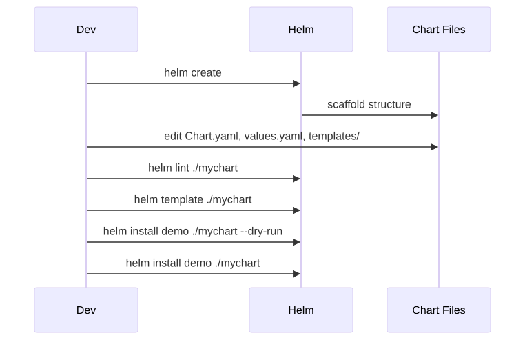
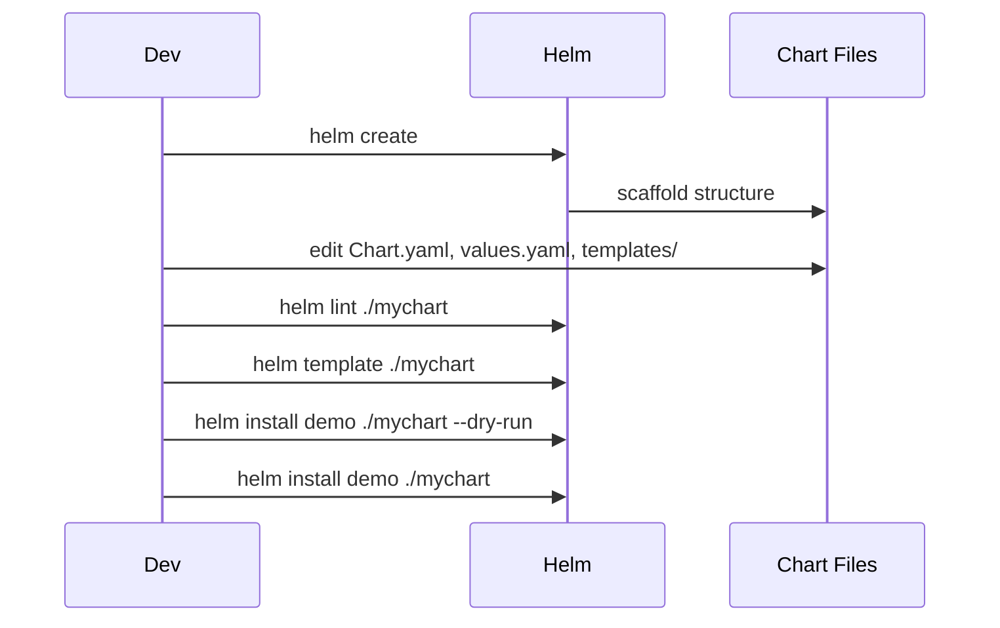

# 04 — Creating a Chart

## Scaffold

```bash
helm create mychart
```

## Anatomy

```bash
mychart/
├── Chart.yaml          # metadata: name, version, appVersion, dependencies
├── values.yaml         # default config values
├── values.schema.json  # (optional) JSON schema validation
├── .helmignore         # files to exclude from package
├── charts/             # vendored sub-charts
├── crds/               # CRDs (installed before templates, never templated)
└── templates/
    ├── _helpers.tpl    # template partials (define / include)
    ├── NOTES.txt       # printed after install (templated)
    ├── deployment.yaml
    ├── service.yaml
    ├── ingress.yaml
    ├── hpa.yaml
    ├── serviceaccount.yaml
    └── tests/          # helm test resources
```

## Lifecycle

<!-- mermaid:rendered -->
<p align="center"></p>

<details><summary>Mermaid source</summary>



</details>
## Chart.yaml Fields

```yaml
apiVersion: v2          # v2 = Helm 3 (always)
name: mychart
description: A Helm chart for Kubernetes
type: application       # or "library"
version: 0.1.0          # CHART version (semver)
appVersion: "1.0"       # APP version (string)
icon: https://...png
maintainers:
  - name: alice
    email: alice@example.com
```

`version` bumps when you change the chart. `appVersion` bumps when the app image changes.

## _helpers.tpl Convention

Standard helpers (created by `helm create`):

| Helper | Purpose |
|---|---|
| `<chart>.name` | Chart name (overridable via `nameOverride`) |
| `<chart>.fullname` | Release-qualified name (`<release>-<chart>`) |
| `<chart>.chart` | `<name>-<version>` for chart label |
| `<chart>.labels` | Standard labels (managed-by, instance, version, etc.) |
| `<chart>.selectorLabels` | Subset used for label selectors (immutable!) |
| `<chart>.serviceAccountName` | SA to use (resolved from values) |

> **Trap:** Never put mutable labels (like `app.kubernetes.io/version`) in `selectorLabels` — selectors are immutable on existing Deployments.

## Try It

A complete starter chart lives at [`hello-app/`](./hello-app/) for `gcr.io/google-samples/hello-app:1.0`.

```bash
cd 04-creating-a-chart
helm lint ./hello-app
helm template demo ./hello-app
helm install demo ./hello-app --dry-run --debug
helm install demo ./hello-app
kubectl port-forward svc/demo-hello-app 8080:80
curl localhost:8080
helm uninstall demo
```
