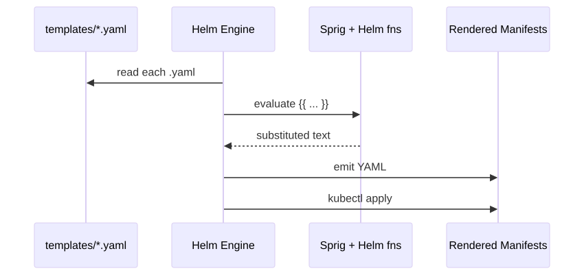
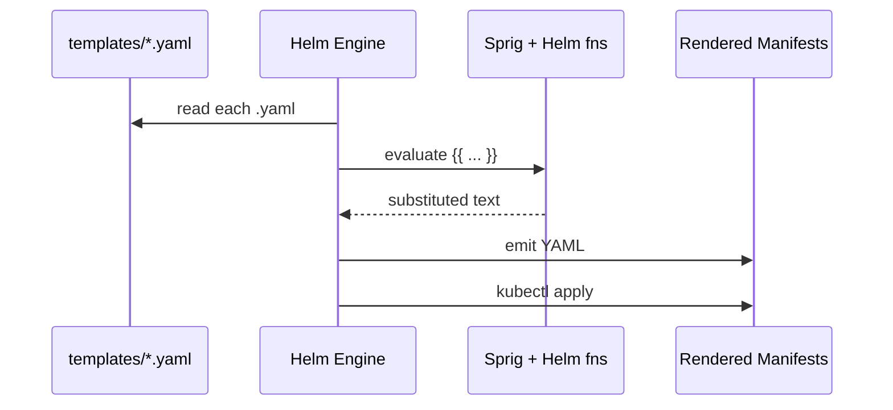

# 05 — Templating

Helm uses **Go templates** + the **sprig** function library + a few Helm-specific objects.

## Render Pipeline

<!-- mermaid:rendered -->
<p align="center"></p>

<details><summary>Mermaid source</summary>



</details>
## Built-in Objects

| Object | Use |
|---|---|
| `.Values` | Values from values.yaml + overrides |
| `.Release.Name` | Release name |
| `.Release.Namespace` | Target namespace |
| `.Release.Service` | Always `Helm` |
| `.Release.IsInstall` / `.Release.IsUpgrade` | Bool |
| `.Release.Revision` | Revision number |
| `.Chart.Name`, `.Chart.Version`, `.Chart.AppVersion` | From Chart.yaml |
| `.Files` | Access non-template files (`.Files.Get`, `.Files.Glob`) |
| `.Capabilities` | Cluster info: `.KubeVersion`, `.APIVersions.Has` |
| `.Template.Name`, `.Template.BasePath` | Current template path |

## Actions

```yaml
# Substitution
image: "{{ .Values.image.repository }}:{{ .Values.image.tag }}"

# Conditional
{{- if .Values.ingress.enabled }}
apiVersion: networking.k8s.io/v1
kind: Ingress
{{- end }}

# Range over list
env:
{{- range .Values.envVars }}
  - name: {{ .name }}
    value: {{ .value | quote }}
{{- end }}

# With (scope change)
{{- with .Values.nodeSelector }}
nodeSelector:
  {{- toYaml . | nindent 2 }}
{{- end }}

# Whitespace control: `-` trims preceding/following whitespace
{{- if true -}}clean{{- end -}}
```

## include vs template

```yaml
# template — emits text directly, cannot be piped
{{ template "hello-app.labels" . }}

# include — returns a string, can be piped (USE THIS)
{{ include "hello-app.labels" . | nindent 4 }}
```

> Always prefer `include` so you can pipe into `nindent`/`indent`.

## Common Sprig Functions

| Function | Example |
|---|---|
| `quote` | `{{ .v | quote }}` → `"v"` |
| `default` | `{{ .v | default "x" }}` |
| `required` | `{{ required "msg" .v }}` |
| `toYaml` | `{{ .Values.x | toYaml | nindent 2 }}` |
| `nindent N` | newline + indent N spaces |
| `trunc N` / `trimSuffix` | `{{ .name | trunc 63 | trimSuffix "-" }}` |
| `b64enc` / `b64dec` | secrets |
| `sha256sum` | trigger pod restart on configmap change |

## Restart Pod on ConfigMap Change

```yaml
spec:
  template:
    metadata:
      annotations:
        checksum/config: {{ include (print $.Template.BasePath "/configmap.yaml") . | sha256sum }}
```

See [examples.md](./examples.md).
