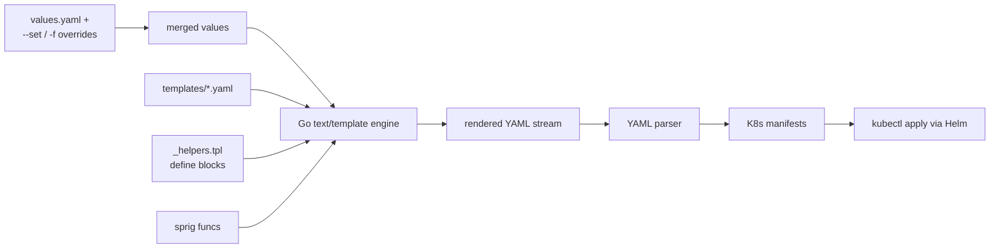
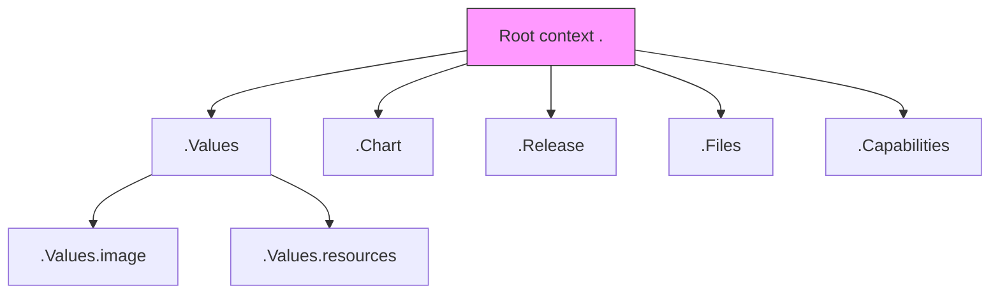
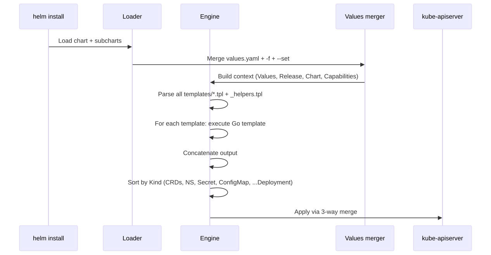
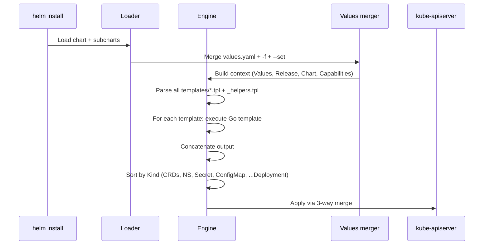

# Helm Template Internals Deep Dive

## Why this matters

Helm templates aren't YAML — they're Go `text/template` programs that emit YAML. Misunderstanding execution order, scope, sprig functions, and whitespace control is the #1 source of "works on my laptop, breaks in CI" chart bugs. Mastering named templates and `_helpers.tpl` is what separates a copy-pasted chart from a production-grade library.

## Mental Model

<!-- mermaid:rendered -->
<p align="center"></p>

<details><summary>Mermaid source</summary>



</details>

The engine knows nothing about YAML — it produces a text stream that must be valid YAML AFTER rendering. A stray space at column 0 invalidates the whole file.

## The Render Context

Every template has these top-level objects:

| Object | Contents |
|--------|----------|
| `.Values` | Merged values from `values.yaml` + overrides |
| `.Chart` | Chart.yaml metadata (Name, Version, AppVersion) |
| `.Release` | Name, Namespace, IsInstall, IsUpgrade, Revision |
| `.Files` | Access to non-template files in the chart |
| `.Capabilities` | API versions available, K8s version |
| `.Template` | Name + BasePath of the current template |

<!-- mermaid:rendered -->
<p align="center"></p>

<details><summary>Mermaid source</summary>



</details>

## Walkthrough — annotated template

```yaml
{{/* templates/deployment.yaml */}}
apiVersion: apps/v1
kind: Deployment
metadata:
  name: {{ include "api.fullname" . }}     # named template from _helpers.tpl
  labels:
    {{- include "api.labels" . | nindent 4 }}   # nindent = newline + indent
spec:
  replicas: {{ .Values.replicaCount | default 1 }}
  selector:
    matchLabels:
      {{- include "api.selectorLabels" . | nindent 6 }}
  template:
    metadata:
      annotations:
        # checksum forces pod restart when ConfigMap changes
        checksum/config: {{ include (print $.Template.BasePath "/configmap.yaml") . | sha256sum }}
      labels:
        {{- include "api.selectorLabels" . | nindent 8 }}
    spec:
      {{- with .Values.imagePullSecrets }}    # `with` rebinds . to the value
      imagePullSecrets:
        {{- toYaml . | nindent 8 }}
      {{- end }}
      containers:
        - name: {{ .Chart.Name }}
          image: "{{ .Values.image.repository }}:{{ .Values.image.tag | default .Chart.AppVersion }}"
          {{- if .Values.resources }}
          resources:
            {{- toYaml .Values.resources | nindent 12 }}
          {{- end }}
```

### `_helpers.tpl` idioms

```yaml
{{/* templates/_helpers.tpl */}}
{{/*
Expand the name of the chart.
*/}}
{{- define "api.name" -}}
{{- default .Chart.Name .Values.nameOverride | trunc 63 | trimSuffix "-" }}
{{- end }}

{{/*
Fully qualified app name. Truncated to 63 chars (DNS label limit).
*/}}
{{- define "api.fullname" -}}
{{- if .Values.fullnameOverride }}
{{- .Values.fullnameOverride | trunc 63 | trimSuffix "-" }}
{{- else }}
{{- $name := default .Chart.Name .Values.nameOverride }}
{{- if contains $name .Release.Name }}
{{- .Release.Name | trunc 63 | trimSuffix "-" }}
{{- else }}
{{- printf "%s-%s" .Release.Name $name | trunc 63 | trimSuffix "-" }}
{{- end }}
{{- end }}
{{- end }}

{{/*
Common labels — included by every resource.
*/}}
{{- define "api.labels" -}}
helm.sh/chart: {{ include "api.chart" . }}
{{ include "api.selectorLabels" . }}
{{- if .Chart.AppVersion }}
app.kubernetes.io/version: {{ .Chart.AppVersion | quote }}
{{- end }}
app.kubernetes.io/managed-by: {{ .Release.Service }}
{{- end }}
```

## define / template / include

```mermaid
flowchart LR
    A[define name] --> B[Stored in template registry]
    B --> C[template name .]
    B --> D[include name .]
    C --> E[Direct emit — cannot pipe]
    D --> F[Returns string — pipe-able]
    F --> G[| nindent 4 | quote | etc]
```

| Construct | Pipeable? | Use when |
|-----------|-----------|----------|
| `{{ template "foo" . }}` | No | Rare; legacy |
| `{{ include "foo" . }}` | Yes | Always prefer; you'll likely pipe to `nindent`/`indent`/`toYaml` |
| `{{ define "foo" }}...{{ end }}` | — | Defines a named template, lives in `_helpers.tpl` |

## Whitespace control

Go templates have two modifiers that gobble surrounding whitespace:

| Syntax | Effect |
|--------|--------|
| `{{- ... }}` | Trim leading whitespace (including newline before this action) |
| `{{ ... -}}` | Trim trailing whitespace (including newline after this action) |
| `{{- ... -}}` | Trim both sides |

`indent N` adds N spaces to each line. `nindent N` is `"\n" + indent N` — used when you also need a leading newline so the block starts on a new line at the right column.

```yaml
# WRONG — produces "      key: value" with stray whitespace before it
labels:
    {{ include "labels" . | indent 4 }}

# RIGHT
labels:
  {{- include "labels" . | nindent 4 }}
```

## Sprig — the standard library

Helm bundles [sprig](http://masterminds.github.io/sprig/). Categories most used in charts:

| Category | Examples |
|----------|----------|
| String | `quote`, `upper`, `trunc`, `replace`, `printf`, `trimSuffix` |
| Default | `default`, `coalesce`, `empty`, `required` |
| Encoding | `b64enc`, `b64dec`, `toYaml`, `toJson`, `fromYaml` |
| Crypto | `sha256sum`, `genCA`, `genSignedCert` (cert generation in templates) |
| Lookup | `lookup` (live cluster lookup at render time), `tpl` (recursive render) |
| Lists/Dicts | `dict`, `set`, `get`, `hasKey`, `pluck` |

### `required` — fail fast on missing values

```yaml
image: {{ required "image.repository must be set" .Values.image.repository }}
```

### `tpl` — render a string AS a template

```yaml
data:
  config.yaml: |
    {{ tpl .Values.config . | indent 4 }}
```

Use when values themselves contain template syntax (e.g. user-supplied config snippets that reference `.Release.Name`).

### `lookup` — read live cluster state during render

```yaml
{{- $existing := lookup "v1" "Secret" .Release.Namespace "tls-cert" -}}
{{- if not $existing }}
# only render if Secret doesn't exist
{{- end }}
```

Returns empty during `helm template` (no cluster context) — write defensive checks.

## Execution flow

<!-- mermaid:rendered -->
<p align="center"></p>

<details><summary>Mermaid source</summary>



</details>

The Kind sort order is hard-coded in Helm and ensures CRDs/Namespaces exist before resources that reference them. Hooks bypass this and run in `helm.sh/hook` weight order.

## Common Interview Questions

> [!IMPORTANT]
> **Q1: Difference between `template` and `include`?**
> A: `template` directly emits its result and cannot be piped. `include` returns a string, so you can pipe it through `indent`, `nindent`, `quote`, etc. Always prefer `include`.
>
> **Q2: Why use `nindent` over `indent`?**
> A: `nindent N` = newline + N-space indent. `indent N` only indents — if your block needs to start on its own line you'll lose alignment. Use `nindent` when emitting after a `:` on the previous line.
>
> **Q3: When is `tpl` needed?**
> A: When a value in `values.yaml` itself contains template syntax that must be rendered against the chart context (e.g. user-supplied configs referencing `.Release.Name`).
>
> **Q4: How do you force a Pod restart when a ConfigMap changes?**
> A: Set a pod annotation to `sha256sum` of the rendered ConfigMap: `checksum/config: {{ include "configmap.yaml" . | sha256sum }}`. Hash changes → rolling restart.
>
> **Q5: What does `required` do?**
> A: Fails the render with a custom error if a value is nil/empty. Use for mandatory inputs to give clear error messages instead of cryptic YAML failures.
>
> **Q6: How does Helm handle CRDs vs other resources at install time?**
> A: Resources in `crds/` install BEFORE templates render and aren't templated. Templates are sorted by Kind so CRDs/Namespaces/RBAC come first. CRDs in `crds/` are NOT upgraded by `helm upgrade`.
>
> **Q7: What is `lookup` and what's its big caveat?**
> A: `lookup APIVersion Kind Namespace Name` queries the live cluster at render time. Returns empty `{}` during `helm template` (no API access) — always guard with `if`.
>
> **Q8: How does Helm decide rendering order across files?**
> A: Files within `templates/` are processed alphabetically, but final apply order is by Kind (Namespaces, CRDs, RBAC, ConfigMap/Secret, then workloads). `_*.tpl` partials are loaded but not rendered as separate manifests.

## Sources

- Helm Chart Template Guide: https://helm.sh/docs/chart_template_guide/
- Built-in Objects: https://helm.sh/docs/chart_template_guide/builtin_objects/
- Named Templates: https://helm.sh/docs/chart_template_guide/named_templates/
- Sprig Function Docs: http://masterminds.github.io/sprig/
- Go text/template: https://pkg.go.dev/text/template
